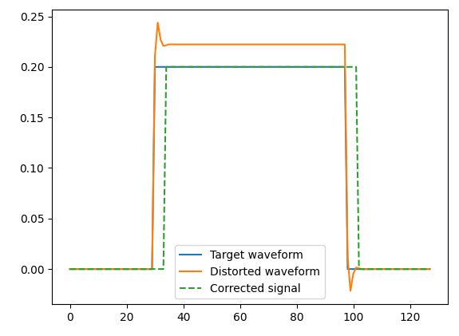
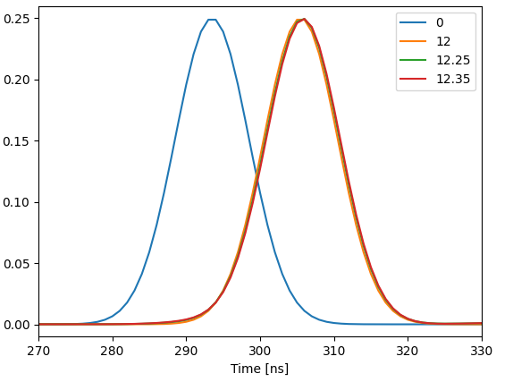

This folder contains various examples for applying filters on the outputs of the OPX.

## Distortion compensation

The filters can be used to compensate for distortions caused by electrical components.
This example is similar to what is used in: https://arxiv.org/pdf/1907.04818.pdf

In this example, we deliberately play a distorted waveform through the OPX output, which 
is looped back into the OPX input. We sample the raw ADC input, and then run an optimization
algorithm to try to improve the output, using the built-in filters. This is different from the paper, in which they measured and optimized the response of 
the detuning of the qubit.

Of course, the parameters and optimization strategy will have to be adapted in other scenarios.

The result of one of the runs cal be seen in the figure below:

Notice the added group delay caused by the filters.

Script: [blackbox-filter-optimization.py](blackbox-filter-optimization.py)

## Delay channel with <ns resolution

The FIR filter can be used to delay channels with resolutions far exceeding the sampling rate 
of the OPX, this can be used to correct for small phase differences.

This can be done by setting the taps to be the values of a normalized sinc function, centered
around the needed delay, and sampled at [0, 1, ..., 40] ns. If the delay is an integer number,
then all the values will be 0 expect for the tap which is exactly at required delay.

In the example, delays of 0, 12, 12.25 and 12.35 ns are shown.

Script: [delay_channels.py](delay_channels.py)