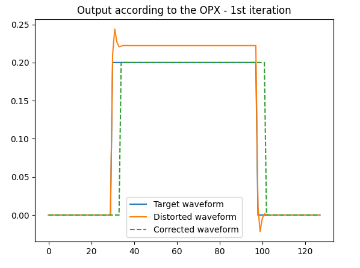
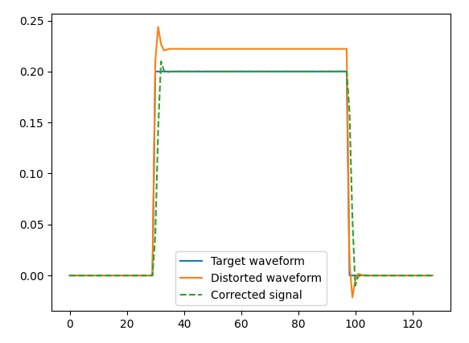

This folder contains various examples for applying filters on the outputs of the OPX.

## Distortion compensation

The filters can be used to compensate for distortions caused by electrical components.
This example is similar to what is used in: https://arxiv.org/pdf/1907.04818.pdf

In these examples, we deliberately play a distorted waveform through the OPX output, which 
is looped back into the OPX input. We sample the raw ADC input, and then run an optimization
algorithm to try to improve the result, using the built-in filters.
This is different from the paper, in which they measured and optimized the response of 
the detuning of the qubit.
Because using filters can change the delay between the pulses, we need to take that into account in some way.
In these examples we compute the correlation between the original waveform and the distorted waveform. 
The maximum of the normalized correlation should be equal to exactly 1 when they are identical, even if they are shifted. 
Therefore, The loss function is defined as “1 - max(corr)”. However, there is a small caveat: the correlation would
also be one when the waveforms have a different amplitude! So this has to be checked and corrected manually.
Simply multiplying the feedforward coefficients by the ratio of the amplitudes would correct this.
In these examples, this is being done only for plotting the waveforms.

Notice the added group delay caused by the filters, it is being calculated in the script by looking at the index of 
the maximum of the correlation.

### Example 1 - Optimization using Nelder-Mead
This example requires SciPi 1.7.0 or above
In this example, we use the Nelder-Mead optimization to find the filter coefficients.
Assuming that the system response is linear, the optimization can be done using SciPy filter module.
The real-life experimental procedure would be as follows:

1. Run the experiment once to retrieve the system response.
2. Run the optimization offline, comparing the system response with the target system response.
3. Run the experiment again, the response should be much better.
4. If it is still not good enough, then second order effects are not negligible.
   Run the optimization algorithm again, this time directly on the OPX measurement.
   
These steps are being emulated in the following script: [nelder-mead-filter-optimization.py](nelder-mead-filter-optimization.py)
Of course, because our simulator response is linear (and identical), then step 4 is redundant and there is no difference
between the 1st and 2nd iterations.

-------------------------------------------------------------------------------------------------------
> **_Note:_** : 
> SciPy uses a different convention for the feedback taps:
> 1. SciPy have an extra coefficient a[0] which multiples y[n]. In our case, a[0]=1.
> 2. The other coefficients have a minus sign.
> 
> This means that in order to simulate the OPX response with SciPy signal module, the coefficients need to undergo the 
> transformation: (a[1], a[2]) -> (1, -a[1], -a[2]).

-------------------------------------------------------------------------------------------------------
   
### Example 2 - Optimization using CMA (Covariance Matrix Adaptation)
This example uses the CMA toolbox to solve the problem.

Of course, the parameters and optimization strategy will have to be adapted in other scenarios.

The result of one of the runs can be seen in the figure below:

Script: [blackbox-filter-optimization.py](blackbox-filter-optimization.py)

## Delay channel with <ns resolution

The FIR filter can be used to delay channels with resolutions far exceeding the sampling rate 
of the OPX, this can be used to correct for small phase differences.

This can be done by setting the taps to be the values of a normalized sinc function, centered
around the needed delay, and sampled at [0, 1, ..., 40] ns. If the delay is an integer number,
then all the values will be 0 expect for the tap which is exactly at required delay.

Notice that adding <1ns delays should be done as close a possible to the center of the taps. i.e., around 20ns.
This is because we are sampling a sinc function at discrete locations, but we can't put the coefficients which are lower
than 0ns and higher than 40ns.
The script currently checks if these missing coefficients are larger than 2%, and if so, outputs a warning.

### Simple examples of adding delays
In 1st example, delays of 0, 22, 22.25 and 22.35 ns are shown.

Script: [delay_channels.py](delay_channels.py)

### XY-Z precise timing
This example shows how the FIR filters can be used to move an RF pulse to the qubit relative to the flux pulse with 25ps
steps:

Script: [xyz_timing.py](xyz_timing.py)
