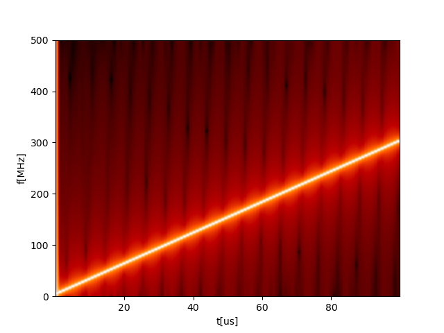
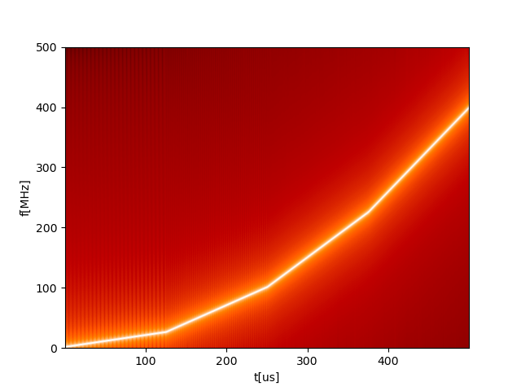
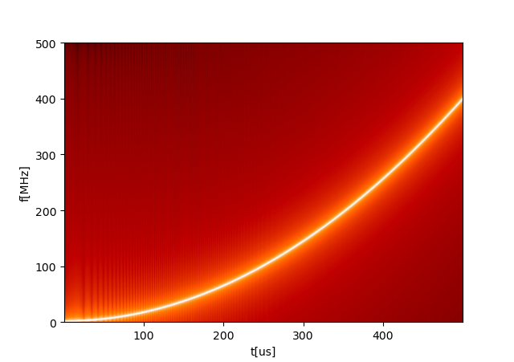

A pulse with continuously changing frequency is called a 
_chirped_ pulse. Details on how this feature is implemented can be found in the 
QUA docs. 

In this example, we show a simple usage of the `chirp` keyword 
in the `play` statement to sweep the frequency at a uniform rate (of 3kHz/nsec).
The specrogram below shows the spectrum of this pulse as a function of time. 

The second example shows how, though the system can generate only linear
chirps, you can quite easily piece together multiple linear segments 
to form other functional forms. 

For example, a quadratic chirp is show to be generated with either
4 segments below, 

or 40 segments, showing a much smoother transition

