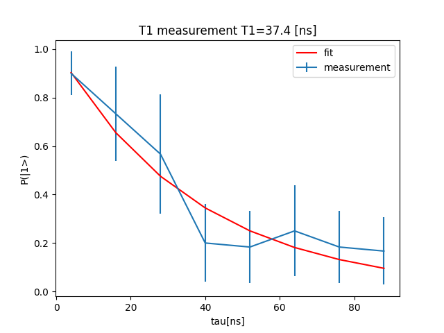

The $$T_1$$ is a characteristic decay time assessing the energy relaxation rate of a qubit. This script aims to present the protocol to deduce it for the usecase of a transmon qubit. 

It plays a $$\pi$$ pulse to rotate the qubit into the excited state 
and then reads out the state using the readout resonator.
 
## Config

The configuration dictionary is in the `configuration.py` file and is imported into the main program file 
`t1.py`. 
 
The configuration defines two elements: `qubit` and `rr` (the readout
resonator). 

The `qubit` quantum element defines the qubit we are measuring. The OPX is connected to 
a mixer via two analog output channels of the OPX, numbered 1 and 2. We also 
specify the LO frequency received by the mixer using the `lo_frequency` field of the `mixInputs`
dictionary, and a mixer correction matrix using the `mixer` field. 

The `qubit` element defines a single operation: `X` which plays a gaussian pulse to the 
I channel of the OPX - producing a rotation of the qubit about the X axis. 
This, of course, must be calibrated to product a proper $\pi$ pulse, e.g. with a 
Time-Rabi experiment.

The `rr` quantum element allows to measure the qubit state by measuring the resonant
I and Q components of a reflected microwave signal.
It defines a `readout` pulse which is read on input number 1 of the OPX, 
as set by the `output` entry of the `rr` element dictionary.
Note also the `time_of_flight` and `smearing` parameters which must 
be defined to perform a measurement. As for the `qubit` we define the associated
`lo_frequency` and `mixer` correction. 

> ⚠️Note that failing to declare a `digital_marker` will not fail program compilation, 
but will prevent data from being acquired. 

## Program 

The QUA program `T1` is built around two nested `for_` loops. The external 
loop is used for repeated averaging steps, and the internal loop scans the parameter `tau`.
The body of the loops plays the `X` operation to rotate the qubit into the `|1>` 
state. The `wait` statement is then used with a variable duration `tau`, followed by 
a measurement statement demodulating the readout into the `I` and `Q` variables. 
Each loop ends by a `wait` statement.
The program ends by a `recovery_delay` period which is assumed to be sufficient 
to allow qubit to decay back in the ground state.  

```python
with for_(tau, 4, tau < taumax, tau + dtau):
   with for_(n, 0, n < NAVG, n + 1):
       play("X", "qubit")
       wait(tau, "qubit")
       align("rr", "qubit")
       measure_and_save_state("rr")
       wait(recovery_delay // 4, "qubit")
   save(tau, tau_vec)
```
We run the program on the simulator for 500 clock cycles and 
take the simulated samples from the simulation job.

The acquired ADC stream is taken from `result_handles`. 
Note the change of name of the raw ADC stream from the name 
we specified in the program (`raw_adc`) to the name we use to 
get the stream (`raw_adc_input1`). This is an idiosyncrasy of the
raw ADC interface which does not appear in other QUA data saving 
mechanisms.
   
## Post-processing

To get an estimate of the probability to be in the excited state as a function of delay duration, 
we need to reshape the output streams and calculate the statistics: mean and variance of the 
probability to be in the excited state.

For the sake of the simulation, we define a function called `estimate_state` which returns 
a `1` or `0` with a probability exponentially decaying with the `tau` value. 
We then perform the required operations for estimating the mean and variance, 
plotting the results and estimating the T1 time (that was put in by hand).

This is a convenient starting point for integrating with a custom system-specific procedure.

## Sample output





## Script

[download script](t1.py)
 
