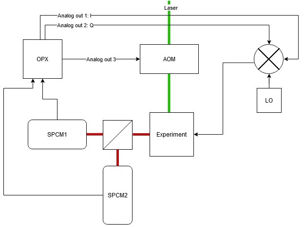
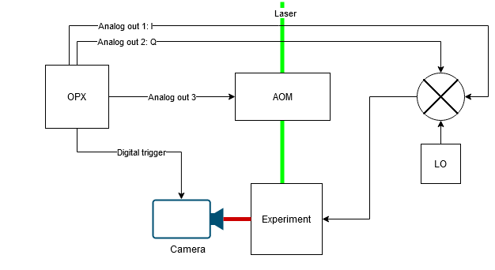

## G2 scanning

This example shows how to connect an OPX to a scanning microscopy setup with two SPCMs and to perform a G2 correlation measurement during a scan.

[download script](../g2-with-stage/g2_with_stage.py)

## Widefield ODMR

This example shows how to connect an OPX to a widefield imaging setup and perform ODMRs.
There are several different options, depending on the model and capabilities of the camera.

[download script](../widefield-odmr/widefield_odmr.py)

## Presentation

There is a presentation which further illustrates these options:

[download presentation](NV_Experiments_with_the_OPX.pptx)