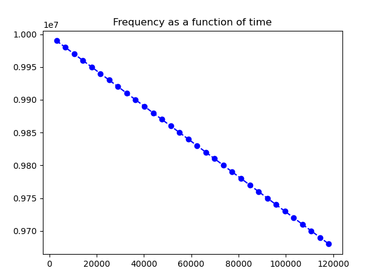
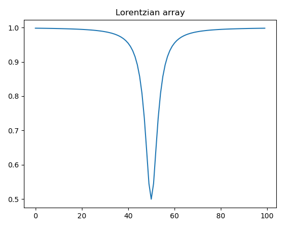

To be able to properly interact with a superconducting quantum system 
one needs to keep the calibrated intermediate frequency correct, as it can slightly and slowly change over time.

This example demonstrates a basic algorithm implementation that tracks the resonator's intermediate frequency while it decreases by 0.01 MHz per experiment iteration.
Also, In order to demonstrate the tracking, the response is spoofed using a Lorentzian array.

## Config
The configuration defines the quantum element `qe1` the readout resonator.
We define 2 inputs, one for the `I` component and one for the `Q` component.
Furthermore, we define a constant waveform.
That is because we are just interested in the resonance frequency, so we care only about the magnitude of the signal.

## Program
This method fixes the quantum element intermediate frequency using a basic tracking algorithm

The algorithm assumes the previous frequency is given, and that it changed a little bit.
It also assumes the element responses less at it's intermediate frequency, as some of the energy will be absorbed.

And so, the algorithm will measure the response at the previous frequency and at a step lower and higher.
Then the frequency with the least response will be chosen, and the element's frequency will be updated accordingly.

In this program, the real intermediate frequency decreases by 0.01MHz in each experiment iteration.
The tracker function is called in each iteration's start, and the chosen frequency therefore also decreases accordingly.

The used intermediate frequency as a function of time can be shown here:

While the magnitude stays constant (value at the minima of the Lorentzian) up to some noise, as can be shown here:

The Lorentz function (1-0.5/(1+(n-50)**2)) is approximated using the following array (minima at (50, 0.5)):

## Post Processing
No post processing provided. 

## Script

[download script](frequency_tracking.py)
