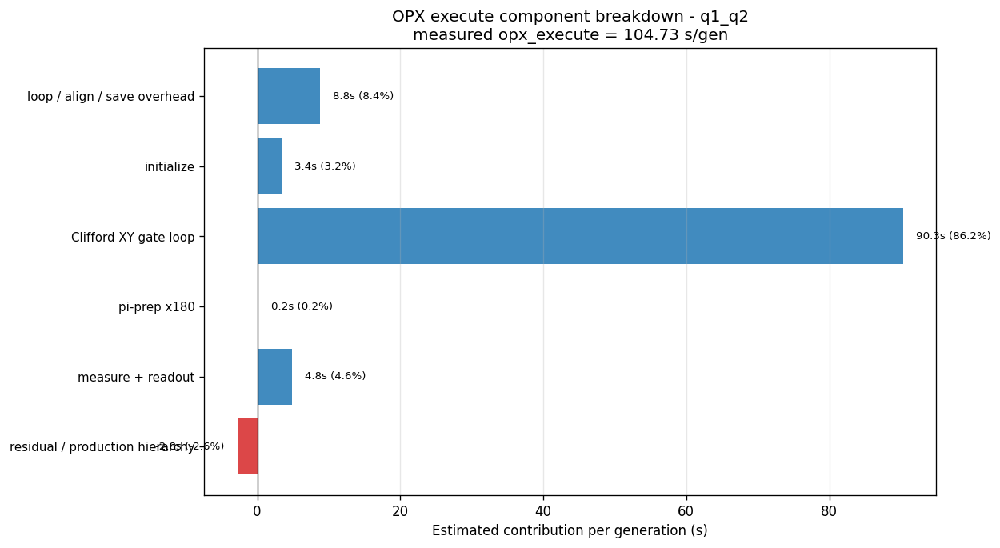

# CMA-ES Orbit — Timing / Profiling Report

- **Generated:** 2026-06-02 18:21:54
- **Qubit pair:** `q1_q2`
- **Push mode:** batched array input streams (1 RPC/stream/gen)

## Load

| Parameter | Value |
|---|---|
| generations | 10 |
| population_size | 10 |
| num_shots | 500 |
| num_circuits | 20 |
| orbit_depth | 30 |

## Headline

| Metric | Value |
|---|---|
| Total wall-clock runtime | 1076.350 s |
| Mean time per generation | 106.296 s |
| input_stream_pushes (total) | 60 |

## Logical categories (partition of total runtime)

| Category | Total (s) | % of total |
|---|---:|---:|
| communication | 15.631 | 1.5% |
| compile_upload | 8.942 | 0.8% |
| opx_execute | 1047.296 | 97.3% |
| cmaes_calculation | 0.030 | 0.0% |
| host_score_compute | 0.002 | 0.0% |
| setup_other | 3.596 | 0.3% |
| unaccounted | 0.852 | 0.1% |

## What `opx_execute` Includes

`opx_execute` starts immediately after the host finishes the six `push_to_input_stream` calls for one generation. It ends when both `survival_target` and `survival_control` have published the next stream-processed result item. It excludes host-side push, fetch, score computation, CMA-ES math, compile/upload, and session setup.

### Pair `q1_q2`

| Work item per generation | Count |
|---|---:|
| shot bodies | 400,000 |
| initializes | 400,000 |
| measurements | 400,000 |
| `ramp_to_zero` calls | 400,000 |
| `reset_frame` calls | 400,000 |
| stream `save` calls | 400,000 |
| Clifford loop iterations | 12,000,000 |
| native XY gates inside Clifford sequences | 22,610,000 |
| extra pi-variant `x180` gates | 200,000 |
| total native XY gates | 22,810,000 |
| frequency updates | 40 |
| input-stream advances | 6 |

| Estimated OPX time component | Total/gen (s) | % of `opx_execute` | Basis |
|---|---:|---:|---|
| loop / align / save overhead | 8.784 | 8.4% | 400,000 bodies x 21.96 us |
| initialize | 3.360 | 3.2% | 400,000 bodies x 8.40 us simulated span |
| Clifford XY gate loop | 90.327 | 86.2% | 22,610,000 native gates x 3.995 us |
| pi-prep x180 | 0.200 | 0.2% | 200,000 gates x 1.00 us pulse |
| measure + readout | 4.827 | 4.6% | 400,000 bodies x 12.07 us inferred span |
| residual / production hierarchy | -2.769 | -2.6% | measured opx_execute minus estimated components; includes candidate/qubit/circuit hierarchy, stream processing, unblock latency, and probe uncertainty |

| Derived metric | Value |
|---|---:|
| measured mean `opx_execute` per shot body | 261.82 us |
| measured mean `opx_execute` normalized by native XY gate | 4.59 us |
| normal-circuit native gates used | 1,138 |
| pi-circuit native gates used | 1,123 |
| target/control x90 length | 1000 ns / 1000 ns |
| target/control x180 length | 1000 ns / 1000 ns |
| target/control initialize inferred duration | 4416.0 ns / 4416.0 ns |
| target/control initialize estimated span | 8400.0 ns / 8400.0 ns |
| target/control measure inferred duration | 12068.0 ns / 12068.0 ns |

Each shot body is:

`reset_frame -> align -> initialize -> align -> optional x180 (pi variant only) -> depth random Clifford loop (array lookup + switch_ + XY pulse per native gate) -> align -> measure -> align -> voltage_sequence.ramp_to_zero -> align -> Cast.to_int -> save`

The initialize duration above is the macro-reported value. For the current non-heralded balanced initialize state, simulation showed an 8.4 us waveform span, so measured/simulated timing should be used for budget attribution rather than that inferred property.


## Per-iteration phases (summed over all generations)

| Phase | Total (s) | % of total | Mean/gen (ms) | Min (ms) | Max (ms) |
|---|---:|---:|---:|---:|---:|
| cmaes_ask | 0.009 | 0.0% | 0.87 | 0.29 | 1.28 |
| cmaes_tell | 0.021 | 0.0% | 2.12 | 0.91 | 4.05 |
| fetch | 6.400 | 0.6% | 639.97 | 633.31 | 653.46 |
| opx_execute | 1047.296 | 97.3% | 104729.61 | 100105.26 | 111759.33 |
| push | 9.231 | 0.9% | 923.13 | 913.95 | 941.36 |
| score_compute | 0.002 | 0.0% | 0.21 | 0.04 | 0.51 |

## One-time setup phases

| Phase | Total (s) | % of total |
|---|---:|---:|
| build_program | 0.217 | 0.0% |
| cmaes_init | 0.003 | 0.0% |
| compile_upload | 8.942 | 0.8% |
| connect | 1.100 | 0.1% |
| generate_circuits | 0.000 | 0.0% |
| generate_config | 0.439 | 0.0% |
| session_open | 1.837 | 0.2% |

## Figure


## OPX Execute Figure



## Raw report

```
========================================================================
CMA-ES ORBIT — TIMING / PROFILING REPORT
========================================================================
Total wall-clock run time :   1076.350 s
Generations executed      : 10
Mean time per generation  :    106.296 s
Counter[input_stream_pushes] = 60
Counter[candidates_evaluated] = 100

-- One-time setup phases -----------------------------------------------
  build_program               0.217 s     0.0%   
  cmaes_init                  0.003 s     0.0%   
  compile_upload              8.942 s     0.8%   
  connect                     1.100 s     0.1%   
  generate_circuits           0.000 s     0.0%   
  generate_config             0.439 s     0.0%   
  session_open                1.837 s     0.2%   

-- Per-iteration phases (summed over all generations) ------------------
  phase                       total     %tot     mean/gen       min       max
  cmaes_ask                   0.009 s     0.0%        0.87ms     0.29ms     1.28ms
  cmaes_tell                  0.021 s     0.0%        2.12ms     0.91ms     4.05ms
  fetch                       6.400 s     0.6%      639.97ms   633.31ms   653.46ms
  opx_execute              1047.296 s    97.3%   104729.61ms 100105.26ms 111759.33ms
  push                        9.231 s     0.9%      923.13ms   913.95ms   941.36ms
  score_compute               0.002 s     0.0%        0.21ms     0.04ms     0.51ms

-- Logical categories --------------------------------------------------
  communication              15.631 s     1.5%   
  compile_upload              8.942 s     0.8%   
  opx_execute              1047.296 s    97.3%   
  cmaes_calculation           0.030 s     0.0%   
  host_score_compute          0.002 s     0.0%   
  setup_other                 3.596 s     0.3%   
  unaccounted                 0.852 s     0.1%   

-- What opx_execute includes --------------------------------------------
  Starts after the six candidate input-stream pushes complete; ends when both survival result handles publish the next generation.
  Pair q1_q2:
    shot bodies/gen          : 400,000 (261.82 us per body at measured mean)
    initialize / measure/gen : 400,000 / 400,000
    Clifford steps/gen       : 12,000,000
    native XY gates/gen      : 22,810,000 (4.59 us per gate if all OPX time is normalized by gates)
    pi-prep x180 gates/gen   : 200,000
    reset/ramp/save/gen      : 400,000 / 400,000 / 400,000
    freq updates / stream advances/gen: 40 / 6
    estimated time contribution:
      loop / align / save overhead           8.78 s     8.4%
      initialize                             3.36 s     3.2%
      Clifford XY gate loop                 90.33 s    86.2%
      pi-prep x180                           0.20 s     0.2%
      measure + readout                      4.83 s     4.6%
      residual / production hierarchy       -2.77 s    -2.6%
========================================================================
```
