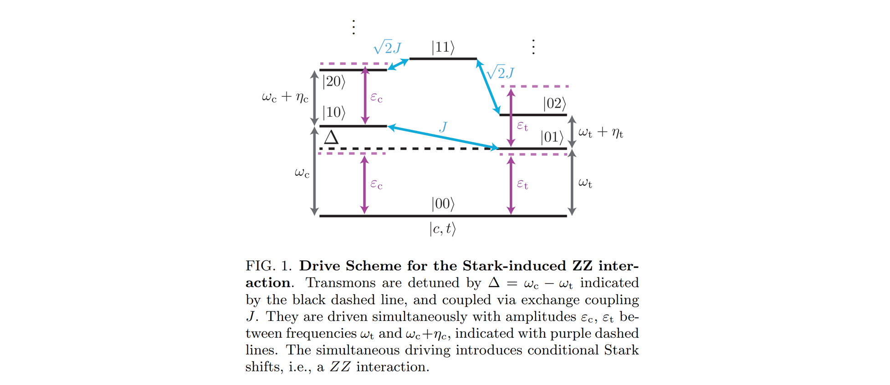

# Fixed‑Frequency Two‑Qubit Gates: **CR**, **CZ**, and **Microwave Crosstalk** (Repo Overview)

This repository gathers our **fixed‑frequency transmon** routines for

* **CR (Cross‑Resonance) gate**,
* **Stark‑induced CZ** (microwave‑activated, tunable **ZZ**) gate, and
* **Microwave drive‑line crosstalk** characterization/compensation.

### Quick Links

* 👉 **[CR Gate (Cross Resonance)](#cr-gate-cross-resonance)** — *placeholder; owner **Soon** (nodes {30–31g}).*
* 👉 **[Stark‑Induced CZ Gate (Microwave‑Activated Tunable ZZ)](#stark-induced-cz-gate-microwave-activated-tunable-zz)** 
* 👉 **[Microwave Crosstalk Characterization & Compensation](#microwave-crosstalk-characterization--compensation)** — *placeholder; owner **Ingu** (nodes {20–21}).*

---

## CR Gate (Cross Resonance)

> ***Placeholder — Soon***

**To be included by owner:**


---

# Stark‑Induced **CZ** Gate (Microwave‑Activated Tunable ZZ)

This repository documents and implements a **hardware‑efficient CZ gate** based on a *microwave‑activated, tunable ZZ interaction* between fixed‑frequency, fixed‑coupling transmons. It explains the physics, the experimental tuning flow, and how the provided **QUA** nodes realize the ZZ calibration.

> **Paper basis** – Bradley K. Mitchell *et al.*,  
> “[Hardware-Efficient Microwave-Activated Tunable Coupling Between Superconducting Qubits](https://arxiv.org/abs/2105.05384),” 2021.  
> We cite it throughout and point to specific figures for visuals you can place in this README.

---

## Table of Contents

1. [Concept of the CZ gate](#concept-of-the-cz-gate)
2. [How tunable **ZZ**, **ZI**, **IZ** arise (physics)](#how-tunable-zz-zi-iz-arise-physics)
3. [How to tune **ZZ/ZI/IZ** in the lab (experiments)](#how-to-tune-zzziiz-in-the-lab-experiments)
4. [QUA implementation (focus on ZZ)](#qua-implementation-focus-on-zz)

   * [Node **40a\_Stark\_induced\_ZZ\_vs\_durations** (detailed)](#node-40a_stark_induced_zz_vs_durations-detailed)
   * [How **40b** differs (duration × relative phase)](#how-40b-differs-duration--relative-phase)
   * [How **40c** differs (duration × amplitude)](#how-40c-differs-duration--amplitude)
5. [Future work – ZI/IZ QUA nodes](#future-work--ziiz-qua-nodes)
6. [Project structure](#project-structure)
7. [References](#references)

---

## Concept of the CZ gate

**Matrix form.**

$$
\mathrm{CZ}=\mathrm{diag}(1,1,1,-1)
$$

**Generator (Pauli decomposition).** In our context the CZ is realized by accumulating a conditional phase via **ZZ**, while compensating single‑qubit phases (**ZI, IZ**):

$$
\mathrm{CZ}=\exp\left[-\frac{i}{2}\frac{\pi}{2}(-\mathrm{ZI}-\mathrm{IZ}+\mathrm{ZZ})\right].
$$

(Used explicitly in the paper when calibrating the gate.)&#x20;

The CZ gate can be understood both from its **matrix form** and from its **generator in terms of Pauli operators**.  
This decomposition shows how the conditional phase arises via the **ZZ interaction**, while ZI/IZ terms represent single-qubit phase shifts to be compensated.

> **Figure:** Effective Hamiltonian used in the paper, showing coefficients for ZI, IZ, and ZZ contributions.  
> **Experiemental Goal** Tune-up for these coefficients. 
> 

---

## How tunable **ZZ**, **ZI**, **IZ** arise (physics)

### System Hamiltonian (drive frame, Duffing model)

Two coupled transmons (control **Qc**, target **Qt**) driven simultaneously near‑but‑off resonance:

$$
H=\sum_{i=c,t}\Big[(\omega_i-\omega_d)a_i^\dagger a_i + \frac{\eta_i}{2}a_i^\dagger a_i^\dagger a_i a_i + \epsilon_i a_i+\epsilon_i^\ast a_i^\dagger\Big]
+J\,(a_c^\dagger a_t+a_c a_t^\dagger).
$$

Here \$J\$ is the exchange coupling, \$\epsilon\_i\$ are complex drive amplitudes, \$\eta\_i\$ are anharmonicities.&#x20;

> 

### Conditional Stark picture → tunable **ZZ**

* Off‑resonant driving of **Qt** when **Qc** is also driven produces **state‑dependent Stark shifts** on **Qt**:

  $$
  \tilde{\delta}_n=\frac{|\tilde{\epsilon}_n|^2}{\Delta_t}\quad (n\in\{0,1\}),
  $$

  with \$\Delta\_t=\omega\_t-\omega\_d\$. The **ZZ rate** is \$\zeta=\tilde{\delta}\_0-\tilde{\delta}\_1\$.&#x20;
* Driving **both** transmons enhances and controls \$\zeta\$. To first order, adding a drive on **Qt** makes

  $$
  \zeta \propto \frac{2\mu}{\Delta_t}(\tilde{\epsilon}_0+\tilde{\epsilon}_1+2\epsilon_t)+\mathcal{O}(|\epsilon_t|^2),
  $$

  where \$\mu\$ is the CR‑like conditional drive rate. **Amplitude** and **relative phase** between drives tune \$\zeta\$ smoothly and even allow sign reversal (cancellation of idle ZZ).&#x20;

> **Optional deep‑dive**
>
> <details><summary>Third‑order expression and phase dependence (from supplement)</summary>
> The third‑order contribution shows \(\zeta\) scales as \( \propto \epsilon_t \epsilon_c \cos\phi \) (relative phase \(\phi\)), on top of the static second‑order term—matching the observed sinusoidal dependence on relative phase and linear scaling with amplitude. :contentReference[oaicite:10]{index=10}
> </details>

---

## How to tune **ZZ/ZI/IZ** in the lab (experiments)

### **ZZ** tuning (entangling strength)

* **What to vary**: Drive frequency \$\omega\_d\$, amplitudes on both qubits \$A\_c, A\_t\$, and **relative phase** \$\varphi\_d\$.
* **What to measure**: Frequency shift of **Qt** *conditioned* on the state of **Qc** (i.e., \$\zeta\$).
  The paper does this with **Ramsey** on **Qt** while preparing **Qc** in \$|0\rangle\$ or \$|1\rangle\$; \$\zeta\$ vs \$\varphi\_d\$ and vs amplitudes matches simulation including crosstalk.&#x20;

> **Place figure here**
> 📎 *Paper Fig. 2 (p.3)*: \$\zeta(\varphi\_d)\$ for several \$|A|\$ (asymmetry with crosstalk) and \$\zeta(A\_t)\$ for several \$A\_c\$ (linear scaling).&#x20;

### Gate‑level calibration (**ZZ** then **ZI/IZ**)

1. **Choose pulse shape and coarse \$\tau\_p\$.** Use a **cosine‑ramp flattop**; pick \$\tau\_p\$ from an amplitude/phase sweep that yields strong entanglement. The paper maximizes $R=\tfrac{1}{2}\lVert \mathbf{r}_0-\mathbf{r}_1\rVert^2$.&#x20;
2. **Calibrate \$\omega\_d, A\$** by scanning drive **detuning** and **amplitude** to maximize $R$ (broad usable detuning band; off‑resonant interaction).&#x20;
3. **Calibrate local phases (ZI/IZ)** using **virtual‑Z** corrections after the entangling pulse, following Supplement Fig. S2.&#x20;

> **Place figures here**
> 📎 *Paper Fig. 3 (p.4)*: pulse diagram for $R$ scan and heatmap $R(A,\omega_d)$.&#x20;
> 📎 *Paper Fig. S2 (supplement p.3)*: circuit used to extract $\phi_{ZI},\phi_{IZ}$.&#x20;

---

## QUA implementation (focus on **ZZ**)

> ⚠️ **Important difference from the paper**
> The paper’s $\zeta$ extraction uses **Ramsey** with measurements along $\langle X\rangle,\langle Y\rangle,\langle Z\rangle$.
> **Our code** uses an **echo‑style sequence** and measures only **$\langle Z\rangle$**. Keep this in mind when comparing analysis/fits.&#x20;

> **Place figure here**
> 📎 *Slides p.8*: “How to implement with QUA” (pulse sketch and code snippet).&#x20;

### Node **40a\_Stark\_induced\_ZZ\_vs\_durations** (detailed)

#### `def create_qua_program(node):` — what it does

* **Setup & sweeps**

  * Builds **flattop** Stark‑CZ pulses with **40 ns** cosine ramps and **sweeps flat‑top durations**; `idle_time = flat_top + 2×40 ns`.
  * **Control state** loop `s ∈ {0,1}` prepares **Qc** in \$|g\rangle\$ or \$|e\rangle\$.
  * Registers sweep axes: `qubit_pair`, `idle_time`, `control_state`.

* **Baked waveforms**

  * `bake_ZZ_waveforms(...)` creates the **matched pair** (ZZ drive + detuned XY on **Qt**) per duration.

* **Pulse sequence (echo‑style)**

  1. **x90** on **Qt** (equator prep).
  2. **Zero‑amp** flattop (symmetry).
  3. **π flips** (conditional on `s`).
  4. **Play Stark‑CZ** flattop.
  5. **x90** on **Qt**.
  6. **Measure $\langle Z\rangle$**; optional state discrimination.
  7. Reset frames and wait.

  This yields an **oscillation vs `idle_time`**; the **difference** of fitted frequencies between control states gives **$\zeta$**.

* **Streams & buffering**

  * Buffers shaped `[control_state, idle_time]`, shot‑averaged.

> **Pointers to code**: `align(...)`, `flattop_pulses[qp.name][pulse_idx].run(...)`, nested loops over `idle_durations_ns` and `s`, and stream processing `.buffer(2).buffer(len(idle_durations_ns)).average().save(...)`.

#### `def analyse_data(node):` — what it does

* **Reshape & IQ→V** via `process_raw_dataset(...)`.
* **Fit oscillation with exponential envelope** via `fit_oscillation_decay_exp(...)`, extracting:

  * **frequency** `f`,
  * **decay** → **modified echo** $T_{2,\mathrm{echo}}=-1/\text{decay}$,
  * **ZZ coefficient** (target):

    $$
    \zeta = f_{\text{target}\,|\,\text{Qc}=0}-f_{\text{target}\,|\,\text{Qc}=1}.
    $$

  Results saved in `ds_fit` and `fit_results`.

> **Why echo + ⟨Z⟩ works here**
> Echo suppresses low‑frequency detuning noise while converting the **conditional detuning** into a robust phase oscillation visible in $\langle Z\rangle$ after the second $x_{90}$. This differs from the paper’s full tomography but yields the same **$\zeta$** observable.&#x20;

---

### How **40b** differs (duration × relative phase)

**File:** `40b_Stark_induced_ZZ_vs_duration_and_relative_phase`

* **What’s new in `create_qua_program`**

  * Adds a sweep of **relative phase** \$\varphi\$; feeds **\[cos, −sin, sin, cos]** as I/Q scaling:
    `amp_array=[(zz.name, 1), (qt.xy_detuned.name, [cos, -sin, sin, cos])]`.
  * Adds sweep axis `relative_phase`; buffers `[control_state, idle_time, relative_phase]`.

* **What’s new in `analyse_data`**

  * Same fit; summary plots per phase.
  * `update_state` stores calibrated scaling in `qp.macros["stark_cz"]`.

> **Why**: matches the paper’s **sinusoidal** phase dependence of $\zeta$ and ability to **cancel** ZZ.&#x20;

---

### How **40c** differs (duration × amplitude)

**File:** `40c_Stark_induced_ZZ_vs_duration_and_amplitude`

* **What’s new in `create_qua_program`**

  * Sweeps scalar **amplitude scaling** `a` for both tones:

    ```python
    zz.play(wf_type, a)
    qt.xy_detuned.play(f"zz_{wf_type}_{qp.name}", a)
    ```
  * Adds sweep axis `amp_scaling`.

* **What’s new in `analyse_data`**

  * Same extraction; in `update_state` multiplies stored waveform **amplitudes** by the fitted scaling.

> **Why**: mirrors paper data where $\zeta$ grows approximately **linearly** with amplitude when both qubits are driven.&#x20;

---

## Future work – **ZI/IZ** QUA nodes

> **Not implemented in this repo yet** (intentionally left for follow‑up).

**Planned approach (matching the paper’s procedure):**

* After setting the **ZZ** pulse (frequency/amp/phase/duration), measure **local phase errors** via simple Ramsey‑type scans and compensate with **virtual‑Z** gates $(\phi_{ZI}, \phi_{IZ})$ immediately after the entangling pulse (see **Fig. S2**).&#x20;

---

## Project structure

```
cz-stark/
├── calibrations/
│   ├── 40a_Stark_induced_ZZ_vs_durations.py
│   ├── 40b_Stark_induced_ZZ_vs_duration_and_relative_phase.py
│   └── 40c_Stark_induced_ZZ_vs_duration_and_amplitude.py
├── calibration_utils/   # baking, analysis, plotting, helpers (imported by nodes)
├── quam_config/         # QUAM state generation / loading
└── README.md            # this file
```

---

## References

* **Main reference (with figures to place in this README):**
  B. K. Mitchell *et al.*, “Hardware‑Efficient Microwave‑Activated Tunable Coupling Between Superconducting Qubits,” incl. Supplement. Use: **Fig. 1** (drive scheme), **Fig. 2** (ZZ vs phase/ampl.), **Fig. 3** (R‑map), **Fig. S2** (local‑Z calibration).&#x20;
* **Slide deck (placeholders for visuals & code snippets):**
  “CZ Gate Implementation”—matrix & decomposition, tuning steps, and a “How to implement with QUA” code/pulse sketch.&#x20;

---

## Appendix — Image placement guide

> Use these as TODO markers when you add images to the repo.

* **Concept of the CZ gate** — *Slides p.2–3* (**Matrix**, **Pauli decomposition**).&#x20;
* **How tunable ZZ arises** — *Paper Fig. 1 (p.2)* (**Drive scheme**).&#x20;
* **ZZ tuning (experiments)** — *Paper Fig. 2 (p.3)* (**$\zeta(\varphi_d)$** and **$\zeta(A_t)$**).&#x20;
* **Gate‑level calibration** — *Paper Fig. 3 (p.4)* (**$R(A,\omega_d)$** map + **pulse cartoon**).&#x20;
* **Future work – ZI/IZ** — *Paper Fig. S2 (supplement p.3)* (**local Z calibration circuit**).&#x20;
* **QUA implementation** — *Slides p.8* (**pulse sequence + code snippet**).&#x20;

---

## FAQ

<details>
<summary><strong>Why do our nodes use an echo and only ⟨Z⟩ readout?</strong></summary>
It reduces low‑frequency detuning noise and simplifies acquisition on multi‑qubit systems. The fit extracts the oscillation frequency vs idle time, and the **difference** between control states directly yields **\(\zeta\)**—the same observable targeted via Ramsey‑tomography in the paper. :contentReference[oaicite:32]{index=32}
</details>

<details>
<summary><strong>Where does relative phase enter in QUA?</strong></summary>
In **40b**, the detuned **Qt** tone uses a 2×2 rotation \([ \cos\phi, -\sin\phi; \sin\phi, \cos\phi]\) applied to I/Q via `amp_array=[cos,-sin,sin,cos]`, matching the paper’s phase‑dependent \(\zeta\). :contentReference[oaicite:33]{index=33}
</details>

---

## Microwave Crosstalk Characterization & Compensation

> ***Placeholder — Ingu** to add content for nodes {20–21} (code review + README section).*

**To be included by owner:**

* Brief purpose (drive‑line crosstalk matrix identification & compensation knobs).
* Minimal experiment flow and analysis hooks.
* Image placeholders (pulse layouts, matrix view).

---

**License** — same as the parent project.
