# Fixed‑Frequency Two‑Qubit Gates: **CR**, **CZ**, and **Microwave Crosstalk** (Repo Overview)

This repository gathers our **fixed‑frequency transmon** routines for

> 👉 **[Cross Resonance(CR) Gate](#cr-gate-cross-resonance)**  
> 👉 **[Stark-Induced Controlled-Z(CZ) Gate](#stark-induced-cz-gate-with-microwave-activated-tunable-zz)**  
> 👉 **[Microwave Crosstalk Characterization & Compensation](#microwave-crosstalk-characterization--compensation)** 

---

# CR Gate (Cross Resonance)
The cross-resonance (CR) gate is implemented on fixed-frequency qubit with exchange coupling $J$ by driving the control qubit at or near the resonance frequency of the target qubit ($\omega_d=\omega_t$) [1]. The figure shows the resulting drive amplitude $\tilde{\varepsilon}$ on the target qubit as a function of drive frequency $\omega_d$ [2]. The drive strength depends on the control state which gives the state-dependent interaction necessary to generate entanglement between the qubits.

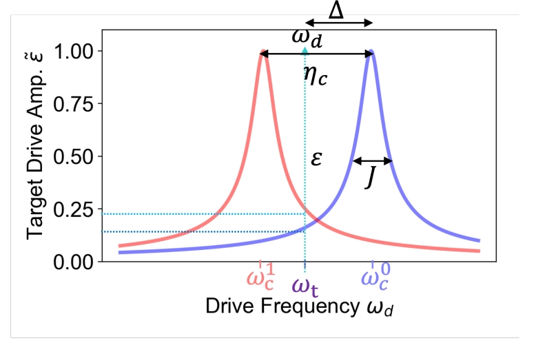

This forms the basis of the cross-resonance (CR) gate, with the tuned CR gate resulting in only a ZX interaction on the qubits.


## Standard (echo) CR gate
The driven Hamiltonian is approximately [3]

$$
\frac{H_D}{\hbar} \approx \epsilon(t)\left( m\,IX - \mu\,ZX + \eta\,ZI \right),
$$

where qubit 1 (2) is the control (target), and:

- $\{I, X, Y, Z\}^{\otimes 2}$: two-qubit Pauli operators.  
- $\epsilon(t)$: drive amplitude on the control qubit.  
- $\mu \approx J/\Delta$: coupling parameter ($J$ = qubit-qubit coupling energy, $\Delta$ = frequency detuning).  
- $m$: accounts for spurious crosstalk and higher-level effects.  
- $\eta$: magnitude of Stark shift from off-resonant driving.  

The physical meaning of each term is as follows:
- $mIX$: Rabi-like oscillations of qubit 2.  
- $-\mu ZX$: slower conditional rotation of qubit 2, depending on qubit 1’s state.  
- $\eta ZI$: Stark shift on qubit 1.  

Within this picure, an ideal ZX interaction can be obtained by performing an echo protocol.

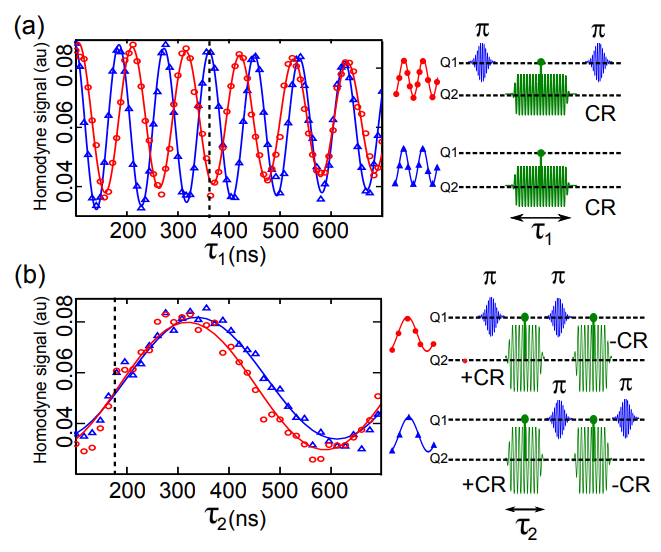

The figure shows the evolution of the qubit states depending on the control qubit state (red: $\ket{1}$, blue: $\ket{0}$) prior to the CR pulse. When applying directly a CR $\pi$ pulse (Fig. a), the resultant signals deviate rapidly due to the additional terms, which lead to poor gate fidelity. An echo scheme is implemented by a sequential CR $\pm \pi/2$ sandwiching a $\pi$ pulse on the control. This standard implementation echoed away the fast-rotating $IX$ and $ZI$ to obtain the desired $ZX$ gate.

## CR gate with cancellation pulse
However, the Hamiltonian equation in the previous section assumes a simple qubit model. In the presence of higher levels of the transmon and microwave crosstalk on the device, the complete Hamiltonian is described by [4]
$$
\hat{H}_{\mathrm{CR}} = I \otimes A + Z \otimes B,
$$
in which $A$ and $B$ are generic sum of Pauli operators. Indeed, measuring the expectation values $\langle X \rangle$, $\langle Y \rangle$, and $\langle Z \rangle$ revealed that oscillation is present for the target qubit as characterized by $A$ and $B$ depending on the state of the control qubit.

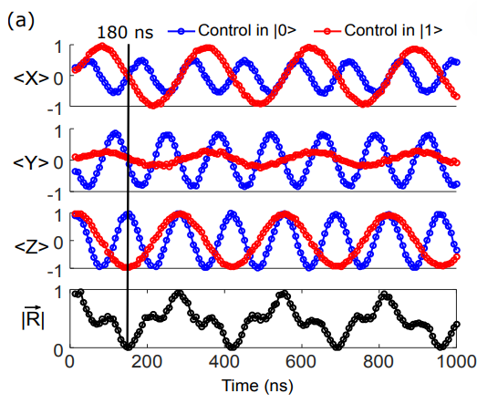 

The Bloch vector $\|\vec{R}\|$ characterizes the distance of the target qubit state when control qubit in $\ket{0}$ and $\ket{1}$ as
$$
\|\vec{R}\| =
\sqrt{(\langle X \rangle_0 + \langle X \rangle_1)^2 +
      (\langle Y \rangle_0 + \langle Y \rangle_1)^2 +
      (\langle Z \rangle_0 + \langle Z \rangle_1)^2}.
$$
The state can be maximally entangled at $\|\vec{R}\| = 0$. While this is conceptually straightforward, the exact interaction strength of the Pauli terms depend on the system.

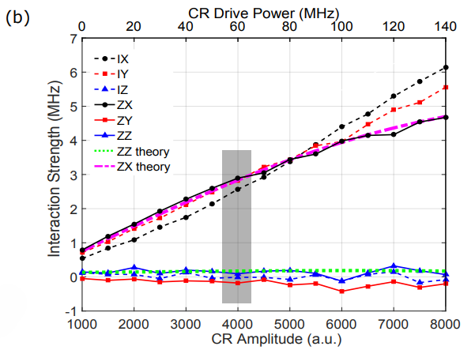 

Here, we observed dominant interaction of $IX$, $IY$ and $ZX$ dependent on the CR amplitude in a measurement [4]. While others are negligible in terms of magnitude, they can still compromise the gate fidelity. More importantly, we observe the additional contribution of $IY$ and $ZY$. This is attributed to the classical crosstalk.

For an ideal CR gate, the goal is to produce only $ZX$ interaction with the rest echoed away. However, this only works for the $IX$, $ZZ$, and $ZI$ since they commute with $ZX$. As such, a calibration scheme that cancels these error is necessary. The proposed method is to apply a cancellation pulse on the target qubit [4].

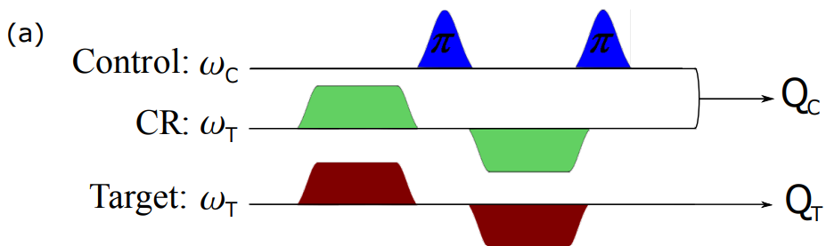 

Extending this upon the echo scheme, the evolution on the Bloch sphere shows a more circular trajectory as expected from an ideal Rabi oscillation of the ZX interaction (up to a small error).

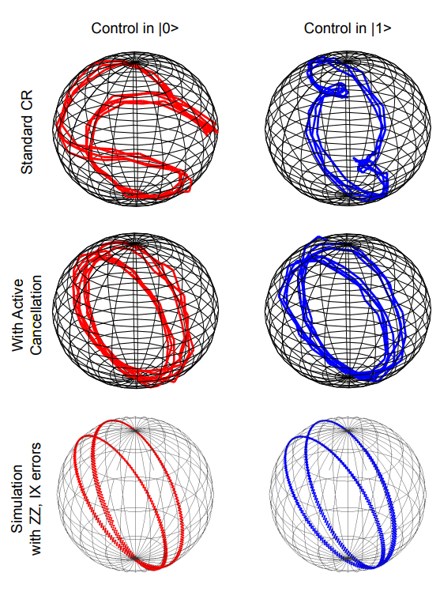 

## Implementation of the CR gate
Within the calibration node, we could select the `cr_type` parameter as one of the following: `direct`, `direct+cancel`, `direct+echo`, `direct+cancel+echo`. The naming of each should be self-explanatory. For example, `direct+cancel+echo` implied that a CR pulse (on control qubit) and cancellation pulse (on target qubit) is implemented with echo. Here, we will describe the full calibration scheme for the `direct+cancel+echo` CR gate.


## Calibration node

Here, we describe the protocols implemented in each node.

`30_CR_time_rabi_QST`
While this is not a calibration node, the node measures the evolution of $\langle X \rangle$, $\langle Y \rangle$ and $\langle Z \rangle$ with respect to the CR drive duration. The interaction strength of the two Pauli gates (see <a href="#CR_cancel">figure</a> for reference) are calculated. The analysis used here is used for the rest of the nodes.

`31a_CR_hamiltonian_tomography_vs_cr_drive_amp`
Is used to determine the required CR drive amplitude to achieve the desired $ZX$ interaction strength.


`31b_CR_hamiltonian_tomography_vs_cr_drive_phase`
The CR drive phase is optimized to $\phi_0$ in which the $ZX$ component is maximized and $ZY$ is zero. $\phi_1$ is also obtained which minimizes $IY$.

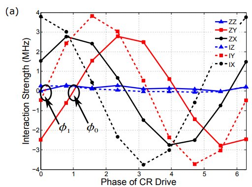 

<!-- `31c_CR_hamiltonian_tomography_vs_cr_cancel_phase`
The ideal cancellation phase is $\phi_0-\phi_1$, but we manually scan the phase. -->

`31d_CR_hamiltonian_tomography_vs_cr_cancel_amp`
For the calibrated phases, an optimized cancellation amplitude can lead to the interaction strength zero crossing of the other components.

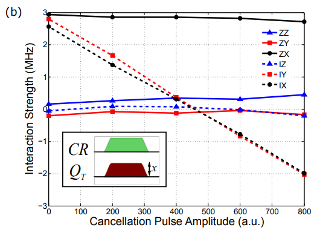 

`31e_CR_phase_correction`
As there is residual $ZZ$ from the implemented CR gate (in general), we correct for them.

## References

[1] A simple all-microwave entangling gate for fixed-frequency superconducting qubits https://arxiv.org/abs/1106.0553

[2] Investigating Microwave-Activated Entangling Gates on Superconducting Quantum
Processors https://escholarship.org/uc/item/5sp8n6st

[3] Process verification of two-qubit quantum gates by randomized benchmarking https://arxiv.org/abs/1210.7011

[4] Procedure for systematically tuning up crosstalk in the cross resonance gate https://arxiv.org/pdf/1603.04821


---

# Stark-Induced **CZ** Gate (with microwave-activated tunable ZZ) 

The Stark-induced CZ gate is implemented by simultaneously driving two fixed-frequency, fixed-coupling transmons with off-resonant microwaves, which generates state-dependent Stark shifts and thus a tunable ZZ interaction. <U>Instead of relying on flux-tunable couplers</U>, this approach amplifies or cancels the residual ZZ coupling by adjusting the drive frequency, amplitude, and relative phase.  

**Experiments in the paper**: The ZZ interaction is characterized with Ramsey experiment to observe conditional frequency shifts, and the CZ pulse is calibrated by sweeping the drive parameters and then applying virtual Z corrections to figure out IZ, ZI coefficients.  
  
**Code differences from the paper**:
1. ZZ interaction is characterized with Echo experiment.
2. IZ, ZI coeffiecients are characterized with error amplification experiments.

> **Ref. Paper** – Bradley K. Mitchell *et al.*,  
> “[Hardware-Efficient Microwave-Activated Tunable Coupling Between Superconducting Qubits](https://arxiv.org/abs/2105.05384),” 2021.  


---

## Table of Contents

1. [Concept of the CZ gate](#concept-of-the-cz-gate)
2. [How tunable **ZZ**, **ZI**, **IZ** arise (physics)](#how-tunable-zz-zi-iz-arise-physics)
3. [How to tune **ZZ/ZI/IZ** in the lab (experiments)](#how-to-tune-zzziiz-in-the-lab-experiments)
4. [QUA implementation (focus on ZZ)](#qua-implementation-focus-on-zz)

   * [Node **40a\_Stark\_induced\_ZZ\_vs\_durations** (detailed)](#node-40a_stark_induced_zz_vs_durations-detailed)
   * [How **40b** differs (duration × relative phase)](#how-40b-differs-duration--relative-phase)
   * [How **40c** differs (duration × amplitude)](#how-40c-differs-duration--amplitude)
5. [Future work – ZI/IZ QUA nodes](#future-work--ziiz-qua-nodes)
6. [Project structure](#project-structure)
7. [References](#references)

---

## CZ Gate Representation

**Matrix form**

$$
\mathrm{CZ}=\mathrm{diag}(1,1,1,-1)
$$

**Generator (Pauli decomposition)**: In our context the CZ is realized by accumulating a conditional phase via **ZZ**, while compensating single‑qubit phases (**ZI, IZ**):

$$
\mathrm{CZ}=\exp\left[-\frac{i}{2}\frac{\pi}{2}(-\mathrm{ZI}-\mathrm{IZ}+\mathrm{ZZ})\right].
$$

(Used explicitly in the paper when calibrating the gate.)&#x20;


Each term shows how the conditional phase arises via the **ZZ interaction**, while ZI/IZ terms represent single-qubit phase shifts to be compensated.  
**Experimental goal**: Extract $\alpha$, $\beta$, $J$ coefficients of the effective hamiltonian as below.
  
> 

---

## How tunable **ZZ**, **ZI**, **IZ** arise

### System Hamiltonian (Duffing model)

Two coupled transmons (control **$Q_c$**, target **$Q_t$**) driven simultaneously near‑but‑off resonance:

$$
H=\sum_{i=c,t}\Big[(\omega_i-\omega_d)a_i^\dagger a_i + \frac{\eta_i}{2}a_i^\dagger a_i^\dagger a_i a_i + \epsilon_i a_i+\epsilon_i^\ast a_i^\dagger\Big]
+J\,(a_c^\dagger a_t+a_c a_t^\dagger).
$$

Here $J$ is the exchange coupling, $\omega_d$, $\omega_c$, $\omega_t$ are drive/control/target frequencies respectively, $\epsilon_i$ are complex drive amplitudes, $\eta_i$ are anharmonicities. Drive scheme with energy levels for the Stark‑induced ZZ interaction are shown below.

> 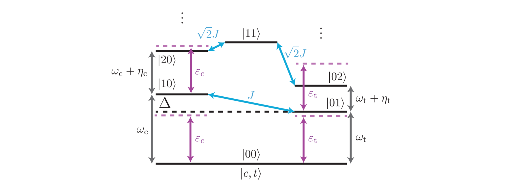

### Conditional Stark picture → tunable **ZZ**

**ZZ interaction**: Off‑resonant driving on **$Q_c$** at the frequency $w_d$ induces Stark shifts on the target qubit **$Q_t$** with the rate $\tilde{\delta}_n$ depending on control qubit state $n$:

$$
\tilde{\delta}_n=\frac{|\tilde{\epsilon}_n|^2}{\Delta_t}.
$$

with $\Delta_t=\omega_t-\omega_d$ and $n\in\{0,1\}$. The **ZZ interaction rate** $\zeta$ is defined as $\zeta=\tilde{\delta}_0-\tilde{\delta}_1$, which can be described in terms of $\mu$. 

$$
\zeta = 2\mu(\tilde{\epsilon}_0 + \tilde{\epsilon}_1)/\Delta_t.
$$


where $\mu$ is the CR‑like conditional drive rate $\mu$ = $(\tilde{\epsilon}_0-\tilde{\epsilon}_1)/2$. 

**Driving $Q_c$ and $Q_t$ simultaneously**: Since a single drive tone on **$Q_c$** does not induce sufficiently large interaction to realize CZ gate, the paper proposes driving target qubit simultaneously. To first order, adding a drive on **$Q_t$** makes

$$
\zeta \propto \frac{2\mu}{\Delta_t}(\tilde{\epsilon}_0+\tilde{\epsilon}_1+2\epsilon_t)+\mathcal{O}(|\epsilon_t|^2),
$$

**Amplitude** and **relative phase** between drives tune $\zeta$ smoothly and even allow sign reversal (cancellation of idle ZZ) as shown in the figure below.

> **Optional**<details><summary>Third-order expression and phase dependence (from supplement)</summary>
> The third-order contribution shows $\zeta$ scales as $\propto \epsilon_t \epsilon_c \cos\phi$ (relative phase $\phi$), on top of the static second-order term—matching the observed sinusoidal dependence on relative phase and linear scaling with amplitude.
> </details>

---

## Experiment: how to tune **ZZ/ZI/IZ** 

### **ZZ** interaction tuning

* **What to vary**: Drive pulse duration $\tau$, Drive frequency $\omega_d$, amplitudes on both qubits $A_c, A_t$, and **relative phase** $\varphi_d$.
* **What to measure**: Frequency shift $\zeta$ of **$Q_t$** *conditioned* on the state of **$Q_c$**.
  The paper does this with **Ramsey**(while **Echo** in the code) on **$Q_t$** while preparing **$Q_c$** in $|0\rangle$ or $|1\rangle$; $\zeta$ vs $\varphi_d$ and vs amplitudes.
* **Why Echo?**: Using an echo sequence suppresses low-frequency dephasing and cancels background single-qubit detuning, so the measurement isolates the pure ZZ interaction. 

> 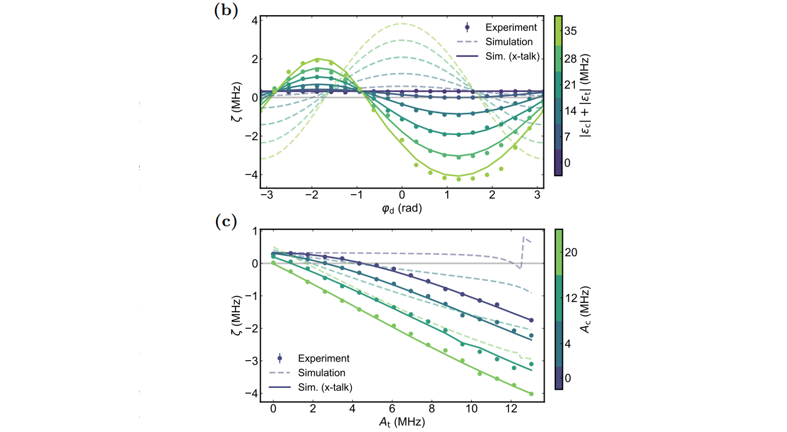
> 📎 *Paper Fig. 2 (p.3)*: $\zeta(\varphi_d)$ for varying $|\epsilon_c|+|\epsilon_t|$ (asymmetry with crosstalk) and $\zeta(A_t)$ for varying $A_c$ (linear scaling).

---  
## QUA implementation for ZZ 

> ⚠️ **Important difference from the paper**
> The paper’s $\zeta$ extraction uses **Ramsey** with measurements along $\langle X\rangle,\langle Y\rangle,\langle Z\rangle$.
> **Our code** uses an **echo‑style sequence** and measures only **$\langle Z\rangle$**. Keep this in mind when comparing analysis/fits.

> 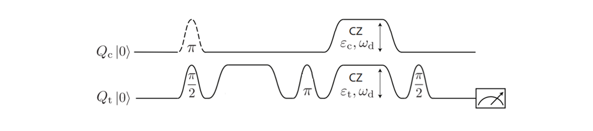

### Node **40a\_Stark\_induced\_ZZ\_vs\_durations**

#### `def create_qua_program(node):`

* **Setup & sweeps**

  * Builds **flattop** Stark‑CZ pulses with cosine ramps and **sweeps flat‑top durations**
  * **Control state** loop `s ∈ {0,1}` prepares $Q_c$ in $|g\rangle$ or $|e\rangle$.
  * Registers sweep axes: `qubit_pair`, `idle_time`, `control_state`.

* **Baked waveforms**

  * `bake_ZZ_waveforms(...)` creates the matched pair of ZZ pulse per duration.

* **Echo-like pulse sequence**

  1. **x90** on $Q_t$ (equator prep).  
     (**x180** on $Q_c$ for control qubit state = $|1\rangle$)
  2. **Zero‑amp** flattop (symmetry).
  3. **π flips** (conditional on `s`).
  4. **Play Stark‑CZ** flattop.
  5. **x90** on $Q_t$.
  6. **Measure $\langle Z\rangle$**; optional state discrimination.
  7. Reset frames and wait.

  This yields an **oscillation vs `idle_time`**; the **difference** of fitted frequencies between control states gives **$\zeta$**.

* **Streams & buffering**

  * Buffers shaped `[control_state, idle_time]`, shot‑averaged.

> **Pointers to code**: `align(...)`, `flattop_pulses[qp.name][pulse_idx].run(...)`, nested loops over `idle_durations_ns` and `s`, and stream processing `.buffer(2).buffer(len(idle_durations_ns)).average().save(...)`.

#### `def analyse_data(node):`

* **Reshape & IQ→V** via `process_raw_dataset(...)`.
* **Fit oscillation with exponential envelope** via `fit_oscillation_decay_exp(...)`, extracting:

  * **frequency** `f`,
  * **decay** → **modified echo** $T_{2,\mathrm{echo}}=-1/\text{decay}$,
  * **ZZ coefficient** (target):

    $$
    \zeta = f_{\text{target}\,|\,\text{Qc}=0}-f_{\text{target}\,|\,\text{Qc}=1}.
    $$

  Results saved in `ds_fit` and `fit_results`.

> **Why echo + ⟨Z⟩ works here**
> Echo suppresses low‑frequency detuning noise while converting the **conditional detuning** into a robust phase oscillation visible in $\langle Z\rangle$ after the second $x_{90}$. This differs from the paper’s full tomography but yields the same **$\zeta$** observable.&#x20;

---

### How **40b** differs (duration × relative phase)

**File:** `40b_Stark_induced_ZZ_vs_duration_and_relative_phase`

* **What’s new in `create_qua_program`**

  * Adds a sweep of **relative phase** \$\varphi\$; feeds **\[cos, −sin, sin, cos]** as I/Q scaling:
    `amp_array=[(zz.name, 1), (qt.xy_detuned.name, [cos, -sin, sin, cos])]`.
  * Adds sweep axis `relative_phase`; buffers `[control_state, idle_time, relative_phase]`.

* **What’s new in `analyse_data`**

  * Same fit; summary plots per phase.
  * `update_state` stores calibrated scaling in `qp.macros["stark_cz"]`.

> **Why**: matches the paper’s **sinusoidal** phase dependence of $\zeta$ and ability to **cancel** ZZ.&#x20;

---

### How **40c** differs (duration × amplitude)

**File:** `40c_Stark_induced_ZZ_vs_duration_and_amplitude`

* **What’s new in `create_qua_program`**

  * Sweeps scalar **amplitude scaling** `a` for both tones:

    ```python
    zz.play(wf_type, a)
    qt.xy_detuned.play(f"zz_{wf_type}_{qp.name}", a)
    ```
  * Adds sweep axis `amp_scaling`.

* **What’s new in `analyse_data`**

  * Same extraction; in `update_state` multiplies stored waveform **amplitudes** by the fitted scaling.

> **Why**: mirrors paper data where $\zeta$ grows approximately **linearly** with amplitude when both qubits are driven.&#x20;

---

## **ZI/IZ** Implementation Desctiption here

---

## QUA implementation for ZI/IZ


* After setting the **ZZ** pulse (frequency/amp/phase/duration), measure **local phase errors** via error amplications with series of CZ gates and compensate with **virtual‑Z** gates $(\phi_{ZI}, \phi_{IZ})$ immediately after the entangling pulse.

---

## Project structure

```
cz-stark/
├── calibrations/
│   ├── 40a_Stark_induced_ZZ_vs_durations.py
│   ├── 40b_Stark_induced_ZZ_vs_duration_and_relative_phase.py
│   ├── 40c_Stark_induced_ZZ_vs_duration_and_amplitude.py
│   ├── 41a_Stark_induced_ZZ_R_vs_frequency_and_amplitude.py
│   ├── 42a_CZ_calib_cz_pulse_vs_correction_phase.py
│   ├── 42b_CZ_calib_cz_pulse_vs_amplitude.py
│   └── 42c_CZ_calib_cz_pulse_vs_relative_phase.py
├── calibration_utils/   # baking, analysis, plotting, helpers (imported by nodes)
├── quam_config/         # QUAM state generation / loading
└── README.md            # this file
```

---

# Microwave Crosstalk Characterization & Compensation

This repository documents and implements a **Microwave crosstalk characterization and compensation** between two neighboring qubits. Microwave corsstalk occurs when a control signal meant for one qubit drives other neighboring qubits. Understanding and mitigating this effect is crucial for high-fidelity gate operations and scalable quantum computing. 

---

## Table of Contents

1. [Introduction on microwave crosstalk](#Introduction-on-microwave-crosstalk)
2. [How to characterize crosstalk in the lab (experiments)](#how-to-characterizae-crosstalk-in-the-lab-experiments)
3. [QUA implementation](#qua-implementation)
   * [Node **20a\_XY\_crosstalk\_coupling\_magnitude** (detailed)](#node-20a_XY_crosstalk_coupling_magnitude-detailed)
4. [Future work – QUA nodes](#future-work-qua-nodes)
5. [Project structure](#project-structure)
6. [References](#references)

---

## Introduction on microwave crosstalk
Achieving high-fidelity 2 qubit gates requires a comprehensive understanding of the device’s strengths and weaknesses to avoid hidden errors. For fixed-frequency devices, systematic microwave (MW) crosstalk characterization is as essential. Integrating these protocols into the calibration graph lays the groundwork for reliable, high-fidelity CR and CZ gates. Therefore, the immediate action item is to implement an MW-crosstalk characterization script to establish a baseline understanding of the device’s microwave environment.

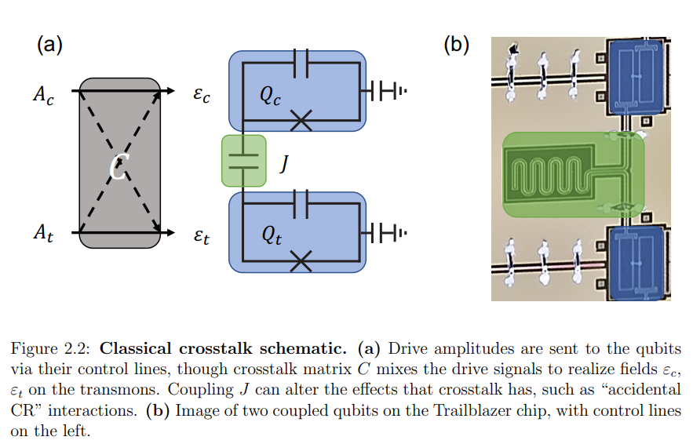

Coupling between control lines or imperfections in the sample packaging allows a drive signal sent to a target qubit to leak and create unwanted fields on probed qubits. These leaked fields can further induce effects like accidental CR interactions, adding extra dynamics to coupled qubits.

---

## How to characterize crosstalk in the lab (experiments)
Effective crosstalk compensation starts with a detailed characterization of the unwanted interactions between qubits.
This involves performing Rabi and Ramsey experiments on a probe qubit while driving the target qubit to measure the induced field’s amplitude and phase. Using these measurements, a crosstalk matrix can be built, enabling precise cancellation by applying counter-drives with calibrated amplitude and phase.

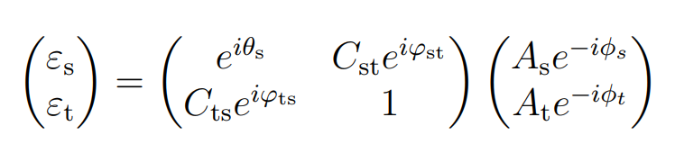

By applying carefully calibrated counter-drives or using digital predistortion to cancel these effects in real time—and integrating this detailed crosstalk model directly into the calibration workflow—each subsequent tuning step, from amplitude and phase adjustments to pulse-shape optimization, begins from a thoroughly corrected baseline.

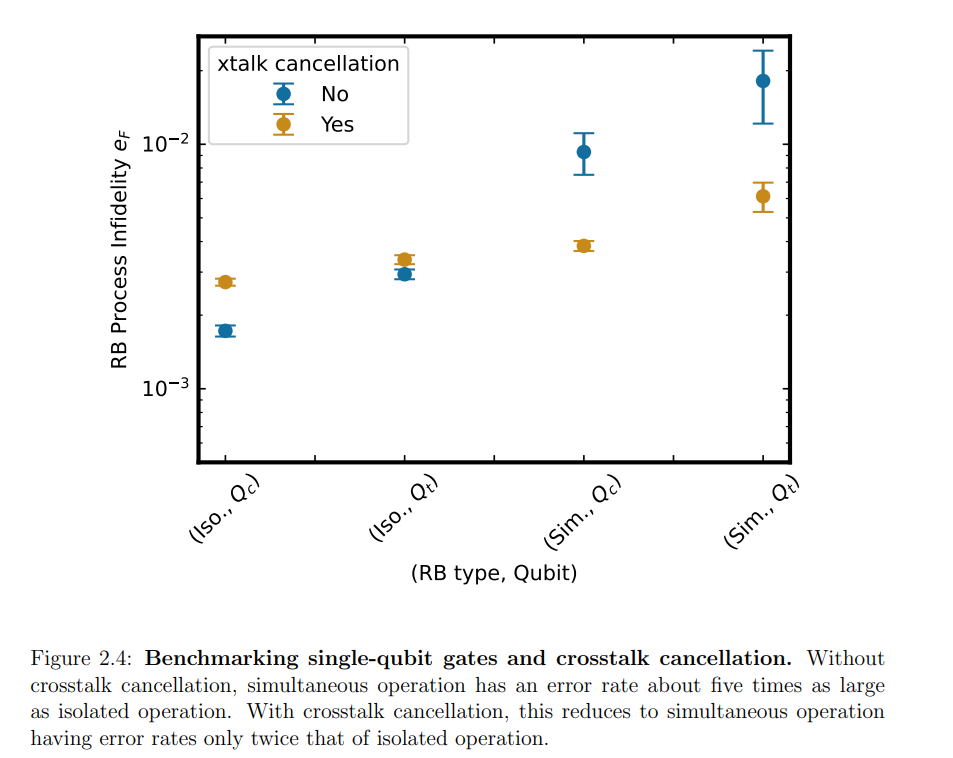
With crosstalk compensating drives, simultaneous single-qubit operations exhibit error rates half of those of isolated operations, boosting overall gate fidelity.

### Crosstalk magnitude characterization (entangling strength)

* **What to vary**: Magnitude of pulse applied on drive qubit at probed qubit frequency either by adjusting pulse amplitude or duration. In this experiment, adjusting pulse duration.

* **What to measure**: Change in probability of probed qubit vs magnitude

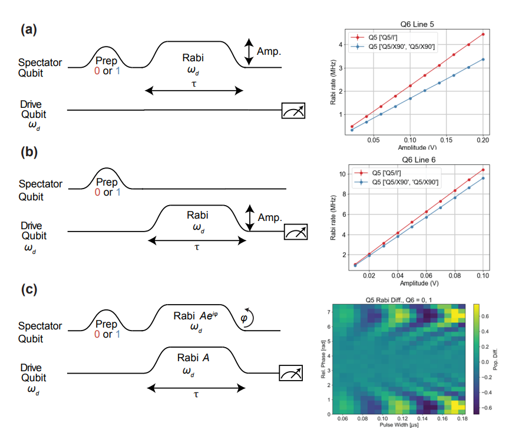
where a and b measures magnitude of XY crosstalk when probed_qubit (spectator qubit) is either in ground or excited states. 
c measures the phase of XY crosstalk.

---

## QUA implementation

### Node **20a\_XY\_crosstalk\_coupling\_magnitude** (detailed)

#### `def create_qua_program(node):` — what it does

* **Setup & sweeps**

  * Updates frequency of pulse applied on drive qubit to probed_qubit frequency and  **sweeps pulse_durations**

* **Pulse sequence**

  1. update frequency of drive_qubit element with probe_qubit frequency
  2. **x180** on **Qd**
  3. **Measure** **Qd** and **Qp** optional state discrimination
  4. Reset frames and wait

  This yields an **oscillation vs `pulse_duration`**; 

* **Streams & buffering**

  * Buffers shaped `[control_state, pulse_duration]`, shot‑averaged.

#### `def analyse_data(node):` — what it does

* **Reshape & IQ→V** via `process_raw_dataset(...)`.
* **Fit oscillation** via `fit_oscillation(...)`, extracting:

  * **frequency** `f`,
  * **Rabi_rate** (target):

  Results saved in `ds_fit` and `fit_results`.

---

## Future work – QUA nodes

> **Not implemented in this repo yet** (intentionally left for follow‑up).

**Planned approach (matching the paper’s procedure):**
  1. XY crosstalk's phase characterization and create crosstalk matrix.
  2. Error amplification with cancellation tone for XY
  3. Z crosstalk characterization 
  4. Error amplification with cancellation tone for Z
---

## Project structure

```
cz-stark/
├── calibrations/
│   ├── 20a_XY_crosstalk_coupling_magnitude.py
├── calibration_utils/   # baking, analysis, plotting, helpers (imported by nodes)
├── quam_config/         # QUAM state generation / loading
└── README.md            # this file
```

---

## References

* **Main reference (with figures to place in this README):**
  B. K. Mitchell *et al.*, “Investigating Microwave-Activated Entangling Gates on Superconducting Quantum
Processors”, Use: **Fig. 1** (crosstalk scheme), **Fig. 2** (matrix), **Fig. 3** (fidelity), **Fig. 4** (experiment).&#x20;

---

**License** — same as the parent project.
