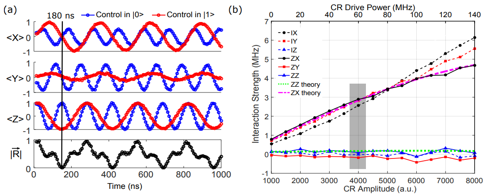

# CR and CZ (ZZ-driven) calibrations

---

## 3X protocols: Cross-resonance (CR) gate calibration

### Standard (echo) CR gate
The driven Hamiltonian is approximately  [3]

$$
\frac{H_D}{\hbar} \approx \epsilon(t)\left( m\,IX - \mu\,ZX + \eta\,ZI \right),
$$

where:

- $\{I, X, Y, Z\}^{\otimes 2}$: two-qubit Pauli operators.  
- $\epsilon(t)$: drive amplitude.  
- $\mu \approx J/\Delta$: coupling parameter ($J$ = qubit-qubit coupling energy, $\Delta$ = frequency detuning).  
- $m$: accounts for spurious crosstalk and higher-level effects.  
- $\eta$: magnitude of Stark shift from off-resonant driving.  

**Physical meaning of each term:**
- $mIX$: Rabi-like oscillations of qubit 2.  
- $-\mu ZX$: slower conditional rotation of qubit 2, depending on qubit 1’s state.  
- $\eta ZI$: Stark shift on qubit 1.  

### CR gate with cancellation pulse

 

 

 

<!-- 

    

 -->

### 4 types of CR gate
"direct", "direct+cancel", "direct+echo", "direct+cancel+echo"

### Calibration

`30_CR_time_rabi_QST`
`31a_CR_hamiltonian_tomography_vs_cr_drive_amp`
`31b_CR_hamiltonian_tomography_vs_cr_drive_phase`
`31c_CR_hamiltonian_tomography_vs_cr_cancel_phase`
`31d_CR_hamiltonian_tomography_vs_cr_cancel_amp`
`31e_CR_phase_correction`
`31g_CR_error_amplification`

## References

[1] A simple all-microwave entangling gate for fixed-frequency superconducting qubits https://arxiv.org/abs/1106.0553

[2] Investigating Microwave-Activated Entangling Gates on Superconducting Quantum
Processors https://escholarship.org/uc/item/5sp8n6st

[3] Procedure for systematically tuning up crosstalk in the cross resonance gate https://arxiv.org/pdf/1603.04821

[4] Process verification of two-qubit quantum gates by randomized benchmarking https://arxiv.org/abs/1210.7011

---