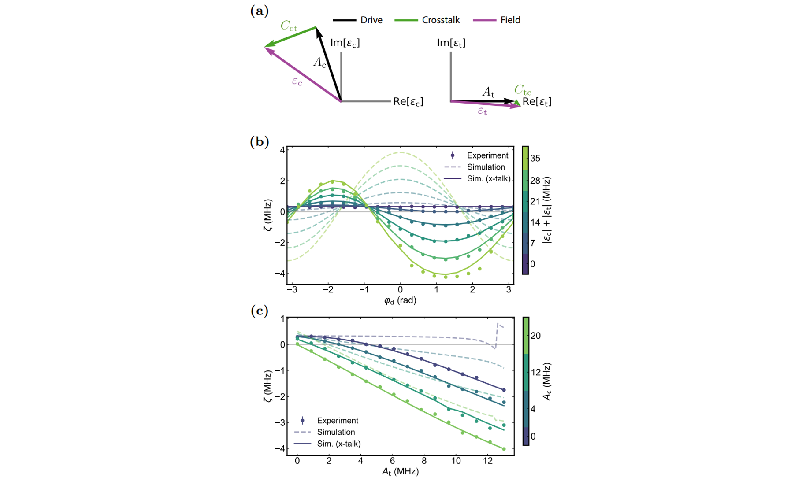
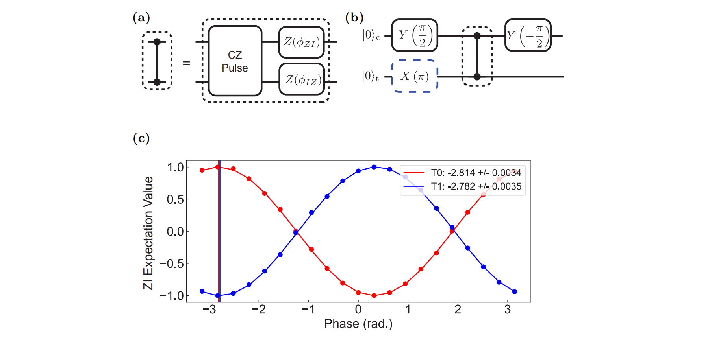

# Fixed‑Frequency Two‑Qubit Gates: **CR**, **CZ**, and **Microwave Crosstalk** (Repo Overview)

This repository gathers our **fixed‑frequency transmon** routines for

> 👉 **[Cross Resonance(CR) Gate](#cr-gate-cross-resonance)**  
> 👉 **[Stark-Induced Controlled-Z(CZ) Gate](#stark-induced-cz-gate-with-microwave-activated-tunable-zz)**  
> 👉 **[Microwave Crosstalk Characterization & Compensation](#microwave-crosstalk-characterization--compensation)** 

# Creating the QuAM State

To get started, first read both the project-level [`README.md`](../README.md) and [`quam_config/README.md`](../quam_config/README.md).

## Environment for `CR_CZ_calibrations`

Create a virtual environment and install the dependencies declared in `CR_CZ_calibrations/pyproject.toml` (some are pinned to specific branches):

### Using pip (recommended)
```bash
cd CR_CZ_calibrations
python3 -m venv .venv
source .venv/bin/activate        # On Windows: .venv\Scripts\activate
python -m pip install --upgrade pip
pip install .                    # or: pip install -e .  (for editable installs)
```

---

# CR Gate (Cross Resonance)
The cross-resonance (CR) gate is implemented on fixed-frequency qubit with exchange coupling $J$ by driving the control qubit at or near the resonance frequency of the target qubit ($\omega_d=\omega_t$) [1]. The figure shows the resulting drive amplitude $\tilde{\varepsilon}$ on the target qubit as a function of drive frequency $\omega_d$ [2]. The drive strength depends on the control state which gives the state-dependent interaction necessary to generate entanglement between the qubits.


This forms the basis of the cross-resonance (CR) gate, with the tuned CR gate resulting in only a ZX interaction on the qubits.


## Standard (echo) CR gate
The driven Hamiltonian is approximately [3]

$$
\frac{H_D}{\hbar} \approx \epsilon(t)\left( m\,IX - \mu\,ZX + \eta\,ZI \right),
$$

where qubit 1 (2) is the control (target), and:

- $\{I, X, Y, Z\}^{\otimes 2}$: two-qubit Pauli operators.  
- $\epsilon(t)$: drive amplitude on the control qubit.  
- $\mu \approx J/\Delta$: coupling parameter ($J$ = qubit-qubit coupling energy, $\Delta$ = frequency detuning).  
- $m$: accounts for spurious crosstalk and higher-level effects.  
- $\eta$: magnitude of Stark shift from off-resonant driving.  

The physical meaning of each term is as follows:
- $mIX$: Rabi-like oscillations of qubit 2.  
- $-\mu ZX$: slower conditional rotation of qubit 2, depending on qubit 1’s state.  
- $\eta ZI$: Stark shift on qubit 1.  

Within this picure, an ideal ZX interaction can be obtained by performing an echo protocol.


The figure shows the evolution of the qubit states depending on the control qubit state (red: $\ket{1}$, blue: $\ket{0}$) prior to the CR pulse. When applying directly a CR $\pi$ pulse (Fig. a), the resultant signals deviate rapidly due to the additional terms, which lead to poor gate fidelity. An echo scheme is implemented by a sequential CR $\pm \pi/2$ sandwiching a $\pi$ pulse on the control. This standard implementation echoed away the fast-rotating $IX$ and $ZI$ to obtain the desired $ZX$ gate.

## CR gate with cancellation pulse
However, the Hamiltonian equation in the previous section assumes a simple qubit model. In the presence of higher levels of the transmon and microwave crosstalk on the device, the complete Hamiltonian is described by [4]
$$
\hat{H}_{\mathrm{CR}} = I \otimes A + Z \otimes B,
$$
in which $A$ and $B$ are generic sum of Pauli operators. Indeed, measuring the expectation values $\langle X \rangle$, $\langle Y \rangle$, and $\langle Z \rangle$ revealed that oscillation is present for the target qubit as characterized by $A$ and $B$ depending on the state of the control qubit.

 

The Bloch vector $\|\vec{R}\|$ characterizes the distance of the target qubit state when control qubit in $\ket{0}$ and $\ket{1}$ as
$$
\|\vec{R}\| =
\sqrt{(\langle X \rangle_0 + \langle X \rangle_1)^2 +
      (\langle Y \rangle_0 + \langle Y \rangle_1)^2 +
      (\langle Z \rangle_0 + \langle Z \rangle_1)^2}.
$$
The state can be maximally entangled at $\|\vec{R}\| = 0$. While this is conceptually straightforward, the exact interaction strength of the Pauli terms depend on the system.

 

Here, we observed dominant interaction of $IX$, $IY$ and $ZX$ dependent on the CR amplitude in a measurement [4]. While others are negligible in terms of magnitude, they can still compromise the gate fidelity. More importantly, we observe the additional contribution of $IY$ and $ZY$. This is attributed to the classical crosstalk.

For an ideal CR gate, the goal is to produce only $ZX$ interaction with the rest echoed away. However, this only works for the $IX$, $ZZ$, and $ZI$ since they commute with $ZX$. As such, a calibration scheme that cancels these error is necessary. The proposed method is to apply a cancellation pulse on the target qubit [4].

 

Extending this upon the echo scheme, the evolution on the Bloch sphere shows a more circular trajectory as expected from an ideal Rabi oscillation of the ZX interaction (up to a small error).

 

## Implementation of the CR gate
Within the calibration node, we could select the `cr_type` parameter as one of the following: `direct`, `direct+cancel`, `direct+echo`, `direct+cancel+echo`. The naming of each should be self-explanatory. For example, `direct+cancel+echo` implied that a CR pulse (on control qubit) and cancellation pulse (on target qubit) is implemented with echo. Here, we will describe the full calibration scheme for the `direct+cancel+echo` CR gate.


## Calibration node

Here, we describe the protocols implemented in each node.

`30_CR_time_rabi_QST`
While this is not a calibration node, the node measures the evolution of $\langle X \rangle$, $\langle Y \rangle$ and $\langle Z \rangle$ with respect to the CR drive duration. The interaction strength of the two Pauli gates (see <a href="#CR_cancel">figure</a> for reference) are calculated. The analysis used here is used for the rest of the nodes.

`31a_CR_hamiltonian_tomography_vs_cr_drive_amp`
Is used to determine the required CR drive amplitude to achieve the desired $ZX$ interaction strength.


`31b_CR_hamiltonian_tomography_vs_cr_drive_phase`
The CR drive phase is optimized to $\phi_0$ in which the $ZX$ component is maximized and $ZY$ is zero. $\phi_1$ is also obtained which minimizes $IY$.

 

<!-- `31c_CR_hamiltonian_tomography_vs_cr_cancel_phase`
The ideal cancellation phase is $\phi_0-\phi_1$, but we manually scan the phase. -->

`31d_CR_hamiltonian_tomography_vs_cr_cancel_amp`
For the calibrated phases, an optimized cancellation amplitude can lead to the interaction strength zero crossing of the other components.

 

`31e_CR_correction_phase`
Calibrates and applies per-gate virtual-Z updates to cancel residual Z-type phases on the control and target qubits (from Stark shifts, ZZ/ZI/IZ byproducts, etc.) accumulated during the CR block.

## References

[1] A simple all-microwave entangling gate for fixed-frequency superconducting qubits https://arxiv.org/abs/1106.0553

[2] Investigating Microwave-Activated Entangling Gates on Superconducting Quantum
Processors https://escholarship.org/uc/item/5sp8n6st

[3] Process verification of two-qubit quantum gates by randomized benchmarking https://arxiv.org/abs/1210.7011

[4] Procedure for systematically tuning up crosstalk in the cross resonance gate https://arxiv.org/pdf/1603.04821


---

# Stark-Induced **CZ** Gate (with microwave-activated tunable ZZ)
The Stark-induced CZ gate is implemented by simultaneously driving two fixed-frequency, fixed-coupling transmons with off-resonant microwaves, which generates state-dependent Stark shifts and thus a tunable ZZ interaction. <U>Instead of relying on flux-tunable couplers</U>, this approach amplifies or cancels the residual ZZ coupling by adjusting the drive frequency, amplitude, and relative phase.  
**Experiments in the paper**: The ZZ interaction is characterized with Ramsey experiment to observe conditional frequency shifts, and the CZ pulse is calibrated by sweeping the drive parameters and then applying virtual Z corrections to figure out IZ, ZI coefficients.  
> **Ref. Paper** – Bradley K. Mitchell *et al.*,  
> "[Hardware-Efficient Microwave-Activated Tunable Coupling Between Superconducting Qubits](https://arxiv.org/abs/2105.05384)," 2021.  
---
## Table of Contents
1. [CZ Gate Representation](#cz-gate-representation)
2. [How tunable **ZZ**, **ZI**, **IZ** arise](#how-tunable-zz-zi-iz-arise)
3. [Experiment: how to tune **ZZ/ZI/IZ**](#experiment-how-to-tune-zzziiz)
4. [QUA implementation for ZZ](#qua-implementation-for-zz)
   * [Node **40a\_Stark\_induced\_ZZ\_vs\_duration**](#node-40a_stark_induced_zz_vs_duration)
   * [How **40b** differs (frequency sweep)](#how-40b-differs-frequency-sweep)
   * [How **40c** differs (relative phase sweep)](#how-40c-differs-relative-phase-sweep)
   * [How **40d** differs (amplitude sweep)](#how-40d-differs-amplitude-sweep)
   * [Node **41a** (2D frequency-amplitude scan)](#node-41a-2d-frequency-amplitude-scan)
5. [QUA implementation for ZI/IZ](#qua-implementation-for-ziiz)
   * [Node **42a\_CZ\_calib\_cz\_pulse\_vs\_correction\_phase**](#node-42a_cz_calib_cz_pulse_vs_correction_phase)
   * [How **42b** differs (amplitude fine-tuning)](#how-42b-differs-amplitude-fine-tuning)
   * [How **42c** differs (relative phase fine-tuning)](#how-42c-differs-relative-phase-fine-tuning)
6. [Project structure](#project-structure)
---
## CZ Gate Representation
**Matrix form**  

$$
\mathrm{CZ}=\mathrm{diag}(1,1,1,-1)
$$  

**Generator (Pauli decomposition)**: In our context the CZ is realized by accumulating a conditional phase via **ZZ**, while compensating single‑qubit phases (**ZI, IZ**):  

$$
\mathrm{CZ}=\exp\left[-\frac{i}{2}\frac{\pi}{2}(-\mathrm{ZI}-\mathrm{IZ}+\mathrm{ZZ})\right].
$$

(Used explicitly in the paper when calibrating the gate.)&#x20;
Each term shows how the conditional phase arises via the **ZZ interaction**, while ZI/IZ terms represent single-qubit phase shifts to be compensated.  

**Experimental goal**: Extract $\alpha$, $\beta$, $J$ coefficients of the effective hamiltonian as below.
  
> 
---
## How tunable **ZZ**, **ZI**, **IZ** arise
### System Hamiltonian (Duffing model)
Two coupled transmons (control **$Q_c$**, target **$Q_t$**) are driven simultaneously with near‑but‑off resonant pulses:  

$$
H=\sum_{i=c,t}\Big[(\omega_i-\omega_d)a_i^\dagger a_i + \frac{\eta_i}{2}a_i^\dagger a_i^\dagger a_i a_i + \epsilon_i a_i+\epsilon_i^\ast a_i^\dagger\Big]
+J\,(a_c^\dagger a_t+a_c a_t^\dagger).
$$

Here $J$ is the exchange coupling, $\omega_d$, $\omega_c$, $\omega_t$ are drive/control/target frequencies respectively, $\epsilon_i$ are complex drive amplitudes, $\eta_i$ are anharmonicities. Drive scheme with energy levels for the Stark‑induced ZZ interaction are shown below.  

> 

### Conditional Stark picture → tunable **ZZ**

**ZZ interaction**: Off‑resonant driving on **$Q_c$** at the frequency $w_d$ induces Stark shifts on the target qubit **$Q_t$** with the rate $\tilde{\delta}_n$ depending on control qubit state $n$:  

$$
\tilde{\delta}_n=\frac{|\tilde{\epsilon}_n|^2}{\Delta_t}.
$$

with $\Delta_t=\omega_t-\omega_d$ and $n\in\{0,1\}$. The **ZZ interaction rate** $\zeta$ is defined as $\zeta=\tilde{\delta}_0-\tilde{\delta}_1$, which can be described in terms of $\mu$.  

$$
\zeta = 2\mu(\tilde{\epsilon}_0 + \tilde{\epsilon}_1)/\Delta_t.
$$

where $\mu$ is the CR‑like conditional drive rate $\mu$ = $(\tilde{\epsilon}_0-\tilde{\epsilon}_1)/2$.   

**Driving $Q_c$ and $Q_t$ simultaneously**: Since a single drive tone on **$Q_c$** does not induce sufficiently large interaction to realize CZ gate, the paper proposes driving target qubit simultaneously. To first order, adding a drive on **$Q_t$** makes  

$$
\zeta \propto \frac{2\mu}{\Delta_t}(\tilde{\epsilon}_0+\tilde{\epsilon}_1+2\epsilon_t)+\mathcal{O}(|\epsilon_t|^2),
$$  

**Tunability of ZZ interaction**: By varying **Amplitude** and **relative phase** of drive pulses, the ZZ interaction $\zeta$ can be tuned smoothly and even allowed to be sign reversal (cancellation of idle ZZ) as shown in the figure of the following section.

### Single-qubit Z rotations → **ZI** and **IZ**  
While the ZZ term creates entanglement, the off-resonant drives also induce **unconditional single-qubit Z rotations** (ZI and IZ terms) that must be compensated. These arise from AC Stark shifts that affect each qubit independently of the other's state. The correction phases $\phi_{ZI}$ and $\phi_{IZ}$ are calibrated to transform the raw operation into a pure CZ gate.

> **Optional**<details><summary>Third-order expression and phase dependence (from supplement)</summary>
> The third-order contribution shows $\zeta$ scales as $\propto \epsilon_t \epsilon_c \cos\phi$ (relative phase $\phi$), on top of the static second-order term—matching the observed sinusoidal dependence on relative phase and linear scaling with amplitude.
> </details>

---
## Experiment: how to tune **ZZ/ZI/IZ** 

### **ZZ** interaction tuning

* **What to vary**: Drive pulse duration $\tau$, Drive frequency $\omega_d$, amplitudes on both qubits $A_c, A_t$, and **relative phase** $\varphi_d$.

* **What to measure**: Frequency shift $\zeta$ of **$Q_t$** *conditioned* on the state of **$Q_c$**.
  The paper does this with **Ramsey** on **$Q_t$** while preparing **$Q_c$** in $|0\rangle$ or $|1\rangle$; $\zeta$ vs $\varphi_d$ and vs amplitudes.

> **Pulse Sequence**
> 


**Experimental results (Fig. 2 in paper)**:
- **(a)** Drive crosstalk: Fields $\epsilon_c$, $\epsilon_t$ incident on qubits are complex combinations of drive line amplitudes $A_c$, $A_t$ mixed via microwave crosstalk matrix $C$
- **(b)** ZZ vs relative phase $\phi_d$: 
  - Multiple curves for different overall drive amplitudes where $|A| = |A_c| = |A_t|$
  - Crosstalk causes asymmetry in maximal ZZ magnitude between positive/negative values
  - Shift in phase corresponding to maximum/minimum ZZ rates
  - Solid lines: simulation with crosstalk; Dashed lines: crosstalk-free simulation
- **(c)** ZZ vs target amplitude $A_t$ for various control amplitudes $A_c$ (colorbar):
  - Linear behavior with respect to target drive amplitude when also driving control
  - Crosstalk results in larger ZZ than crosstalk-free driving (dashed lines)
  - Demonstrates amplification effect of simultaneous driving

**Key observations**:
- ZZ tunability from negative to positive values enables both amplification and cancellation
- Optimal operating point found where |ζ| is maximized
- Crosstalk effects must be included for accurate modeling

> 
> 📎 *Paper Fig. 2 (p.3)*: $\zeta(\varphi_d)$ for varying $|\epsilon_c|+|\epsilon_t|$ (asymmetry with crosstalk) and $\zeta(A_t)$ for varying $A_c$ (linear scaling).

### **ZI/IZ** phase correction  
* **What to vary**: Virtual-Z correction phases $\phi_{ZI}$, $\phi_{IZ}$ after the entangling pulse.
* **What to measure**: Population transfer when one qubit is prepared in $|+\rangle$ and the other in $|0\rangle$ or $|1\rangle$.

**Calibration circuit (Fig. S2 in supplementary)**:
- **(a)** Circuit diagram: CZ pulse followed by virtual-Z gates $Z(\phi_{IZ})$ implementing local phase corrections
- **(b)** Experimental sequence: Control qubit prepared in $|+\rangle = \frac{1}{\sqrt{2}}(|0\rangle + |1\rangle)$ via x-basis preparation, measured in x-basis via $Y(\frac{\pi}{2})$, $Y(-\frac{\pi}{2})$ gates
- **(c)** Results: $\langle ZI \rangle$ expectation value vs correction phase $\phi_{ZI}$ for target states $|0\rangle$ (T0, red) and $|1\rangle$ (T1, blue)
  
**Key observation**: The correction phase is properly calibrated when:
- $|+,0\rangle \to |0,0\rangle$ (T0 curve crosses zero at $\phi_{ZI} \approx -2.814$ rad)
- $|+,1\rangle \to |1,1\rangle$ (T1 curve crosses zero at $\phi_{ZI} \approx -2.782$ rad)
- Optimal $\phi_{ZI}$ chosen as average of both crossing points
- Process repeated analogously for $\phi_{IZ}$ with roles of control/target swapped

  The paper calibrates these by preparing $Q_c$ in $|+\rangle$ (via Y90), applying CZ with varied $\phi_{ZI}$, and measuring expectation $\langle Z \rangle$.
> 
> 📎 *Paper Fig. S2*: Local phase calibration circuit and expected oscillations vs correction phase.

---  
## QUA implementation for ZZ

### Node **40a\_Stark\_induced\_ZZ\_vs\_duration**
#### `def create_qua_program(node):`
* **Setup & sweeps**
  * Sweeps **Stark-CZ pulse durations** (idle_times) while keeping other parameters fixed
  * **Control state** loop `s ∈ {0,1}` prepares $Q_c$ in $|g\rangle$ or $|e\rangle$.
  * Registers sweep axes: `qubit_pair`, `idle_time`, `control_state`.
* **Ramsey-type pulse sequence**
  1. **Reset** qubits to ground state
  2. **Prepare control qubit**: x180 on $Q_c$ if control_state = 1, wait if control_state = 0
  3. **Place target on equator**: x90 on $Q_t$  
  4. **Apply Stark-CZ pulse**: `qp.apply("stark_cz", ...)` with variable duration `t`
  5. **Second x90** on $Q_t$ to complete Ramsey sequence
  6. **Measure** both qubits (state discrimination or IQ values)
  7. **Reset frames** and wait for qubit decay
  This yields an **oscillation vs `idle_time`**; the **difference** of fitted frequencies between control states gives **$\zeta$**.
* **Streams & buffering**
  * Buffers shaped `[control_state, idle_time]`, shot‑averaged.
> **Key QUA elements**: `align(...)`, `qp.apply("stark_cz", ...)` with duration sweep, nested loops over `idle_times` and control states, stream processing `.buffer(2).buffer(len(idle_times)).average().save(...)`.

#### `def analyse_data(node):`
* **Reshape & process**: `process_raw_dataset(...)` reshapes control/target data and converts IQ→V if needed
* **Fit oscillation**: `fit_oscillation_decay_exp(...)` extracts:
  * **frequency** `f` for each control state
  * **decay** → **T2 echo**  
  
  $$T_{2,\text{echo}}=-1/\text{decay}$$

  * **ZZ coefficient** (target):  

    $$
    \zeta = f_{\text{target}\,|\,\text{Qc}=0}-f_{\text{target}\,|\,\text{Qc}=1}.
    $$  

  Results saved in `ds_fit` and `fit_results`.
> **Why Ramsey + ⟨Z⟩ works here**
> The Ramsey sequence converts the **conditional frequency shift** into a measurable phase oscillation visible in $\langle Z\rangle$ after the second $x_{90}$. This directly yields the **$\zeta$** observable matching the paper's approach.

---
### How **40b** differs (frequency sweep)
**File:** `40b_Stark_induced_ZZ_vs_duration_and_frequency`
* **What's new in `create_qua_program`**
  * Adds a sweep of **drive detuning** `df` in addition to duration
  * Updates frequencies dynamically: 
    ```python
    qp.zz_drive.update_frequency(df + qp.zz_drive.intermediate_frequency)
    qt.xy_detuned.update_frequency(df + qt.xy_detuned.intermediate_frequency)
    ```
  * Adds sweep axis `detuning`; buffers `[control_state, idle_time, detuning]`
* **What's new in `analyse_data`**
  * Same oscillation fit per detuning value
  * Identifies optimal detuning that maximizes |ZZ|
* **State update**
  * Updates `zz_control.detuning` and `zz_target.detuning` with the best detuning
> **Why**: Finds the optimal drive frequency to maximize ZZ interaction strength
---

### How **40c** differs (relative phase sweep)  
**File:** `40c_Stark_induced_ZZ_vs_duration_and_relative_phase`
* **What's new in `create_qua_program`**
  * Sweeps **relative phase** `ph` between control and target drives
  * Phase applied dynamically in `qp.apply("stark_cz", zz_relative_phase=ph, ...)`
  * Adds sweep axis `relative_phase`; buffers `[control_state, idle_time, relative_phase]`
* **What's new in `analyse_data`**
  * Fits oscillation for each phase value
  * Finds phase that maximizes |ZZ| (typically π/2 or 3π/2 per paper)
* **State update**
  * Updates `qt.xy_detuned.operations[f"zz_{wf_type}_{qp.name}"].axis_angle` with optimal phase
> **Why**: Matches the paper's **sinusoidal** phase dependence of $\zeta$ and enables ZZ sign control/cancellation
---

### How **40d** differs (amplitude sweep)
**File:** `40d_Stark_induced_ZZ_vs_duration_and_amplitude`  
* **What's new in `create_qua_program`**
  * Sweeps **amplitude scaling** `a` for either control or target drive (set by `calibrate_qc` flag)
  * Applied in stark_cz call:
    ```python
    zz_control_amp_scaling=a if calibrate_qc else zz_control_amp_scalings[i],
    zz_target_amp_scaling=a if not calibrate_qc else zz_target_amp_scalings[i],
    ```
  * Adds sweep axis `amp_scaling`; buffers `[control_state, idle_time, amp_scaling]`
* **What's new in `analyse_data`**
  * Extracts optimal amplitude scaling that maximizes |ZZ|
* **State update**  
  * Multiplies the amplitude by best scaling:
    - If `calibrate_qc`: updates `zz_control.operations[wf_type].amplitude`
    - Else: updates `zz_target.operations[f"zz_{wf_type}_{qp.name}"].amplitude`
> **Why**: Mirrors paper data where $\zeta$ grows approximately **linearly** with amplitude when both qubits are driven
---
### Node **41a** (2D frequency-amplitude scan)
**File:** `41a_Stark_induced_ZZ_R_vs_frequency_and_amplitude`
* **What's new in `create_qua_program`**
  * **2D sweep**: frequency `df` AND amplitude `a` simultaneously  
  * **Tomography on target**: Adds basis rotation (X, Y, Z) after CZ pulse
    ```python
    with if_(b_t == 0): #X axis
        qt.xy.play("-y90")
    with elif_(b_t == 1): #Y axis
        qt.xy.play("x90")
    ```
  * Includes virtual-Z corrections: `qc_correction_phase` and `qt_correction_phase`
  * Sweep axes: `detuning`, `amp_scaling`, `target_basis`, `control_state`
* **What's new in `analyse_data`**
  * Computes **R metric**: $R = \frac{1}{2}\|r_0 - r_1\|$ from tomography data
  * Creates 2D map of R vs (frequency, amplitude)
  * Identifies optimal (ω*, A*) where R ≈ 1 (maximal entangling)
* **State update**
  * Updates both detuning AND amplitude based on optimal point:
    - `zz_control.detuning` and `zz_target.detuning`  
    - Amplitude scaling as in 40d
> **Why**: Comprehensive 2D optimization matching paper's approach to find best operating point for CZ gate
---
## QUA implementation for ZI/IZ
After calibrating the **ZZ** interaction strength, the final step is compensating the **single-qubit phase errors** that accumulate during the CZ gate. These ZI and IZ terms arise from unconditional AC Stark shifts and must be corrected with **virtual-Z gates** to achieve a pure CZ operation.

### Node **42a\_CZ\_calib\_cz\_pulse\_vs\_correction\_phase**
#### `def create_qua_program(node):`
* **Setup & sweeps**
  * Sweeps **correction phases** for both ZI and IZ terms independently
  * **Correction target** loop over `["ZI", "IZ"]` determines which phase to calibrate
  * **Control state** loop `s ∈ {0,1}` prepares the "spectator" qubit
  * Registers sweep axes: `qubit_pair`, `correction_target_term`, `correction_phase`, `control_state`
* **Local phase calibration sequence**
  1. **Reset** qubits to ground state
  2. **State preparation**: 
     - For ZI calibration: Prepare $Q_c$ in $|0\rangle/|1\rangle$, place $Q_t$ on equator (Y90)
     - For IZ calibration: Prepare $Q_t$ in $|0\rangle/|1\rangle$, place $Q_c$ on equator (Y90)
  3. **Apply Stark-CZ** with swept correction phase:
     ```python
     qp.apply("stark_cz",
         qc_correction_phase=ph if corr_term=="ZI" else fixed_value,
         qt_correction_phase=ph if corr_term=="IZ" else fixed_value,
     )
     ```
  4. **Undo rotation**: -Y90 on the qubit that was on equator
  5. **Measure** both qubits' populations
  6. **Reset frames** and wait for decay
* **Expected behavior**: The correction phase that maps $|+,0\rangle \to |0,0\rangle$ and $|+,1\rangle \to |1,1\rangle$ realizes the correct CZ operation
* **Streams & buffering**
  * Buffers shaped `[control_state, correction_phase, correction_target_term]`, shot-averaged
> **Key QUA elements**: Dynamic phase assignment based on calibration target, conditional state preparation, virtual-Z implementation via `qc_correction_phase` and `qt_correction_phase` parameters

#### `def analyse_data(node):`
* **Fit oscillations**: For each correction term (ZI/IZ), fits population vs phase
* **Extract optimal phases**: 
  * $\phi_{ZI}$: Phase where control qubit correction minimizes error
  * $\phi_{IZ}$: Phase where target qubit correction minimizes error
* **State update**:
  ```python
  qp.macros.stark_cz.qc_correction_phase = fit_result["best_correction_phase_zi_c"]  
  qp.macros.stark_cz.qt_correction_phase = fit_result["best_correction_phase_iz_t"]
  ```


> **Why this works**: Virtual-Z gates are implemented in software by tracking phase accumulation. By sweeping these phases and measuring population transfer, we find the exact compensation needed to cancel unwanted single-qubit rotations.

---

### How **42b** differs (amplitude fine-tuning)

**File:** `42b_CZ_calib_cz_pulse_vs_amplitude`

- **What's new in `create_qua_program`**
    - Instead of correction phases, sweeps **amplitude scaling** for fine-tuning
    - **Calibrated qubit** loop over `["c", "t"]` determines which amplitude to optimize
    - State preparation similar to 42a but with amplitude sweep:
        
        ```python
        zz_control_amp_scaling=a if cal_qb == "c" else fixed_value,  
        zz_target_amp_scaling=a if cal_qb == "t" else fixed_value,
        ```
        
    - Adds sweep axis `calibrated_qubit`, `amp_scaling`
- **What's new in `analyse_data`**
    - Fits population oscillations vs amplitude
    - Finds optimal amplitude that minimizes state transfer error
- **State update**
    - Updates amplitude based on which qubit was calibrated:
        - If control: `zz_control.operations[wf_type].amplitude *= best_scaling`
        - If target: `zz_target.operations[f"zz_{wf_type}_{qp.name}"].amplitude *= best_scaling`

> **Why**: Fine-tunes amplitudes after initial coarse calibration, optimizing for minimal single-qubit rotation errors

---

### How **42c** differs (relative phase fine-tuning)

**File:** `42c_CZ_calib_cz_pulse_vs_relative_phase`

- **What's new in `create_qua_program`**
    - Sweeps **relative phase** between drives for final optimization
    - No correction target loop—applies same phase to both drives
    - Simplified state preparation: always $Q_c$ in $|0\rangle/|1\rangle$, $Q_t$ on equator
    - Phase sweep applied:          
        ```python
        qp.apply("stark_cz", zz_relative_phase=ph, qc_correction_phase=fixed_value, qt_correction_phase=fixed_value, ...)
        ```  
    - Adds sweep axis `relative_phase`; buffers `[control_state, relative_phase]`

- **What's new in `analyse_data`**
    - Fits population vs relative phase
    - Identifies phase minimizing gate error  

- **State update**
    - Updates relative phase in target operation:          
        ```python
        operation = qt.xy_detuned.operations[f"zz_{wf_type}_{qp.name}"]  
        operation.axis_angle = best_relative_phase * 2 * np.pi
        ```  

> **Why**: Final fine-tuning of the relative phase optimizes gate fidelity by minimizing both ZZ and single-qubit errors simultaneously

---
## Project structure
```
cz-stark/
├── calibrations/
│   ├── 40a_Stark_induced_ZZ_vs_duration.py
│   ├── 40b_Stark_induced_ZZ_vs_duration_and_frequency.py
│   ├── 40c_Stark_induced_ZZ_vs_duration_and_relative_phase.py
│   ├── 40d_Stark_induced_ZZ_vs_duration_and_amplitude.py
│   ├── 41a_Stark_induced_ZZ_R_vs_frequency_and_amplitude.py
│   ├── 42a_CZ_calib_cz_pulse_vs_correction_phase.py
│   ├── 42b_CZ_calib_cz_pulse_vs_amplitude.py
│   └── 42c_CZ_calib_cz_pulse_vs_relative_phase.py
├── calibration_utils/   # baking, analysis, plotting, helpers (imported by nodes)
├── quam_config/         # QUAM state generation / loading
└── README.md            # this file
```

---

# Microwave Crosstalk Characterization & Compensation

This repository documents and implements a **Microwave crosstalk characterization and compensation** between two neighboring qubits. Microwave corsstalk occurs when a control signal meant for one qubit drives other neighboring qubits. Understanding and mitigating this effect is crucial for high-fidelity gate operations and scalable quantum computing. 

---

## Table of Contents

1. [Introduction on microwave crosstalk](#Introduction-on-microwave-crosstalk)
2. [How to characterize crosstalk in the lab (experiments)](#how-to-characterizae-crosstalk-in-the-lab-experiments)
3. [QUA implementation](#qua-implementation)
   * [Node **20a\_XY\_crosstalk\_coupling\_magnitude** (detailed)](#node-20a_XY_crosstalk_coupling_magnitude-detailed)
4. [Future work – QUA nodes](#future-work-qua-nodes)
5. [Project structure](#project-structure)
6. [References](#references)

---

## Introduction on microwave crosstalk
Achieving high-fidelity 2 qubit gates requires a comprehensive understanding of the device’s strengths and weaknesses to avoid hidden errors. For fixed-frequency devices, systematic microwave (MW) crosstalk characterization is as essential. Integrating these protocols into the calibration graph lays the groundwork for reliable, high-fidelity CR and CZ gates. Therefore, the immediate action item is to implement an MW-crosstalk characterization script to establish a baseline understanding of the device’s microwave environment.


Coupling between control lines or imperfections in the sample packaging allows a drive signal sent to a target qubit to leak and create unwanted fields on probed qubits. These leaked fields can further induce effects like accidental CR interactions, adding extra dynamics to coupled qubits.

---

## How to characterize crosstalk in the lab (experiments)
Effective crosstalk compensation starts with a detailed characterization of the unwanted interactions between qubits.
This involves performing Rabi and Ramsey experiments on a probe qubit while driving the target qubit to measure the induced field’s amplitude and phase. Using these measurements, a crosstalk matrix can be built, enabling precise cancellation by applying counter-drives with calibrated amplitude and phase.


By applying carefully calibrated counter-drives or using digital predistortion to cancel these effects in real time—and integrating this detailed crosstalk model directly into the calibration workflow—each subsequent tuning step, from amplitude and phase adjustments to pulse-shape optimization, begins from a thoroughly corrected baseline.


With crosstalk compensating drives, simultaneous single-qubit operations exhibit error rates half of those of isolated operations, boosting overall gate fidelity.

### Crosstalk magnitude characterization (entangling strength)

* **What to vary**: Magnitude of pulse applied on drive qubit at probed qubit frequency either by adjusting pulse amplitude or duration. In this experiment, adjusting pulse duration.

* **What to measure**: Change in probability of probed qubit vs magnitude


where a and b measures magnitude of XY crosstalk when probed_qubit (spectator qubit) is either in ground or excited states. 
c measures the phase of XY crosstalk.

---

## QUA implementation

### Node **20a\_XY\_crosstalk\_coupling\_magnitude** (detailed)

#### `def create_qua_program(node):` — what it does

* **Setup & sweeps**

  * Updates frequency of pulse applied on drive qubit to probed_qubit frequency and  **sweeps pulse_durations**

* **Pulse sequence**

  1. update frequency of drive_qubit element with probe_qubit frequency
  2. **x180** on **Qd**
  3. **Measure** **Qd** and **Qp** optional state discrimination
  4. Reset frames and wait

  This yields an **oscillation vs `pulse_duration`**; 

* **Streams & buffering**

  * Buffers shaped `[control_state, pulse_duration]`, shot‑averaged.

#### `def analyse_data(node):` — what it does

* **Reshape & IQ→V** via `process_raw_dataset(...)`.
* **Fit oscillation** via `fit_oscillation(...)`, extracting:

  * **frequency** `f`,
  * **Rabi_rate** (target):

  Results saved in `ds_fit` and `fit_results`.

---

## Future work – QUA nodes

> **Not implemented in this repo yet** (intentionally left for follow‑up).

**Planned approach (matching the paper’s procedure):**
  1. XY crosstalk's phase characterization and create crosstalk matrix.
  2. Error amplification with cancellation tone for XY
  3. Z crosstalk characterization 
  4. Error amplification with cancellation tone for Z
---

## Project structure

```
cz-stark/
├── calibrations/
│   ├── 20a_XY_crosstalk_coupling_magnitude.py
├── calibration_utils/   # baking, analysis, plotting, helpers (imported by nodes)
├── quam_config/         # QUAM state generation / loading
└── README.md            # this file
```

---

## References

* **Main reference (with figures to place in this README):**
  B. K. Mitchell *et al.*, “Investigating Microwave-Activated Entangling Gates on Superconducting Quantum
Processors”, Use: **Fig. 1** (crosstalk scheme), **Fig. 2** (matrix), **Fig. 3** (fidelity), **Fig. 4** (experiment).&#x20;

---

**License** — same as the parent project.
