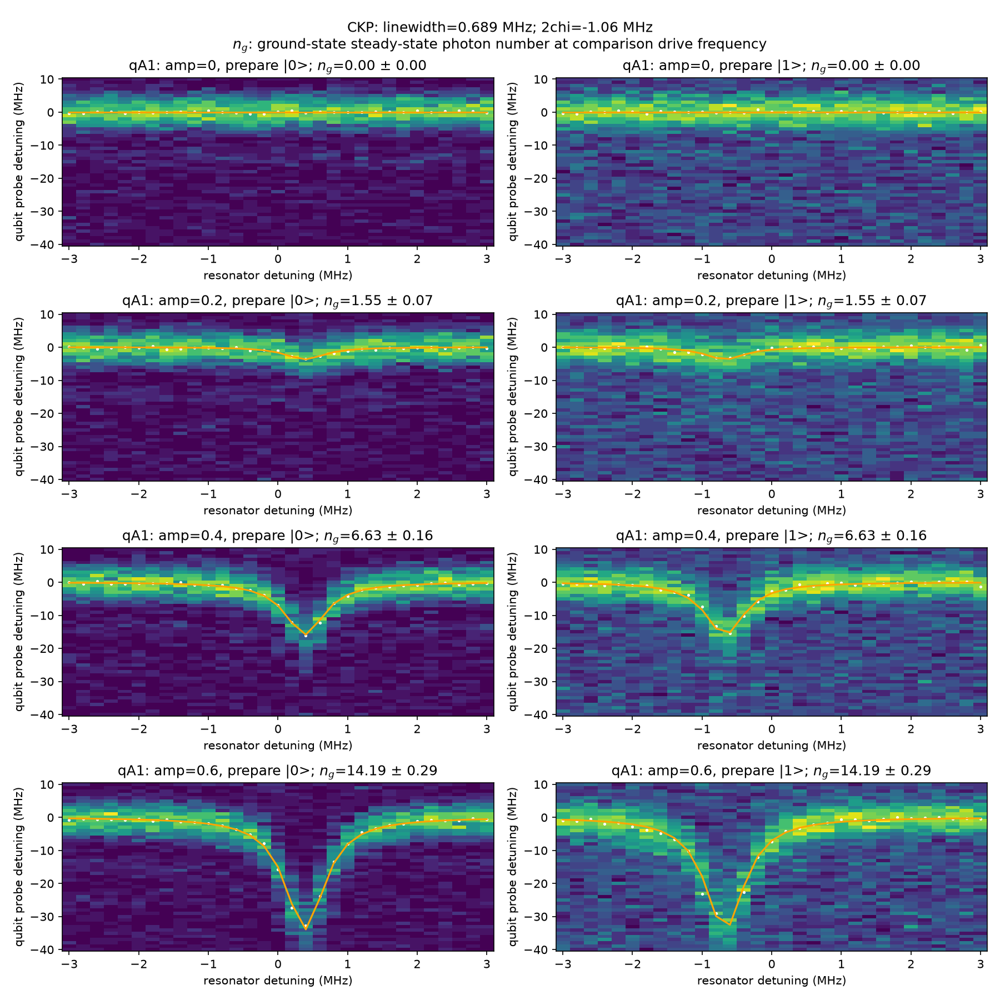
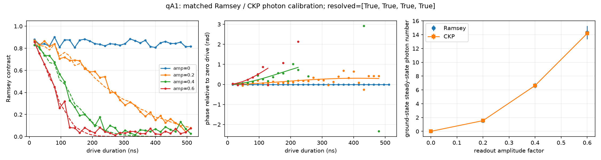

# Readout photon number: CKP and Ramsey

The nodes `23f_readout_ckp.py` and `23e_readout_photon_ramsey.py` default to
qA1 and the calibrated `readout_square` operation. Both use the same square
voltage amplitude, amplitude factors and comparison drive frequency. The
calibrated `readout` operation is still used for final state discrimination.

From the repository root, activate the superconducting calibration environment
and run CKP first:

```sh
PYTHONPATH="$PWD/qualibration_graphs/superconducting" \
  python qualibration_graphs/superconducting/calibrations/1Q_calibrations/23f_readout_ckp.py
```

Then pass its saved node id to Ramsey:

```sh
PHOTON_CKP_DATA_ID=401 \
PYTHONPATH="$PWD/qualibration_graphs/superconducting" \
  python qualibration_graphs/superconducting/calibrations/1Q_calibrations/23e_readout_photon_ramsey.py
```

Replace `401` with the actual CKP run id. `PHOTON_QUBITS`, `PHOTON_SHOTS`, `PHOTON_AMPS`,
`PHOTON_OPERATION` and `PHOTON_DRIVE_DETUNING_MHZ` override local defaults.
For example, `PHOTON_AMPS=0,0.2,0.4,0.6`. GUI and graph runs use the node
parameter models instead. Historical runs can be reanalysed with `load_data_id`.
Neither node updates calibrated machine state. CKP splits the requested shots
into equal short batches (`max_shots_per_batch=10` by default) to stay within
cloud execution limits, and averages the batch datasets before fitting.

CKP prepares both computational states, rings up the resonator, and applies a
frequency-swept qubit probe **while the resonator drive is still on**. It fits
probe transition centers, then jointly fits the state-dependent Stark curves
using Eq. (7) of [Sank et al., Phys. Rev. Applied 23, 024055 (2025)](https://doi.org/10.1103/PhysRevApplied.23.024055).
The generated CKP config assigns the resonator a separate core, so its drive
actually overlaps the XY probe even when the saved machine uses a shared
qubit core. This changes only the run config.

The square probe area is 0.8 of the waveform area of the calibrated
`reference_operation` pi gate (`x180` by default). This does not assume the
separate square gate is calibrated. Its default
100 ns duration follows the paper. Increase frequency spans if probe lines or
the resonator linewidth are truncated; weak shifts can require more averages.

The summary reports:

- `linewidth_mhz`: the resonator power-profile FWHM, kappa/(2 pi).
- `chi_mhz`: signed half-separation chi/(2 pi).
- `dispersive_shift_mhz`: signed excited-minus-ground separation 2 chi/(2 pi).
- `photon_number`: ground-state **steady-state** occupation at the comparison
  drive frequency, separately fitted at each nonzero amplitude.

Ramsey applies x90, the swept square drive, an idle for cavity depletion, and
a phase-swept x90. The zero-amplitude branch has identical timing. It fits the
complex Ramsey fringe relative to that reference using conditional resonator
fields, including ring-up and ring-down; simply dividing a phase by 2 chi and
the drive duration would neglect those effects. The fitted `cos - i sin`
fringe phasor uses the opposite phase sign to qubit rho_ge, consistent with
QUA adding frame rotation to the lab RF phase. The reported occupation uses
the same steady-state definition as CKP, rather than the instantaneous photon
population in the finite Ramsey pulse. Points below the contrast threshold or
with ambiguous fits return NaN and unsuccessful amplitude flags.

Ramsey requires measured CKP chi and kappa. Thus it independently measures the
drive strength, but the two photon estimates share a dispersive calibration.
The Ramsey errors and two-sigma comparison are conditional statistical
checks, not a full test with independent calibration uncertainty. Interpret
agreement together with raw maps, fitted ridges, Ramsey contrast and phase.
The model assumes a linear dispersive cavity and negligible photons during
qubit gates; it checks cavity depletion before the second Ramsey gate.
The same amplitude applied to a shaped Drachma pulse is a different waveform
and is outside this square-drive comparison.


## qA1 hardware validation

The following figures are measured qA1 data acquired on October 8, 2026.
CKP used 20 shots per sweep point (two equal batches) and a 1 MHz qubit
probe step; Ramsey used 100 shots per point and 12 analysis frames.
Both used amplitude factors `[0, 0.2, 0.4, 0.6]`, a square base amplitude
of 0.0153729 V and the same 7.125943 GHz comparison drive frequency.
CKP reports linewidth **0.689 ± 0.010 MHz** and signed dispersive separation
**2 chi / (2 pi) = −1.060 ± 0.008 MHz**.

| Square amplitude factor | CKP photon number | Ramsey photon number |
| --- | --- | --- |
| 0 | 0 (reference) | 0 (reference) |
| 0.2 | 1.55 ± 0.07 | 1.51 ± 0.04 |
| 0.4 | 6.63 ± 0.16 | 6.64 ± 0.36 |
| 0.6 | 14.19 ± 0.29 | 14.31 ± 0.95 |

The values agree within the reported conditional uncertainties. Ramsey uses
CKP chi and kappa, so this checks the drive-strength estimate with shared
calibration parameters rather than two independent absolute calibrations.
Zero drive is a reference defined by the model; its zero uncertainty does
not measure a bound on residual thermal photons.



Each map title reports the ground-state steady-state occupation at the fixed
comparison drive frequency. This quantity differs from the peak occupation
at each state-dependent resonator resonance (`peak_photon_number`).



Local run provenance: CKP #401, Ramsey acquisition #402, corrected offline
Ramsey analysis #403. Raw datasets and machine configuration are not included
in this package.
