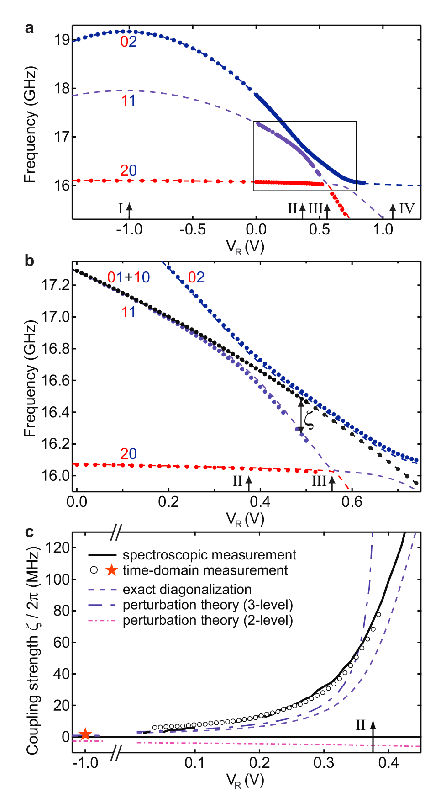
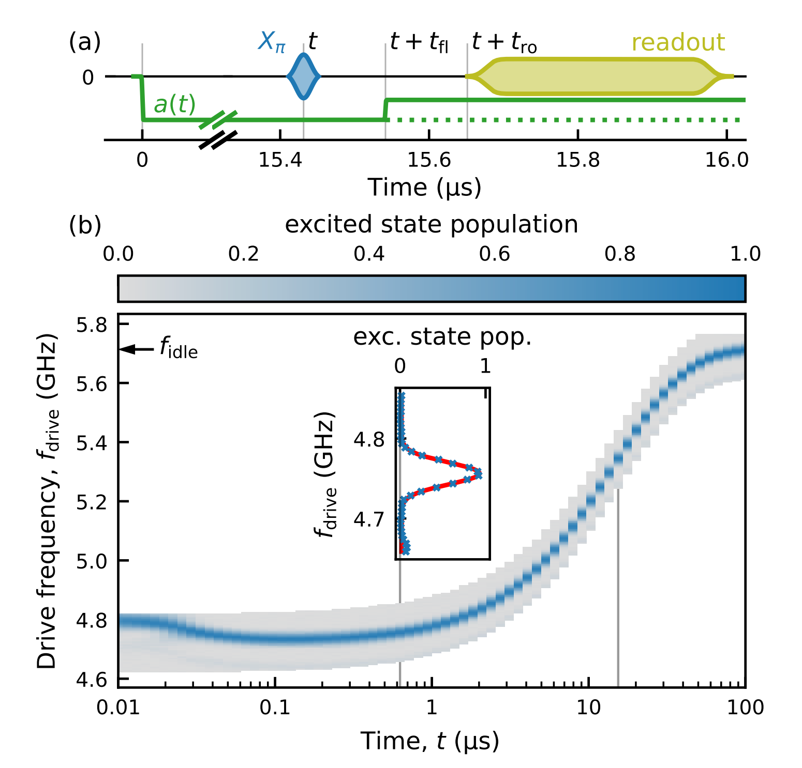
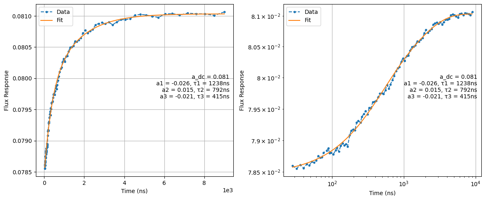
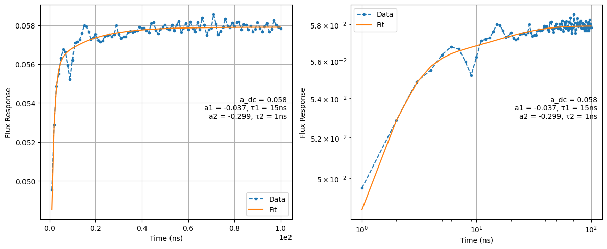
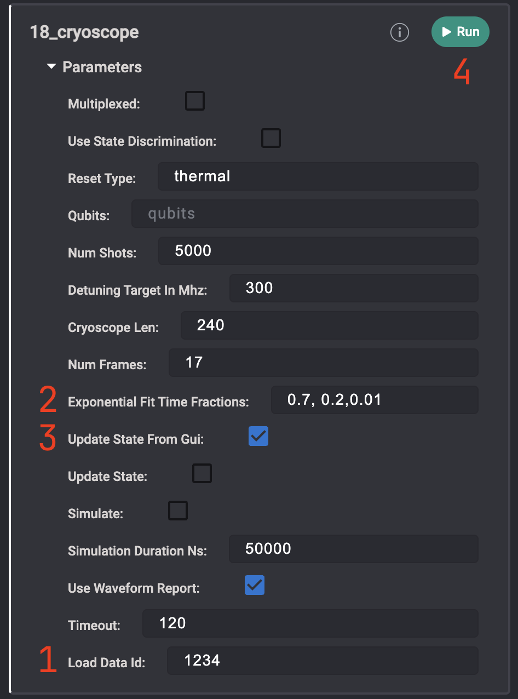
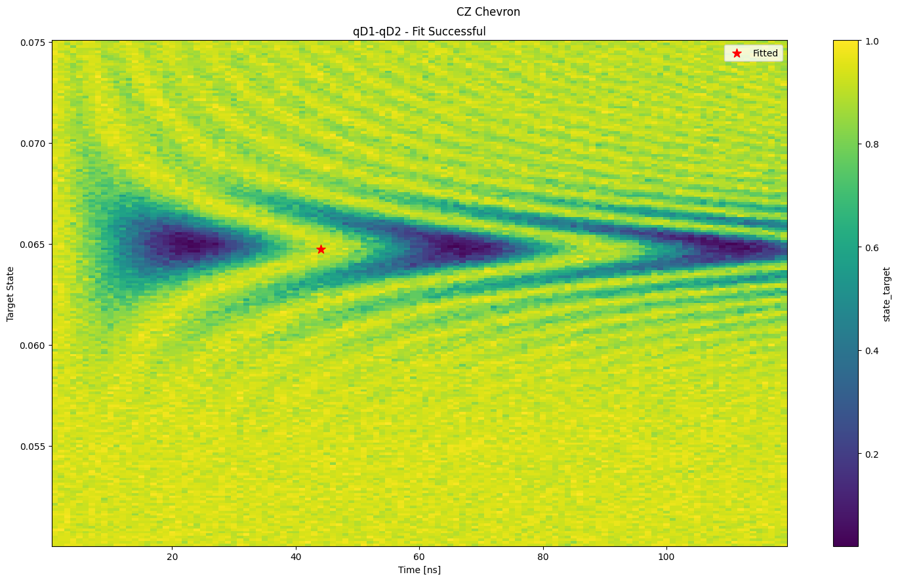
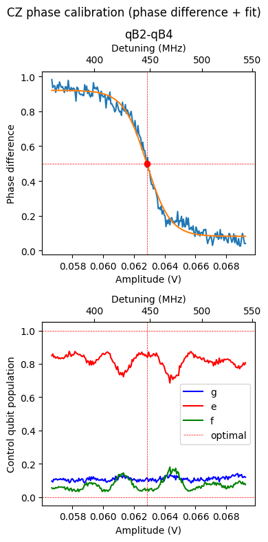
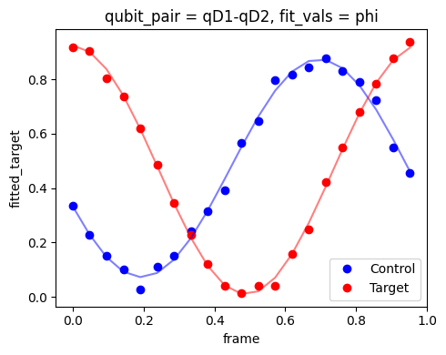

# **CZ Gate on tunable transmons with fixed couplers: Physics & Calibration Overview**

This folder contains routines for implementing and calibrating the **flux-activated CZ gate** on **flux tunable transmons**.

The gate relies on the precise activation of the non-computational state **|11⟩ ↔ |02⟩ avoided-crossing interaction** to accumulate a conditional phase. This protocol requires fine control of the qubit frequency through a short baseband flux pulse on the higher-frequency qubit’s flux line.

---

## Table of Contents
1. [Physics of the CZ gate based on 11–02 Interaction](#physics-of-the-cz-gate-based-on-11-02-interaction)
2. [Calibration Procedure](#calibration-procedure)
   - [Distortions: Cryoscope and Spectroscopy](#distortions-cryoscope-and-spectroscopy)
   - [Finding Initial Parameters – Amplitude and Duration Sweep](#finding-initial-parameters--amplitude-and-duration-sweep)
   - [Amplitude Sweep for 90° Phase Point](#conditional-phase-calibration)
   - [Single-Qubit Phase Compensation – Virtual Z Rotations](#single-qubit-phase-compensation--virtual-z-rotations)
3. [Project Structure](#project-structure)
4. [References](#references)

---

# Physics of the CZ gate based on 11–02 Interaction

The **controlled-Z (CZ) gate** for flux tunable superconducting qubits operates via the *|11⟩ ↔ |02⟩* avoided crossing between two transmons coupled with exchange rate **J**.

### Mechanism

The CZ gate is realized by pulsing the qubit frequencies to an avoided crossing at a specific operating point (Point II).

   

At Point II, a useful two-qubit interaction appears in the two-excitation spectrum. This involves a large cavity-mediated avoided crossing between the computational state |11⟩ and the non-computational higher-level transmon excitation |02⟩.

This avoided crossing causes a frequency shift, $\zeta/2\pi$, in the transition frequency of the |11⟩ state. A CZ gate is implemented by selecting a voltage pulse $V_R$ into Point II such that the time integral of the frequency shift satisfies:

$$
\int \zeta(t) dt = (2n+1)\pi
$$

(where *n* is an integer). The $\zeta(t)$ frequency shift is directly determined by the waveform amplitude, shape, and duration.

### Gate Condition

A **π phase accumulation** on the |11⟩ state realizes an ideal CZ:

$$U_\mathrm{CZ} = \mathrm{diag}(1, 1, 1, -1).$$

**Key Reference:**
- **DiCarlo et al.**, *Nature* (2009), *Demonstration of Two-Qubit Algorithms with a Superconducting Quantum Processor*

---

# Calibration Procedure

The calibration sequence ensures accurate compensation of intrinsic distortions caused by non-ideal cabling and components, as well as precise conditional-phase calibration and single-qubit virtual phase compensation.

---

## Distortions: Cryoscope and Spectroscopy

To achieve high-fidelity operation, flux lines tuning the qubit frequency must be characterized and corrected for distortion. Two complementary methods are used to characterize long- and short-timescale distortions.

### Qubit Spectroscopy vs. Flux Delay
[(17_pi_vs_flux_long_distortions)](../1Q_calibrations/17_pi_vs_flux_long_distortions.py)

This method, proposed in [1], consists of detuning the qubit via a flux pulse and probing its frequency via a short microwave pulse. By sweeping the delay between the two pulses (*t*), one can reconstruct the pulse amplitude time evolution by tracking the qubit frequency.

   

Exponential filter corrections are then fitted to compensate for long-timescale distortions.

   

### Cryoscope Calibration
[(18_cryoscope)](../1Q_calibrations/18_cryoscope.py)

This method, introduced in [2], consists of sweeping the duration of a square flux pulse within a fixed-time Ramsey sequence. The Ramsey experiment allows measurement of the qubit detuning for each pulse duration, enabling reconstruction of the pulse shape with 1 ns resolution. This data is then used to fit another set of exponential corrections for short-timescale distortions.

   

### Intended Usage

These two nodes are designed for interactive parameter fitting through the **QUAlibrate GUI**. The fitting parameters for the exponential-fit time constants can be tuned interactively by loading the dataset via its ID and committing the changes using the `update_state_from_GUI` flag. Intended calibration workflow:

- User acquires data with the `update_state` flag set to `False`.
- If the data is judged to be good for fitting the user then loads the dataset via it's load id (1) and starts interating with the fitting parameters (2).
- Once a good set of parameters is found, the user can set `update_state_from_GUI` to `True` (3) and press RUN (4) to update the fitted filters to the Quam state.

   

**References:**

[1] Christoph Hellings et al., *arXiv* (2025), *Calibrating Magnetic Flux Control in Superconducting Circuits by Compensating Distortions on Time Scales from Nanoseconds up to Tens of Microseconds*

[2] Rol et al., *Appl. Phys. Lett.* (2019), *Time-domain Characterization and Correction of On-chip Distortion of Control Pulses in a Quantum Processor*

---

## Finding Initial Parameters – Amplitude and Duration Sweep
[(19_chevron_11-02)](./19_chevron_11-02.py)

The first calibration stage identifies coarse operating points using a **Chevron-pattern** experiment. The qubit pair is initialized to the |11⟩ state, and a flux pulse is applied to the higher-frequency qubit to activate the interaction with the |02⟩ state.

By sweeping the pulse amplitude and duration, a Chevron-like pattern is observed. The center of the first oscillation period is used as an initial parameter for the CZ gate.

   

**Goal:** Identify the amplitude–duration pair that produces a full π phase shift between control states (the first yellow fringe).

---

## Conditional Phase Calibration
[(20_cz_conditional_phase)](./20_cz_conditional_phase.py)

With the optimal duration fixed, perform a fine amplitude scan to locate the **90° conditional-phase point (π/2)**.

The sequence involves preparing the states |0+⟩ and |1+⟩ (control, target), then applying the CZ flux pulse of varying amplitude on the control qubit. The conditional phase acquired by the target qubit is reconstructed via tomography using an x90 pulse of varying phase.

   

**Goal:** Fit the conditional phase curve and update the optimal CZ amplitude in the system state.

---

## Single-Qubit Phase Compensation – Virtual Z Rotations
[(21_cz_phase_compensation)](./21_cz_phase_compensation.py)

During the CZ pulse, qubit frequencies shift, causing each qubit to acquire an additional phase. These phases must be measured and compensated via virtual Z rotations.

The sequence prepares the |++⟩ state, applies the CZ pulse, and reconstructs each qubit’s phase using tomography with a rotating-phase (frame) x90 pulse.

  

**Goal:** Measure the individual qubit phases and apply virtual Z corrections to the system state.

---

# Summary

This repository provides a complete workflow for implementing and calibrating flux-activated CZ gates on tunable-frequency transmons with fixed couplers. It covers the physical principles, distortion compensation techniques, and step-by-step calibration procedures required to reach high-fidelity gate performance.

