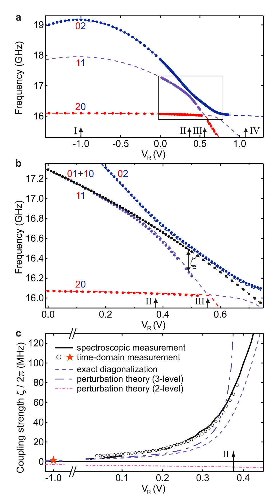
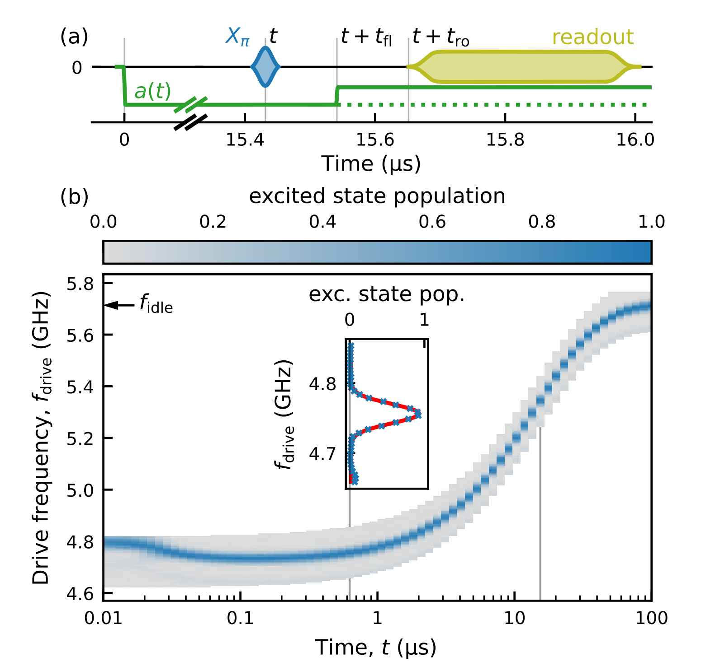
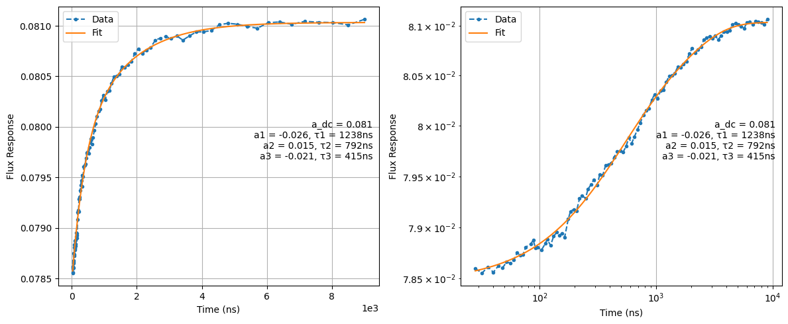
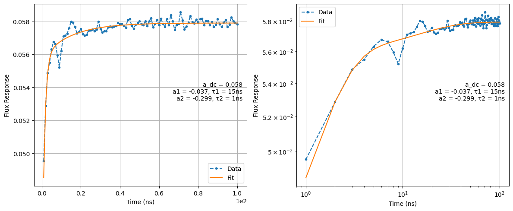
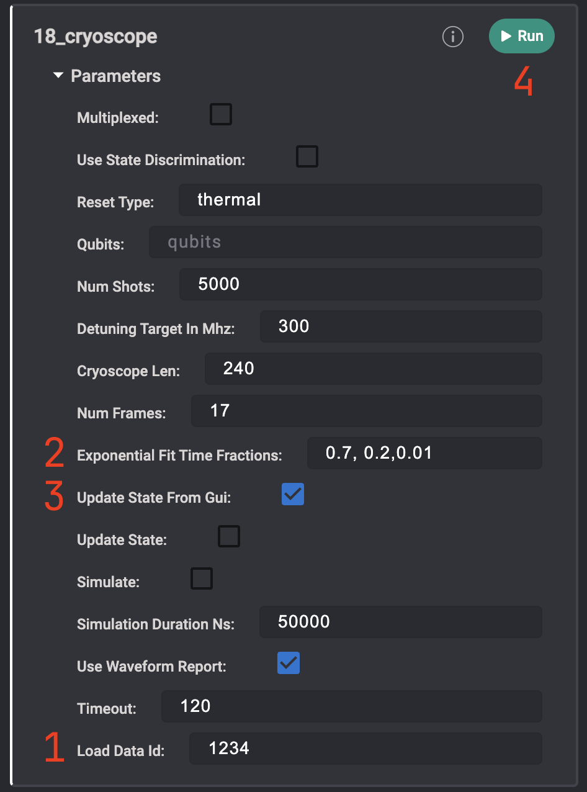
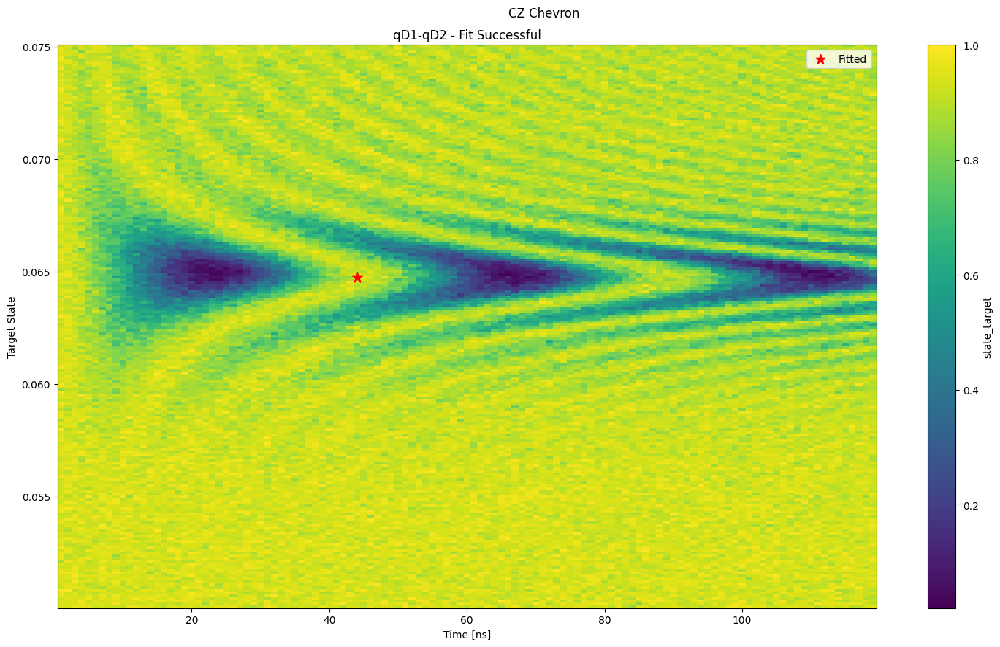
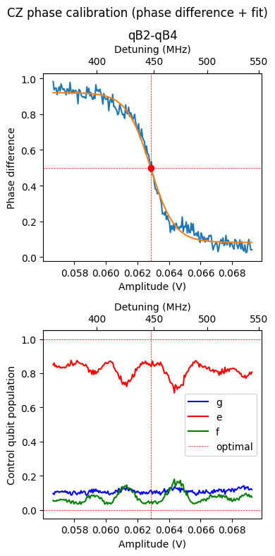
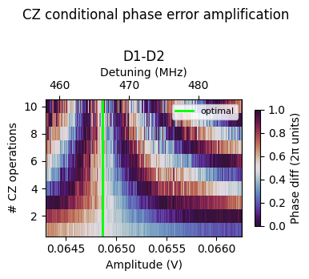
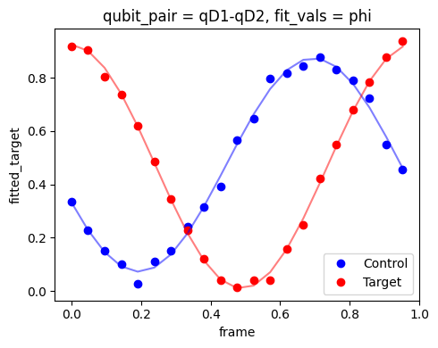

# **CZ gate on flux-tunable transmons: physics & calibration**

This folder contains routines for the **flux-activated CZ gate** on flux-tunable transmons. The gate uses the **|11⟩ ↔ |20⟩** (state convention: |high_freq_qubit, low_freq_qubit⟩) avoided crossing; a baseband flux pulse on the moving qubit brings the pair into the interaction region.

Hardware falls into two workflows:

| Architecture        | Coupler                                        | Two-qubit entry                                            |
| ------------------- | ---------------------------------------------- | ---------------------------------------------------------- |
| **Fixed coupler**   | Bias fixed (no coupler flux sweep in CZ chain) | Chevron (**31**)                                           |
| **Tunable coupler** | Flux-tunable coupler + qubit Z flux            | Flux bootstrap (**30**); **31** optional (usually skipped) |

Distortion calibration (**17**, **18**) applies to **both** (moving-qubit flux line).

---

## Table of Contents

1. [Physics of the CZ gate (11–20 interaction)](#physics-of-the-cz-gate-based-on-11-02-interaction)
2. [Calibration workflows](#calibration-workflows)
   - [Shared: flux-line distortions](#shared-flux-line-distortions)
   - [Fixed-coupler workflow](#fixed-coupler-workflow)
   - [Tunable-coupler workflow](#tunable-coupler-workflow)
3. [Node reference](#node-reference)
4. [Project structure](#project-structure)
5. [Orchestrated graph (fixed coupler)](#orchestrated-graph-fixed-coupler)
6. [References](#references)

---

# Physics of the CZ gate based on 11–20 Interaction

The **controlled-Z (CZ) gate** for flux tunable superconducting qubits operates via the _|11⟩ ↔ |20⟩_ avoided crossing between two transmons coupled with exchange rate **J**.

### Mechanism

The CZ gate is realized by pulsing the qubit frequencies to an avoided crossing at a specific operating point (Point II).

<p align="center">
   
</p>
At Point II, a useful two-qubit interaction appears in the two-excitation spectrum. This involves a large cavity-mediated avoided crossing between the computational state |11⟩ and the non-computational higher-level transmon excitation |20⟩.

This avoided crossing causes a frequency shift, $\zeta/2\pi$, in the transition frequency of the |11⟩ state. A CZ gate is implemented by selecting a voltage pulse $V_R$ into Point II such that the time integral of the frequency shift satisfies:

$$
\int \zeta(t) dt = (2n+1)\pi
$$

(where _n_ is an integer). The $\zeta(t)$ frequency shift is directly determined by the waveform amplitude, shape, and duration.

### Gate Condition

A **π phase accumulation** on the |11⟩ state realizes an ideal CZ:

$$U_\mathrm{CZ} = \mathrm{diag}(1, 1, 1, -1).$$

**Key Reference:**

- **DiCarlo et al.**, _Nature_ (2009), _Demonstration of Two-Qubit Algorithms with a Superconducting Quantum Processor_

---

# Calibration workflows

## Shared: flux-line distortions

Compensate distortion on the **moving-qubit** flux line before two-qubit tuning.

| Step            | Node   | File                                                                                     |
| --------------- | ------ | ---------------------------------------------------------------------------------------- |
| Long timescale  | **17** | [`17_pi_vs_flux_long_distortions`](../1Q_calibrations/17_pi_vs_flux_long_distortions.py) |
| Short timescale | **18** | [`18_cryoscope`](../1Q_calibrations/18_cryoscope.py)                                     |

### Qubit spectroscopy vs. flux delay (17)

Detune the qubit with a flux pulse and probe frequency with a delayed microwave pulse. Reconstruct pulse amplitude vs. time and fit exponential filters for long-timescale distortion [1].

<p align="center">
   
</p>

<p align="center">
   
</p>

### Cryoscope (18)

Sweep square-pulse duration inside a Ramsey sequence to reconstruct the pulse shape at ~1 ns resolution and fit short-timescale corrections [2].

<p align="center">
   
</p>

### GUI fitting (17 / 18)

Acquire with `update_state=False`, reload by `load_data_id`, tune fit parameters in the GUI, then set `update_state_from_GUI=True` and run to commit filters to QUAM.

<p align="center">
   
</p>

---

## Fixed-coupler workflow

Coupler bias is **not** swept in the CZ calibration chain. After distortion calibration, run the chevron → conditional-phase → phase-compensation sequence. Automate with graph **99**.

```text
17 → 18  →  31 → 32a → 32b
                    └→ 34a → 34b (optional)
```

| Order | Node    | Summary                                                                                       |
| ----- | ------- | --------------------------------------------------------------------------------------------- |
| 1     | **31**  | Chevron: amplitude × duration → coarse CZ duration/amplitude                                  |
| 2     | **32a** | Fine amplitude scan → π conditional-phase point                                               |
| 3     | **32b** | CZ pulse train → error-amplified amplitude fine tune                                          |
| 4     | **34a** | Virtual-Z phase compensation (can run after **32a**; **99** runs it in parallel with **32b**) |
| 4′    | **34b** | Error-amplified virtual-Z fine tune (optional follow-up to **34a**)                           |

---

## Tunable-coupler workflow

Node **30** finds coupler **decouple (idle)** and **interaction** flux biases plus moving-qubit detuning in one 2D map (CZ or iSWAP). That replaces the coarse amplitude/duration role of chevron (**31**), so the usual path is **30 → 32a → 32b → 33a → 34a** without **31**. Pulse duration and macro amplitudes come from **30** and the gate macro already in QUAM. Use **33b** (PALEA) instead of **33a** for improved leakage isolation.

```text
17 → 18  →  30 → 32a → 32b → 33a/33b → 34a → 34b (optional)
```

| Order | Node    | Summary                                                                             |
| ----- | ------- | ----------------------------------------------------------------------------------- |
| 1     | **30**  | 2D coupler + moving-qubit flux → `decouple_offset`, `detuning`, `macros[operation]` |
| 2     | **32a** | Fine amplitude → π conditional-phase point                                          |
| 3     | **32b** | CZ pulse train → error-amplified amplitude fine tune                                |
| 4     | **33a** | Coupler amplitude via \|11⟩ leakage amplification (standard)                        |
| 4′    | **33b** | Coupler amplitude via PALEA leakage amplification (alternative to **33a**)          |
| 5     | **34a** | Virtual-Z phase compensation                                                        |
| 5′    | **34b** | Error-amplified virtual-Z fine tune (optional follow-up to **34a**)                 |

**31** remains available if you still want an explicit amplitude–duration Chevron after **30** (e.g. new macro shape or duration not set in state).

Run **30** manually or in a custom graph; graph **99** is for the fixed-coupler path only. Set `operation` and `cz_or_iswap` on **30** for the gate you are calibrating.

---

# Node reference

## Flux bootstrap — tunable coupler only

[(30_cz_iswap_flux_bootstrap)](./30_cz_iswap_flux_bootstrap.py)

2D sweep of coupler flux (around `coupler.decouple_offset`) and moving-qubit flux. Prep: |11⟩ (CZ) or |10⟩ (iSWAP). Finds idle plateau (decouple) and first interaction fringe; updates `coupler.decouple_offset`, `qubit_pair.detuning`, and `macros[operation]` amplitudes.

**Goal:** Coarse coupler/qubit flux operating point; for tunable couplers this typically **replaces 31**.

---

## Chevron — fixed coupler (optional for tunable)

[(31_chevron_11_02)](./31_chevron_11_02.py)

Prepare |11⟩, sweep CZ flux pulse amplitude and duration on the moving qubit. First Chevron fringe → initial duration/amplitude. **Required** on fixed-coupler pairs; **usually skipped** after **30** on tunable-coupler pairs.

<p align="center">
   
</p>

**Goal:** Full π phase between control states (first yellow fringe).

---

## Conditional phase — both workflows

[(32a_cz_conditional_phase)](./32a_cz_conditional_phase.py)

Use gate duration from **31** (fixed coupler) or from the macro in state after **30** (tunable coupler). Sweep amplitude to the **π conditional-phase** point (phase difference = 0.5 in normalised units). Frame tomography uses rotating x90 on the stationary qubit.

<p align="center">
   
</p>

**Goal:** Update optimal CZ amplitude in state.

### Error amplification

[(32b_cz_conditional_phase_error_amp)](./32b_cz_conditional_phase_error_amp.py)

Train of CZ pulses for finer amplitude tuning.

<p align="center">
   
</p>

**Goal:** Fine-tune gate amplitude.

---

## Leakage amplification — tunable coupler only

### Standard protocol

[(33a_cz_leakage_amplification)](./33a_cz_leakage_amplification.py)

Prepare \|11⟩, sweep **coupler flux pulse amplitude**, repeat CZ `n = 1…N`, measure P(11). Optimal amplitude maximizes mean P(11) over `n`. Requires GEF readout and `macros[operation].coupler_flux_pulse`.

**Goal:** Tune `coupler_flux_pulse.amplitude` to preserve \|11⟩ under repeated CZ.

### PALEA protocol

[(33b_cz_leakage_amplification_palea)](./33b_cz_leakage_amplification_palea.py)

Same coupler-amplitude objective as **33a**, with a dynamical-decoupling layer after each CZ (EF π on the high-frequency qubit, g–e π on the low-frequency qubit). Sweeps even `n = 2, 4, …`. See Marxer et al., [arXiv:2508.16437](https://arxiv.org/abs/2508.16437).

**Goal:** Same state update as **33a** with improved leakage-error amplification.

---

## Phase compensation — both workflows

### Standard protocol

[(34a_cz_phase_compensation)](./34a_cz_phase_compensation.py)

|++⟩, apply CZ, reconstruct per-qubit phase; update virtual Z in state.

<p align="center">
  
</p>

**Goal:** Compensate single-qubit phases acquired during CZ.

### Error amplification

[(34b_cz_phase_compensation_error_amp)](./34b_cz_phase_compensation_error_amp.py)

Same phase-compensation objective as **34a**, with a train of CZ operations to amplify phase errors before fitting a sinc model on the N-averaged signal. Run after **34a** when finer virtual-Z compensation is needed.

**Goal:** Fine-tune `phase_shift_control` / `phase_shift_target`; optional follow-up to **34a**.

---

# Project structure

| Node    | File                                                                                 | Fixed coupler  |                      Tunable coupler                       |
| ------- | ------------------------------------------------------------------------------------ | :------------: | :--------------------------------------------------------: |
| **30**  | [`30_cz_iswap_flux_bootstrap.py`](./30_cz_iswap_flux_bootstrap.py)                   |       —        |                             ✓                              |
| **31**  | [`31_chevron_11_02.py`](./31_chevron_11_02.py)                                       |       ✓        |                          optional                          |
| **32a** | [`32a_cz_conditional_phase.py`](./32a_cz_conditional_phase.py)                       |       ✓        |                             ✓                              |
| **32b** | [`32b_cz_conditional_phase_error_amp.py`](./32b_cz_conditional_phase_error_amp.py)   |       ✓        |                             ✓                              |
| **33a** | [`33a_cz_leakage_amplification.py`](./33a_cz_leakage_amplification.py)               |       —        |                             ✓                              |
| **33b** | [`33b_cz_leakage_amplification_palea.py`](./33b_cz_leakage_amplification_palea.py)   |       —        |                             ✓                              |
| **34a** | [`34a_cz_phase_compensation.py`](./34a_cz_phase_compensation.py)                     |       ✓        |                             ✓                              |
| **34b** | [`34b_cz_phase_compensation_error_amp.py`](./34b_cz_phase_compensation_error_amp.py) |       ✓        |                             ✓                              |
| **99**  | [`99_CZ_calibration_graph.py`](./99_CZ_calibration_graph.py)                         | ✓ (31–32b–34a) | — (use **30** → 32a–32b-33a/b–34a by hand or custom graph) |

Utilities: `cz_iswap_flux_bootstrap`, `chevron_cz`, `cz_conditional_phase`, `cz_conditional_phase_error_amp`, `cz_leakage_amp`, `cz_phase_compensation`, `cz_phase_compensation_error_amp` under `../calibration_utils/`.

---

# Orchestrated graph (fixed coupler)

[`99_CZ_calibration_graph.py`](./99_CZ_calibration_graph.py) — `CZ_Calibration_Fixed_Couplers`:

- **31** → **32a** → **32b** → **34a** (add **34b** manually for finer virtual-Z tuning)

Leakage nodes (**33a** / **33b**) are tunable-coupler only and are not included in this graph.

---

# References

[1] Christoph Hellings et al., _arXiv_ (2025), _Calibrating Magnetic Flux Control in Superconducting Circuits by Compensating Distortions on Time Scales from Nanoseconds up to Tens of Microseconds_

[2] Rol et al., _Appl. Phys. Lett._ (2019), _Time-domain Characterization and Correction of On-chip Distortion of Control Pulses in a Quantum Processor_
