# **Controlled-Z (CZ) gate on flux-tunable transmons: calibration & benchmarking**

This folder takes a qubit pair from "the two qubits are individually calibrated" to **a CZ gate whose fidelity you have measured**. It assumes single-qubit bring-up is complete on both qubits (see the [1Q calibration README](../1Q_calibrations/README.md)). It does that in two halves:

- **Calibration (nodes 30–34).** Find the flux operating point, suppress leakage, set the conditional phase to π, and remove the residual single-qubit phases. The product is a calibrated CZ pulse.
- **Verification (nodes 35–39).** Measure what you built — readout confusion matrices, Bell-state tomography, two-qubit randomized benchmarking, and multi-qubit GHZ states. The product is a CZ fidelity.

Calibration without verification is unfinished: nothing in nodes 30–34 measures gate fidelity, so the benchmarking chapter is where "high fidelity" stops being an assumption.

The gate uses the **|11⟩ ↔ |20⟩** avoided crossing (state convention: |high_freq_qubit, low_freq_qubit⟩); a baseband flux pulse on the moving qubit brings the pair into the interaction region.

Hardware falls into two workflows:

| Architecture        | Coupler                                        | Two-qubit entry point                                      |
| ------------------- | ---------------------------------------------- | ---------------------------------------------------------- |
| **Fixed coupler**   | Bias fixed (no coupler flux sweep in CZ chain) | Chevron (**31**)                                           |
| **Tunable coupler** | Flux-tunable coupler + qubit Z flux            | Flux bootstrap (**30**); **31** optional (usually skipped) |

---

## Table of Contents

1. [Physics of the CZ gate](#1-physics-of-the-cz-gate)
2. [Before you start](#2-before-you-start)
3. [Calibration procedure](#3-calibration-procedure)
   - [Stage 1 — Operating point](#stage-1--operating-point)
   - [Stage 2 — Leakage suppression](#stage-2--leakage-suppression)
   - [Stage 3 — Conditional phase = π](#stage-3--conditional-phase--π)
   - [Stage 4 — Single-qubit phase cleanup](#stage-4--single-qubit-phase-cleanup)
   - [Choosing the flux-pulse shape](#choosing-the-flux-pulse-shape)
4. [Verification & benchmarking](#4-verification--benchmarking)
   - [Readout characterisation (35, 38)](#readout-characterisation-35-38)
   - [Two-qubit gate quality (36, 37a, 37b)](#two-qubit-gate-quality-36-37a-37b)
   - [Multi-qubit validation (39a, 39b)](#multi-qubit-validation-39a-39b)
5. [Reading results and iterating](#5-reading-results-and-iterating)
   - [Symptoms and where to go back to](#symptoms-and-where-to-go-back-to)
6. [Project structure](#6-project-structure)
7. [Orchestrated graphs](#7-orchestrated-graphs)

---

# 1. Physics of the CZ gate

The CZ is a two-qubit entangling gate that applies a $\pi$ phase to
the $|11\rangle$ state and leaves the rest of the computational basis untouched:

$$U_\mathrm{CZ} = \mathrm{diag}(1, 1, 1, -1).$$

Equivalently, it imprints a Z on the target _conditioned_ on the control
being $|1\rangle$. Combined with single-qubit rotations it is universal, and on
flux-tunable transmons it is one of the native, highest-fidelity two-qubit
gates.

With the qubits coupled by an exchange interaction $J$, the Hamiltonian in
the ordered basis {$|20\rangle$, $|11\rangle$, $|02\rangle$} is

$$
H^{(2)} =
\begin{pmatrix}
2\omega_H + \alpha_H & \sqrt{2}\,J & 0 \\
\sqrt{2}\,J & \omega_H + \omega_L & \sqrt{2}\,J \\
0 & \sqrt{2}\,J & 2\omega_L + \alpha_L
\end{pmatrix}.
$$

where $\omega_H$ and $\omega_L$ are the $|0\rangle\to|1\rangle$ transition
frequencies of the higher and lower frequency qubit respectively, and
$\alpha_H$, $\alpha_L$ are their anharmonicities (negative for transmons).

The structure shows that $|11\rangle$ couples to **both** double-excitation
states, $|20\rangle$ and $|02\rangle$, each through a $\sqrt{2} J$ matrix element — the $\sqrt{2}$ coming
from the 1→2 transition of the doubly-excited transmon (the bosonic $\sqrt{2}$ of
$a^{\dagger}$). The corner entry is zero: $|20\rangle$ and $|02\rangle$ do not couple directly, only
through $|11\rangle$. Compare the single-excitation block,

$$
H^{(1)} =
\begin{pmatrix}
\omega_H & J\\
J & \omega_L
\end{pmatrix},
$$

whose off-diagonal is just $J$, a factor of $\sqrt2$ smaller than the
$\sqrt2 J$ coupling at either double-excitation crossing (same physical
$J$, larger matrix element from the bosonic $|1\rangle\to|2\rangle$
transition). Both the $|11\rangle\leftrightarrow|20\rangle$ and
$|11\rangle\leftrightarrow|02\rangle$ crossings are therefore stronger than
the single-excitation one, and that strength cuts both ways: it is what
makes the swap fast enough to be a usable gate, and it is exactly why an
imperfect traversal (wrong amplitude, distorted pulse, timing error)
transfers population into the doubly excited state so readily. The strong
coupling both drives the gate and sets the dominant leakage channel, which
is why leakage gets its own dedicated calibration step (Stage 2) rather
than being incidental.

So in the two-excitation manifold there are two candidate partners for
$|11\rangle$:

- $|11\rangle \leftrightarrow |20\rangle$ (high-frequency qubit doubly excited)
- $|11\rangle \leftrightarrow |02\rangle$ (low-frequency qubit doubly excited)

Either realizes a CZ in principle. The resonance conditions follow from
the diagonals of $H^{(2)}$:

- $|11\rangle \leftrightarrow |20\rangle$ at $\omega_H - \omega_L = |\alpha_H|$
- $|11\rangle \leftrightarrow |02\rangle$ at $\omega_H - \omega_L = -|\alpha_L|$

The single-excitation manifold {$|10\rangle, |01\rangle$} adds a third
resonance at $\omega_H - \omega_L = 0$, the iSWAP point. It sits at
$\Delta = 0$, directly between the two CZ crossings. A flux excursion
that crosses $\Delta = 0$ transits this unwanted single-excitation exchange
resonance, so in practice the gate always targets whichever CZ crossing
can be reached without passing through zero. With $\Delta > 0$ at idle
(by definition of $\omega_H$ and $\omega_L$), that is the $|11\rangle\leftrightarrow|20\rangle$
crossing at $+|\alpha_H|$.

<p align="center">
   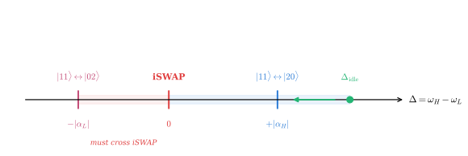
</p>

Which qubit is the mover, and in which
direction, depends on which side of $|\alpha_H|$ the idle detuning sits
on. Since transmon frequencies decrease under applied flux, fluxing a
qubit always lowers its frequency:

- $\Delta_\text{idle} > |\alpha_H|$: the qubits are far apart and
  $\Delta$ must decrease to reach the crossing. Flux the
  **higher frequency** qubit down: $\omega_H$ drops, $\Delta$ shrinks
  toward $|\alpha_H|$.
- $\Delta_\text{idle} < |\alpha_H|$: the qubits are already close
  together and $\Delta$ must increase to reach the crossing. Flux the
  **lower frequency** qubit down: $\omega_L$ drops, $\Delta$ grows
  toward $|\alpha_H|$.

In both cases $\Delta$ stays positive throughout the excursion.

<p align="center">
   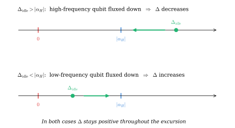
</p>

**This folder uses the $|11\rangle \leftrightarrow |20\rangle$ crossing throughout.**

## Mechanism

A baseband flux pulse on the moving qubit sweeps the detuning $\Delta = \omega_H - \omega_L$
toward the $|11\rangle \leftrightarrow |20\rangle$ resonance at $\Delta = |\alpha_H|$. There are two ways to spend
the resulting interaction as a conditional phase:

- **Adiabatic.** Ramp into the avoided crossing slowly enough that $|11\rangle$
  follows the lower eigenstate without ever fully populating $|20\rangle$,
  accumulating a dynamical phase along the way. Leakage-robust, but slower.
- **Diabatic.** Pulse fast to (or near) resonance and let $|11\rangle$ undergo a
  full 2π population exchange with $|20\rangle$ — out to $|20\rangle$ and back — returning
  to $|11\rangle$ with the conditional phase banked.

**This stack uses the diabatic gate.** Over the excursion, $|11\rangle$ acquires a
phase $\zeta(t)$ relative to the single-excitation states $|01\rangle$, $|10\rangle$; the gate is
calibrated so that

$$\int \zeta(t)\, dt = (2n+1)\pi, \quad n \in \mathbb{Z},$$

i.e. an _odd_ multiple of π. The residual single-qubit phases on $|01\rangle$ and
$|10\rangle$ are removed by virtual-Z compensation (node **34a**), yielding the ideal
$U_\mathrm{CZ}$ above.

### How the physics maps onto the calibration stages

Each stage below fixes one term in this picture, which is why the order matters:

| Physical quantity                                           | Controlled by                       | Stage |
| ----------------------------------------------------------- | ----------------------------------- | ----- |
| Detuning $\Delta$ at the interaction point                  | Flux-pulse amplitude & coupler bias | 1     |
| Population left in $\vert 20\rangle$ (leakage)              | Coupler flux-pulse amplitude        | 2     |
| $\int\zeta\,dt$ (the conditional phase)                     | Qubit flux-pulse amplitude          | 3     |
| Single-qubit phases on $\vert 01\rangle$, $\vert 10\rangle$ | Virtual-Z frame shifts              | 4     |

**Key references:**

- Strauch et al., _Phys. Rev. Lett._ **91**, 167005 (2003), [arXiv:quant-ph/0303002](https://arxiv.org/abs/quant-ph/0303002) — original theory proposal for the controlled-phase gate via the two-excitation avoided crossing on coupled superconducting qubits
- Krantz et al., _Appl. Phys. Rev._ **6**, 021318 (2019), [arXiv:1904.06560](https://arxiv.org/abs/1904.06560) — comprehensive review of superconducting qubit design, control, coupling, and readout
- DiCarlo et al., _Nature_ **460**, 240 (2009), [arXiv:0903.2030](https://arxiv.org/abs/0903.2030) — first experimental demonstration of a CZ gate and two-qubit algorithms on flux-tunable transmons
- Sung et al., _Phys. Rev. X_ **11**, 021058 (2021), [arXiv:2011.01261](https://arxiv.org/abs/2011.01261) — full CZ (and ZZ-free iSWAP) calibration on a tunable-coupler architecture, including coupler control to suppress leakage and residual ZZ

---

# 2. Before you start

A CZ chain will happily converge onto a bad operating point if the single-qubit layer underneath it is not solid. Most "the CZ won't calibrate" problems are really one of these. Confirm all of the following on **both** qubits of the pair before running node 30 or 31.

| Requirement                | Nodes                                                                                                                                                                                                                                             | Why the CZ needs it                                                                                                                                                                                                          |
| -------------------------- | ------------------------------------------------------------------------------------------------------------------------------------------------------------------------------------------------------------------------------------------------- | ---------------------------------------------------------------------------------------------------------------------------------------------------------------------------------------------------------------------------- |
| Flux bias points           | [`02c`](../1Q_calibrations/02c_resonator_spectroscopy_vs_flux.py), [`03b`](../1Q_calibrations/03b_qubit_spectroscopy_vs_flux.py), [`09a`](../1Q_calibrations/09a_ramsey_vs_flux_calibration.py)                                                   | Sets the idle point and the frequency-vs-flux conversion                                                                                                                                                                     |
| Single-qubit gates         | [`04b`](../1Q_calibrations/04b_power_rabi.py), [`10b`](../1Q_calibrations/10b_drag_calibration_180_minus_180.py), verified by [`11a`](../1Q_calibrations/11a_single_qubit_randomized_benchmarking.py) and [`20`](../1Q_calibrations/20_all_xy.py) | Every CZ node brackets the gate with x90/x180 pulses; their errors alias into the extracted phase                                                                                                                            |
| Readout + discrimination   | [`07`](../1Q_calibrations/07_iq_blobs.py), [`08a`](../1Q_calibrations/08a_readout_frequency_optimization.py), [`08b`](../1Q_calibrations/08b_readout_power_optimization.py)                                                                       | Most CZ nodes discriminate computational states; leakage nodes (**32a/32b**) hard-require GEF (see next row)                                                                                                                 |
| GEF (three-state) readout  | [`12`](../1Q_calibrations/12_Qubit_Spectroscopy_E_to_F.py), [`13`](../1Q_calibrations/13_power_rabi_ef.py), [`14`](../1Q_calibrations/14_gef_readout_frequency_optimization.py), [`15`](../1Q_calibrations/15_iq_blobs_gef.py)                    | Leakage nodes **32a/32b** measure ǀf⟩ population and refuse to run without it; **30** (CZ mode), **31**, **33a** and **33b** also use GEF when state discrimination is on. 32b further needs an e–f π pulse                  |
| XY–Z timing alignment      | [`16a`](../1Q_calibrations/16a_xyz_delay.py), [`16b`](../1Q_calibrations/16b_xy_coupler_z_delay.py)                                                                                                                                               | A misaligned flux pulse truncates the interaction window                                                                                                                                                                     |
| Flux-line distortions      | [1Q README](../1Q_calibrations/README.md#flux-line-distortions-17a--17b--17c) (`17a` / `17b` / `17c`)                                                                                                                                             | A distorted pulse can still show a chevron, so **30/31 may succeed anyway** — but the fringe will look **asymmetric**, and the gate waveform is wrong, which **will cap CZ fidelity**. Predistort before you trust a number. |
| Coupler spectroscopy       | [`22a`](../1Q_calibrations/22a_three_tone_coupler_spectroscopy_flux_pulse.py) / [`22b`](../1Q_calibrations/22b_three_tone_coupler_spectroscopy_vs_coupler_flux.py) — **tunable coupler only**                                                     | Maps coupler frequency vs flux; this is how you set a sensible decouple bias before **30**                                                                                                                                   |
| Coupler flux distortions   | [`21a`](../1Q_calibrations/21a_coupler_flux_long_distortion_qubitspec.py) / [`21b`](../1Q_calibrations/21b_coupler_flux_long_distortion_ramsey.py) → [`21c`](../1Q_calibrations/21c_coupler_flux_short_distortion.py) — **tunable coupler only**  | Same job as **17a/17b/17c**, on the coupler flux line, so leakage (**32a/32b**) and bootstrap (**30**) amplitudes are not calibrated against a distorted coupler pulse                                                       |
| Static ZZ characterisation | [`19`](../1Q_calibrations/19_zz_off_jazz.py)                                                                                                                                                                                                      | Always-on ZZ biases the conditional phase you are about to calibrate                                                                                                                                                         |

Tunable-coupler pairs additionally need a coupler flux pulse on the gate; the leakage and bootstrap nodes will not run without it. Nodes **22a/22b** and **21a/21b/21c** are how that coupler is found and its flux line predistorted.

**Role vocabulary used throughout.** The **moving qubit** is the one whose flux line is pulsed to reach the avoided crossing; the **stationary qubit** stays at its idle point. These roles are independent of which qubit you call control or target in the circuit sense. Because the gate rides the |11⟩↔|20⟩ crossing, the doubly-excited (leakage) qubit is always the **higher-frequency** one.

---

# 3. Calibration procedure

The whole pipeline, both architectures and both halves:

```text
  prerequisites (1Q gates, readout, GEF, flux bias, XY-Z delay, flux-line distortions;
                 tunable coupler also 22a/22b and 21a/21b/21c)
          |
  Stage 1 +-- fixed coupler ------>  31
          +-- tunable coupler ---->  30
          |
  Stage 2 |  32a  (or 32b)                            tunable coupler only
          |
  Stage 3 |  33a --> 33b  --> [33c / 33d optional]    conditional phase = pi
          |
  Stage 4 |  34a --> 34b (optional)                   virtual-Z cleanup
          |
  ========+===========================================================
          |     gate is calibrated; everything below only measures it
          |
  Stage 5 |  35 --> 36                                Bell tomography
          |  37a --> 37b                              RB reference --> CZ fidelity
          |  38 --> 39a --> 39b                       multi-qubit GHZ
```

Condensed per architecture:

| Architecture        | Calibration order                         |
| ------------------- | ----------------------------------------- |
| **Fixed coupler**   | `31 → 33a → 33b → 34a → 34b`              |
| **Tunable coupler** | `30 → 32a or 32b → 33a → 33b → 34a → 34b` |

Graph [**99**](./99_CZ_calibration_graph_fixed_couplers.py) automates the fixed-coupler core (`31 → 33a → 33b → 34a`). Graph [**98**](./98_CZ_calibration_graph_tunable_couplers.py) automates the tunable-coupler core (`30 → 32a → 33a → 33b → 34a`). Swap **32a** for **32b** if you want PALEA leakage amplification.

## Stage 1 — Operating point

Find where in flux space the interaction lives, and roughly how long and how hard to pulse. This is the coarse step; everything after it is refinement.

### 30 — Flux bootstrap (tunable coupler)

[`30_cz_iswap_flux_bootstrap.py`](./30_cz_iswap_flux_bootstrap.py)

One 2D map over coupler flux (around the decouple bias) and moving-qubit flux finds the idle (decouple) plateau and the first interaction fringe simultaneously. Prepares |11⟩ for CZ or |10⟩ for iSWAP. Because it returns both biases _and_ the flux-pulse amplitudes, it **replaces** the coarse role of 31.

<p align="center">
   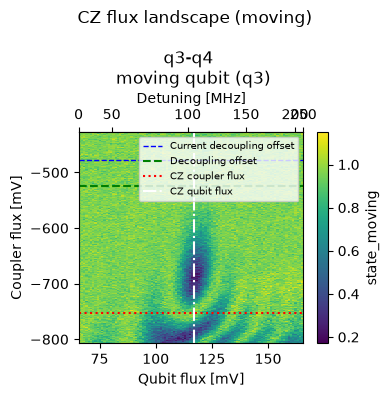
   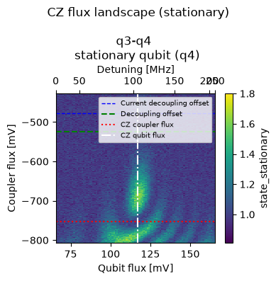
</p>

The figures above are example data for this type of experiment. Both qubits are read out on the same 2D map. The horizontal line is the coupler decoupling offset (the flat region where the exchange is off) and the vertical line the moving-qubit flux at the first interaction fringe; together they fix the operating point. The interaction shows up as loss of population on the moving qubit and gain on the stationary one, so the two panels should mirror each other — if they do not, you are looking at a feature that is not the |11⟩↔|20⟩ exchange.

### 31 — Chevron (fixed coupler; optional for tunable)

[`31_chevron_11_20.py`](./31_chevron_11_20.py)

Prepare |11⟩ and sweep flux-pulse amplitude × duration on the moving qubit. The first chevron fringe gives the initial duration and amplitude, written back to the CZ pulse (duration rounded up to the hardware's 4 ns grid).

The chevron is also a visual check that flux-line predistortion (`17a`/`17b`/`17c`) is doing its job. A well-corrected flux pulse gives a left–right symmetric fringe; uncorrected distortions skew the chevron (asymmetric about the resonance amplitude, or a fringe that shears with duration). Rol et al., _Appl. Phys. Lett._ **116**, 054001 (2020), [arXiv:1907.04818](https://arxiv.org/abs/1907.04818), Figs. 2(b)–2(c), show this explicitly: without predistortion the |11⟩–|02⟩ chevron bends and is brighter on one side (finite rise time); with it, the pattern is almost perfectly symmetric. If you see the asymmetric case, go back to the [1Q flux-line distortions](../1Q_calibrations/README.md#flux-line-distortions-17a--17b--17c) before trusting the fitted point.

**Do you need 31 after 30?** Only for the gate duration. Node 30 writes the coupler bias and both flux amplitudes, but it never sets the qubit flux-pulse duration — measuring that is what the chevron is for. So run 31 if the pulse has no duration yet, or if you switched to a pulse shape whose duration has not been measured. Otherwise skip it: re-running 31 would overwrite the amplitudes 30 just fitted, using a sweep that holds the coupler fixed instead of mapping it.

## Stage 2 — Leakage suppression

**Tunable-coupler pairs only** — it tunes the coupler flux-pulse amplitude, which fixed-coupler pairs do not have.

The |11⟩↔|20⟩ crossing that powers the gate is also the leak. Any population that finishes in |20⟩ instead of returning to |11⟩ is lost outside the computational subspace, where randomized benchmarking will later report it as an error it cannot distinguish from decoherence. Fixing it here, before the phase calibration, means Stage 3 tunes a gate that is already leakage-clean.

Both nodes prepare |11⟩, sweep coupler amplitude, repeat the CZ `n` times, and pick the amplitude that best preserves P(11). Both **require GEF readout**.

- [**32a**, standard](./32a_cz_leakage_amplification.py) — straightforward repetition, `n = 1…N`.
- [**32b**, PALEA](./32b_cz_leakage_amplification_palea.py) — adds a dynamical-decoupling layer after each CZ (EF π on the high-frequency qubit, g–e π on the low-frequency qubit) and sweeps even `n`. Reported to reach the same leakage sensitivity in roughly half the repetitions, and is more robust to ZZ over-rotation and single-qubit phase error.

  **Ref:** Marxer et al., [arXiv:2508.16437](https://arxiv.org/abs/2508.16437) — PALEA leakage amplification

Run one of them; 32b is the better choice when you can afford the EF pulses.

**Done when:** there is a coupler amplitude where P(11) vs repetition count `n` is flat and high — that is the leakage null. Off that amplitude, leftover |11⟩↔|20⟩ exchange makes P(11) oscillate with `n`. The node does not fit those oscillations; it averages P(11) over `n` and takes the amplitude that maximises the mean (oscillating traces average down, a flat high one does not).

Both nodes refuse to run without state discrimination; 32b additionally requires an e–f π pulse on each high-frequency qubit for its PALEA layer.

## Stage 3 — Conditional phase = π

Now set the quantity that actually defines the gate: $\int\zeta\,dt = \pi$. The gate duration is already fixed (Stage 1), so amplitude is the knob.

### 33a / 33b — Conditional phase (both workflows)

[`33a_cz_conditional_phase.py`](./33a_cz_conditional_phase.py) · [`33b_cz_conditional_phase_error_amp.py`](./33b_cz_conditional_phase_error_amp.py)

1. [**33a**](./33a_cz_conditional_phase.py) — sweep flux-pulse amplitude and read the conditional phase out by frame tomography (rotating x90 on the stationary qubit). Take the amplitude where the phase difference crosses π, i.e. 0.5 in normalised units, from a tanh fit. On tunable couplers run this **after** Stage 2.
2. [**33b**](./33b_cz_conditional_phase_error_amp.py) — repeat the CZ in a train so a small per-gate amplitude error accumulates into a large measurable one, then refit. This is the node that buys you the last significant figure. Leakage populations are recorded for inspection when GEF readout is on, but are not part of the fit criterion.

<p align="center">
   
   
</p>

33a (left) reads the π-crossing straight off the tanh fit at a phase difference of 0.5, with the g/e/f populations underneath as a leakage check. 33b (right) repeats the gate, so the same amplitude error fans out into the tilted fringes of the 2D map and the optimum can be located far more precisely. The lower panels are diagnostics, not fit inputs — rising |f⟩ population with repetition count means Stage 2 is not done, whatever the phase fit says.

### 33c / 33d — JAZZ precision amplitude (optional)

[`33c_JAZZ-N.py`](./33c_JAZZ-N.py) · [`33d_JAZZ2-N.py`](./33d_JAZZ2-N.py)

Same goal as 33a/33b — find the amplitude where the conditional phase is π — but the CZ is wrapped in an echo ($X_\pi$ on both qubits). The echo cancels the single-qubit phases, so what you measure is only the two-qubit phase.

That buys three things over 33b:

- **A cleaner number.** 33b amplifies the conditional phase error, but it also amplifies everything else — residual detuning, AC-Stark shift, virtual-Z inside the CZ macro. Here those cancel, so the fitted amplitude does not inherit your single-qubit frequency calibration.
- **Finer resolution.** The peak around π keeps sharpening as you add echo repetitions, so you can push the amplitude precision further than 33b's train.
- **Half the runs.** The echo sweeps the control through |0⟩ and |1⟩ within one sequence, instead of two separately conditioned scans.

**Ref:** [arXiv:2402.18926](https://arxiv.org/abs/2402.18926), Appendix I.1, Fig. 13 — JAZZ-N (a) and JAZZ2-N (b)

The two nodes differ only in what gets measured:

1. [**33c**, JAZZ-N](./33c_JAZZ-N.py) — reads out the stationary qubit.

<p align="center">
   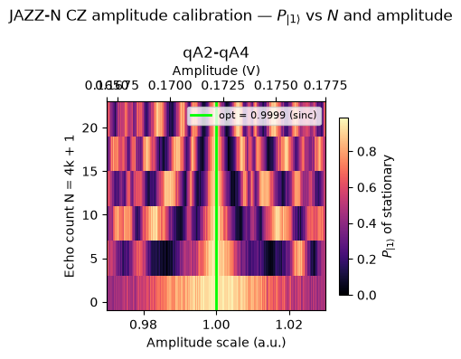
   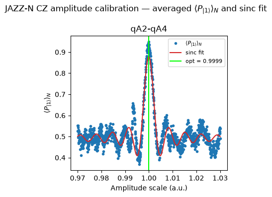
</p>

The 2D map (left) shows the fringes narrowing as the echo count grows — that narrowing is the error amplification. Averaging over $N$ (right) collapses them into a single sharp central lobe whose position, from the sinc fit, is the amplitude scale to apply; the flat, noisy background away from the lobe is where the repetitions no longer agree. A lobe that is broad, off-centre, or has a competing side peak of comparable height means the starting amplitude from 33b was too far off for the echo to refine.

2. [**33d**, JAZZ2-N](./33d_JAZZ2-N.py) — reads out both qubits together. Sharper for the same number of pulses and less sensitive to single-qubit gate error, but it needs good readout on both qubits. Read the plots the same way as above.

Run either after 33b; pick 33d if you want the tightest amplitude.

**Done when:** the fitted conditional phase sits at π and the error-amplified scan no longer moves the optimum.

## Stage 4 — Single-qubit phase cleanup

A correct conditional phase still is not a CZ: the flux excursion also drags the single-qubit phases of |01⟩ and |10⟩. Those are removed in software, by shifting the virtual-Z frames, at zero time cost.

### 34a / 34b — Phase compensation (both workflows)

[`34a_cz_phase_compensation.py`](./34a_cz_phase_compensation.py) · [`34b_cz_phase_compensation_error_amp.py`](./34b_cz_phase_compensation_error_amp.py)

1. [**34a**](./34a_cz_phase_compensation.py) — prepare |++⟩, apply the CZ, reconstruct each qubit's phase, and subtract it as a virtual-Z on control and target.

<p align="center">
  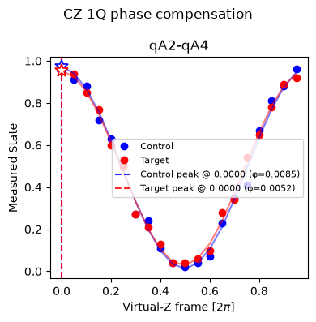
</p>

2. [**34b**](./34b_cz_phase_compensation_error_amp.py) — same objective with a train of CZs to amplify the phase error, fitting a sinc model on the N-averaged signal. Run it when 34a's residual is not small enough.

<p align="center">
  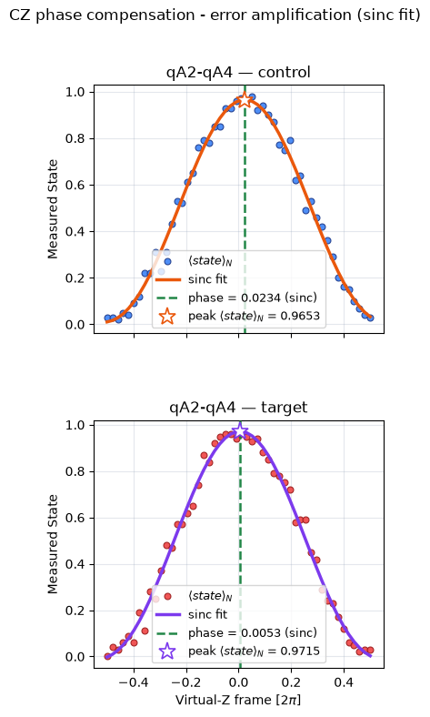
</p>

34a scans both qubits over the virtual-Z frame in the same run; the fitted peak of each cosine is the phase that gets subtracted into the frames. Here both land within 0.01 of zero, meaning the frames were already nearly correct — after a first update from a fresh gate you should expect the peaks to move to zero, not to already sit there. 34b repeats the CZ so that cosine sharpens into a sinc, fitted separately for control and target. The residual phase each fit reports is _added_ to the frame already set by 34a, so the peaks should sit closer to zero than they did before — the two panels must both converge for the node to succeed.

**Done when:** the reconstructed per-qubit phases are consistent with zero after the update. Neither node enforces a tolerance on the residual — they only require their fits to converge — so decide for yourself when the residual is small enough. At this point the pulse is a CZ; go measure it.

## Choosing the flux-pulse shape

The flux-pulse shape is a real fidelity lever — a smoother or net-zero waveform can suppress leakage and low-frequency flux noise, at the cost of more parameters to tune. **The entire chain is re-run per shape.**

[quam-builder](https://github.com/qua-platform/quam-builder) ships these flux-pulse classes (plus `SquarePulse` from QUAM):

| Class                                   | Waveform                                               |
| --------------------------------------- | ------------------------------------------------------ |
| `SquarePulse`                           | Square (unipolar)                                      |
| `FlatTopGaussianPulse`                  | Plateau with Gaussian rise and fall                    |
| `FlatTopCosinePulse`                    | Plateau with cosine rise and fall                      |
| `FlatTopBlackmanPulse`                  | Plateau with Blackman rise and fall                    |
| `FlatTopTanhPulse`                      | Plateau with tanh rise and fall (the erf-like flattop) |
| `GaussianFilteredSquarePulse`           | Square filtered by a Gaussian                          |
| `CosineBipolarPulse`                    | Cosine bipolar, net-zero                               |
| `GaussianFilteredSymmetricBipolarPulse` | Symmetric bipolar square, Gaussian-filtered, net-zero  |
| `SNZPulse`                              | Sudden net-zero (DiCarlo)                              |

The default populate in this folder currently attaches three of them as CZ macros: `cz_unipolar` (`SquarePulse`), `cz_flattop` (`FlatTopGaussianPulse`), `cz_bipolar` (`CosineBipolarPulse`). The others can be hung on a `CZGate` the same way. Every node that plays a CZ takes the shape from its `operation` parameter.

---

# 4. Verification & benchmarking

Nothing in Stages 1–4 measures gate fidelity — each node optimises its own local objective and declares success on its own fit. This chapter is where you find out whether the gate is actually good, and it is the only part that reports a fidelity.

The three tracks are independent of one another; run whichever answer you need.

```text
  35  two-qubit confusion matrix  -->  36  Bell-state tomography
  37a standard RB (reference)     -->  37b interleaved CZ RB
  38  N-qubit confusion matrix    -->  39a GHZ Z-basis  -->  39b GHZ tomography
```

The arrows are hard dependencies: the tomography nodes consume the confusion matrices for readout error mitigation, and interleaved RB is meaningless without a reference curve from the same CZ pulse.

## Readout characterisation (35, 38)

Tomography reports whatever your readout tells it, so readout error must be measured and divided out first — otherwise you will blame the CZ for SPAM error.

- [**35**, two-qubit confusion matrix](./35_two_qubit_confusion_matrix.py) — prepare all four computational basis states, read both qubits simultaneously, build the 4×4 matrix. It also computes the Kronecker product of the per-qubit matrices and the difference against the directly measured one; that difference **is** the readout crosstalk, i.e. the part that simultaneous measurement introduces and per-qubit calibration cannot see.

<p align="center">
   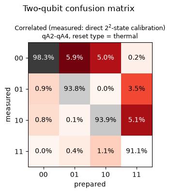
   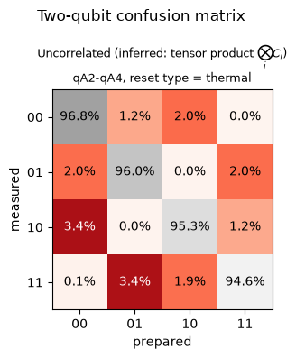
</p>

Left is the measured (correlated) matrix; right is the tensor product of the two single-qubit matrices. Where they disagree is crosstalk from reading both qubits at once.

- [**38**, N-qubit confusion matrix](./38_n_qubit_confusion_matrix.py) — the same idea for groups of 1–5 qubits. For groups of 3 or more, 39a/39b use the measured matrix for mitigation.

<p align="center">
   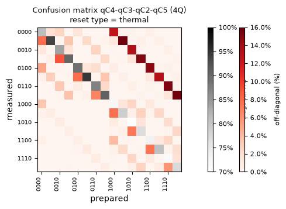
   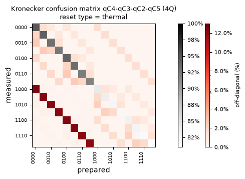
</p>

Rows are prepared states, columns measured; the diagonal is correct assignment. The dominant off-diagonal weight sits in the single-bit-flip entries, as expected from per-qubit readout error, and the reset type in the title matters because thermal reset leaves more residual excitation than active reset. Each row must sum to 1 within 0.05 or the node fails — that is a shape check on the matrix, not a verdict on readout quality.

## Two-qubit gate quality (36, 37a, 37b)

[**36**, Bell-state tomography](./36_bell_state_tomography.py) prepares a Bell state with the calibrated CZ, applies a full set of tomography rotations on both qubits, and reconstructs the density matrix. It reports **fidelity** against the target Bell state and **purity**, under two mitigation options — Kron (tensor product of per-qubit matrices) and Joint (the measured two-qubit matrix from 35). Comparing the two tells you how much of your infidelity is readout crosstalk rather than gate error. Node 35 is a **hard** prerequisite: 36 will not run without a valid two-qubit confusion matrix.

<p align="center">
   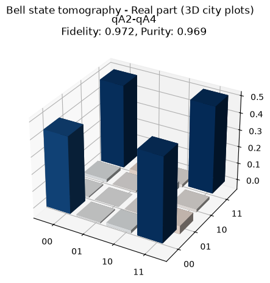
   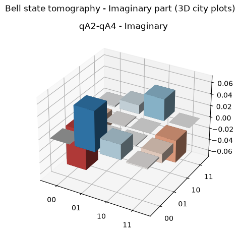
</p>

The reconstructed density matrix is shown as city plots of its real (left) and imaginary (right) parts. A Bell state puts four bars of height 0.5 at the corners of the 00/11 block and nothing else; the shortfall in those bars, and any weight appearing on 01 or 10, is your infidelity. Note the axis scales differ by roughly an order of magnitude — the imaginary part should be residual noise, so structured imaginary weight at the 00/11 corners points to an uncompensated phase and sends you back to Stage 4.

This is the fastest honest answer to "does my CZ entangle?", but it is a single-shot snapshot of one state and it folds SPAM and single-qubit gate error into the number.

[**37a**, standard RB](./37a_two_qubit_standard_rb.py) and [**37b**, interleaved CZ RB](./37b_two_qubit_interleaved_cz_rb.py) give the SPAM-insensitive answer. Random two-qubit Clifford sequences are generated offline, transpiled to a basis of single-qubit rotations plus CZ, and executed per layer; survival probability vs. depth is fit to an exponential.

- **37a** alone yields the average two-qubit **Clifford** fidelity — not the CZ fidelity, since each Clifford contains several gates.
- **37b** interleaves your CZ between random Cliffords and compares the two decay rates. The ratio isolates the **CZ gate fidelity** itself. It needs the reference decay from 37a on the same pulse; a run whose interleaved decay comes out _slower_ than the reference is rejected as unphysical.

Set a **fidelity threshold** on 37b to the CZ fidelity you are targeting. Left unset, interleaved RB will report whatever number it got as a success — it is the only quality gate the pipeline will enforce for you.

For deep or numerous sequences, stream the circuits to the OPX rather than holding them all in program memory.

**Report the interleaved number as your CZ fidelity.** Bell fidelity is the sanity check; interleaved RB is the figure of merit.

## Multi-qubit validation (39a, 39b)

Two qubits working does not mean the device works. The GHZ nodes chain CZs across multiple qubits and expose crosstalk and context-dependent error that pairwise benchmarking cannot see. Node 39a accepts groups of 3 to 5 qubits; 39b accepts 2 or more.

- [**39a**, GHZ Z-basis](./39a_ghz_z_basis.py) — prepare the GHZ state, measure populations, report the Z-basis population fidelity P(|0…0⟩) + P(|1…1⟩) after mitigation. Cheap; catches gross failures.
- [**39b**, GHZ tomography](./39b_ghz_tomography.py) — full tomography by sweeping local X/Y/Z pre-rotations, reporting fidelity and purity against the ideal GHZ state. Expensive; scales steeply with qubit count.

Both offer Kron and N-qubit mitigation, the latter using the full N-qubit matrix from node 38.

> **Topology constraint.** GHZ preparation uses a **linear CZ ladder** over the qubits in list order — it is not a general graph builder. Every consecutive pair must actually be coupled.

---

# 5. Reading results and iterating

## Symptoms and where to go back to

The diagrams above are drawn as straight lines, but calibration is a loop: you benchmark, get a number you do not like, and return to a specific stage. Use the symptom to pick the stage rather than restarting from the top.

| Symptom                                                      | Most likely cause                                      | Go back to                                                                                                  |
| ------------------------------------------------------------ | ------------------------------------------------------ | ----------------------------------------------------------------------------------------------------------- |
| No chevron fringe, or it drifts during the scan              | Flux distortion, wrong idle bias, GEF readout not good | [1Q flux-line distortions](../1Q_calibrations/README.md#flux-line-distortions-17a--17b--17c), then 02c/03b  |
| Operating point found, but CZ fidelity stays low             | Distorted flux pulse — Stages 1–4 can still converge   | [1Q flux-line distortions](../1Q_calibrations/README.md#flux-line-distortions-17a--17b--17c) (`17*`, `21*`) |
| Chevron fringe present but conditional phase never reaches π | Gate duration too short, or wrong fringe chosen        | Stage 1 (31 / 30)                                                                                           |
| Conditional phase fits, but 33b's optimum keeps moving       | Residual long-timescale distortion                     | [1Q flux-line distortions](../1Q_calibrations/README.md#flux-line-distortions-17a--17b--17c) (`17a`/`17b`)  |
| High $\vert f\rangle$ population after the gate              | Coupler amplitude off the leakage-null                 | Stage 2 (32a/32b)                                                                                           |
| Bell fidelity low but purity high                            | Coherent error — phases, not decoherence               | Stage 3 and 4 (33b, 34a/34b)                                                                                |
| Bell fidelity and purity both low                            | Decoherence or leakage                                 | Stage 2, and check T1/T2 (05, 06a)                                                                          |
| Bell fidelity much better with Joint than Kron mitigation    | Readout crosstalk, not gate error                      | Re-run 35; revisit 08a/08b                                                                                  |
| RB decay non-exponential or with a long tail                 | Leakage out of the computational subspace              | Stage 2 (32a/32b)                                                                                           |
| Interleaved RB much worse than Bell tomography suggests      | Error that only shows under repetition — drift or ZZ   | Stage 4 (34b), and check 19                                                                                 |
| Pair benchmarks well, GHZ does not                           | Crosstalk or spectator error                           | Re-run 38; check neighbour idle biases                                                                      |

Two habits that save time: re-run the **cheap** verification (35 → 36) after any retune before committing to a full RB campaign, and change **one** stage at a time so the resulting fidelity change is attributable.

### Retuning

If the CZ was working yesterday and has drifted, you do not need to restart from the chevron. Re-run the stages that are sensitive to drift:

- **Quick retune:** `33b` (error-amplified phase) → `34a` (virtual-Z) → `36` (Bell check)
- **Deeper retune:** `32a` (leakage check) → `33a` → `33b` → `34a` → `36`
- **After a cooldown or large flux change:** start from `31` (chevron) or `30` (bootstrap)

If the 1Q layer has also drifted, fix that first (see [1Q retuning](../1Q_calibrations/README.md#retuning)).

---

# 6. Project structure

| Node    | File                                                                                           | Fixed coupler | Tunable coupler | Purpose             |
| ------- | ---------------------------------------------------------------------------------------------- | :-----------: | :-------------: | ------------------- |
| **30**  | [`30_cz_iswap_flux_bootstrap.py`](./30_cz_iswap_flux_bootstrap.py)                             |       —       |        ✓        | Operating point     |
| **31**  | [`31_chevron_11_20.py`](./31_chevron_11_20.py)                                                 |       ✓       |    optional     | Operating point     |
| **32a** | [`32a_cz_leakage_amplification.py`](./32a_cz_leakage_amplification.py)                         |       —       |        ✓        | Leakage             |
| **32b** | [`32b_cz_leakage_amplification_palea.py`](./32b_cz_leakage_amplification_palea.py)             |       —       |        ✓        | Leakage (PALEA)     |
| **33a** | [`33a_cz_conditional_phase.py`](./33a_cz_conditional_phase.py)                                 |       ✓       |        ✓        | Conditional phase   |
| **33b** | [`33b_cz_conditional_phase_error_amp.py`](./33b_cz_conditional_phase_error_amp.py)             |       ✓       |        ✓        | Conditional phase   |
| **33c** | [`33c_JAZZ-N.py`](./33c_JAZZ-N.py)                                                             |       ✓       |        ✓        | Conditional phase   |
| **33d** | [`33d_JAZZ2-N.py`](./33d_JAZZ2-N.py)                                                           |       ✓       |        ✓        | Conditional phase   |
| **34a** | [`34a_cz_phase_compensation.py`](./34a_cz_phase_compensation.py)                               |       ✓       |        ✓        | Virtual-Z           |
| **34b** | [`34b_cz_phase_compensation_error_amp.py`](./34b_cz_phase_compensation_error_amp.py)           |       ✓       |        ✓        | Virtual-Z           |
| **35**  | [`35_two_qubit_confusion_matrix.py`](./35_two_qubit_confusion_matrix.py)                       |       ✓       |        ✓        | Readout model       |
| **36**  | [`36_bell_state_tomography.py`](./36_bell_state_tomography.py)                                 |       ✓       |        ✓        | Benchmark           |
| **37a** | [`37a_two_qubit_standard_rb.py`](./37a_two_qubit_standard_rb.py)                               |       ✓       |        ✓        | Benchmark           |
| **37b** | [`37b_two_qubit_interleaved_cz_rb.py`](./37b_two_qubit_interleaved_cz_rb.py)                   |       ✓       |        ✓        | Benchmark           |
| **38**  | [`38_n_qubit_confusion_matrix.py`](./38_n_qubit_confusion_matrix.py)                           |       ✓       |        ✓        | Readout model       |
| **39a** | [`39a_ghz_z_basis.py`](./39a_ghz_z_basis.py)                                                   |       ✓       |        ✓        | Benchmark (N-qubit) |
| **39b** | [`39b_ghz_tomography.py`](./39b_ghz_tomography.py)                                             |       ✓       |        ✓        | Benchmark (N-qubit) |
| **98**  | [`98_CZ_calibration_graph_tunable_couplers.py`](./98_CZ_calibration_graph_tunable_couplers.py) |       —       |        ✓        | Orchestration       |
| **99**  | [`99_CZ_calibration_graph_fixed_couplers.py`](./99_CZ_calibration_graph_fixed_couplers.py)     |       ✓       |        —        | Orchestration       |

---

# 7. Orchestrated graphs

[`99_CZ_calibration_graph_fixed_couplers.py`](./99_CZ_calibration_graph_fixed_couplers.py) — the fixed-coupler core:

```text
31 → 33a → 33b
       └→ 34a
```

[`98_CZ_calibration_graph_tunable_couplers.py`](./98_CZ_calibration_graph_tunable_couplers.py) — the tunable-coupler core:

```text
30 → 32a → 33a → 33b
             └→ 34a
```

34a runs in parallel with 33b because it only depends on 33a. Add 34b manually for finer virtual-Z tuning. Swap 32a for 32b if you want PALEA.

Not covered by any graph, and run by hand or in a custom graph:

- The **JAZZ** refinements (33c/33d).
- All of **verification and benchmarking** (35–39).

---
