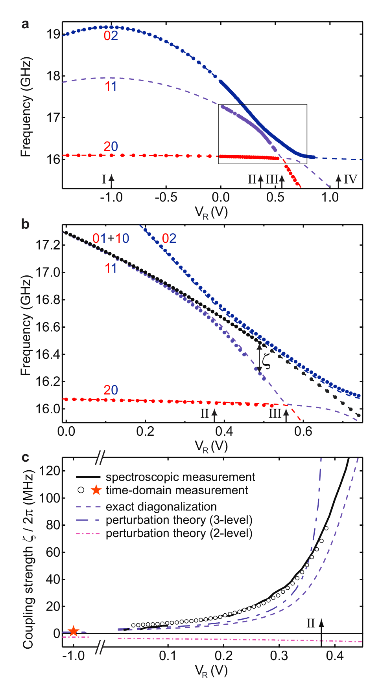
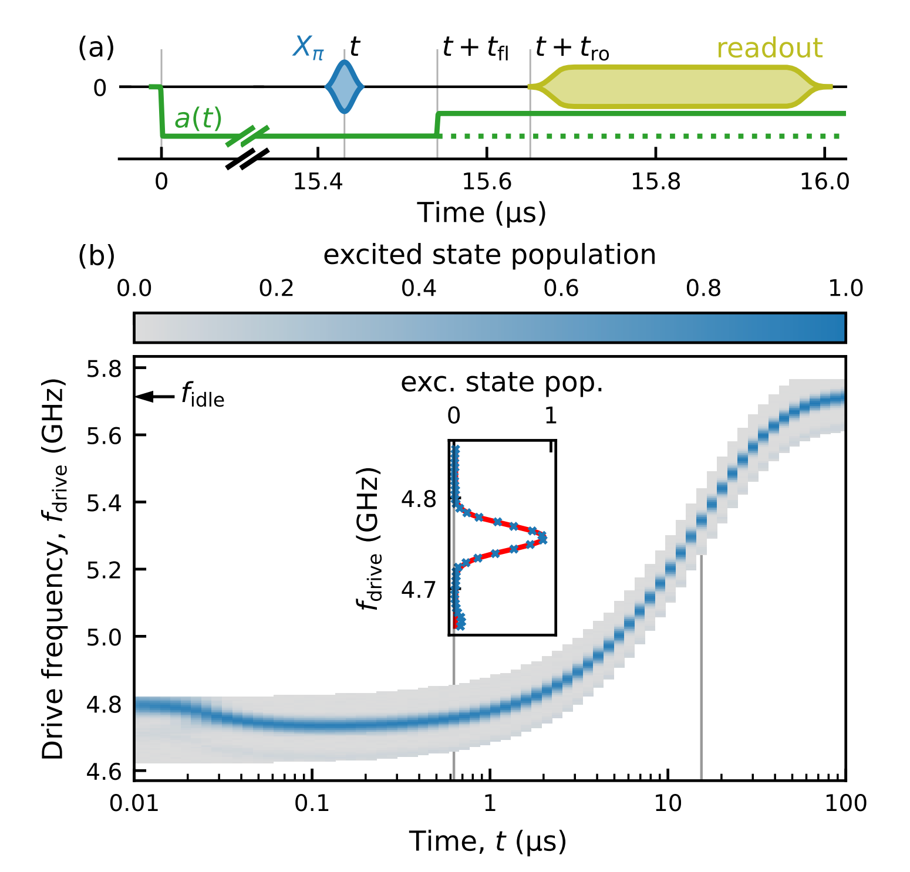
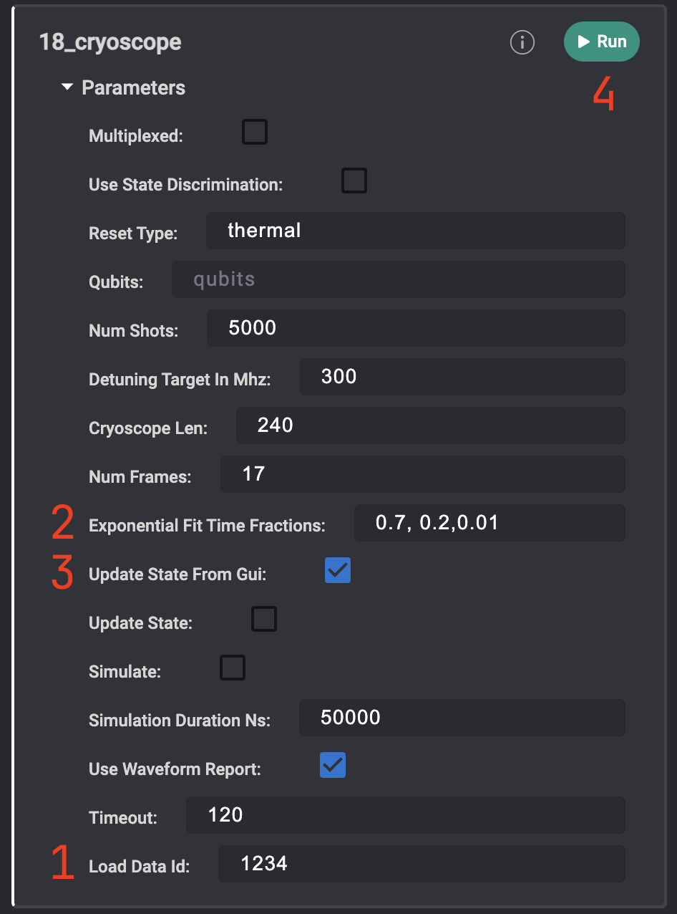
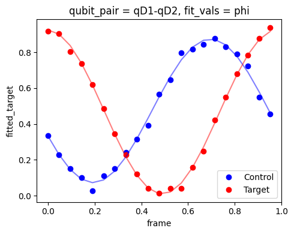
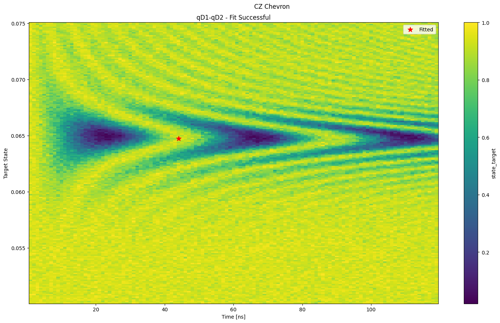
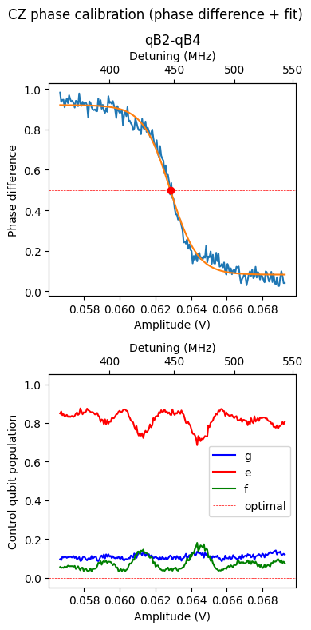
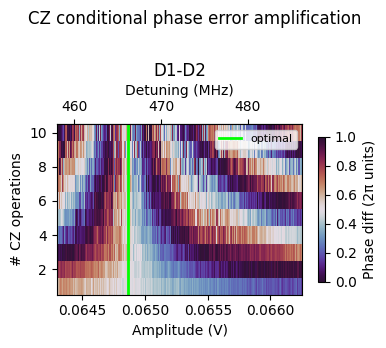

# **Controlled-Z (CZ) gate on flux-tunable transmons: calibration & benchmarking**

This folder takes a qubit pair from "the two qubits are individually calibrated" to **a CZ gate whose fidelity you have measured**. It does that in two halves:

- **Calibration (nodes 30–34).** Find the flux operating point, suppress leakage, set the conditional phase to π, and remove the residual single-qubit phases. The product is a calibrated `cz_*` macro stored in QUAM.
- **Verification (nodes 35–39).** Measure what you built — readout confusion matrices, Bell-state tomography, two-qubit randomized benchmarking, and multi-qubit GHZ states. The product is a fidelity number written back into `macros[operation].fidelity`.

Calibration without verification is unfinished: nothing in nodes 30–34 measures gate fidelity, so the benchmarking chapter is where "high fidelity" stops being an assumption.

The gate uses the **|11⟩ ↔ |20⟩** avoided crossing (state convention: |high_freq_qubit, low_freq_qubit⟩); a baseband flux pulse on the moving qubit brings the pair into the interaction region.

Hardware falls into two workflows:

| Architecture        | Coupler                                        | Two-qubit entry point                                      |
| ------------------- | ---------------------------------------------- | ---------------------------------------------------------- |
| **Fixed coupler**   | Bias fixed (no coupler flux sweep in CZ chain) | Chevron (**31**)                                           |
| **Tunable coupler** | Flux-tunable coupler + qubit Z flux            | Flux bootstrap (**30**); **31** optional (usually skipped) |

---

## Table of Contents

1. [Physics of the CZ gate](#1-physics-of-the-cz-gate)
2. [Before you start](#2-before-you-start)
3. [Calibration procedure](#3-calibration-procedure)
   - [Stage 0 — Flux-line distortions](#stage-0--flux-line-distortions)
   - [Stage 1 — Operating point](#stage-1--operating-point)
   - [Stage 2 — Leakage suppression](#stage-2--leakage-suppression)
   - [Stage 3 — Conditional phase = π](#stage-3--conditional-phase--π)
   - [Stage 4 — Single-qubit phase cleanup](#stage-4--single-qubit-phase-cleanup)
   - [Choosing the flux-pulse shape](#choosing-the-flux-pulse-shape)
4. [Verification & benchmarking](#4-verification--benchmarking)
5. [Reading results and iterating](#5-reading-results-and-iterating)
   - [What a "successful" outcome means](#what-a-successful-outcome-means)
   - [Symptoms and where to go back to](#symptoms-and-where-to-go-back-to)
6. [Node reference](#6-node-reference)
7. [What each node writes to QUAM](#7-what-each-node-writes-to-quam)
8. [Project structure](#8-project-structure)
9. [Orchestrated graphs](#9-orchestrated-graphs)
10. [References](#10-references)

---

# 1. Physics of the CZ gate

The CZ is a two-qubit entangling gate that applies a $\pi$ phase to
the $|11\rangle$ state and leaves the rest of the computational basis untouched:

$$U_\mathrm{CZ} = \mathrm{diag}(1, 1, 1, -1).$$

Equivalently, it imprints a Z on the target _conditioned_ on the control
being $|1\rangle$. Combined with single-qubit rotations it is universal, and on
flux-tunable transmons it is one of the native, highest-fidelity two-qubit
gates.

With the qubits coupled by an exchange interaction $J$, the Hamiltonian in
the ordered basis {$|20\rangle$, $|11\rangle$, $|02\rangle$} is

$$
H^{(2)} =
\begin{pmatrix}
2\omega_H + \alpha_H & \sqrt{2}\,J & 0 \\
\sqrt{2}\,J & \omega_H + \omega_L & \sqrt{2}\,J \\
0 & \sqrt{2}\,J & 2\omega_L + \alpha_L
\end{pmatrix}.
$$

The structure shows that $|11\rangle$ couples to **both** double-excitation
states, $|20\rangle$ and $|02\rangle$, each through a $\sqrt{2} J$ matrix element — the $\sqrt{2}$ coming
from the 1→2 transition of the doubly-excited transmon (the bosonic $\sqrt{2}$ of
$a^{\dagger}$). The corner entry is zero: $|20\rangle$ and $|02\rangle$ do not couple directly, only
through $|11\rangle$. Compare the single-excitation block,

$$
H^{(1)} =
\begin{pmatrix}
\omega_H & J\\
J & \omega_L
\end{pmatrix},
$$

whose off-diagonal is just $J$ — the double-excitation crossing is the
stronger one, which is why it both drives the gate and sets the dominant
leakage channel.

So in the two-excitation manifold there are two candidate partners for
$|11\rangle$:

- $|11\rangle \leftrightarrow |20\rangle$ (high-frequency qubit doubly excited)
- $|11\rangle \leftrightarrow |02\rangle$ (low-frequency qubit doubly excited)

Either realizes a CZ in principle; the choice is set by the frequency
arrangement and which qubit is fluxed. **Here we use $|11\rangle \leftrightarrow |20\rangle$.**

<p align="center">
   
</p>

The single-excitation manifold {$|10\rangle, |01\rangle$} is a separate resource:
brought to resonance ($\omega_H = \omega_L$) it exchanges excitations and realizes the
**iSWAP family**, not a CZ. It is shown only for orientation.

The resonance conditions follow from the diagonals:

- $|11\rangle \leftrightarrow |20\rangle$ at $\omega_H - \omega_L = |\alpha_H|$ (CZ operating point)
- $|11\rangle \leftrightarrow |02\rangle$ at $\omega_H - \omega_L = -|\alpha_L|$ (unused here)
- $|10\rangle \leftrightarrow |01\rangle$ at $\omega_H - \omega_L = 0$ (iSWAP)

## Mechanism

A baseband flux pulse on the moving qubit sweeps the detuning $\Delta = \omega_H - \omega_L$
toward the $|11\rangle \leftrightarrow |20\rangle$ resonance at $\Delta = |\alpha_H|$. There are two ways to spend
the resulting interaction as a conditional phase:

- **Adiabatic.** Ramp into the avoided crossing slowly enough that $|11\rangle$
  follows the lower eigenstate without ever fully populating $|20\rangle$,
  accumulating a dynamical phase along the way. Leakage-robust, but slower.
- **Diabatic.** Pulse fast to (or near) resonance and let $|11\rangle$ undergo a
  full 2π population exchange with $|20\rangle$ — out to $|20\rangle$ and back — returning
  to $|11\rangle$ with the conditional phase banked.

**This stack uses the diabatic gate.** Over the excursion, $|11\rangle$ acquires a
phase $\zeta(t)$ relative to the single-excitation states $|01\rangle$, $|10\rangle$; the gate is
calibrated so that

$$\int \zeta(t)\, dt = (2n+1)\pi, \quad n \in \mathbb{Z},$$

i.e. an _odd_ multiple of π. The residual single-qubit phases on $|01\rangle$ and
$|10\rangle$ are removed by virtual-Z compensation (node **34a**), yielding the ideal
$U_\mathrm{CZ}$ above.

### How the physics maps onto the calibration stages

Each stage below fixes one term in this picture, which is why the order matters:

| Physical quantity                       | Controlled by                        | Stage |
| --------------------------------------- | ------------------------------------ | ----- |
| Flux actually delivered to the chip     | FIR/IIR predistortion filters        | 0     |
| Detuning $\Delta$ at the interaction point | Flux-pulse amplitude & coupler bias  | 1     |
| Population left in $\|20\rangle$ (leakage) | Coupler flux-pulse amplitude         | 2     |
| $\int\zeta\,dt$ (the conditional phase) | Qubit flux-pulse amplitude           | 3     |
| Single-qubit phases on $\|01\rangle,\|10\rangle$ | Virtual-Z frame shifts          | 4     |

**Key reference:** DiCarlo et al., _Nature_ (2009), _Demonstration of Two-Qubit Algorithms with a Superconducting Quantum Processor_ (figure above).

---

# 2. Before you start

A CZ chain will happily converge onto a bad operating point if the single-qubit layer underneath it is not solid. Most "the CZ won't calibrate" problems are really one of these. Confirm all of the following on **both** qubits of the pair before running node 30 or 31.

| Requirement                    | Nodes                                                   | Why the CZ needs it                                                              |
| ------------------------------ | ------------------------------------------------------- | -------------------------------------------------------------------------------- |
| Single-qubit gates             | [`04b`](../1Q_calibrations/04b_power_rabi.py), [`10b`](../1Q_calibrations/10b_drag_calibration_180_minus_180.py), verified by [`11a`](../1Q_calibrations/11a_single_qubit_randomized_benchmarking.py) and [`20`](../1Q_calibrations/20_all_xy.py) | Every CZ node brackets the gate with x90/x180 pulses; their errors alias into the extracted phase |
| Readout + discrimination       | [`07`](../1Q_calibrations/07_iq_blobs.py), [`08a`](../1Q_calibrations/08a_readout_frequency_optimization.py), [`08b`](../1Q_calibrations/08b_readout_power_optimization.py) | All CZ nodes default to `use_state_discrimination=True`                           |
| **GEF (three-state) readout**  | [`12`](../1Q_calibrations/12_Qubit_Spectroscopy_E_to_F.py), [`13`](../1Q_calibrations/13_power_rabi_ef.py), [`14`](../1Q_calibrations/14_gef_readout_frequency_optimization.py), [`15`](../1Q_calibrations/15_iq_blobs_gef.py) | Leakage nodes **32a/32b** measure $\|f\rangle$ population and refuse to run without it; **30** (CZ mode), **31**, **33a** and **33b** also read out in GEF when state discrimination is on. 32b further needs an `EF_x180` pulse |
| Flux bias points               | [`02c`](../1Q_calibrations/02c_resonator_spectroscopy_vs_flux.py), [`03b`](../1Q_calibrations/03b_qubit_spectroscopy_vs_flux.py), [`09a`](../1Q_calibrations/09a_ramsey_vs_flux_calibration.py) | Sets the idle point and the frequency-vs-flux conversion used by **17c**          |
| XY–Z timing alignment          | [`16a`](../1Q_calibrations/16a_xyz_delay.py), [`16b`](../1Q_calibrations/16b_xy_coupler_z_delay.py) | A misaligned flux pulse truncates the interaction window                          |
| Static ZZ characterisation     | [`19`](../1Q_calibrations/19_zz_off_jazz.py)             | Always-on ZZ biases the conditional phase you are about to calibrate              |

Tunable-coupler pairs additionally need a `coupler` element with a sensible `decouple_offset` and a `macros[operation]` that defines a `coupler_flux_pulse`; the leakage and bootstrap nodes raise if it is missing.

**Role vocabulary used throughout.** The **moving qubit** is the one whose flux line is pulsed to reach the avoided crossing; the **stationary qubit** stays at its idle point. These roles are resolved from `QubitRoles` and are independent of which qubit you call control or target in the circuit sense. Because the gate rides the |11⟩↔|20⟩ crossing, the doubly-excited (leakage) qubit is always the **higher-frequency** one.

---

# 3. Calibration procedure

The whole pipeline, both architectures and both halves:

```text
  prerequisites (1Q gates, readout, GEF, flux bias points, XY-Z delay)
          |
  Stage 0 |  17a / 17b  -->  17c                      flux-line distortions
          |
  Stage 1 +-- fixed coupler ------>  31
          +-- tunable coupler ---->  30
          |
  Stage 2 |  32a  (or 32b)                            tunable coupler only
          |
  Stage 3 |  33a --> 33b  --> [33c / 33d optional]    conditional phase = pi
          |
  Stage 4 |  34a --> 34b (optional)                   virtual-Z cleanup
          |
  ========+===========================================================
          |     gate is calibrated; everything below only measures it
          |
  Stage 5 |  35 --> 36                                Bell tomography
          |  37a --> 37b                              RB reference --> CZ fidelity
          |  38 --> 39a --> 39b                       multi-qubit GHZ
```

Condensed per architecture:

| Architecture        | Calibration order                                  |
| ------------------- | -------------------------------------------------- |
| **Fixed coupler**   | `17a/17b → 17c → 31 → 33a → 33b → 34a → 34b`       |
| **Tunable coupler** | `17a/17b → 17c → 30 → 32a|32b → 33a → 33b → 34a → 34b` |

Graph [**99**](./99_CZ_calibration_graph.py) automates the fixed-coupler core (`31 → 33a → 33b → 34a`). The tunable-coupler path has no packaged graph; run it node by node or build your own.

## Stage 0 — Flux-line distortions

Room-temperature electronics and the cryostat wiring distort the flux pulse, so the waveform the qubit sees is not the one you programmed. Predistortion filters must be fitted **before** any two-qubit tuning, otherwise every amplitude you calibrate downstream is calibrated against a moving target. This applies to **both** architectures, on the **moving-qubit** flux line.

| Timescale                  | Node                                                                                                | Method                                   |
| -------------------------- | --------------------------------------------------------------------------------------------------- | ---------------------------------------- |
| Long (ns → tens of µs)     | [`17a`](../1Q_calibrations/17a_qubit_flux_long_distortion_qubitspec.py) / [`17b`](../1Q_calibrations/17b_qubit_flux_long_distortion_ramsey.py) | Qubit spectroscopy / Ramsey vs flux delay |
| Short (~1 ns resolution)   | [`17c`](../1Q_calibrations/17c_qubit_flux_short_distortion.py)                                       | Cryoscope, optional FIR                   |

### Long-timescale distortions (17a / 17b)

Detune the qubit with a flux pulse and probe its frequency with a delayed microwave pulse. Reconstruct pulse amplitude vs. time and fit exponential filters [1].

<p align="center">
   
</p>

<p align="center">
   
</p>

### Cryoscope (17c)

Sweep square-pulse duration inside a Ramsey sequence to reconstruct the pulse shape at ~1 ns resolution and fit short-timescale corrections [2]. Note that 17c consumes the frequency-to-flux conversion from **09a**, referenced by run ID rather than retyped.

<p align="center">
   
</p>

### GUI fitting (17a / 17b / 17c)

Acquire with `update_state=False`, reload by `load_data_id`, tune fit parameters in the GUI, then set `update_state_from_GUI=True` and re-run to commit filters to QUAM.

<p align="center">
   
</p>

**Done when:** the reconstructed step response is flat to within your target over the gate duration, and the fitted filters are committed to QUAM.

## Stage 1 — Operating point

Find where in flux space the interaction lives, and roughly how long and how hard to pulse. This is the coarse step; everything after it is refinement.

- **Fixed coupler → [31, Chevron](./31_chevron_11_20.py).** Prepare |11⟩ and sweep flux-pulse amplitude × duration on the moving qubit. The first chevron fringe gives the initial duration and amplitude. Writes both `flux_pulse_qubit.amplitude` and `.length` (rounded up to the hardware's 4 ns grid).
- **Tunable coupler → [30, Flux bootstrap](./30_cz_iswap_flux_bootstrap.py).** One 2D map over coupler flux and moving-qubit flux finds the idle (decouple) plateau and the first interaction fringe simultaneously. Because it returns both biases *and* the macro amplitudes, it **replaces** the coarse role of 31.

**Done when:** you can point at the fringe you intend to operate on, and the state holds a gate duration you are willing to keep fixed for the rest of the chain. Note that 31 only accepts a fitted duration between 10 ns and 1000 ns, and rejects an optimum that falls outside the swept amplitude range — so if it fails, widen the sweep before suspecting the physics.

**31 after 30?** Only if you changed macro shape or the duration is not yet set in state. Otherwise skip it.

## Stage 2 — Leakage suppression

**Tunable-coupler pairs only** — it tunes `coupler_flux_pulse.amplitude`, which fixed-coupler pairs do not have.

The |11⟩↔|20⟩ crossing that powers the gate is also the leak. Any population that finishes in |20⟩ instead of returning to |11⟩ is lost outside the computational subspace, where randomized benchmarking will later report it as an error it cannot distinguish from decoherence. Fixing it here, before the phase calibration, means Stage 3 tunes a gate that is already leakage-clean.

Both nodes prepare |11⟩, sweep coupler amplitude, repeat the CZ `n` times, and pick the amplitude that best preserves P(11). Both **require GEF readout**.

- [**32a**, standard](./32a_cz_leakage_amplification.py) — straightforward repetition, `n = 1…N`.
- [**32b**, PALEA](./32b_cz_leakage_amplification_palea.py) — adds a dynamical-decoupling layer after each CZ (EF π on the high-frequency qubit, g–e π on the low-frequency qubit) and sweeps even `n`. Reported to reach the same leakage sensitivity in roughly half the repetitions, and is more robust to ZZ over-rotation and single-qubit phase error [3].

Run one of them; 32b is the better choice when you can afford the EF pulses.

**Done when:** mean P(11) over the repetition sweep is maximised and stops improving with more repetitions. The node only verifies that the optimum is finite and inside the swept range — it sets no floor on P(11), so judge the absolute value yourself.

Both nodes hard-fail with a `ValueError` if `use_state_discrimination=False`; 32b additionally requires an `EF_x180` pulse on each high-frequency qubit for its PALEA layer.

## Stage 3 — Conditional phase = π

Now set the quantity that actually defines the gate: $\int\zeta\,dt = \pi$. The gate duration is already fixed (Stage 1), so amplitude is the knob.

1. [**33a**, conditional phase](./33a_cz_conditional_phase.py) — sweep flux-pulse amplitude and read the conditional phase out by frame tomography (rotating x90 on the stationary qubit). Take the amplitude where the phase difference crosses π, i.e. 0.5 in normalised units, from a tanh fit. On tunable couplers run this **after** Stage 2.
2. [**33b**, error amplification](./33b_cz_conditional_phase_error_amp.py) — repeat the CZ in a train so a small per-gate amplitude error accumulates into a large measurable one, then refit. This is the node that buys you the last significant figure.
3. **Optional precision refinement — JAZZ.** [**33c** (JAZZ-N)](./33c_JAZZ-N.py) and [**33d** (JAZZ2-N)](./33d_JAZZ2-N.py) insert X π refocusing pulses on both qubits, which echo away ordinary single-qubit phase (residual detuning, AC-Stark shifts) so the extracted phase is purely $\theta_{CZ} = \theta_{11}-\theta_{10}-\theta_{01}+\theta_{00}$ [4]. The echo also sweeps the control through both states inside one sequence, so you no longer need two separate conditioned runs. 33d measures both qubits in superposition jointly, which folds single-qubit gate error symmetrically into the correlator instead of dumping it on one readout, and gives a denser fringe per unit pulse count than 33c.

Both JAZZ nodes accept the full set of pulse shapes, including `cz_SNZ` and `cz_flattop_erf`, so they are the tool of choice when refining a shaped pulse.

**Done when:** the fitted conditional phase sits at π and the error-amplified scan no longer moves the optimum. Watch 33b in particular: it does not check that its optimum lies inside the swept amplitude window, so confirm that on the plot rather than relying on the outcome flag.

## Stage 4 — Single-qubit phase cleanup

A correct conditional phase still is not a CZ: the flux excursion also drags the single-qubit phases of |01⟩ and |10⟩. Those are removed in software, by shifting the virtual-Z frames, at zero time cost.

1. [**34a**, phase compensation](./34a_cz_phase_compensation.py) — prepare |++⟩, apply the CZ, reconstruct each qubit's phase, and subtract it into `phase_shift_control` / `phase_shift_target`.
2. [**34b**, error amplification](./34b_cz_phase_compensation_error_amp.py) — same objective with a train of CZs to amplify the phase error, fitting a sinc model on the N-averaged signal. Run it when 34a's residual is not small enough.

<p align="center">
  
</p>

**Done when:** the reconstructed per-qubit phases are consistent with zero after the update. Neither node enforces a tolerance on the residual — they only require their fits to converge — so decide for yourself when the residual is small enough. At this point the macro is a CZ; go measure it.

## Choosing the flux-pulse shape

Every node takes an `operation` parameter naming the CZ macro, and **the entire chain is re-run per shape**. The shape is a real fidelity lever: net-zero and SNZ-style pulses suppress leakage and low-frequency flux noise at the cost of more parameters to tune.

Coverage is not uniform across nodes, which constrains how you work:

| Shape                                               | Accepted by                                                  |
| --------------------------------------------------- | ------------------------------------------------------------ |
| `cz_unipolar` (default), `cz_flattop`, `cz_bipolar` | every node that takes an `operation`                          |
| `cz_flattop_erf`, `cz_SNZ`                          | 30, 31, 32a, 32b, 33c, 33d, 34b, 36, 37a, 37b, 39a, 39b      |

Nodes **33a**, **33b** and **34a** currently restrict `operation` to the first three shapes. To calibrate an SNZ or erf-flattop gate end to end, use the JAZZ nodes (**33c**/**33d**) for the conditional phase and **34b** for the phase compensation. Nodes **35** and **38** take no `operation` at all — they only prepare computational basis states, so no CZ is involved.

---

# 4. Verification & benchmarking

Nothing in Stages 0–4 measures gate fidelity — each node optimises its own local objective and declares success on its own fit. This chapter is where you find out whether the gate is actually good, and it is the only part that writes fidelity numbers into QUAM.

The three tracks are independent of one another; run whichever answer you need.

```text
  35  two-qubit confusion matrix  -->  36  Bell-state tomography
  37a standard RB (reference)     -->  37b interleaved CZ RB
  38  N-qubit confusion matrix    -->  39a GHZ Z-basis  -->  39b GHZ tomography
```

The arrows are hard dependencies: the tomography nodes consume the confusion matrices for readout error mitigation, and interleaved RB is meaningless without a reference curve from the same operation.

## Readout characterisation (35, 38)

Tomography reports whatever your readout tells it, so readout error must be measured and divided out first — otherwise you will blame the CZ for SPAM error.

- [**35**, two-qubit confusion matrix](./35_two_qubit_confusion_matrix.py) — prepare all four computational basis states, read both qubits simultaneously, build the 4×4 matrix. It also computes the Kronecker product of the per-qubit matrices and the difference against the directly measured one; that difference **is** the readout crosstalk, i.e. the part that simultaneous measurement introduces and per-qubit calibration cannot see.
- [**38**, N-qubit confusion matrix](./38_n_qubit_confusion_matrix.py) — the same idea for groups of 1–5 qubits, specified as dash-separated names in `qubit_groups` (e.g. `["qC4-qC3-qC2"]`). For groups of 3 or more it saves the measured matrix into the qubit-pair extras, where 39a/39b pick it up.

## Two-qubit gate quality (36, 37a, 37b)

[**36**, Bell-state tomography](./36_bell_state_tomography.py) prepares a Bell state with the calibrated CZ, applies a full set of tomography rotations on both qubits, and reconstructs the density matrix. It reports **fidelity** against the target Bell state and **purity**, under two mitigation options — `Kron` (tensor product of per-qubit matrices) and `Joint` (the measured two-qubit matrix from 35). Comparing the two tells you how much of your infidelity is readout crosstalk rather than gate error. Node 35 is a **hard** prerequisite: 36 raises a `ValueError` if `qp.confusion` is unset or fails validation.

This is the fastest honest answer to "does my CZ entangle?", but it is a single-shot snapshot of one state and it folds SPAM and single-qubit gate error into the number.

[**37a**, standard RB](./37a_two_qubit_standard_rb.py) and [**37b**, interleaved CZ RB](./37b_two_qubit_interleaved_cz_rb.py) give the SPAM-insensitive answer. Random two-qubit Clifford sequences are generated offline, transpiled to a basis set (default `['rz','sx','x','cz']`), and executed per layer via `switch_case`; survival probability vs. depth is fit to an exponential.

- **37a** alone yields the average two-qubit **Clifford** fidelity — not the CZ fidelity, since each Clifford contains several gates.
- **37b** interleaves your CZ between random Cliffords and compares the two decay rates. The ratio isolates the **CZ gate fidelity** itself. It reads the reference decay straight out of `fidelity["StandardRB_alpha"]` and raises a `KeyError` if it is absent, so 37a must have run on the same `operation`; that is also why 37a records its snapshot index in `fidelity["StandardRB_load_id"]`. A run whose interleaved decay comes out *slower* than the reference (`α > α_reference`) is rejected as unphysical.

Set **`fidelity_threshold`** on 37b to the CZ fidelity you are targeting. It defaults to `None`, and it is the only quality gate the framework will enforce for you anywhere in this pipeline.

Use `use_input_stream=True` to stream circuits to the OPX rather than holding them in program memory, for deep or numerous sequences.

**Report the interleaved number as your CZ fidelity.** Bell fidelity is the sanity check; interleaved RB is the figure of merit.

## Multi-qubit validation (39a, 39b)

Two qubits working does not mean the device works. The GHZ nodes chain CZs across multiple qubits and expose crosstalk and context-dependent error that pairwise benchmarking cannot see. Node 39a accepts groups of 3 to 5 qubits; 39b accepts 2 or more.

- [**39a**, GHZ Z-basis](./39a_ghz_z_basis.py) — prepare the GHZ state, measure populations, report the Z-basis population fidelity P(|0…0⟩) + P(|1…1⟩) after mitigation. Cheap; catches gross failures.
- [**39b**, GHZ tomography](./39b_ghz_tomography.py) — full tomography by sweeping local X/Y/Z pre-rotations, reporting fidelity and purity against the ideal GHZ state. Expensive; scales steeply with qubit count.

Both offer `Kron` and `NQ` mitigation, the latter using the full N-qubit matrix from node 38.

> **Topology constraint.** GHZ preparation uses a **linear CZ ladder** over the qubits in list order — it is not a general graph builder. Every consecutive pair in `qubit_groups` must exist as a qubit pair on the machine. For a star coupler where qD1 is the hub, write `["qD2-qD1-qD3"]` with the hub in the middle; `["qD1-qD2-qD3"]` will fail because qD2–qD3 is not a pair.

---

# 5. Reading results and iterating

## What a "successful" outcome means

Read this before trusting a green run. **With two exceptions, `node.outcomes == "successful"` means the fit converged and landed somewhere physically sensible — it does not mean the gate is good.** There is no minimum conditional-phase accuracy, no maximum leakage, and no minimum Bell or RB fidelity enforced anywhere in the calibration chain. A pair can report success at every stage and still have a mediocre CZ. The numbers are yours to read.

What each node actually checks:

| Node        | "Successful" means                                                                                                       |
| ----------- | ------------------------------------------------------------------------------------------------------------------------ |
| **30**      | Coupler sweep has ≥ 5 points and a flat region of ≥ 4 points; decouple and interaction indices are distinct and off the sweep boundary |
| **31**      | Fitted `J > 0`; derived duration satisfies 10 ns < `cz_len` < 1000 ns; `cz_amp` falls inside the swept amplitude range     |
| **32a/32b** | The P(11)-maximising amplitude is finite and inside the swept range — **no minimum P(11)**                                 |
| **33a**     | The tanh fit converges and the π-crossing amplitude is inside the swept range                                              |
| **33b**     | The optimum is finite. **Note:** unlike 33a, there is no check that it lies inside the swept range — verify this yourself  |
| **33c/33d** | The sinc fit converges inside the swept window, or a finite parabolic argmax is found as fallback                          |
| **34a**     | The oscillation fit converges for both qubits — **no tolerance on the residual phase**                                     |
| **34b**     | The sinc fit (or parabolic fallback) succeeds for *both* control and target                                                |
| **35/38**   | Every prepared-state column of the confusion matrix sums to 1 within **0.05** — a shape check, not a readout-quality check |
| **36**      | The reconstructed ρ is physical: fidelity and purity in [0, 1], \|Tr ρ − 1\| ≤ 1e-3. **Any physically valid state passes**  |
| **37a**     | A genuine fit-quality gate: decay `α ∈ (0, 1]`, `A ≥ 0`, `B ≥ 0`, `A + B ≤ 1`, fidelity in [0, 1], and max normalised residual ≤ 4σ |
| **37b**     | All of 37a's checks, plus `α ≤ α_reference` — and it is **the only node accepting a user quality gate**, via `fidelity_threshold` (default `None`) |
| **39a/39b** | The mitigated populations form a valid probability vector / ρ is normalised — no minimum GHZ fidelity                      |

Two practical consequences:

- **Set `fidelity_threshold` on 37b.** It is the only place in the whole pipeline where you can state what "good enough" means and have the framework enforce it. Left at `None`, interleaved RB will happily report a poor fidelity as a success.
- **37a also emits soft warnings that never fail the node** — survival below 0.35 at the shallowest depth, or non-monotonic decay beyond 0.03. Both usually indicate a problem worth chasing, so read the logs rather than just the outcome flag.

## Symptoms and where to go back to

The diagrams above are drawn as straight lines, but calibration is a loop: you benchmark, get a number you do not like, and return to a specific stage. Use the symptom to pick the stage rather than restarting from the top.

| Symptom                                                        | Most likely cause                              | Go back to                          |
| -------------------------------------------------------------- | ---------------------------------------------- | ----------------------------------- |
| No chevron fringe, or it drifts during the scan                | Flux distortion, or wrong idle bias            | Stage 0 (17a/17b/17c), then 02c/03b |
| Chevron fringe present but conditional phase never reaches π   | Gate duration too short, or wrong fringe chosen | Stage 1 (31 / 30)                   |
| Conditional phase fits, but 33b's optimum keeps moving         | Residual long-timescale distortion              | Stage 0 (17a/17b)                   |
| High $\|f\rangle$ population after the gate                     | Coupler amplitude off the leakage-null          | Stage 2 (32a/32b)                   |
| Bell fidelity low but purity high                              | Coherent error — phases, not decoherence        | Stage 3 and 4 (33b, 34a/34b)        |
| Bell fidelity and purity both low                              | Decoherence or leakage                          | Stage 2, and check T1/T2 (05, 06a)  |
| Bell fidelity much better with `Joint` than `Kron` mitigation  | Readout crosstalk, not gate error               | Re-run 35; revisit 08a/08b          |
| RB decay non-exponential or with a long tail                   | Leakage out of the computational subspace       | Stage 2 (32a/32b)                   |
| Interleaved RB much worse than Bell tomography suggests        | Error that only shows under repetition — drift or ZZ | Stage 4 (34b), and check 19    |
| Pair benchmarks well, GHZ does not                             | Crosstalk or spectator error                    | Re-run 38; check neighbour idle biases |

Two habits that save time: re-run the **cheap** verification (35 → 36) after any retune before committing to a full RB campaign, and change **one** stage at a time so the resulting fidelity change is attributable.

---

# 6. Node reference

## 30 — Flux bootstrap (tunable coupler only)

[`30_cz_iswap_flux_bootstrap.py`](./30_cz_iswap_flux_bootstrap.py)

2D sweep of coupler flux (around `coupler.decouple_offset`) and moving-qubit flux. Prepares |11⟩ for CZ or |10⟩ for iSWAP, selected by `cz_or_iswap`. Locates the idle plateau and the first interaction fringe.

**Goal:** coarse coupler/qubit flux operating point. Replaces 31 on tunable-coupler pairs.

## 31 — Chevron (fixed coupler; optional for tunable)

[`31_chevron_11_20.py`](./31_chevron_11_20.py)

Prepare |11⟩, sweep CZ flux-pulse amplitude and duration on the moving qubit. First chevron fringe gives the initial duration and amplitude.

<p align="center">
   
</p>

**Goal:** full π phase between control states (first yellow fringe).

## 32a / 32b — Leakage amplification (tunable coupler only)

[`32a_cz_leakage_amplification.py`](./32a_cz_leakage_amplification.py) · [`32b_cz_leakage_amplification_palea.py`](./32b_cz_leakage_amplification_palea.py)

Prepare |11⟩, sweep coupler flux-pulse amplitude, repeat the CZ, measure P(11). 32b adds PALEA dynamical decoupling and sweeps even repetition counts [3]. Both require GEF readout and a `coupler_flux_pulse` in the macro.

**Goal:** tune `coupler_flux_pulse.amplitude` to preserve |11⟩ under repeated CZ.

## 33a / 33b — Conditional phase (both workflows)

[`33a_cz_conditional_phase.py`](./33a_cz_conditional_phase.py) · [`33b_cz_conditional_phase_error_amp.py`](./33b_cz_conditional_phase_error_amp.py)

Sweep amplitude to the π conditional-phase point (0.5 in normalised units) by frame tomography; 33b repeats the gate to amplify residual amplitude error. Leakage populations are recorded for inspection when GEF readout is on, but are not part of the fit criterion.

<p align="center">
   
</p>

<p align="center">
   
</p>

**Goal:** optimal CZ amplitude in state.

## 33c / 33d — JAZZ precision amplitude (optional)

[`33c_JAZZ-N.py`](./33c_JAZZ-N.py) · [`33d_JAZZ2-N.py`](./33d_JAZZ2-N.py)

Echoed amplitude calibrations following [4] (Appendix I.1). 33c reads out the stationary qubit with `N = 4k+1` repetitions; 33d reads out both qubits jointly with `N = 2k`, giving a denser fringe and better immunity to single-qubit gate error. Both are immune to virtual-Z phase inside the macro, and both support every pulse shape.

**Goal:** fine-tune `flux_pulse_qubit.amplitude` beyond what 33b achieves.

## 34a / 34b — Phase compensation (both workflows)

[`34a_cz_phase_compensation.py`](./34a_cz_phase_compensation.py) · [`34b_cz_phase_compensation_error_amp.py`](./34b_cz_phase_compensation_error_amp.py)

|++⟩, apply CZ, reconstruct per-qubit phase, update the virtual-Z frames. 34b amplifies the residual with a train of CZs and fits a sinc model.

**Goal:** compensate the single-qubit phases acquired during the CZ.

## 35 / 38 — Readout confusion matrices

[`35_two_qubit_confusion_matrix.py`](./35_two_qubit_confusion_matrix.py) · [`38_n_qubit_confusion_matrix.py`](./38_n_qubit_confusion_matrix.py)

Prepare every computational basis state, read out simultaneously, build the confusion matrix. Both also produce the Kronecker-product reference and the difference against it, isolating simultaneous-readout crosstalk. 38 targets `qubit_groups` of 1–5 qubits and stores matrices in pair extras for 3+ qubit groups.

**Goal:** the readout error model that the tomography nodes divide out.

## 36 — Bell-state tomography

[`36_bell_state_tomography.py`](./36_bell_state_tomography.py)

Full two-qubit state tomography of a CZ-prepared Bell state. Reports fidelity and purity under `Kron` and `Joint` mitigation. Requires node 35.

**Goal:** first quantitative verdict on the entangling gate.

## 37a / 37b — Two-qubit randomized benchmarking

[`37a_two_qubit_standard_rb.py`](./37a_two_qubit_standard_rb.py) · [`37b_two_qubit_interleaved_cz_rb.py`](./37b_two_qubit_interleaved_cz_rb.py)

Offline-generated Clifford sequences transpiled to `['rz','sx','x','cz']`, truncated per depth with a recovery gate, executed per layer via `switch_case`. 37a gives average Clifford fidelity; 37b interleaves the CZ and, against the 37a reference, isolates the CZ fidelity.

**Goal:** the SPAM-insensitive CZ fidelity you quote.

## 39a / 39b — GHZ states

[`39a_ghz_z_basis.py`](./39a_ghz_z_basis.py) · [`39b_ghz_tomography.py`](./39b_ghz_tomography.py)

Linear CZ ladder over an ordered qubit group — 3 to 5 qubits for 39a, 2 or more for 39b. 39a reports Z-basis population fidelity; 39b reconstructs the density matrix from swept local X/Y/Z pre-rotations. Both support `Kron` and `NQ` mitigation, and both raise if any adjacent pair in the chain lacks the CZ macro or routes its flux pulse to the wrong Z line.

**Goal:** multi-qubit validation beyond pairwise fidelity.

---

# 7. What each node writes to QUAM

The pipeline is ordered the way it is because each node depends on the fields written before it.

| Node        | Writes to                                                                             |
| ----------- | -------------------------------------------------------------------------------------- |
| **30**      | `coupler.decouple_offset`, `qubit_pair.detuning`, `macros[op].flux_pulse_qubit.amplitude`, `macros[op].coupler_flux_pulse.amplitude` |
| **31**      | `macros[op].flux_pulse_qubit.amplitude`, `macros[op].flux_pulse_qubit.length`           |
| **32a/32b** | `macros[op].coupler_flux_pulse.amplitude`                                               |
| **33a/33b** | `macros[op].flux_pulse_qubit.amplitude`                                                 |
| **33c/33d** | `macros[op].flux_pulse_qubit.amplitude`                                                 |
| **34a/34b** | `macros[op].phase_shift_control`, `macros[op].phase_shift_target`                       |
| **35**      | two-qubit confusion matrix (node results)                                               |
| **36**      | `macros[op].fidelity["Bell_State"]` = `{Fidelity, Purity}`                              |
| **37a**     | `macros[op].fidelity["StandardRB"]`, `["StandardRB_alpha"]`, `["StandardRB_load_id"]`   |
| **37b**     | `macros[op].fidelity["InterleavedRB"]`, `["InterleavedRB_alpha"]`                       |
| **38**      | N-qubit confusion matrix → qubit-pair extras (groups of 3+)                             |
| **39a/39b** | node results only (no state update)                                                     |

Note that 34a **subtracts** the fitted phase from the existing frame while 34b **adds** its fitted residual, both modulo 1 — so 34b refines 34a rather than replacing it, and running 34b without 34a first is not meaningful.

---

# 8. Project structure

| Node    | File                                                                                 | Fixed coupler | Tunable coupler | Purpose              |
| ------- | ------------------------------------------------------------------------------------ | :-----------: | :-------------: | -------------------- |
| **30**  | [`30_cz_iswap_flux_bootstrap.py`](./30_cz_iswap_flux_bootstrap.py)                   |       —       |        ✓        | Operating point      |
| **31**  | [`31_chevron_11_20.py`](./31_chevron_11_20.py)                                       |       ✓       |    optional     | Operating point      |
| **32a** | [`32a_cz_leakage_amplification.py`](./32a_cz_leakage_amplification.py)               |       —       |        ✓        | Leakage              |
| **32b** | [`32b_cz_leakage_amplification_palea.py`](./32b_cz_leakage_amplification_palea.py)   |       —       |        ✓        | Leakage (PALEA)      |
| **33a** | [`33a_cz_conditional_phase.py`](./33a_cz_conditional_phase.py)                       |       ✓       |        ✓        | Conditional phase    |
| **33b** | [`33b_cz_conditional_phase_error_amp.py`](./33b_cz_conditional_phase_error_amp.py)   |       ✓       |        ✓        | Conditional phase    |
| **33c** | [`33c_JAZZ-N.py`](./33c_JAZZ-N.py)                                                   |       ✓       |        ✓        | Conditional phase    |
| **33d** | [`33d_JAZZ2-N.py`](./33d_JAZZ2-N.py)                                                 |       ✓       |        ✓        | Conditional phase    |
| **34a** | [`34a_cz_phase_compensation.py`](./34a_cz_phase_compensation.py)                     |       ✓       |        ✓        | Virtual-Z            |
| **34b** | [`34b_cz_phase_compensation_error_amp.py`](./34b_cz_phase_compensation_error_amp.py) |       ✓       |        ✓        | Virtual-Z            |
| **35**  | [`35_two_qubit_confusion_matrix.py`](./35_two_qubit_confusion_matrix.py)             |       ✓       |        ✓        | Readout model        |
| **36**  | [`36_bell_state_tomography.py`](./36_bell_state_tomography.py)                       |       ✓       |        ✓        | Benchmark            |
| **37a** | [`37a_two_qubit_standard_rb.py`](./37a_two_qubit_standard_rb.py)                     |       ✓       |        ✓        | Benchmark            |
| **37b** | [`37b_two_qubit_interleaved_cz_rb.py`](./37b_two_qubit_interleaved_cz_rb.py)         |       ✓       |        ✓        | Benchmark            |
| **38**  | [`38_n_qubit_confusion_matrix.py`](./38_n_qubit_confusion_matrix.py)                 |       ✓       |        ✓        | Readout model        |
| **39a** | [`39a_ghz_z_basis.py`](./39a_ghz_z_basis.py)                                         |       ✓       |        ✓        | Benchmark (N-qubit)  |
| **39b** | [`39b_ghz_tomography.py`](./39b_ghz_tomography.py)                                   |       ✓       |        ✓        | Benchmark (N-qubit)  |
| **99**  | [`99_CZ_calibration_graph.py`](./99_CZ_calibration_graph.py)                         |       ✓       |        —        | Orchestration        |

Supporting analysis modules live under [`../../calibration_utils/`](../../calibration_utils/): `cz_iswap_flux_bootstrap`, `chevron_cz`, `cz_leakage_amp`, `cz_conditional_phase`, `cz_conditional_phase_error_amp`, `cz_jazz_n`, `cz_jazz2_n`, `cz_phase_compensation`, `cz_phase_compensation_error_amp`, `two_q_confusion_matrix`, `n_qubit_confusion_matrix`, `bell_state_tomography`, `two_qubit_rb`, `ghz_z_basis`, `ghz_tomography`.

---

# 9. Orchestrated graphs

[`99_CZ_calibration_graph.py`](./99_CZ_calibration_graph.py) — `CZ_Calibration_Fixed_Couplers`, the fixed-coupler core:

```text
31 → 33a → 33b
       └→ 34a
```

34a runs in parallel with 33b because it only depends on 33a. Add 34b manually for finer virtual-Z tuning.

Not covered by any graph, and run by hand or in a custom graph:

- The **tunable-coupler** path (30 → 32a/32b → 33a → 33b → 34a), since leakage nodes are tunable-coupler only.
- The **JAZZ** refinements (33c/33d).
- All of **verification and benchmarking** (35–39).

---

# 10. References

[1] Christoph Hellings et al., _arXiv_ (2025), _Calibrating Magnetic Flux Control in Superconducting Circuits by Compensating Distortions on Time Scales from Nanoseconds up to Tens of Microseconds_

[2] Rol et al., _Appl. Phys. Lett._ (2019), _Time-domain Characterization and Correction of On-chip Distortion of Control Pulses in a Quantum Processor_

[3] Marxer et al., [arXiv:2508.16437](https://arxiv.org/abs/2508.16437) — PALEA leakage amplification

[4] [arXiv:2402.18926v3](https://arxiv.org/abs/2402.18926), Appendix I.1, Fig. 13 — JAZZ-N and JAZZ2-N protocols

[5] DiCarlo et al., _Nature_ **460**, 240 (2009), _Demonstration of Two-Qubit Algorithms with a Superconducting Quantum Processor_
