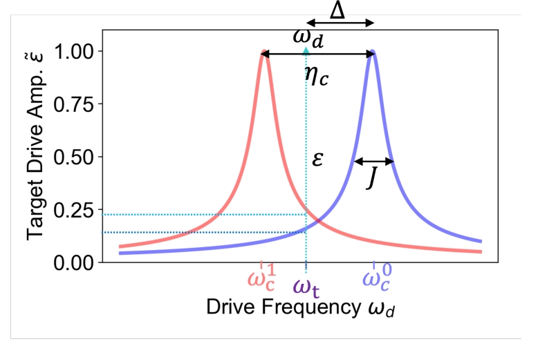

# Cross Resonance Gate on Fixed-Frequency Transmons — Calibration Overview

## Creating the QuAM State

To get started, first read both:
- the project-level [`README.md`](../../README.md)
- [`quam_config/README.md`](../../quam_config/README.md)

These documents describe the overall project structure and QuAM configuration workflow.

---

## Environment for `CrossResonance_calibrations`

Create a Python virtual environment and install the dependencies declared in
[`pyproject.toml`](../../pyproject.toml).

If the feature branch  
[`feat/add-crgate-macro`](https://github.com/qua-platform/quam-builder/tree/feat/add-crgate-macro)  
has not yet been merged into `main`, install `quam-builder` directly from that
branch by updating the corresponding dependency entry in `pyproject.toml`, for example:

```toml
"quam-builder @ git+https://github.com/qua-platform/quam-builder.git@feat/add-crgate-macro",
```

## Generating Quam State

Use the following example scripts as references:

- `quam_config/quam_examples/CrossResonance_calibrations/my_quam.py`
- `quam_config/quam_examples/CrossResonance_calibrations/generate_quam_mw_fem.py`
- `quam_config/quam_examples/CrossResonance_calibrations/populate_quam_mw_fem.py`

Based on these examples, update or implement the corresponding project-specific files:

- `quam_config/my_quam.py`
- `quam_config/generate_quam_mw_fem.py`
- `quam_config/populate_quam_mw_fem.py`

And run 

```bash
python quam_config/generate_quam_mw_fem.py
```

This command generates the following QuAM configuration files:

- `quam_state/wiring.json`
- `quam_state/state.json`


# Cross Resonance Gate
The cross-resonance (CR) gate is implemented on fixed-frequency qubit with exchange coupling $J$ by driving the control qubit at or near the resonance frequency of the target qubit ($\omega_d=\omega_t$) [1]. The figure shows the resulting drive amplitude $\tilde{\varepsilon}$ on the target qubit as a function of drive frequency $\omega_d$ [2]. The drive strength depends on the control state which gives the state-dependent interaction necessary to generate entanglement between the qubits.



This forms the basis of the cross-resonance (CR) gate, with the tuned CR gate resulting in only a ZX interaction on the qubits.


## Standard (echo) CR gate
The driven Hamiltonian is approximately [3]

$$
\frac{H_D}{\hbar} \approx \epsilon(t)\left( m\,IX - \mu\,ZX + \eta\,ZI \right),
$$

where qubit 1 (2) is the control (target), and:

- $\{I, X, Y, Z\}^{\otimes 2}$: two-qubit Pauli operators.  
- $\epsilon(t)$: drive amplitude on the control qubit.  
- $\mu \approx J/\Delta$: coupling parameter ($J$ = qubit-qubit coupling energy, $\Delta$ = frequency detuning).  
- $m$: accounts for spurious crosstalk and higher-level effects.  
- $\eta$: magnitude of Stark shift from off-resonant driving.  

The physical meaning of each term is as follows:
- $mIX$: Rabi-like oscillations of qubit 2.  
- $-\mu ZX$: slower conditional rotation of qubit 2, depending on qubit 1’s state.  
- $\eta ZI$: Stark shift on qubit 1.  

Within this picure, an ideal ZX interaction can be obtained by performing an echo protocol.


The figure shows the evolution of the qubit states depending on the control qubit state (red: $\ket{1}$, blue: $\ket{0}$) prior to the CR pulse. When applying directly a CR $\pi$ pulse (Fig. a), the resultant signals deviate rapidly due to the additional terms, which lead to poor gate fidelity. An echo scheme is implemented by a sequential CR $\pm \pi/2$ sandwiching a $\pi$ pulse on the control. This standard implementation echoed away the fast-rotating $IX$ and $ZI$ to obtain the desired $ZX$ gate.

## CR gate with cancellation pulse
However, the Hamiltonian equation in the previous section assumes a simple qubit model. In the presence of higher levels of the transmon and microwave crosstalk on the device, the complete Hamiltonian is described by [4]
$$
\hat{H}_{\mathrm{CR}} = I \otimes A + Z \otimes B,
$$
in which $A$ and $B$ are generic sum of Pauli operators. Indeed, measuring the expectation values $\langle X \rangle$, $\langle Y \rangle$, and $\langle Z \rangle$ revealed that oscillation is present for the target qubit as characterized by $A$ and $B$ depending on the state of the control qubit.

 

The Bloch vector $\|\vec{R}\|$ characterizes the distance of the target qubit state when control qubit in $\ket{0}$ and $\ket{1}$ as
$$
\|\vec{R}\| =
\sqrt{(\langle X \rangle_0 + \langle X \rangle_1)^2 +
      (\langle Y \rangle_0 + \langle Y \rangle_1)^2 +
      (\langle Z \rangle_0 + \langle Z \rangle_1)^2}.
$$
The state can be maximally entangled at $\|\vec{R}\| = 0$. While this is conceptually straightforward, the exact interaction strength of the Pauli terms depend on the system.

 

Here, we observed dominant interaction of $IX$, $IY$ and $ZX$ dependent on the CR amplitude in a measurement [4]. While others are negligible in terms of magnitude, they can still compromise the gate fidelity. More importantly, we observe the additional contribution of $IY$ and $ZY$. This is attributed to the classical crosstalk.

For an ideal CR gate, the goal is to produce only $ZX$ interaction with the rest echoed away. However, this only works for the $IX$, $ZZ$, and $ZI$ since they commute with $ZX$. As such, a calibration scheme that cancels these error is necessary. The proposed method is to apply a cancellation pulse on the target qubit [4].

 

Extending this upon the echo scheme, the evolution on the Bloch sphere shows a more circular trajectory as expected from an ideal Rabi oscillation of the ZX interaction (up to a small error).

 

## Implementation of the CR gate
Within the calibration node, we could select the `cr_type` parameter as one of the following: `direct`, `direct+cancel`, `direct+echo`, `direct+cancel+echo`. The naming of each should be self-explanatory. For example, `direct+cancel+echo` implied that a CR pulse (on control qubit) and cancellation pulse (on target qubit) is implemented with echo. Here, we will describe the full calibration scheme for the `direct+cancel+echo` CR gate.


## Calibration node

Here, we describe the protocols implemented in each node.

`30_CR_time_rabi_QST`
While this is not a calibration node, the node measures the evolution of $\langle X \rangle$, $\langle Y \rangle$ and $\langle Z \rangle$ with respect to the CR drive duration. The interaction strength of the two Pauli gates (see <a href="#CR_cancel">figure</a> for reference) are calculated. The analysis used here is used for the rest of the nodes.

`31a_CR_hamiltonian_tomography_vs_cr_drive_amp`
Is used to determine the required CR drive amplitude to achieve the desired $ZX$ interaction strength.


`31b_CR_hamiltonian_tomography_vs_cr_drive_phase`
The CR drive phase is optimized to $\phi_0$ in which the $ZX$ component is maximized and $ZY$ is zero. $\phi_1$ is also obtained which minimizes $IY$.

 

<!-- `31c_CR_hamiltonian_tomography_vs_cr_cancel_phase`
The ideal cancellation phase is $\phi_0-\phi_1$, but we manually scan the phase. -->

`31d_CR_hamiltonian_tomography_vs_cr_cancel_amp`
For the calibrated phases, an optimized cancellation amplitude can lead to the interaction strength zero crossing of the other components.

 

`31e_CR_correction_phase`
Calibrates and applies per-gate virtual-Z updates to cancel residual Z-type phases on the control and target qubits (from Stark shifts, ZZ/ZI/IZ byproducts, etc.) accumulated during the CR block.

## References

[1] A simple all-microwave entangling gate for fixed-frequency superconducting qubits https://arxiv.org/abs/1106.0553

[2] Investigating Microwave-Activated Entangling Gates on Superconducting Quantum Processors https://escholarship.org/uc/item/5sp8n6st

[3] Process verification of two-qubit quantum gates by randomized benchmarking https://arxiv.org/abs/1210.7011

[4] Procedure for systematically tuning up crosstalk in the cross resonance gate https://arxiv.org/pdf/1603.04821
