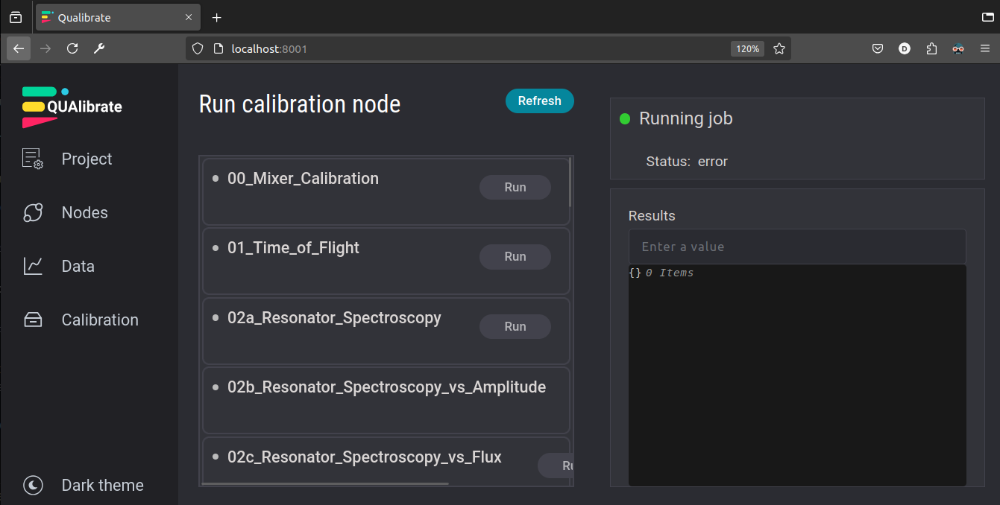
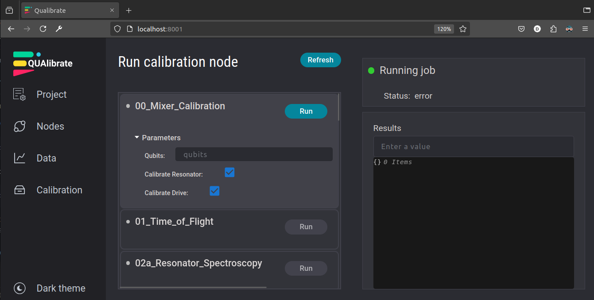
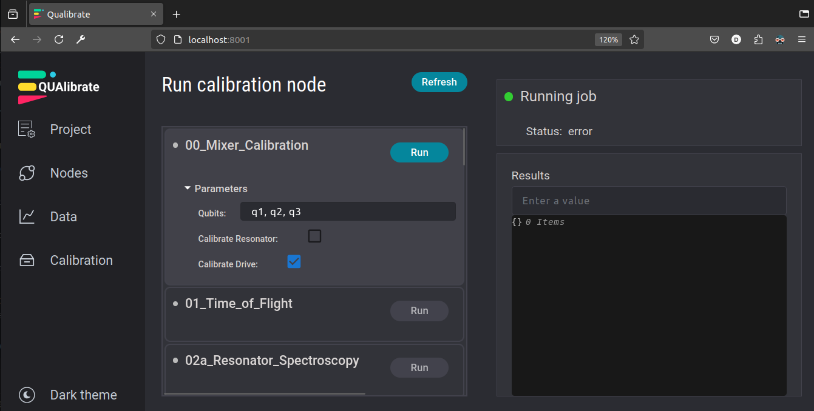
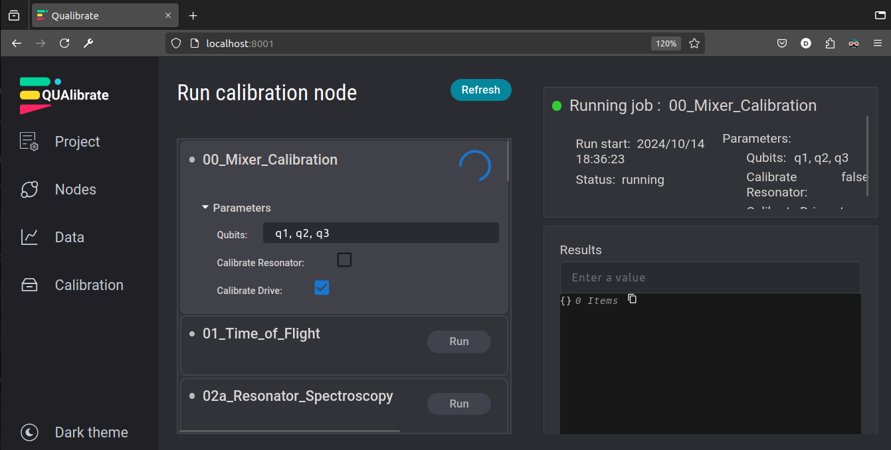

# Calibration Node & Graph Overview

This document provides an overview of the calibration nodes and the concept of calibration graphs within the QUAlibrate framework used in this project.

## Collection of Calibration Nodes

The `calibrations` directory contains a collection of standardized Python scripts, each representing a **Calibration Node**. Think of each node as a single, well-defined step in the overall process of calibrating and characterizing qubits or other quantum elements.

A typical calibration node performs the following workflow:

1.  **Loads QUAM State:** Reads the current state of the quantum machine configuration (QUAM).
2.  **Executes QUA Program:** Runs a specific QUA sequence tailored to the calibration task (e.g., spectroscopy, Rabi, T1).
3.  **Performs Analysis:** Processes the acquired data and performs fitting or other analysis to extract relevant parameters.
4.  **Updates QUAM State:** Based on the analysis, it proposes changes to the relevant QUAM parameters (e.g., updating a frequency, amplitude, or duration).
5.  **Saves Results:** Persists the input parameters, raw/processed data, analysis results, generated plots, and the proposed QUAM state updates for review and tracking.

## Relevant QualibrationNode properties

Each calibration script instantiates a `QualbirationNode` close to the top of the script. Here we note the most relevant properties and methods.

### `QualibrationNode` attributes

- **`node.machine`**: The QUAM root-level object, typically loaded as follows:
  ```python
  from quam_config import Quam
  node.machine = Quam.load()
  ```
  This step is optional, if it is omitted, the QUAM state won't be saved in the data folder when calling `node.save()`.
- **`node.modes`**: A collection of different modes in which the node is used.  
  For example, the node may be run from the web app (`modes.external is True`), or directly through the IDE (`modes.interactive is True`).
- **`node.name`**: The unique name of the `QualibrationNode`, typically matches the filename.
- **`node.namespace`**: A shared container for any variables that need to be accessed by multiple node actions.
  An example is the QUA program, which is created in the action `create_qua_program`, but then used by other actions `simulate` and `execute_qua_program`.
- **`node.outcomes`**: The node outcome per qubit (target).  
  Each value is either "successful" or "failed".
  This is used when the node is run as a calibration graph to determine what the next action should be.
- **`node.parameters`**: An instance of the `NodeParameters`, which are specific to the calibration node.  
  The parameters typically include the parameter `qubits`, which are referred to as the _node targets_.
- **`node.results`**: A dictionary containing all the results that should be saved.  
  This can include values, numpy arrays, Xarray data arrays or datasets, and matplotlib figures.

### `QualibrationNode` methods

- **`node.copy()`**: Create an identical copy of the node, useful when the node is defined as part of a graph.  
  Additional node parameters can be passed, which can override the default parameters.
- **`node.log()`**: Emit a log message with additional metadata to clarify what node emitted the log message.
- **`node.run_action()`** Define a node action through the decorator `@node.run_action`.  
  This is followed by the action's function. The function is immediately executed after its definition.
- **`node.save()`**: Save all the contents of the `QualibrationNode` into a data folder.  
  This includes the parameters, results, outcomes, and the QUAM state if specified.

## Node Anatomy Explained

For a detailed breakdown of the internal structure of a typical calibration node, please refer to the [Anatomy of a QualibrationNode](./node_anatomy.ipynb) document. It dissects the `02a_resonator_spectroscopy.py` node section by section, explaining the purpose of the common components like imports, initialization, run actions (`@node.run_action`), QUA program creation, data handling, analysis, state updates, and saving.

## Extending the Calibration Library

You can easily extend this library by adding your own custom calibration nodes. To ensure compatibility and maintainability, new nodes should follow the same standardized structure and conventions outlined in the "Resonator Spectroscopy Node Explained" document. This includes:

- Using the `# %%` separators for code cells.
- Defining parameters in a separate `Parameters` class (usually imported).
- Structuring the workflow using functions decorated with `@node.run_action`.  
  It is recommended to implement the same actions as those defined in the other calibration nodes
- Loading and interacting with the `QUAM` object.
- Using `node.results`, `node.outcomes` for storing outputs.
- Using `with node.record_state_updates():` for proposing QUAM changes.
- Calling `node.save()` at the end.

## Creating a Calibration Graph

While individual nodes can be run standalone or via the QUAlibrate UI for specific tasks, their real power comes from combining them into a **Calibration Graph**. A graph defines a sequence (or parallel execution) of nodes to perform a more complex calibration routine automatically.

Creating a typical calibration graph involves:

1.  **Define Paraemters:** Typically the only relevant parameter is the targets type, e.g. `qubits`
2.  **Specifying Nodes:** Define which nodes will be used in the graph
3.  **Connecting Nodes:** Defining the execution order by defining connections between nodes.
4.  **Create the Graph:** Pass these parameters to create a `QualibrationGraph` instance

Calibration graphs allow for robust, automated calibration sequences that can adapt based on intermediate results. For a more detailed explanation of graph components, dependencies, and advanced features, please refer to the [Anatomy of a Calibration Graph](./graph_anatomy.ipynb) document.

## Running Calibration Nodes and Graphs

There are two primary ways to execute calibration nodes and graphs:

### Running via IDE / Standalone

Each calibration node script is designed to be runnable as a standalone Python file. The use of `# %%` separators allows you to treat the script like a Jupyter Notebook in compatible IDEs (such as VS Code with the Python/Jupyter extensions). You can run the script section by section (cell by cell) within an interactive kernel.

This workflow is ideal for development and debugging:

- Execute cells sequentially to understand the flow.
- Inspect variables and data structures after each step.
- Modify code within a cell and re-run only that cell.
- Test individual components (like QUA program generation, analysis functions) in isolation.

### Running via QUAlibrate Frontend

The QUAlibrate frontend (web UI) is designed for running stable, well-tested calibration nodes and graphs, particularly when you primarily need to adjust input parameters rather than modify the code itself.

- **Automatic Discovery:** Any calibration node script placed within the `calibrations` folder that follows the standard structure (including `QualibrationNode` instantiation) will automatically be discovered and made available in the QUAlibrate UI.
- **Launching the UI:** Start the QUAlibrate web application by running the command `qualibrate start` in your terminal within the correct environment. This launches a local web server.
- **Accessing Nodes/Graphs:** Open the provided URL (usually `http://localhost:8001` or similar) in your browser. The UI will list all discovered calibration nodes and saved calibration graphs.
- **Execution:** Select the desired node or graph, modify its input parameters through the UI form, and click "Run" to execute it. The UI will display progress, results, plots, and any proposed state updates for review.

3. Open http://localhost:8001/ on your browser:
   
4. Select the node you would like to run:
   
5. Change the input parameters to your liking:
   
6. Press "Run":
   
