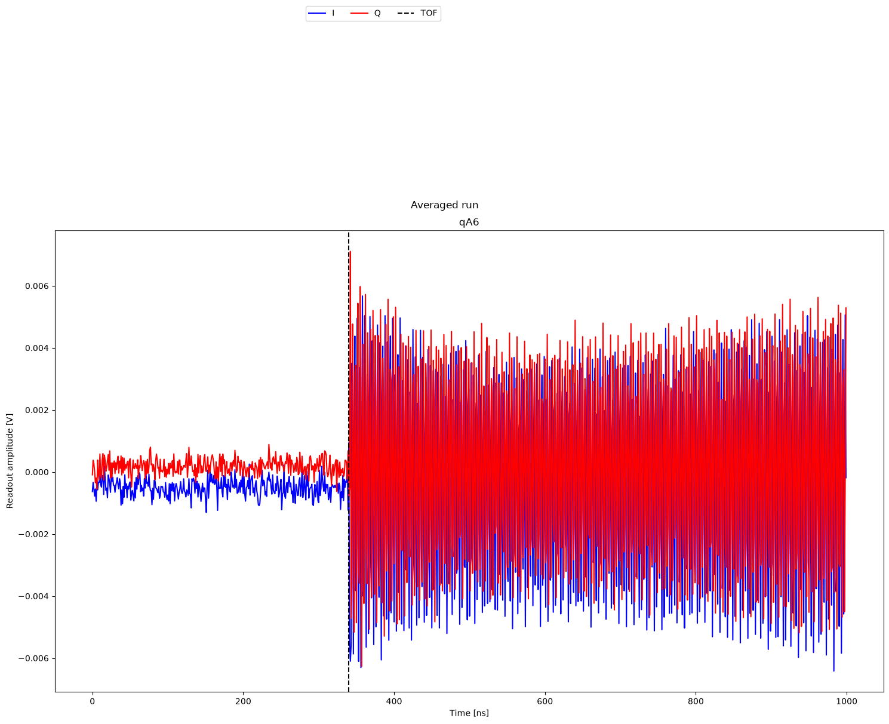

# Time of Flight (MW-FEM)

[`01b_time_of_flight_mw_fem.py`](../../../../../calibrations/1Q_calibrations/01b_time_of_flight_mw_fem.py) · **Targets:** qubits · **Category:** 1Q_calibrations

Sends a readout pulse, captures the raw ADC trace, and fits the pulse arrival time for MW-FEM readout hardware — the MW-FEM counterpart of `01a_time_of_flight`, with no analog-input offset correction and dBm-based power control.

{ .calibration-result }

## Purpose

Same underlying need as `01a_time_of_flight`: the OPX's acquisition window must be shifted by the fixed propagation/processing delay between issuing a readout pulse and the reflected signal arriving at the digitizer, or every subsequent demodulated measurement integrates over the wrong window. This is conceptually the same correction as the propagation-delay term $\tau_v$ in a fitted resonator $S_{21}$ (Eq. 51, **[GRTW2021]**, p. 21) — measured directly here from a raw ADC trace rather than as a byproduct of a frequency-sweep fit.

**Use this node instead of `01a_time_of_flight` if the readout chain is MW-FEM hardware**, not OPX+/LF-FEM. Three concrete differences follow directly from that hardware distinction:

- **Power is specified in dBm, not volts.** MW-FEM resonator channels expose `set_output_power(power_in_dbm, ..., operation="readout")`, which adjusts the channel's `full_scale_power_dbm` (in 3 dB steps) and the pulse's amplitude together to hit the target dBm exactly — a fundamentally different knob than `01a`'s `readout_amplitude_in_v`, which just sets a pulse amplitude in volts against a fixed full-scale range.
- **No analog-input DC-offset calibration.** `01a` measures and corrects `opx_input_I.offset`/`opx_input_Q.offset` because the OPX+/LF-FEM path has separate analog I and Q inputs, each with its own residual offset. The MW-FEM path digitizes a single RF input and demodulates digitally into real/imaginary components (`stream.real()`/`stream.image()` in the QUA program, rather than `input1()`/`input2()`) — there is no equivalent per-channel analog offset to fit or write back here.
- **Time-of-flight-only state update.** Because there's no offset fit, this node's `update_state` writes only `qubit.resonator.time_of_flight` — nothing else.

## Mechanism

`create_qua_program` (`calibrations/1Q_calibrations/01b_time_of_flight_mw_fem.py`):

1. For each qubit's `resonator`, wrap it in `tracked_updates(resonator, auto_revert=False, dont_assign_to_none=True)`. Unlike `01a`, the TOF override here is applied under an **explicit `if time_of_flight_in_ns is not None` guard** — but since this node's default is `28` (not `None`), the guard is true by default, so **every default run overrides `time_of_flight` to 28 ns before measuring** (contrast with `01a`, where the default `None` leaves the existing configured TOF untouched for the measurement). `readout_length_in_ns` is always applied (default 1000). Power is set via `resonator.set_output_power(readout_amplitude_in_dBm, operation="readout")` rather than a plain amplitude assignment.
2. For each batch of qubits, loop `num_shots` times; for each qubit, `reset_if_phase(qubit.resonator.name)`, then `qubit.resonator.measure("readout", stream=adc_st[i])` to capture the raw ADC trace, then wait `node.machine.depletion_time`. (Note: unlike `01a`, there is no `align()` immediately before the shot loop in the batch — only the `align()` at the end of each shot — a minor structural difference that doesn't change the calibration's meaning.)
3. Stream processing branches on `qubit.resonator.opx_input.port_id` (`1` → `input1()`, else `input2()`) and uses `.real()`/`.image()` demodulation rather than the raw `input1()`/`input2()` pair used in `01a` — reflecting the single-RF-input MW-FEM digitization path. Both shot-averaged (`adcI{n}`/`adcQ{n}`) and single-last-shot (`adc_single_runI{n}`/`adc_single_runQ{n}`) traces are streamed per qubit, same as `01a`.

Analysis (`calibration_utils/time_of_flight_mw/analysis.py`) — identical pulse-edge detection to `01a`, but with no offset fit at all:

1. `process_raw_dataset`: convert raw ADC counts to volts (`-adc / 2**12`), compute `IQ_abs = sqrt(I² + Q²)`.
2. `fit_raw_data`: Savitzky–Golay-filter `IQ_abs` (window 11, order 3); compute a threshold as the midpoint between head and tail trace means; find the first threshold crossing and round to the nearest 4 ns (`delay`, i.e. `tof_to_add`).
3. Success requires only that `delay` is not NaN — there is **no offset magnitude check** here (contrast with `01a`'s additional `|offset| < 0.5 V` requirement), simply because no offset is computed in this variant.
4. `FitParameters` for this node has exactly two fields: `tof_to_add` and `success` — no `offset_I_to_add`/`offset_Q_to_add`, confirmed by `calibration_utils/time_of_flight_mw/analysis.py:12-16`.

## Prerequisites

- QUAM initialized (`quam_config/populate_quam_state_*.py`), per the node's own docstring.
- MW-FEM readout hardware — this node's sibling, `01a_time_of_flight`, is the OPX+/LF-FEM equivalent; pick whichever matches the actual hardware.
- Mixer calibration is not a prerequisite in the Octave sense (MW-FEM has no Octave upconverter to calibrate via `01a_mixer_calibration`), but the resonator's configured LO/upconverter frequency should already be sensible.

## Parameters

Inherits the common parameter set — see [Common node parameters](_common_parameters.md) — plus the node-specific parameters below (`calibration_utils/time_of_flight_mw/parameters.py`).

| Parameter | Type | Default | Unit | Description | Effect |
|---|---|---|---|---|---|
| `num_shots` | `int` | 100 | – | Averages per qubit for the averaged trace. | More shots reduce noise on the shot-averaged trace used for the pulse-edge fit; the single-run trace (visualization only) is unaffected. |
| `time_of_flight_in_ns` | `Optional[int]` | 28 | ns | TOF override applied before this run **and** the baseline the fitted correction is added to. | Default `28` means every default run **replaces** `time_of_flight` with `28 + tof_to_add` on success (not an increment) — pass `None` explicitly to instead increment the existing configured value, matching `01a`'s default behavior. |
| `readout_amplitude_in_dBm` | `Optional[float]` | -12 | dBm | Target readout output power, applied via `resonator.set_output_power(...)`. | Higher power improves SNR on the pulse edge but risks saturating the ADC or the MW-FEM's own output stage; the underlying `full_scale_power_dbm` is only adjustable in 3 dB steps, so very fine power tuning is quantized at the hardware level. |
| `readout_length_in_ns` | `Optional[int]` | 1000 | ns | Override of `resonator.operations["readout"].length`, and the extent of the acquisition window. | Must be long enough to show a clean baseline before the pulse and a settled plateau after it, or the threshold/edge-detection fit degrades. |

> **Docstrings here are accurate**, unlike `01a_time_of_flight`'s: the docstring defaults for `time_of_flight_in_ns` (28 ns), `readout_amplitude_in_dBm` (-12 dBm), and `readout_length_in_ns` (1000 ns) all match `calibration_utils/time_of_flight_mw/parameters.py`'s actual field defaults exactly — no correction needed.

## Outputs

**Measured:** per-qubit averaged and single-shot raw ADC traces (`adcI`/`adcQ`, `adc_single_runI`/`adc_single_runQ`, in volts) over the `readout_time` axis, plus `IQ_abs`.

| Fitted quantity | Unit | Written to state? | Description |
|---|---|---|---|
| `tof_to_add` | ns | ✅ | Threshold-crossing time of the pulse edge in the acquired trace, rounded to the nearest 4 ns. |

**Success criterion:** `delay` (i.e. `tof_to_add`) is not NaN. Checked per-qubit in `fit_raw_data`. No offset-magnitude check exists in this variant (contrast with `01a`).

## State Updates

`update_state` first **reverts** the temporary TOF/length/power overrides applied in `create_qua_program` (`tracked_resonator.revert_changes()`), then:

| Attribute | New value | Mode | Condition |
|---|---|---|---|
| `qubit.resonator.time_of_flight` | `time_of_flight_in_ns + tof_to_add` | **replace** | outcome successful **and** `time_of_flight_in_ns` was not `None` — true by default (28) |
| `qubit.resonator.time_of_flight` | previous value `+ tof_to_add` | **increment (`+=`)** | outcome successful **and** `time_of_flight_in_ns` was explicitly passed as `None` |

No other QUAM attribute is touched — there is no offset write here at all, matching the node's own docstring's "State update:" section, which lists only `qubit.resonator.time_of_flight` (`calibrations/1Q_calibrations/01b_time_of_flight_mw_fem.py:44-45`).

## Troubleshooting

See also: [General troubleshooting](_general_troubleshooting.md#general-troubleshooting) for issues common to most nodes in this library. Below are issues specific to this node.

1. **Pulse edge is visible but the fitted `tof_to_add` looks systematically early/late by exactly a few ns** → the fit rounds to the nearest 4 ns (`np.round(delay / 4) * 4`), which is a granularity limit, not a bug; don't expect sub-4-ns precision from this node regardless of SNR.
2. **You expected an analog-input DC offset correction and it's not there** → this node genuinely does not calibrate one; the MW-FEM path has no separate analog I/Q inputs to correct (see Purpose). If you're seeing a real baseline offset problem on MW-FEM hardware, it isn't addressed by this node at all — look at MW-FEM-specific gain/offset settings outside this calibration.
3. **You're unsure which of `01a_time_of_flight`/`01b_time_of_flight_mw_fem` to run** → check the QUAM resonator's channel type: OPX+/LF-FEM resonators have separate `opx_input_I`/`opx_input_Q` analog inputs (use `01a`); MW-FEM resonators have a single `opx_input` with a `port_id` (use `01b`, this node). Running the wrong one for the hardware either fails outright (missing attribute) or silently calibrates nothing meaningful.
4. **Downstream nodes show a systematically wrong readout right after this node reports success** → confirm the *reverted* readout pulse length/power actually configured after `update_state` runs matches your intended real-measurement settings — this node's own overrides during the TOF measurement (tuned for a clean edge fit, not for real readout SNR) are explicitly not what persists; only `time_of_flight` itself does.

## Parameter Tuning Heuristics

See also: [General parameter tuning heuristics](_general_troubleshooting.md#general-parameter-tuning-heuristics) for guidance common to most nodes in this library. Below is guidance specific to this node.

1. **Repeated default runs don't converge the way you'd expect (`time_of_flight` doesn't seem to accumulate a correction, or jumps back to ~28 ns territory every time)** → this is the default-`28`-vs-default-`None` distinction: with `time_of_flight_in_ns` left at its default `28`, every successful run **replaces** `time_of_flight` with `28 + tof_to_add`, discarding whatever value was there before. If you intend to iteratively refine an existing calibrated TOF, pass `time_of_flight_in_ns=None` explicitly to switch to increment mode.
2. **Fit fails (`success=False`) with no obvious reason in the trace** → since this variant has no offset-magnitude success gate, a `False` outcome here means `tof_to_add` itself came out NaN — almost always because the Savitzky–Golay-filtered trace never crosses the computed threshold (e.g. the pulse never rises clearly above baseline). Increase `readout_amplitude_in_dBm` and/or `readout_length_in_ns` and re-run.
3. **Raising `readout_amplitude_in_dBm` doesn't seem to produce a proportionally cleaner edge, or the trace looks quantized/stepped** → `set_output_power` on the MW-FEM path adjusts `full_scale_power_dbm` in 3 dB steps and then scales the pulse amplitude to hit the exact target within that step; near a full-scale boundary, a small dBm change can force a step change in the underlying gain rather than a smooth amplitude change. Try values a few dB away from suspected step boundaries if behavior seems discontinuous.

## Next Steps

Not part of the automated bring-up calibration graphs (both `80_calibration_graph_bringup_flux_tunable_transmon.py` and `90_calibration_graph_bringup_fixed_frequency_transmon.py` start at `02a_resonator_spectroscopy`) — this is a manual pre-flight step for MW-FEM hardware. Next: `02a_resonator_spectroscopy`, which is the first node in both bring-up graphs and depends on a correctly time-aligned readout.

## References

**[GRTW2021]** Y. Y. Gao, M. A. Rol, S. Touzard, and C. Wang, "Practical guide for building superconducting quantum devices," *PRX Quantum*, vol. 2, p. 040202, 2021.
