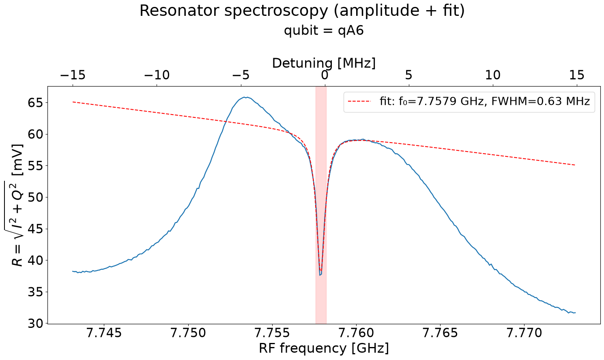

# Resonator Spectroscopy

[`02a_resonator_spectroscopy.py`](../../../../../calibrations/1Q_calibrations/02a_resonator_spectroscopy.py)

Sweep the readout frequency to find the resonator resonance used for dispersive measurement.

## Purpose

The readout resonator appears as a dip (or peak) in reflected power when the probe frequency matches $\omega_r$. Finding this frequency is required before any qubit spectroscopy or state measurement, because all later readout is performed near this line.

{ .calibration-result }

## Prerequisites

- Mixer calibration completed (node 01a_mixer_calibration).
- Time of flight calibrated (node 01a_time_of_flight or 01b_time_of_flight_mw_fem).
- Readout pulse amplitude and length defined in the machine configuration.

## (Chosen) Input Parameters Effect

* Frequency:
    * Span — must bracket the resonance; too narrow a band may miss the line entirely.
    * Step — finer steps improve frequency accuracy at the cost of longer execution time.
* Averaging:
    * Number of shots — reduces noise on the fit but does not shift the resonance position.

## Output

* Resonator resonance frequency.
* Updated readout tone frequency in the machine configuration.

## Experiment Step-by-Step description

1. For each readout frequency in the sweep:
    1. Tune the readout tone to the trial frequency.
    1. Send a readout pulse and demodulate the response.
    1. Record amplitude and phase.
1. Fit a Lorentzian to the amplitude data.
1. Set the readout frequency to the fitted resonance.
