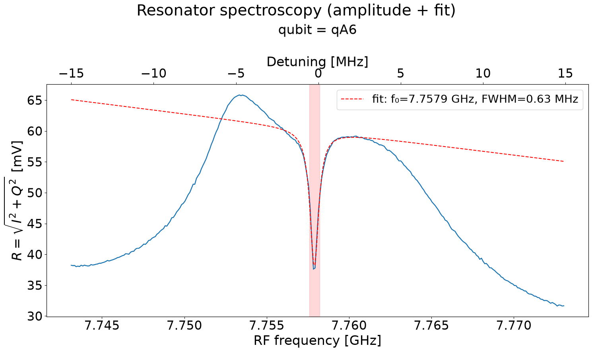

# Resonator Spectroscopy

[`02a_resonator_spectroscopy.py`](../../../../../calibrations/1Q_calibrations/02a_resonator_spectroscopy.py) · **Targets:** qubits · **Category:** 1Q_calibrations

1D sweep of the readout-tone frequency to locate the resonator resonance used for all subsequent dispersive readout.

## Purpose

Superconducting qubits are read out indirectly: a linear readout resonator is coupled dispersively to the qubit, and the qubit's state is inferred from how it pulls the resonator's response **[BGGW2021]**. Before any of that is possible, the bare resonance frequency of that resonator must be located. This node sweeps the readout tone's frequency over a narrow band and measures the demodulated response, which traces out a dip (or peak) in reflected/transmitted amplitude centered on the resonance — a Lorentzian lineshape to first order.

Because this is one of the very first nodes run on a fresh device, the signal at this stage can be weak or noisy: none of the pulse amplitudes, mixer corrections, or amplification chain have been tuned yet. A well-known technique for this bring-up stage is to drive the resonator in the **high-power ("bright-state") limit**, where the resonator is populated with enough photons that its response is dominated by its own bare frequency $\omega_R$ regardless of the qubit's state — this gives a easy-to-find, qubit-independent landmark. Repeating the same sweep at low power (few photons) instead reveals the **qubit-state-dependent "dressed" frequency** $\tilde\omega_R$, shifted from $\omega_R$ by the dispersive shift $\chi$ **[GRTW2021]**. Critically, comparing the two regimes is itself a diagnostic: if the fitted resonance does *not* move between the high-power and low-power sweeps, the resonator being probed is likely not the one dispersively coupled to the qubit of interest **[GRTW2021]**. This node performs a single fixed-power sweep (whatever amplitude is configured on the resonator's `"readout"` operation) — it does not itself vary power (see `02b_resonator_spectroscopy_vs_power` for that), so which regime you land in depends entirely on how that pulse's amplitude happens to be configured at the time this node runs.

{ .calibration-result }

## Mechanism

For each readout-frequency detuning in the sweep, for every (batched) qubit:

1. Initialize the flux point (`node.machine.initialize_qpu`) for all batched qubits, then `align()`.
2. Update the resonator's intermediate frequency to `df + rr.intermediate_frequency` (`rr.update_frequency`).
3. Measure the resonator (`qubit.resonator.measure("readout", ...)`) and save `I`/`Q`.
4. Wait for the resonator to deplete (`rr.wait(rr.depletion_time)`) before the next average.

Notably, **no qubit drive and no reset (thermal or active) is performed at any point** — the qubit is left in whatever state it naturally settles to between readout pulses. This is purely a resonator-side sweep.

Analysis (`process_raw_dataset` / `fit_raw_data` in `calibration_utils/resonator_spectroscopy/analysis.py`):

1. Convert `I`/`Q` to volts, compute amplitude (`IQ_abs`) and unwrapped phase, with a linear-slope subtraction applied to phase (`add_amplitude_and_phase`, `subtract_slope_flag=True`) to remove the group-delay/cable-length ramp otherwise obscuring the resonance in phase.
2. Locate the single most prominent peak or dip in `IQ_abs` vs. detuning (`peaks_dips`, default `prominence_factor=5`) — the function automatically decides whether to look for a peak or a dip (whichever direction is more extreme relative to the mean) and removes a smoothed baseline (asymmetric least-squares) before searching, returning the feature's position, full width at half maximum (`width`), and amplitude.
3. Convert the fitted position into an absolute frequency by adding it to the resonator's currently configured `RF_frequency`.

## Prerequisites

- Mixer/Octave calibration completed (`01a_mixer_calibration`).
- Time of flight calibrated (`01a_time_of_flight` or `01b_time_of_flight_mw_fem`).
- Readout pulse amplitude and length, and the resonator's depletion time, already initialized in the QUAM state — this node does not choose them, it only sweeps frequency around the currently configured `RF_frequency`.
- The desired flux point specified if relevant (`qubit.z.flux_point`) — used by `node.machine.initialize_qpu`.

## Parameters

Inherits the common parameter set — see [Common node parameters](_common_parameters.md) — plus the node-specific parameters below.

| Parameter | Type | Default | Unit | Description | Effect |
|---|---|---|---|---|---|
| `num_shots` | `int` | 100 | – | Averages per frequency point. | Reduces noise on `IQ_abs`/phase at each point; no effect on the fitted resonance position itself; linear cost in run time. |
| `frequency_span_in_mhz` | `float` | 30.0 | MHz | Full width of the frequency sweep, centered on the resonator's current `RF_frequency`. | Must bracket the true resonance — too narrow and the dip/peak may sit entirely outside the window, or worse, only partially inside it, biasing the fitted position. Also directly gates the success criterion (see Outputs). |
| `frequency_step_in_mhz` | `float` | 0.1 | MHz | Step size of the frequency sweep. | Finer steps sharpen the fitted position and width, at proportional cost in run time. Must stay well below the resonator's expected linewidth $\kappa$ or the dip can be under-sampled. |

## Outputs

**Measured:** `I`/`Q`, `IQ_abs`, `phase`, at every detuning point.

| Fitted quantity | Unit | Written to state? | Description |
|---|---|---|---|
| `frequency` | Hz | ✅ | Absolute resonator frequency (`peaks_dips` position + current `RF_frequency`). |
| `fwhm` | Hz | – | Full width at half maximum of the fitted dip/peak (`peaks_dips` width). |

**Success criterion:** both the fitted resonator frequency *and* the FWHM, taken as offsets from the current `RF_frequency`, must satisfy $|\Delta| < {\tt frequency\_span\_in\_mhz}$ (converted to Hz). Checked per-qubit in `_extract_relevant_fit_parameters`.

> **Reading the success criterion literally:** the code checks `abs(res_freq) < frequency_span_in_mhz*1e6 + full_freq`, where `res_freq` is *already* the absolute frequency (`position + full_freq`, GHz-scale) and `full_freq` (also GHz-scale) is added to the span threshold on the right-hand side too. Since a GHz-scale quantity is being compared against another GHz-scale quantity offset by only a MHz-scale span, this inequality holds for essentially any realistic fitted position — it is not actually testing "the peak lies within the swept span." The same is true of the `fwhm` check. In practice the only way this criterion fails is when `peaks_dips` returns `NaN` (no detectable peak/dip at all, e.g. `prominence_factor=5` not met anywhere in the trace) — any peak found, however badly mis-centered, is reported `"successful"`. Inspect the raw amplitude/phase plots (`plot_data`) before trusting a `"successful"` outcome blindly.

## State Updates

Applied only when the fit succeeds — failed qubits are skipped entirely (no partial update):

| Attribute | New value | Mode | Condition |
|---|---|---|---|
| `qubit.resonator.f_01` | fitted `frequency` | replace | outcome successful |
| `qubit.resonator.RF_frequency` | fitted `frequency` | replace | outcome successful |

Both are absolute replacements of the previous value, unlike the `+=` increments used for the frequency shift in `02b`/`02c` — this node establishes the frequency outright rather than correcting it.

## Troubleshooting

See also: [General troubleshooting](_general_troubleshooting.md#general-troubleshooting) for issues common to most nodes in this library. Below are issues specific to this node.

1. **Resonance frequency looks essentially unchanged whether the readout drive is weak or strong** → this is the diagnostic test from **[GRTW2021]**: a dispersively coupled resonator should show a measurable frequency difference between the many-photon "bright" regime and the few-photon "dressed" regime (of order $\chi$). No shift between power regimes suggests you may be probing a resonator that isn't actually coupled to the qubit you think it is — worth double-checking the wiring/QUAM element mapping before proceeding.
2. **An extra small feature or asymmetry appears in the trace beyond the expected single dip** → could be residual thermal population in the qubit's excited state if the fridge/lines aren't fully thermalized, effectively averaging together two slightly different resonator lineshapes (ground- and excited-state-pulled) **[GRTW2021]**. This is a hardware/thermalization issue, not a bug in this node's fit — don't try to "fix" it by narrowing `frequency_span_in_mhz`.
3. **Everything above looks fine at this node, but later resonator-dependent nodes (`02b`, `02c`, qubit spectroscopy) behave oddly** → remember this node performs *no* qubit reset and *no* drive; the resonator is measured with the qubit in an uncontrolled thermal state. If the device has unusually short $T_1$ or elevated thermal population, that alone will not show up here — it will surface later as excess dephasing (`Γ_φ^{th} = n̄_{th}\kappa\chi^2/(\kappa^2+\chi^2)`, **[GRTW2021]**) in Ramsey/T2 nodes, not as a fit failure in this one.

## Parameter Tuning Heuristics

See also: [General parameter tuning heuristics](_general_troubleshooting.md#general-parameter-tuning-heuristics) for guidance common to most nodes in this library. Below is guidance specific to this node.

1. **No dip/peak visible in the raw amplitude trace at all** → the fixed readout amplitude configured on the resonator's `"readout"` operation may be putting you in an awkward intermediate power regime, or the mixer/Octave upconversion may still be miscalibrated. Try the high-power "bright-state" trick: temporarily raise the readout amplitude well above normal (e.g. by editing the `"readout"` operation's amplitude directly, or running `02b_resonator_spectroscopy_vs_power` first) to drive the resonator into its bright state, where the bare resonance $\omega_R$ is far easier to find regardless of qubit state **[GRTW2021]**; once located, narrow back down.
2. **Dip is present but very shallow / low-contrast** → the readout pulse amplitude may be too low for adequate SNR at this early, unoptimized stage of the calibration chain (before IQ-mixer/Octave gain and amplification are fully tuned). **[GRTW2021]** reports −20 to −25 dBm as a representative high-contrast operating power in their setup — a useful order-of-magnitude anchor if the current configured amplitude is far below that.
3. **Fitted `fwhm` is far larger than expected from the resonator's design $Q$** → check `frequency_step_in_mhz`: if it's coarse relative to the true linewidth $\kappa$, `peaks_dips`' width estimate (from `scipy.signal.peak_widths`) will be inflated by under-sampling. Reduce the step and re-run before concluding the resonator itself is lossier than expected.
4. **`peaks_dips` locks onto the wrong (spurious) feature** — e.g. a mixer image tone or a neighboring qubit's resonator bleeding into a multiplexed sweep — → `prominence_factor` is fixed at its default (5) in this node and not exposed as a parameter; the only available lever is `frequency_span_in_mhz`. Narrow the span to exclude the spurious feature once you know roughly where the true resonance sits (e.g. from a device spec sheet or a prior run).

## Next Steps

- **Flux-tunable transmons:** `02c_resonator_spectroscopy_vs_flux` — the bring-up graph (`calibrations/1Q_calibrations/80_calibration_graph_bringup_flux_tunable_transmon.py`) wires this node's output directly into the flux-dependent resonator sweep.
- **Fixed-frequency transmons:** `03a_qubit_spectroscopy` directly, since there is no flux line to sweep (`90_calibration_graph_bringup_fixed_frequency_transmon.py`).
- `02b_resonator_spectroscopy_vs_power` can optionally precede this node (its connectivity edge into `02a` exists but is commented out by default in the bring-up graph) to first establish a safe readout power before the precision frequency sweep.

## References

**[BGGW2021]** A. Blais, A. L. Grimsmo, S. M. Girvin, and A. Wallraff, "Circuit quantum electrodynamics," *Rev. Mod. Phys.*, vol. 93, no. 2, p. 025005, 2021.

**[GRTW2021]** Y. Y. Gao, M. A. Rol, S. Touzard, and C. Wang, "Practical guide for building superconducting quantum devices," *PRX Quantum*, vol. 2, p. 040202, 2021.
