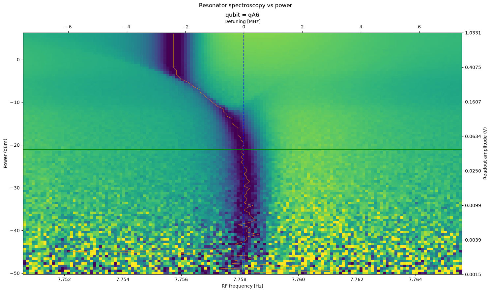

# Resonator Spectroscopy vs Power

[`02b_resonator_spectroscopy_vs_power.py`](../../../../../calibrations/1Q_calibrations/02b_resonator_spectroscopy_vs_power.py)

Map the resonator line as a function of readout power to choose a strong but linear operating point.

## Purpose

At low readout power the resonator line is narrow but noisy. As power increases, the line can shift, broaden, or split due to ac-Stark effects and qubit–resonator coupling. This experiment picks the highest power that still gives a single, well-defined resonance — before the qubit starts to distort the line.

{ .calibration-result }

## Prerequisites

- Resonator frequency found (node 02a_resonator_spectroscopy).

## (Chosen) Input Parameters Effect

* Frequency:
    * Span and step — must resolve the resonance at every power level in the sweep.
* Readout power:
    * Low power — narrow linewidth, poor SNR.
    * High power — stronger signal, but larger dispersive shift and risk of line splitting.
    * Number of power points — more points give a clearer view of where splitting begins.

## Output

* Optimal readout amplitude.
* Resonator frequency corrected for the chosen power.

## Experiment Step-by-Step description

1. For each readout frequency:
    1. For each readout power:
        1. Measure the resonator response.
1. Build a two-dimensional map of amplitude vs frequency and power.
1. Select the highest usable power before the resonance branches or shifts excessively.
1. Update readout amplitude and frequency in the machine configuration.
