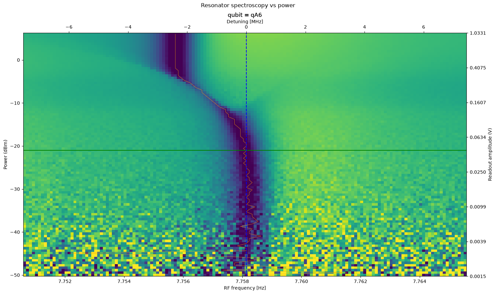

# Resonator Spectroscopy vs Power

[`02b_resonator_spectroscopy_vs_power.py`](../../../../../calibrations/1Q_calibrations/02b_resonator_spectroscopy_vs_power.py) · **Targets:** qubits · **Category:** 1Q_calibrations

2D sweep of readout frequency and readout power to choose the strongest readout power that still avoids nonlinear resonator behavior.

## Purpose

The optimal readout power sits on a knife-edge: too low and the signal-to-noise ratio is poor; too high and the resonator's response becomes nonlinear, distorting or splitting the line and biasing state discrimination. In the dispersive regime, the qubit-state-dependent resonator response is characterized by the dispersive shift $\chi$ and the resonator linewidth $\kappa$; the SNR-optimal readout condition occurs specifically at $\chi = \kappa$ **[GRTW2021]** — moving too far into the high-power limit pushes the system away from that point (and, at high enough photon number, toward measurement-induced state mixing). This node maps the resonator line across a range of readout powers and picks the highest power *before* the resonance frequency starts moving rapidly with power — the empirical signature that this bright-state, nonlinear-response transition is beginning.

This is also, structurally, the counterpart of the "bright-state" resonator-spectroscopy trick described for `02a_resonator_spectroscopy`: sweeping power and watching where the resonance frequency shifts is exactly the kind of scan used, in the high-power limit, to find the bare resonance $\omega_R$ regardless of qubit state, and in the low-power limit to find the dressed, qubit-state-dependent frequency $\tilde\omega_R$ **[GRTW2021]**. Doing this scan explicitly (rather than picking a single fixed power as `02a` does) is what lets this node choose a working point deliberately rather than by accident.

{ .calibration-result }

## Mechanism

Setup, before the QUA program runs:

1. For every targeted qubit's resonator, temporarily (`tracked_updates(..., auto_revert=False, dont_assign_to_none=True)`) call `resonator.set_output_power(power_in_dbm=max_power_dbm, max_amplitude=max_amp)` — this raises the full-scale power / gain of the readout chain so that the `"readout"` operation's amplitude, scaled down during the sweep, can still reach `max_power_dbm` at its top end. Because `auto_revert=False`, this change is **not** automatically undone at the end of the `with` block — it persists until explicitly reverted in `update_state` (see below).

For each (readout-frequency detuning, readout-power) point in the 2D sweep, for every (batched) qubit:

2. Initialize the flux point (`node.machine.initialize_qpu`), `align()`.
3. Update the resonator's intermediate frequency (`update_frequency`).
4. Measure the resonator with the pulse amplitude scaled by the swept pre-factor `a` (`rr.measure("readout", ..., amplitude_scale=a)`), where `a` ranges geometrically from a computed minimum up to `1.0` (i.e. up to the `max_power_dbm` level configured in step 1) — `amps = np.geomspace(amp_min, 1, num_power_points)`, with `amp_min` derived from `calculate_voltage_scaling_factor(max_power_dbm, min_power_dbm)` so that the swept amplitude pre-factors map onto a *linear* power axis in dBm (`power_dbm = np.linspace(min_power_dbm, max_power_dbm, num_power_points)`).
5. Wait for resonator depletion.

As in `02a`/`02c`, **no qubit drive and no reset are performed** — purely a resonator-side sweep.

Analysis (`process_raw_dataset` / `fit_raw_data` in `calibration_utils/resonator_spectroscopy_vs_amplitude/analysis.py`) — the derivative-crossing algorithm, precisely:

1. Normalize `IQ_abs` at each power by its own mean over `detuning` (`IQ_abs_norm`) so the per-power dip depth is comparable across the power axis.
2. For each power, find the detuning of the minimum of `IQ_abs_norm` (`rr_min_response`) — this traces the dip's frequency as a function of power.
3. Differentiate `rr_min_response` with respect to `power` (`rr_min_response_diff`, units Hz/dBm).
4. Reject outlier points where `|rr_min_response_diff| ≥ 1e6` Hz/dBm — **this 1 MHz/dBm rejection threshold is hardcoded** in the analysis, not exposed as a parameter.
5. Apply a centered rolling mean over `power` with window `derivative_smoothing_window_num_points` (default 10) to the filtered trace (`rr_min_response_avg`), then apply an edge correction: for the first `moving_average_filter_window_num_points` (default 10) points, divide by `(moving_average_filter_window_num_points - j)` — this rescales the partially-filled ends of the centered rolling window rather than leaving them under-weighted. **This correction loop is a hardcoded implementation detail**, not something the parameters directly control beyond the two window sizes.
6. Flag every power point where the smoothed derivative drops below `derivative_crossing_threshold_in_hz_per_dbm` (default −50 000 Hz/dBm, i.e. the resonance is shifting by more than 50 kHz per dB of readout power).
7. Take the **first** (lowest) power at which that flag is set (`idxmax` on the boolean trace, ascending power axis) as the crossing point, then subtract `buffer_from_crossing_threshold_in_dbm` (default 1 dBm) to back off from it — this is the reported `optimal_power`.
8. Re-fit the resonance at the power nearest `optimal_power` with `peaks_dips` to get the frequency shift there (`freq_shift`).

> **Source code flags itself as not fully trustworthy:** `calibration_utils`'s node file carries the comment `# TODO: requires manual setting of the readout power since the analysis isn't robust enough...` directly above the analysis call. Treat this node's automatically chosen `optimal_power` as a starting point to sanity-check against the 2D plot, not a black-box answer — see Troubleshooting #1.

## Prerequisites

- Resonator frequency found (`02a_resonator_spectroscopy`).
- The desired flux point specified if relevant (`qubit.z.flux_point`).

## Parameters

Inherits the common parameter set — see [Common node parameters](_common_parameters.md) — plus the node-specific parameters below.

| Parameter | Type | Default | Unit | Description | Effect |
|---|---|---|---|---|---|
| `num_shots` | `int` | 100 | – | Averages per (frequency, power) point. | Reduces noise; no effect on the fitted crossing power; linear cost in run time (multiplies with both swept axes). |
| `frequency_span_in_mhz` | `float` | 15 | MHz | Full width of the frequency sweep, centered on the resonator's current `RF_frequency`. | Must be wide enough to keep the dip inside the window at every power — the dressed-to-bare frequency shift can be tens of MHz across the swept power range. Also gates the success criterion via `freq_shift`. |
| `frequency_step_in_mhz` | `float` | 0.1 | MHz | Step size of the frequency sweep. | Finer steps improve the per-power dip localization (feeding `rr_min_response`), at cost in run time. |
| `max_power_dbm` | `int` | −25 | dBm | Highest readout power in the sweep; also the power level the readout chain is temporarily reconfigured to output at the top of the sweep (`set_output_power`). | Sets the upper end of the derivative-crossing search — if the true crossing lies above this, the algorithm cannot find it and will report no crossing (`NaN`) or default to the top of the range. |
| `min_power_dbm` | `int` | −50 | dBm | Lowest readout power in the sweep. | Sets the lower end of the search; also anchors the geometric amplitude sweep (`amp_min`) via `calculate_voltage_scaling_factor(max_power_dbm, min_power_dbm)`. |
| `num_power_points` | `int` | 100 | – | Number of points across the power axis. | Denser sampling resolves the derivative more smoothly (feeding directly into the rolling-average/crossing-detection algorithm); too few points can make the crossing detection noisy or miss it between samples. |
| `max_amp` | `float` | 0.1 | – (pulse amplitude pre-factor) | Ceiling on the `"readout"` operation's pulse amplitude used both when temporarily configuring the sweep's top power and when finally writing the chosen `optimal_power` back to state (passed as `max_amplitude` to `set_output_power`). | Caps how much of the requested `max_power_dbm`/`optimal_power` can be reached purely via pulse amplitude before the underlying gain (IQ/Octave channel, restricted to `[-0.5, 0.5)`) or full-scale-power (MW-FEM channel, stepped in 3 dB increments) setting is raised instead. |
| `derivative_crossing_threshold_in_hz_per_dbm` | `int` | −50 000 | Hz/dBm | Slope threshold that marks the onset of nonlinear resonator response. | Lower (more negative) values require a faster-moving resonance before triggering — pushes `optimal_power` higher, closer to the true nonlinear onset; less negative values are more conservative, backing off earlier. |
| `derivative_smoothing_window_num_points` | `int` | 10 | – (rolling-window size, in points) | Window size of the centered rolling mean applied to the frequency-vs-power derivative before threshold comparison. | Larger windows smooth out spurious single-point derivative spikes but also blur/delay a genuine sharp transition, shifting the detected crossing power. |
| `moving_average_filter_window_num_points` | `int` | 10 | – (points) | Number of leading points in the smoothed trace that get the edge-correction division described in Mechanism step 5. | Purely a numerical correction for the rolling-mean's partially-filled window at low power; not intended as an independent physical knob — see the stale-docstring note below. |
| `buffer_from_crossing_threshold_in_dbm` | `int` | 1 | dB | Back-off applied below the detected crossing power. | Larger values choose a more conservative (lower) `optimal_power`, trading SNR for margin against nonlinearity; `0` would place the operating point exactly at the detected onset. |

> **Stale docstring:** `moving_average_filter_window_num_points`'s docstring in `calibration_utils/resonator_spectroscopy_vs_amplitude/parameters.py` reads "...Default is 5." — the actual default, from the `Parameters` class field, is **10**.

## Outputs

**Measured:** `I`/`Q`, `IQ_abs`, `IQ_abs_norm`, at every (frequency, power) point.

| Fitted quantity | Unit | Written to state? | Description |
|---|---|---|---|
| `optimal_power` | dBm | ✅ | Readout power chosen just below the detected derivative-crossing threshold. |
| `resonator_frequency` | Hz | – | Absolute resonator frequency at `optimal_power` (`freq_shift` + current `RF_frequency`). |
| `frequency_shift` | Hz | ✅ (as increment) | Resonance shift, relative to current `RF_frequency`, measured at `optimal_power`; also the quantity checked against `frequency_span_in_mhz` for the success criterion. |

**Success criterion:** $|{\tt frequency\_shift}| < {\tt frequency\_span\_in\_mhz}$ (converted to Hz), and neither `frequency_shift` nor `optimal_power` are NaN. Checked per-qubit in `_extract_relevant_fit_parameters`.

## State Updates

The temporary power override from setup is always reverted first, regardless of outcome; the definitive update only applies to successful qubits:

| Attribute | New value | Mode | Condition |
|---|---|---|---|
| *(all tracked resonators)* | reverts to pre-node `set_output_power`/amplitude state | — | unconditional, at the start of `update_state`, via `tracked_resonator.revert_changes()` |
| `qubit.resonator` output power | `optimal_power` (via `set_output_power(power_in_dbm=optimal_power, max_amplitude=max_amp)`) | replace (via gain/amplitude reconfiguration) | outcome successful |
| `qubit.resonator.f_01` | current value **+=** `frequency_shift` | increment | outcome successful |
| `qubit.resonator.RF_frequency` | current value **+=** `frequency_shift` | increment | outcome successful |

Note the asymmetry with `02a`: there, the fitted frequency *replaces* `f_01`/`RF_frequency` outright; here, the fitted `frequency_shift` is *added* to whatever is currently configured. Re-running this node without an intervening `02a` re-run will keep nudging the frequency by whatever shift is measured at the newly chosen power each time, rather than converging to an absolute value.

## Troubleshooting

See also: [General troubleshooting](_general_troubleshooting.md#general-troubleshooting) for issues common to most nodes in this library. Below are issues specific to this node.

1. **`optimal_power` looks physically implausible, or the crossing point in the plot doesn't match visual intuition about where the line starts to bend** → the source code itself flags this analysis as not fully robust (`# TODO: requires manual setting of the readout power since the analysis isn't robust enough...`). Treat the automatic result as a first pass; inspect `plot_raw_data_with_fit` rather than trusting it as a black-box answer.
2. **Detected crossing power shifts noticeably when `derivative_smoothing_window_num_points` or `moving_average_filter_window_num_points` are changed, even though the raw data looks the same** → these two windows interact (the edge-correction loop runs over exactly `moving_average_filter_window_num_points` leading points of the *already-smoothed* trace) — changing one without the other can distort the leading edge of the derivative trace disproportionately. Change them together, or leave the edge-correction window at its default (10) while only tuning the smoothing window.
3. **Resonance frequency barely moves across the whole power sweep, no clear crossing** → per **[GRTW2021]**, a resonator dispersively coupled to a qubit should show a measurable, power-dependent frequency shift between the few-photon and many-photon regimes; if it doesn't, first re-check `02a`'s bright-state/low-power comparison — you may be probing a resonator not actually coupled to a qubit, which this node cannot diagnose or fix on its own.
4. **Later readout fidelity (IQ blobs, `07_iq_blobs`) is poor even though this node reports success at a plausible `optimal_power`** → recall the optimal SNR condition is $\chi=\kappa$, not simply "as much power as possible before nonlinearity" **[GRTW2021]**; `buffer_from_crossing_threshold_in_dbm` only backs off from the nonlinear onset, it does not target the $\chi=\kappa$ point directly.
5. **After running this node, `02a`'s stored `RF_frequency` seems to drift progressively larger/smaller across repeated bring-up attempts** → because the state update here is an *increment* (`+=`) rather than a replace, repeated runs at different powers accumulate frequency_shift corrections rather than resetting. Re-run `02a_resonator_spectroscopy` (which replaces `RF_frequency` outright) before re-running this node if you want a clean baseline.

## Parameter Tuning Heuristics

See also: [General parameter tuning heuristics](_general_troubleshooting.md#general-parameter-tuning-heuristics) for guidance common to most nodes in this library. Below is guidance specific to this node.

1. **If, after inspecting the plot (Troubleshooting #1), the automatically chosen `optimal_power` still looks wrong** → override by re-running with a narrower `min_power_dbm`/`max_power_dbm` bracket around the region you trust, or set the readout power manually via `qubit.resonator.set_output_power(...)` afterward.
2. **Outcome is `"failed"` with `optimal_power` as `NaN`** → the derivative never dropped below `derivative_crossing_threshold_in_hz_per_dbm` anywhere in the swept range. Either the true nonlinear onset lies above `max_power_dbm` (raise it, checking `max_amp` can still reach it) or the threshold itself is too strict — try a less negative `derivative_crossing_threshold_in_hz_per_dbm` (e.g. −20 000 instead of −50 000 Hz/dBm) to trigger on a gentler slope.
3. **The chosen `optimal_power` is right at (or just above) `max_power_dbm`, hugging the edge of the sweep** → same root cause as Parameter Tuning Heuristics #2 but less severe: the crossing is being found only marginally inside the range. Widen `max_power_dbm` upward and re-run to confirm the crossing is a real feature and not an edge artifact of the sweep boundary.
4. **`rr_min_response` trace (the orange line in the plot) is visibly jagged or jumps discontinuously at low power** → the hardcoded `1e6` Hz/dBm outlier-rejection in step 4 of the fit (Mechanism) removes single-point discontinuities but not systematically noisy regions. Increase `num_power_points` for denser sampling, or increase `derivative_smoothing_window_num_points` to smooth harder before the threshold comparison — but check Troubleshooting #2 first if you do.
5. **If fidelity is still poor at the chosen power** → consider deliberately choosing a lower power (smaller `max_power_dbm`, or manually overriding `optimal_power`) rather than pushing this node's threshold further.

## Next Steps

Not included by default in either bring-up graph (`80_calibration_graph_bringup_flux_tunable_transmon.py`, `90_calibration_graph_bringup_fixed_frequency_transmon.py`) — its connectivity edge into `02a_resonator_spectroscopy` is present in the flux-tunable graph's source but commented out. When used, run it before `02a_resonator_spectroscopy` to establish a safe readout power ahead of the precision frequency fit.

## References

**[GRTW2021]** Y. Y. Gao, M. A. Rol, S. Touzard, and C. Wang, "Practical guide for building superconducting quantum devices," *PRX Quantum*, vol. 2, p. 040202, 2021.
