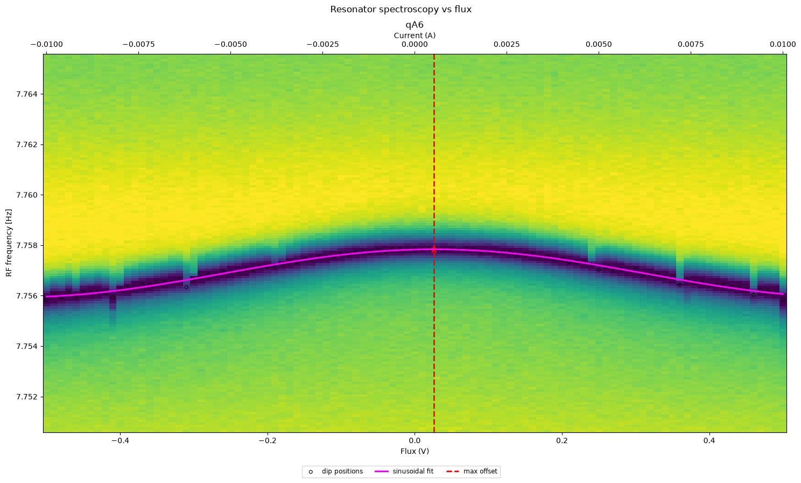

# Resonator Spectroscopy vs Qubit Flux

[`02c_resonator_spectroscopy_vs_flux.py`](../../../../../calibrations/1Q_calibrations/02c_resonator_spectroscopy_vs_flux.py)

Map how the resonator frequency shifts with qubit flux bias to find a stable operating point.

## Purpose

For flux-tunable qubits, stray coupling between the flux line and the readout resonator shifts $\omega_r$ with bias voltage. This experiment reveals that dependence so you can set the qubit at a flux point where the resonator frequency is stable and known.

{ .calibration-result }

## Prerequisites

- Resonator spectroscopy completed (nodes 02a and optionally 02b).
- Flux line connected for flux-tunable qubits.

## (Chosen) Input Parameters Effect

* Flux:
    * Offset voltage span — must include the intended operating point; e.g. $50\ \mathrm{mV}$ scans $25\ \mathrm{mV}$ on each side of the current bias.
    * Number of flux points — finer sampling resolves the parabolic shape at the cost of runtime.
* Frequency:
    * Span and step — must track the moving resonance at every flux value.

## Output

* Optimal flux bias voltage for the chosen operating point.
* Resonator frequency at that flux point.
* Minimum-flux offset (when enabled).

## Experiment Step-by-Step description

1. For each flux bias voltage:
    1. Set the DC flux offset on the qubit.
    1. For each readout frequency:
        1. Measure the resonator response.
    1. Extract the resonance frequency at this flux.
1. Fit the frequency-vs-flux curve.
1. Update flux offset and readout frequency in the machine configuration.
