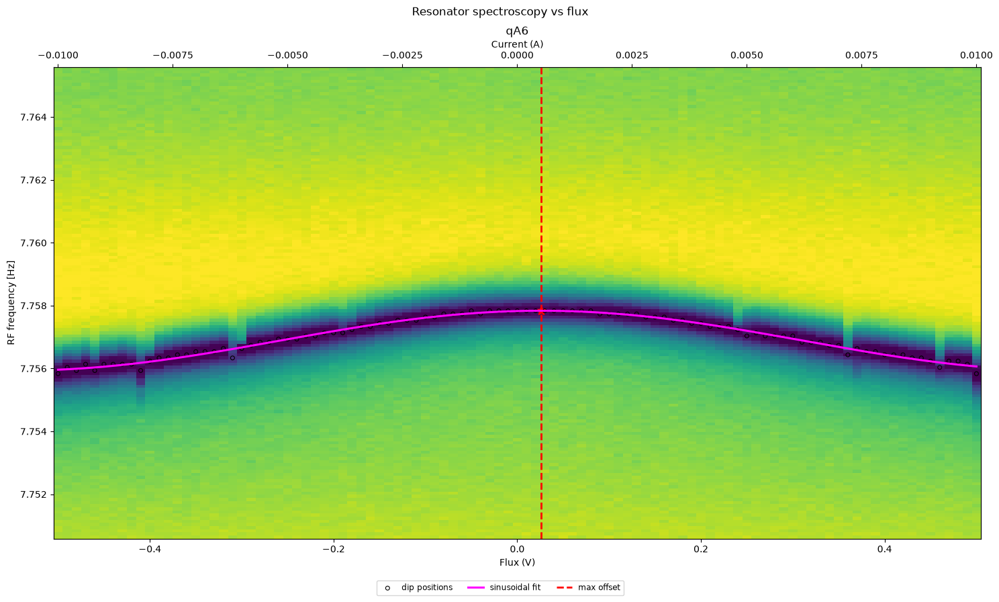

# Resonator Spectroscopy vs Flux

[`02c_resonator_spectroscopy_vs_flux.py`](../../../../../calibrations/1Q_calibrations/02c_resonator_spectroscopy_vs_flux.py) · **Targets:** qubits · **Category:** 1Q_calibrations

2D sweep of readout frequency and qubit flux bias to map the flux-dependent resonator response and locate flux sweet spots from the readout side.

## Purpose

On a flux-tunable transmon, the qubit's transition frequency $f_{01}$ depends on the flux $\Phi$ threading its SQUID loop, $E_J(\Phi) = E_{J,\max}|\cos(\pi\Phi/\Phi_0)|$ **[Koc+2007]**. Because the resonator is dispersively coupled to the qubit, its own apparent resonance frequency is pulled by an amount that depends on how far the qubit is detuned from the resonator — so as flux moves $f_{01}$, the *resonator's* dressed frequency shifts too, tracing out the same periodic dispersion in a way that's visible purely from the readout line, without needing to drive the qubit at all **[Kra+2019]**, **[BGGW2021]**. This node exploits that: sweeping flux while repeating a resonator-frequency sweep at each point maps out $\tilde\omega_R(\Phi)$, whose extrema correspond to the same flux **sweet spots** — points of first-order insensitivity to flux noise — that a qubit-side scan (`03b_qubit_spectroscopy_vs_flux`) would find by tracking $f_{01}(\Phi)$ directly. This is the resonator-side analog of the noise-insensitive "optimal working point" first demonstrated for the quantronium qubit **[Vio+2002]**.

Doing this from the resonator side first, before any qubit drive has been calibrated, is deliberate: per **[GRTW2021]**, a useful bring-up sequence for flux-tunable qubits is to locate the sweet spot via a low-power resonator-vs-flux sweep like this one *before* attempting qubit spectroscopy — it narrows the qubit-frequency search window for the next node and avoids flux-noise-broadened spectroscopic lines that would otherwise result from searching at an arbitrary, possibly flux-sensitive, bias point.

{ .calibration-result }

## Mechanism

For each (flux-bias, readout-frequency detuning) point in the 2D sweep, for every (batched) qubit:

1. Initialize the flux point (`node.machine.initialize_qpu`), `align()`.
2. Set the flux line's DC offset to the swept value (`qubit.z.set_dc_offset(dc)`), wait for it to settle (`qubit.z.settle()`), then `qubit.align()`.
3. Update the resonator's intermediate frequency (`rr.update_frequency`).
4. Measure the resonator (`qubit.resonator.measure("readout", ...)`) and wait for depletion.

As in `02a`/`02b`, **no qubit drive and no reset are performed** — purely a resonator-side sweep, at each flux point.

Before the QUA program is built, if any targeted qubit has no flux line (`qubit.z is None`), the node emits `warnings.warn("Found qubits without a flux line. Skipping")` — see Troubleshooting #4 for why this warning does not actually prevent a crash.

Analysis (`process_raw_dataset` / `fit_raw_data` in `calibration_utils/resonator_spectroscopy_vs_flux/analysis.py`):

1. Convert `I`/`Q` to volts, compute amplitude/phase (with slope-subtracted phase), and add flux-derived diagnostic coordinates: `current = flux_bias / input_line_impedance_in_ohm`, and an attenuation-corrected `attenuated_current = current * 10**(-line_attenuation_in_db/20)`.
2. At each flux point, take the detuning of the minimum `IQ_abs` as the tracked resonance (`peak_freq = ds.IQ_abs.idxmin(dim="detuning")`) — a simpler per-point extremum-finding step than `02a`'s full `peaks_dips` fit, used here because it just needs to be repeated cheaply at every flux point.
3. Fit `peak_freq` vs. flux to a cosine, `a·cos(2π·f·x + φ) + offset` (`fit_oscillation`, FFT-seeded nonlinear least squares) — a local approximation to the true (non-cosine) transmon dispersion, valid near a single extremum, exactly as used by the qubit-side sibling node `03b_qubit_spectroscopy_vs_flux`.
4. From the fitted phase and frequency, derive: the idle-offset flux correction (the cosine's zero-phase point nearest **absolute flux bias 0 V** — not necessarily near the qubit's currently configured offset, since this node's flux sweep is defined by absolute `min_flux_offset_in_v`/`max_flux_offset_in_v` bounds rather than a span centered on the current bias), the opposite extremum (`flux_min`, half a period away), the sweet-spot resonator frequency, and the flux-quantum-scale diagnostics `dv_phi0`/`phi0_current`/`m_pH` — the same mutual-inductance flux-to-current conversion used for in-situ flux-line calibration in **[Dai+2021]**.

## Prerequisites

Per the node's own docstring:

- Resonator frequency already calibrated (`02a_resonator_spectroscopy` and/or `02b_resonator_spectroscopy_vs_power`) — this node sweeps around the resonator's currently configured `RF_frequency`, it does not search blindly.
- The desired flux point specified (`qubit.z.flux_point`) — determines which state attribute is updated (see State Updates).

Implied by the underlying hardware chain (not restated in this node's own docstring, but required for any of the above to be meaningful): mixer/Octave calibration (`01a_mixer_calibration`) and time of flight (`01a_time_of_flight`/`01b_time_of_flight_mw_fem`). Also required in practice: a flux line connected and configured for the targeted qubits (`qubit.z`) — qubits with `qubit.z is None` are not actually skipped despite the emitted warning (see Troubleshooting #4).

## Parameters

Inherits the common parameter set — see [Common node parameters](_common_parameters.md) — plus the node-specific parameters below.

| Parameter | Type | Default | Unit | Description | Effect |
|---|---|---|---|---|---|
| `num_shots` | `int` | 100 | – | Averages per (flux, frequency) point. | Reduces noise; no effect on the fitted flux dispersion; linear cost in run time (multiplies with both swept axes). |
| `min_flux_offset_in_v` | `float` | −0.5 | V | Lower bound of the flux-bias sweep, in **absolute** volts (not relative to the qubit's current offset). | Together with `max_flux_offset_in_v`, sets the swept window; must be wide enough to bracket at least one full extremum of the flux dispersion, or the cosine fit has nothing to lock onto. |
| `max_flux_offset_in_v` | `float` | 0.5 | V | Upper bound of the flux-bias sweep, in absolute volts. | See above. |
| `num_flux_points` | `int` | 101 | – | Number of points across `[min_flux_offset_in_v, max_flux_offset_in_v]`. | More points resolve the flux dispersion curve better, at proportional cost in total sweep time (multiplies with the frequency-axis point count). |
| `frequency_span_in_mhz` | `float` | 15 | MHz | Full width of the readout-frequency sweep, centered on the resonator's current `RF_frequency`. | Must stay wide enough to keep the resonator's flux-pulled dip inside the window across the *entire* flux sweep — the dip moves with flux, so a span adequate at one flux point can miss it at another. Also gates the success criterion. |
| `frequency_step_in_mhz` | `float` | 0.1 | MHz | Step size of the readout-frequency sweep. | Finer steps sharpen the per-flux-point dip localization, at proportional cost in run time. |
| `input_line_impedance_in_ohm` | `float` | 50 | Ω | Assumed impedance of the flux line, used only to convert the swept voltage into an equivalent current for diagnostics and plotting. | Does not affect what's measured, the fitted `idle_offset`/`flux_min`, or the frequency state updates — only rescales `phi0_current`/`m_pH` and the plotted current axis. |
| `line_attenuation_in_db` | `float` | 0 | dB | Attenuation between the flux DAC and the cryostat, used in the same voltage→current conversion above. | Same diagnostic-only scope as `input_line_impedance_in_ohm`. |
| `update_flux_min` | `bool` | `False` | – | Whether to write the fitted `flux_min` (opposite extremum from the idle offset) back to `qubit.z.min_offset`. | With the default `False`, `qubit.z.min_offset` is left untouched even though `flux_min` is still computed and available in the fit results/plot. |

## Outputs

**Measured:** `I`/`Q`, `IQ_abs`, `phase`, plus diagnostic `current`/`attenuated_current` coordinates, at every (flux, frequency) point.

| Fitted quantity | Unit | Written to state? | Description |
|---|---|---|---|
| `resonator_frequency` | Hz | – | Absolute resonator frequency at the fitted idle offset (`frequency_shift` + current `RF_frequency`). |
| `frequency_shift` | Hz | ✅ (as increment) | Resonator-frequency shift, relative to current `RF_frequency`, at the idle offset; also checked against `frequency_span_in_mhz` for the success criterion. |
| `idle_offset` | V | ✅ | Flux-bias correction to reach the cosine's zero-phase extremum nearest 0 V. |
| `min_offset` | V | ✅ (only if `update_flux_min`) | Flux bias at the opposite extremum of the fitted curve (half a period from `idle_offset`), clamped into a ±0.5 V window. |
| `dv_phi0` | V | ✅ (as `qubit.phi0_voltage`) | Voltage span corresponding to one flux quantum, from the fitted oscillation period ($1/f$). |
| `phi0_current` | A | ✅ (as `qubit.phi0_current`) | Current-equivalent of one flux quantum, using `input_line_impedance_in_ohm`/`line_attenuation_in_db`. |
| `m_pH` | pH | – | SQUID loop mutual inductance estimate derived from the same fit; diagnostic only, not written to state. |

**Success criterion:** $|{\tt frequency\_shift}| < {\tt frequency\_span\_in\_mhz}$ (converted to Hz), and none of `frequency_shift`/`min_offset`/`idle_offset` are NaN. Checked per-qubit in `_extract_relevant_fit_parameters`.

## State Updates

Applied only when the fit succeeds — failed qubits are skipped entirely (no partial update):

| Attribute | New value | Mode | Condition |
|---|---|---|---|
| `qubit.z.independent_offset` | fitted `idle_offset` | **replace** | outcome successful **and** `qubit.z.flux_point == "independent"` |
| `qubit.z.joint_offset` | fitted `idle_offset` | **replace** | outcome successful **and** `qubit.z.flux_point != "independent"` |
| `qubit.z.min_offset` | fitted `min_offset` | replace | outcome successful **and** `node.parameters.update_flux_min` is `True` |
| `qubit.resonator.f_01` | current value **+=** `frequency_shift` | increment | outcome successful |
| `qubit.resonator.RF_frequency` | current value **+=** `frequency_shift` | increment | outcome successful |
| `qubit.phi0_voltage` | fitted `dv_phi0` | replace | outcome successful |
| `qubit.phi0_current` | fitted `phi0_current` | replace | outcome successful |

> **Both flux-point branches are plain replacements here — unlike the qubit-side `03b_qubit_spectroscopy_vs_flux`.** The source code is `if q.z.flux_point == "independent": q.z.independent_offset = idle_offset; else: q.z.joint_offset = idle_offset` — this is a strict replace on *both* sides, with no `+=` increment on the joint branch. This differs from `03b`'s asymmetric replace/increment semantics; do not assume the two sibling nodes behave identically here.

> **The `else` branch catches every non-`"independent"` value of `flux_point`, not just `"joint"`.** `FluxLine.flux_point` is typed as `Literal["joint", "independent", "min", "arbitrary", "zero"]`. If a qubit's `flux_point` is set to `"min"`, `"arbitrary"`, or `"zero"` rather than `"joint"`, this node will still write the fitted `idle_offset` into `qubit.z.joint_offset` — which is likely not the intended target attribute for those flux points. Confirm `qubit.z.flux_point` is actually `"independent"` or `"joint"` before relying on this node's state update for another flux-point mode.

> **`resonator_frequency`/`m_pH` are computed but not written to state** — only `frequency_shift` (as an increment to `f_01`/`RF_frequency`) and `dv_phi0`/`phi0_current` make it into QUAM; `resonator_frequency` and `m_pH` are diagnostic-only outputs, available in `fit_results`/logs but never assigned.

## Troubleshooting

1. **No visible flux-dependent curve at all — the dip position looks flat across all flux points** → either the qubit's flux line isn't actually coupled to this resonator's environment strongly enough to shift $\tilde\omega_R$ measurably, or (more mundanely) `qubit.z` isn't wired/configured correctly. Cross-check against `03b_qubit_spectroscopy_vs_flux` if available — if the qubit's own $f_{01}$ *does* move with the same flux sweep but the resonator doesn't, that's consistent with weak dispersive coupling rather than a flux-line fault; if neither moves, suspect the flux line itself.
2. **`node.parameters.update_flux_min` was left at its default `False`, and `qubit.z.min_offset` looks stale after a successful run** → this is expected, not a bug: `min_offset` is computed either way (visible in `fit_results`/the plot) but only written back to state when `update_flux_min=True`. Set it explicitly if you want this node to also refresh the anti-sweet-spot bias.
3. **`qubit.z.joint_offset` gets updated even though you expected `qubit.z.flux_point` to route elsewhere (e.g. `"min"` or `"arbitrary"`)** → per the State Updates note above, the code's `else` branch treats every non-`"independent"` flux point as if it were `"joint"`. This is a real gap in the node, not a misconfiguration on your part — verify `flux_point` is exactly `"independent"` or `"joint"` before running this node if precise routing matters.
4. **Node raises an `AttributeError` on `qubit.z` partway through `create_qua_program`, despite the "Found qubits without a flux line. Skipping" warning already having printed** → the warning is informational only; the code does not actually remove flux-line-less qubits from the sweep afterward, so `qubit.z.set_dc_offset(...)` will still be attempted on them. Explicitly exclude qubits without a flux line via `node.parameters.qubits` rather than relying on the warning to protect you.
5. **The chosen sweet spot from this node disagrees with the one later found by `03b_qubit_spectroscopy_vs_flux`** → this node infers the sweet spot indirectly, from the resonator's flux-pulled response, while `03b` measures the qubit's $f_{01}(\Phi)$ directly. A persistent disagreement between the two is a useful cross-check on dispersive coupling strength and flux-crosstalk assumptions — treat `03b`'s result as authoritative for the qubit's own operating point, and use this node primarily for the earlier, coarser bring-up step of narrowing where to look next **[GRTW2021]**.

## Parameter Tuning Heuristics

1. **Fit fails (outcome = `"failed"`) at most or all flux points** → `frequency_span_in_mhz` is likely too narrow to keep the flux-pulled resonator dip inside the window as flux moves it — the dip walks out of the swept band at some flux points, and `IQ_abs.idxmin` then locks onto noise or the window edge. Widen the span first; it directly targets the span-relative success criterion.
2. **Fitted `idle_offset` sits at or very near the edge of `[min_flux_offset_in_v, max_flux_offset_in_v]`** → the swept window may not contain a full extremum of the flux dispersion; the true sweet spot could be just outside the scanned range. Since these bounds are **absolute**, not centered on the current bias, widen them directly (e.g. push `min_flux_offset_in_v` more negative and/or `max_flux_offset_in_v` more positive) rather than assuming they're already centered correctly.
3. **`dv_phi0`, `phi0_current`, or `m_pH` come out wildly inconsistent with the SQUID loop's known design value** → `input_line_impedance_in_ohm`/`line_attenuation_in_db` default to 50 Ω / 0 dB, which may not reflect the real flux-line hardware (attenuator chain, cabling losses). Update both to calibrated values before trusting these diagnostics; they don't feed back into `idle_offset`/`frequency_shift`, so this doesn't call the sweet-spot state update itself into question.
4. **Sweet spot appears to jump between runs, or shifts inconsistently as the flux range is widened** → with too few `num_flux_points` relative to how many oscillation periods the range actually spans, `fit_oscillation`'s FFT-seeded fit can lock onto an aliased period. Increase `num_flux_points` before widening `min_flux_offset_in_v`/`max_flux_offset_in_v` further, and cross-check the implied periodicity against `dv_phi0` from a prior run.

## Next Steps

`03a_qubit_spectroscopy` — the bring-up graph (`calibrations/1Q_calibrations/80_calibration_graph_bringup_flux_tunable_transmon.py`) wires this node directly into the qubit spectroscopy node that follows, now that the resonator frequency and idle flux offset are both set.

## References

**[Koc+2007]** J. Koch, T. M. Yu, J. Gambetta, A. A. Houck, D. I. Schuster, J. Majer, A. Blais, M. H. Devoret, S. M. Girvin, and R. J. Schoelkopf, "Charge-insensitive qubit design derived from the Cooper pair box," *Phys. Rev. A*, vol. 76, no. 4, p. 042319, 2007.

**[Kra+2019]** P. Krantz, M. Kjaergaard, F. Yan, T. P. Orlando, S. Gustavsson, and W. D. Oliver, "A quantum engineer's guide to superconducting qubits," *Appl. Phys. Rev.*, vol. 6, no. 2, p. 021318, 2019.

**[BGGW2021]** A. Blais, A. L. Grimsmo, S. M. Girvin, and A. Wallraff, "Circuit quantum electrodynamics," *Rev. Mod. Phys.*, vol. 93, no. 2, p. 025005, 2021.

**[Vio+2002]** D. Vion, A. Aassime, A. Cottet, P. Joyez, H. Pothier, C. Urbina, D. Esteve, and M. H. Devoret, "Manipulating the quantum state of an electrical circuit," *Science*, vol. 296, no. 5569, pp. 886–889, 2002.

**[GRTW2021]** Y. Y. Gao, M. A. Rol, S. Touzard, and C. Wang, "Practical guide for building superconducting quantum devices," *PRX Quantum*, vol. 2, p. 040202, 2021.

**[Dai+2021]** X. Dai, D. M. Tennant, R. Trappen, A. J. Martinez, D. Melanson, M. A. Yurtalan, Y. Tang, S. Novikov, J. A. Grover, S. M. Disseler, J. I. Basham, R. Das, D. K. Kim, A. J. Melville, B. M. Niedzielski, S. J. Weber, J. L. Yoder, D. A. Lidar, and A. Lupascu, "Calibration of flux crosstalk in large-scale flux-tunable superconducting quantum circuits," *PRX Quantum*, vol. 2, p. 040313, 2021.
