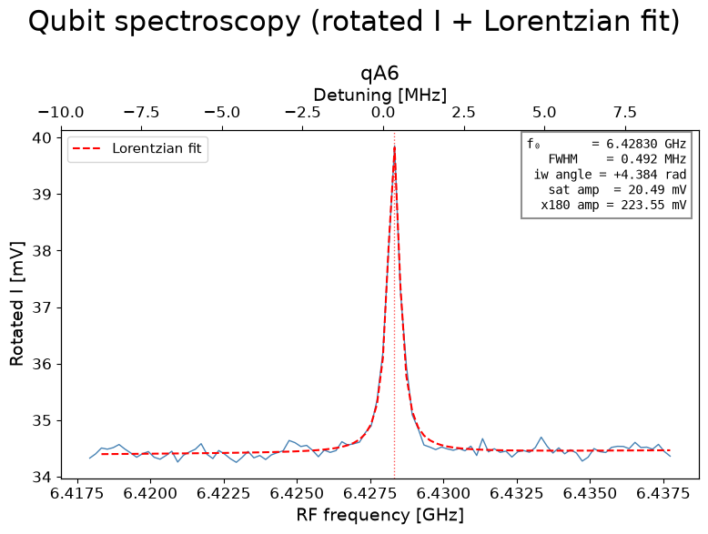

# Qubit Spectroscopy (|0⟩↔|1⟩)

[`03a_qubit_spectroscopy.py`](../../../../../calibrations/1Q_calibrations/03a_qubit_spectroscopy.py)

Sweep the qubit drive frequency while exciting the qubit, to find the $|0\rangle \leftrightarrow |1\rangle$ transition.

## Purpose

All gate calibrations require the qubit transition frequency $f_{01}$. This experiment applies a probe or saturation pulse at many drive frequencies and reads out the resonator. On resonance the qubit is excited and the dispersive readout signal changes, producing a peak (or dip) in the measured response.

{ .calibration-result }

## Prerequisites

- Mixer or Octave calibrated (node 01a_mixer_calibration).
- Readout parameters calibrated (nodes 02a, 02b and/or 02c).
- Flux operating point specified if using a flux-tunable qubit.

## (Chosen) Input Parameters Effect

* Frequency:
    * Span — the qubit frequency band to scan; e.g. $100\ \mathrm{MHz}$ searches $50\ \mathrm{MHz}$ on each side of the current estimate.
    * Step — resolution of the scan; smaller steps yield sharper peaks but take longer.
* Drive pulse:
    * Amplitude — higher amplitude broadens the peak (power broadening) but makes it easier to see; lower amplitude gives a narrower line.
    * Length — longer pulses increase excitation but also add decoherence broadening.

## Output

* Qubit transition frequency $f_{01}$.
* Integration angle for readout along the optimal discrimination axis.
* Optional: updated drive amplitudes if peak-width targeting is enabled.

## Experiment Step-by-Step description

1. For each qubit drive frequency:
    1. Reset the qubit.
    1. Apply a saturation (or probe) drive pulse.
    1. Measure the resonator response.
1. Fit the spectroscopic peak to extract $f_{01}$ and linewidth.
1. Update the qubit drive frequency in the machine configuration.
