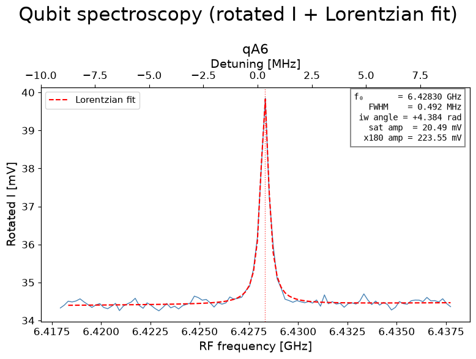

# Qubit Spectroscopy

[`03a_qubit_spectroscopy.py`](../../../../../calibrations/1Q_calibrations/03a_qubit_spectroscopy.py) · **Targets:** qubits · **Category:** 1Q_calibrations

Sweeps the qubit drive frequency while playing a saturation pulse, to find the $|0\rangle \leftrightarrow |1\rangle$ transition frequency $f_{01}$.

## Purpose

Every downstream calibration — Rabi, T1, Ramsey, DRAG, and beyond — needs the qubit's transition frequency. This node finds it by playing a long, resonant (or near-resonant) drive pulse on `qubit.xy` at many candidate frequencies and reading out the resonator afterwards. Off resonance the qubit stays in $|0\rangle$ and the resonator responds at its bare frequency; on resonance the drive saturates the transition, moving population out of $|0\rangle$, which — via the dispersive qubit-resonator coupling **[BGGW2021]** — pulls the resonator's demodulated response away from its off-resonant baseline. The frequency at which that response peaks is $f_{01}$ **[Koc+2007]**, **[Kra+2019]**.

The drive here is **played, then the drive channel is aligned out, and only then is the resonator measured** — it is a sequential (pulsed) two-tone measurement, not a continuous drive held on throughout the readout tone. This matters because a genuinely continuous drive running concurrently with (or between) readout tones has two concrete failure modes described in **[GRTW2021]**: it ac-Stark-shifts the apparent qubit frequency away from its true value, and it continuously dissipates microwave power at the mixing chamber stage (∼20 mK), where the fridge's cooling power is only a few μW, risking spurious heating. Because this node's drive and readout are sequential rather than simultaneous, it structurally avoids both — though the pulse itself (`operation`, default `"saturation"`) is still typically a long, low-Rabi-frequency square pulse, since a long weak drive gives a narrow, Fourier-limited linewidth. As with any two-level-system drive, the observed line still broadens and can be pulled by the AC Stark effect as the drive amplitude rises — this is *power broadening*, and it is the dominant knob to manage in this experiment **[AE1987]**.

There is no universal "correct" drive power to dial in ahead of time — how strongly a given qubit couples to its drive line is exactly the unknown this experiment is trying to characterize. The practical approach recommended in **[GRTW2021]** is to repeat the sweep at a few different `operation_amplitude_factor` values until a clean, resolvable peak appears — see Parameter Tuning Heuristics.

{ .calibration-result }

## Mechanism

For each drive-frequency point in the 1D sweep, repeated `num_shots` times for averaging:

1. Initialize the flux point (`node.machine.initialize_qpu`) for all batched qubits, once per multiplexed batch.
2. Retune `qubit.xy`'s intermediate frequency to the swept detuning (`update_frequency(df + intermediate_frequency)`).
3. Play `operation` (default `"saturation"`) on `qubit.xy`, scaled by `operation_amplitude_factor` and held for `operation_len_in_ns` (or the pulse's configured length if not overridden).
4. `align()`, then measure the resonator (`qubit.resonator.measure("readout", ...)`) and wait `node.machine.depletion_time`.

> **No explicit qubit reset is performed anywhere in this sequence.** Unlike `03b_qubit_spectroscopy_vs_flux` (which hardcodes a thermal reset) or `04a_rabi_chevron`/`04b_power_rabi` (which call `qubit.reset(reset_type, ...)`), this node's QUA program contains no reset call at all — only the resonator's `depletion_time` wait, which is sized for readout ring-down, not qubit $T_1$ relaxation. The common `reset_type` parameter is silently ignored here regardless of its value.

> **`use_state_discrimination` is also silently ignored.** The QUA program never branches on it — there is no `state`/`readout_state` path at all, only raw `I`/`Q`. Toggling this common parameter on this node has no effect on what is measured or how success is assessed.

Analysis (`process_raw_dataset` / `fit_raw_data` in `calibration_utils/qubit_spectroscopy/analysis.py`):

1. Convert I/Q to volts and compute the absolute RF frequency axis (`full_freq = detuning + qubit.xy.RF_frequency`).
2. Locate the frequency where `IQ_abs` deviates most from its mean, and use the I/Q values there to compute a rotation angle (`iw_angle`) that aligns the signal onto the I axis.
3. Rotate the whole trace by that angle (`I_rot`) and fit a peak/dip on it (`peaks_dips`, `prominence_factor=5`) to get its position, width (FWHM), amplitude, and baseline — `NaN` if no sufficiently prominent peak is found.
4. Compose the new integration-weight angle as `(previous_angle + fit_angle) mod 2π` — the value written to state is already the corrected absolute angle, not an increment applied again later.
5. Derive two amplitude targets from the fitted width, **both computed from the `"saturation"` operation's amplitude specifically, regardless of what `operation` was actually swept**:
   - `saturation_amp` = amplitude that would give a FWHM of `target_peak_width` at the same power-broadening rate observed in this fit.
   - `x180_amp` = amplitude that would deliver a $\pi$ rotation in the configured `x180` pulse length, extrapolated from the same fitted linewidth.
6. Assess success (see Outputs) and package `frequency`, `relative_freq`, `fwhm`, `iw_angle`, `saturation_amp`, `x180_amp` per qubit.

> **The `operation` parameter is a free-form `str`, but the amplitude-calibration math always reads/writes the `"saturation"` pulse key.** `used_amp` in `_extract_relevant_fit_parameters` is computed from `q.xy.operations["saturation"].amplitude`, not `q.xy.operations[operation].amplitude`, and the optional state write (see State Updates) likewise always targets `"saturation"`/`"x180"`/`"x90"` by name. If you run this node with a custom `operation` other than `"saturation"`, the derived `saturation_amp`/`x180_amp` values are computed on the wrong amplitude baseline and should not be trusted.

## Prerequisites

- Mixer/Octave calibration (`01a_mixer_calibration`).
- Time of flight calibrated (`01a_time_of_flight` or `01b_time_of_flight_mw_fem`).
- Readout parameters calibrated (`02a_resonator_spectroscopy`, and/or `02b`/`02c`).
- Flux operating point specified if relevant (`qubit.z.flux_point`).
- Graph topology: in the flux-tunable bring-up graph (`80_calibration_graph_bringup_flux_tunable_transmon.py`) this node runs directly after `02c_resonator_spectroscopy_vs_flux`; in the fixed-frequency bring-up graph (`90_calibration_graph_bringup_fixed_frequency_transmon.py`) it runs directly after `02a_resonator_spectroscopy`.

## Parameters

Inherits the common parameter set — see [Common node parameters](_common_parameters.md) — plus the node-specific parameters below.

| Parameter | Type | Default | Unit | Description | Effect |
|---|---|---|---|---|---|
| `num_shots` | `int` | 100 | – | Averages per drive-frequency point. | More shots lower I/Q noise at each point; no effect on the extracted frequency itself; linear cost in run time. |
| `operation` | `str` | `"saturation"` | – | QUAM pulse operation played on `qubit.xy` during the sweep. | Selects which configured pulse drives the qubit — but see the callout above: the derived amplitude outputs still hardcode `"saturation"` regardless of this choice. |
| `operation_amplitude_factor` | `float` | 1.0 | – (pre-factor, restricted to `[-2, 2)`) | Amplitude scale applied to `operation`. | The main power-broadening knob (see Parameter Tuning Heuristics); an order of magnitude higher than `03b`'s default of 0.1. |
| `operation_len_in_ns` | `Optional[int]` | `None` (uses pulse's configured length) | ns | Overrides the duration of `operation`. | Longer drive at fixed amplitude saturates the transition more — an alternative to raising amplitude when trying to see a weak line. |
| `frequency_span_in_mhz` | `float` | 100.0 | MHz | Full width of the qubit-drive detuning sweep, centered on `f_01`. | Must be wide enough to contain the true peak; too narrow and the peak may sit outside the window entirely. |
| `frequency_step_in_mhz` | `float` | 0.25 | MHz | Step size of the drive-frequency sweep. | Finer steps sharpen the extracted peak position/width at proportional cost in run time. |
| `target_peak_width` | `float` | 3e6 | Hz | Target FWHM used to back out a corrected `saturation` amplitude from the observed power-broadened width. | Always computed; only written to state if `update_pulses_amplitude=True`. |
| `update_pulses_amplitude` | `bool` | `False` | – | Whether to write the derived `saturation`/`x180`/`x90` amplitudes back to QUAM state. | See State Updates — off by default, so a normal run only updates frequency and the integration-weight angle. |

> **`reset_type` and `use_state_discrimination` (both common parameters) have no effect on this node** — see the Mechanism callouts above. They are declared and shown in the GUI like on any other node, but this node's QUA program never reads either one.

## Outputs

**Measured:** `I`/`Q` (volts), `IQ_abs`, `phase`, `I_rot` (signal rotated onto the discrimination axis), at every detuning point.

| Fitted quantity | Unit | Written to state? | Description |
|---|---|---|---|
| `frequency` | Hz | ✅ (`f_01`, `RF_frequency`) | Absolute fitted peak frequency (`fit.position + qubit.xy.RF_frequency`). |
| `relative_freq` | Hz | – | Fitted peak position relative to the qubit's current `RF_frequency` (i.e. the detuning of the peak). |
| `fwhm` | Hz | – | Fitted peak full-width-at-half-max; also feeds the `saturation_amp`/`x180_amp` derivations. |
| `iw_angle` | rad | ✅ (`readout` integration weights) | Already composed as `(previous_angle + fit_angle) mod 2π` — see Mechanism. |
| `saturation_amp` | V | Only if `update_pulses_amplitude` | Amplitude that would give `target_peak_width` FWHM; computed from `"saturation"`'s current amplitude regardless of `operation`. |
| `x180_amp` | V | Only if `update_pulses_amplitude` | Amplitude for a $\pi$ rotation at the configured `x180` length, extrapolated from the fitted width. |

**Success criterion**, computed per qubit in `_extract_relevant_fit_parameters`:

$$\texttt{success} = \texttt{freq\_success} \;\wedge\; \texttt{fwhm\_success} \;\wedge\; \texttt{saturation\_amp\_success}$$

> **Read this criterion carefully before trusting a "successful" outcome.** `freq_success`/`fwhm_success` compare the *absolute* frequency (`res_freq`, dominated by the GHz-scale `RF_frequency`) against a threshold that is itself `frequency_span_in_mhz` **plus** that same `RF_frequency` — since the fitted peak position is, by construction, always inside the swept `±span/2` window, these two checks are almost structurally guaranteed to pass and only fail when `peaks_dips` found no peak at all (`NaN`, which fails any comparison). The one condition doing real work is `saturation_amp_success = |saturation_amplitude| < limits[0].max_wf_amplitude` — and note the index: it uses the **first qubit's** hardware amplitude limit for every qubit in the batch, even in a multi-qubit multiplexed run. `x180_amp` is computed but never checked against `limits[0].max_x180_wf_amplitude` at all (that line is present in source but commented out) — despite being one of the values optionally written to state.

## State Updates

Applied only when the fit succeeds — failed qubits are skipped entirely (no partial update):

| Attribute | New value | Mode | Condition |
|---|---|---|---|
| `qubit.f_01` | fitted `frequency` | replace | outcome successful |
| `qubit.xy.RF_frequency` | fitted `frequency` | replace | outcome successful |
| `qubit.resonator.operations["readout"].integration_weights_angle` | fitted `iw_angle` (already includes the previous angle) | replace | outcome successful |
| `qubit.xy.operations["saturation"].amplitude` | fitted `saturation_amp` | replace | outcome successful **and** `update_pulses_amplitude=True` |
| `qubit.xy.operations["x180"].amplitude` | fitted `x180_amp` | replace | outcome successful **and** `update_pulses_amplitude=True` |
| `qubit.xy.operations["x90"].amplitude` | fitted `x180_amp / 2` | replace | outcome successful **and** `update_pulses_amplitude=True` |

## Troubleshooting

1. **A second, weaker peak appears roughly symmetric about the main one, or at low-but-nonzero probability even well off the main resonance** → before assuming it's a spurious mode or crosstalk, **[Reed2013]** notes that sufficiently high spectroscopy power can drive multi-photon transitions (two-photon $|0\rangle\!\to\!|2\rangle$, even three-photon $|0\rangle\!\to\!|3\rangle$) that aren't present at lower power. The diagnostic is simple: lower `operation_amplitude_factor` and see if the extra feature disappears — a real spurious mode/avoided crossing persists at low power, a multi-photon artifact vanishes well before the main $f_{01}$ peak does.
2. **Node reports "successful" but the plotted peak looks noisy, doubled, or clearly wrong** → don't trust the outcome label alone here. As detailed in Outputs, `freq_success`/`fwhm_success` are near-vacuous by construction; the only condition that can meaningfully fail (short of no peak at all) is the `saturation_amp` hardware-limit check. Always visually inspect `plot_data`'s figure before accepting the fitted frequency.
3. **In a multiplexed multi-qubit run, one qubit's outcome looks wrong given its own hardware limits** → the amplitude-limit check in `_extract_relevant_fit_parameters` uses `limits[0]`, the *first* qubit's channel limits, for every qubit in the batch. If qubits mix channel types (e.g. IQ vs. MW-FEM, which have different `max_wf_amplitude`), later qubits are checked against the wrong threshold. Re-run the suspect qubit alone (`qubits=["qX"]`) to get a correctly-scoped check.
4. **Running with a custom `operation` (not `"saturation"`) and the derived amplitudes look inconsistent** → expected: `saturation_amp`/`x180_amp` are always computed from `qubit.xy.operations["saturation"].amplitude`, never from `operation`'s own amplitude (see Mechanism callout). If your `operation` isn't `"saturation"`, treat `update_pulses_amplitude=True`'s output with caution or leave that flag off.
5. **Two peaks appear, symmetric about some central frequency** → possible image-sideband or LO-leakage excitation rather than the intended sideband — this is exactly why mixer/Octave calibration (`01a_mixer_calibration`) is a hard prerequisite. Re-run/verify mixer calibration if this appears.
6. **Toggling `use_state_discrimination` or `reset_type` changes nothing about the results** → expected, not a misconfiguration: neither common parameter is wired into this node's QUA program (see Mechanism callouts); they only matter for other nodes.

## Parameter Tuning Heuristics

1. **No peak at all, response flat across the whole sweep** → probe power too low — the qubit doesn't get excited even near resonance, so the resonator response never shifts **[GRTW2021]**. Raise `operation_amplitude_factor` from the default 1.0, or lengthen `operation_len_in_ns` for more saturation at fixed power.
2. **Peak is so broad it merges into the noise floor / can't be distinguished from the background** → probe power too high — power broadening: linewidth grows with drive amplitude until the peak disappears into the baseline **[GRTW2021]**, **[AE1987]**. Lower `operation_amplitude_factor`.
3. **Unsure what amplitude to start with at all** → there is no shortcut here: how strongly this specific qubit couples to its drive line is unknown ahead of time. Follow the operational recipe in **[GRTW2021]**: repeat the sweep at a few different `operation_amplitude_factor` values (e.g. 1.0, 0.3, 0.1, 3.0) until a clean, well-separated peak appears, rather than guessing once. If you need to reason quantitatively about how much a given amplitude will broaden the line rather than just sweeping blindly, **[Reed2013]** gives the explicit relation between drive (Rabi) rate and linewidth: $2\pi\,\Delta f_{\rm HWHM} = \sqrt{1/T_2^2 + 4\Omega_R^2 T_1/T_2}$ — at low drive the linewidth saturates at the intrinsic $1/T_2^*$-set value, and grows linearly with $\Omega_R$ once power broadening dominates.
4. **Peak position or width drifts between otherwise-identical repeated runs** → since there is no reset instruction of any kind between shots (only the resonator's `depletion_time` wait, sized for ring-down, not qubit $T_1$), residual excited-state population from a strong/long saturation pulse can carry into the next frequency point. This is most likely with high `operation_amplitude_factor` or long `operation_len_in_ns`; reducing either can stabilize repeat-to-repeat results.

## Next Steps

`04a_rabi_chevron` — in the fixed-frequency bring-up graph (`90_calibration_graph_bringup_fixed_frequency_transmon.py`), this node feeds `04a_rabi_chevron` directly. In the flux-tunable bring-up graph (`80_calibration_graph_bringup_flux_tunable_transmon.py`), it instead feeds `03b_qubit_spectroscopy_vs_flux` first (to map the sweet spot), which then feeds `04a_rabi_chevron`.

## References

**[Koc+2007]** J. Koch, T. M. Yu, J. Gambetta, A. A. Houck, D. I. Schuster, J. Majer, A. Blais, M. H. Devoret, S. M. Girvin, and R. J. Schoelkopf, "Charge-insensitive qubit design derived from the Cooper pair box," *Phys. Rev. A*, vol. 76, no. 4, p. 042319, 2007.

**[Kra+2019]** P. Krantz, M. Kjaergaard, F. Yan, T. P. Orlando, S. Gustavsson, and W. D. Oliver, "A quantum engineer's guide to superconducting qubits," *Appl. Phys. Rev.*, vol. 6, no. 2, p. 021318, 2019.

**[BGGW2021]** A. Blais, A. L. Grimsmo, S. M. Girvin, and A. Wallraff, "Circuit quantum electrodynamics," *Rev. Mod. Phys.*, vol. 93, no. 2, p. 025005, 2021.

**[GRTW2021]** Y. Y. Gao, M. A. Rol, S. Touzard, and C. Wang, "Practical guide for building superconducting quantum devices," *PRX Quantum*, vol. 2, p. 040202, 2021.

**[AE1987]** L. Allen and J. H. Eberly, *Optical Resonance and Two-Level Atoms*. New York: Dover Publications, 1987.

**[Reed2013]** M. D. Reed, *Entanglement and Quantum Error Correction with Superconducting Qubits*, Ph.D. dissertation, Yale University, New Haven, CT, 2013.
