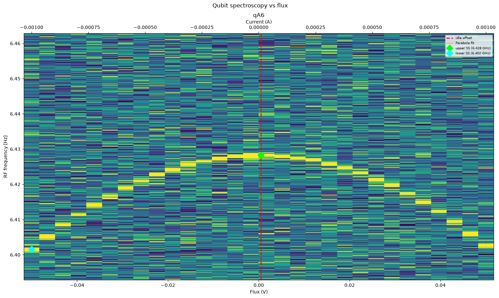

# Qubit Spectroscopy vs Qubit Flux

[`03b_qubit_spectroscopy_vs_flux.py`](../../../../../calibrations/1Q_calibrations/03b_qubit_spectroscopy_vs_flux.py)

A qubit spectroscopy performed for several flux bias values, in order to exhibit the qubit frequency versus flux response.

## Purpose

Measuring the ideal flux bias voltage at the "sweet spot" and its corresponding qubit transition frequency. The sweet spot (see `upper SS` in the attached image) is the maximum point of a parabolic shape that the measured signal creates over the plane where the $Y$-axis is the qubit frequency, and the $X$-axis is the flux bias voltage applied on the Transmon's flux line.

{ .calibration-result }

## Prerequisites

- Having calibrated the mixer or the Octave (nodes 01a or 01b).
- Having calibrated the readout parameters (nodes 02a, 02b and/or 02c).
- Having calibrated the qubit frequency (node 03a_qubit_spectroscopy.py).
- Having specified the desired flux point (qubit.z.flux_point).

## (Chosen) Input Parameters Effect

* Frequency:
    * Span - the qubit frequency band to scan, e.g. $100\ \mathrm{MHz} \implies$ scanning $50\ \mathrm{MHz}$ of each side of the currently defined frequency.
    * Step - the resolution of the frequency scan, e.g. $1\ \mathrm{MHz}$. Smaller step size should yield sharper results in the cost of longer execution time.

* Flux:
    * Offset voltage span - The band of the voltage applied in the Transmon's flux line. E.g., $50\ \mathrm{mV} \implies$ scanning $25\ \mathrm{mV}$ around the currently defined flux offset voltage.
    * Number of flux points - the resolution of the flux offset voltage scan. Large number of points should yield sharper results in the cost of longer execution time.

* Drive pulse:
    * Amplitude factor - amplitude factor of the currently defined pulse amplitude, should be $\in [0, 1]$.

## Output

* Flux bias voltage at the sweet spot.
* Qubit transition frequency at the sweet spot.
* Qubit frequncy <-> flux bias relation (paroblic function that determines the relation).

## Experiment Step-by-Step description

1. Sweep qubit frequency. For each value:
    1. Sweep flux offset voltage. for each value:
        1. Drive the qubit.
        1. Measure its resonator.