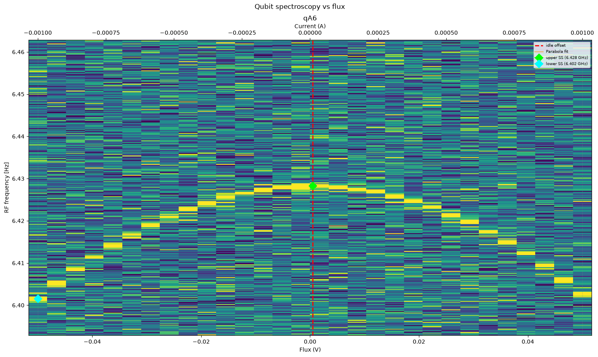

# Qubit Spectroscopy vs Flux

[`03b_qubit_spectroscopy_vs_flux.py`](../../../../../calibrations/1Q_calibrations/03b_qubit_spectroscopy_vs_flux.py) · **Targets:** qubits · **Category:** 1Q_calibrations

Repeats qubit spectroscopy at many flux-bias points to map the qubit's transition frequency vs. flux, and locate the flux-noise-insensitive "sweet spot."

## Purpose

On a flux-tunable transmon, a SQUID loop (two Josephson junctions in a loop) makes the qubit's effective Josephson energy — and therefore its transition frequency $f_{01}$ — depend on the magnetic flux $\Phi$ threading that loop. Sweeping flux while re-measuring $f_{01}$ at each point traces out this dependence directly.

For a split transmon, the flux dependence of the Josephson energy is **[Koc+2007]**:

$$E_J(\Phi) = E_{J,\max}\left|\cos(\pi\Phi/\Phi_0)\right|$$

which, combined with $f_{01} \approx \sqrt{8 E_J E_C}/h - E_C/h$, makes $f_{01}(\Phi)$ a periodic, cosine-like curve in flux (the general asymmetric-junction form is $f_{01}(\Phi) = (f_{01}^{\max} + E_C/h)\left[d^2+(1-d^2)\cos^2(\pi\Phi/\Phi_0)\right]^{1/4} - E_C/h$ **[Koc+2007]**, **[Kra+2019]**). The extrema of this curve — where $\partial f_{01}/\partial\Phi = 0$ — are the **sweet spots**: bias points where the qubit frequency is first-order insensitive to flux noise, substantially reducing flux-induced dephasing. This is the flux-tunable-transmon analog of the noise-insensitive "optimal working point" first demonstrated for the quantronium qubit **[Vio+2002]**. Parking the qubit at a sweet spot before later calibrations (Rabi, T1, Ramsey, etc.) keeps those measurements from being corrupted by flux-noise-driven frequency wander.

This node locates that sweet spot empirically: rather than fitting the full non-linear dispersion relation above, it fits a **local cosine** to the extracted peak frequency vs. flux (`fit_oscillation`, i.e. $a\cos(2\pi f x+\phi)+\text{offset}$) over just the swept window — a good local approximation near a single extremum, distinct from the exact relation above. This distinction matters when comparing fitted parameters (such as `dv_phi0`) against a full device model.

Each individual point in the sweep is itself a qubit spectroscopy measurement: a continuous ("saturation") drive tone near the qubit's expected frequency shifts population out of the ground state, which — via the dispersive qubit-resonator coupling **[BGGW2021]** — changes the resonator's demodulated response at readout. See `03a_qubit_spectroscopy` for the single-flux-point version of this technique.

{ .calibration-result }

## Mechanism

For each (drive-frequency detuning, flux-bias) point in the 2D sweep:

1. Initialize the flux point (`node.machine.initialize_qpu`) for all batched qubits.
2. Reset the qubit — this call is hardcoded to `qubit.reset_qubit_thermal()` in the source, regardless of the `reset_type` common parameter. Setting `reset_type="active"` has **no effect** in this node; it always performs a thermal reset.
3. Play a flux pulse on `qubit.z` (amplitude scaled to the current swept DC level) concurrently with the drive pulse (`operation`, scaled by `operation_amplitude_factor`) on `qubit.xy`, both held for the same duration.
4. `align()`, then measure the resonator (`qubit.resonator.measure("readout", ...)`).

Analysis (`process_raw_dataset` / `fit_raw_data` in `calibration_utils/qubit_spectroscopy_vs_flux/analysis.py`):

1. Convert I/Q to volts, compute amplitude/phase, and locate the spectroscopy peak at each flux point (`peaks_dips`, `prominence_factor=5`).
2. Fit peak position vs. flux to a cosine (`fit_oscillation`).
3. From the cosine's fitted phase and frequency, derive the idle-offset flux correction, the absolute sweet-spot frequency, the minimum-frequency flux point, and the flux-quantum-scale diagnostics (`dv_phi0`, `phi0_current`, `m_pH`) — the same mutual-inductance flux-to-current conversion used for in-situ flux-line calibration in **[Dai+2021]**. See Outputs for which of these are written back to QUAM state.

## Prerequisites

- Mixer/Octave calibration (`01a_mixer_calibration`).
- Time of flight calibrated (`01a_time_of_flight` or `01b_time_of_flight_mw_fem`).
- Readout calibrated (`02a_resonator_spectroscopy`, and/or `02b`/`02c`).
- A rough qubit frequency already found (`03a_qubit_spectroscopy`) — this node sweeps *around* the qubit's currently configured `f_01`, it does not search blindly.
- `qubit.z.flux_point` already set to `"independent"` or `"joint"` — this determines which state attribute gets updated (see State Updates).

## Parameters

Inherits the common parameter set — see [Common node parameters](_common_parameters.md) — plus the node-specific parameters below.

| Parameter | Type | Default | Unit | Description | Effect |
|---|---|---|---|---|---|
| `num_shots` | `int` | 50 | – | Averages per (drive-frequency, flux-bias) point. | More shots lower noise on I/Q at each point; no effect on extracted frequency/flux values; linear cost in run time. |
| `operation` | `str` | `"saturation"` | – | QUAM pulse operation played on `qubit.xy`. | Selects which configured pulse drives the qubit at each flux point. |
| `operation_amplitude_factor` | `float` | 0.1 | – (pre-factor, restricted to `[-2, 2)`) | Amplitude scale applied to `operation`. | 10x lower than `03a_qubit_spectroscopy`'s default of 1.0, to limit power broadening and drive-induced (AC-Stark-like) shifts of the spectroscopic line **[AE1987]** — see note below. |
| `operation_len_in_ns` | `Optional[int]` | `None` (uses pulse's configured length) | ns | Overrides the duration of `operation`. | Longer drive at fixed amplitude saturates the transition more; also sets how long the concurrent flux pulse is held. |
| `frequency_span_in_mhz` | `float` | 100.0 | MHz | Full width of the qubit-drive detuning sweep, centered on the qubit's current `f_01`. | Must stay wide enough to keep the qubit peak inside the window across the entire flux sweep — the qubit frequency moves with flux, so a span adequate at one flux point can miss the peak at another. Directly gates the success criterion. |
| `frequency_step_in_mhz` | `float` | 0.5 | MHz | Step size of the drive-frequency sweep. | Finer steps sharpen the extracted peak position at every flux point, at proportional cost in run time (multiplies with the flux-point count too). |
| `flux_offset_span_in_v` | `float` | 0.05 | V | Full symmetric span of the flux-bias sweep, centered on the qubit's currently configured flux offset. | Must be wide enough to cross a sweet spot, or the fit has nothing to lock onto. See source-docstring note below. |
| `num_flux_points` | `int` | 11 | – | Number of points across `flux_offset_span_in_v`. | More points resolve the flux dispersion curve better, at proportional cost in total sweep time (multiplies with the frequency-axis point count). |
| `input_line_impedance_in_ohm` | `Optional[int]` | 50 | Ω | Assumed impedance of the flux line, used only to convert the swept voltage into an equivalent current for the diagnostic outputs. | Does not affect what's measured or written to state — only rescales `phi0_current`/`m_pH` in the fit results. |
| `line_attenuation_in_db` | `Optional[int]` | 0 | dB | Attenuation between the flux DAC and the cryostat, used in the same voltage→current conversion above. | Same scope as `input_line_impedance_in_ohm` — diagnostic-only, no effect on state updates. |

> **Source docstring is stale:** `flux_offset_span_in_v`'s docstring in `calibration_utils/qubit_spectroscopy_vs_flux/parameters.py` reads "Minimum flux bias offset in volts. Default is -0.02 V" — this matches neither the parameter's actual meaning nor its default. The verified behavior, read directly from the `Parameters` class and its use in `create_qua_program`, is a **span** around the current flux offset, default **0.05 V**.

> **Why the drive amplitude default is lower here than in `03a`:** a continuous drive on a two-level system produces a generalized Rabi splitting that broadens the observed transition, and when off-resonant, shifts its apparent frequency via the AC Stark effect — both effects grow with drive amplitude **[AE1987]**. Because this node repeats the scan at every flux point while tracking a frequency that itself moves with flux, keeping the drive weak (`operation_amplitude_factor = 0.1`) avoids power-broadening or shifting the line enough to bias the extracted sweet spot.

## Outputs

**Measured:** `I`/`Q` (or discriminated `state` if `use_state_discrimination`), `IQ_abs`, `phase`, at every (frequency, flux) point.

| Fitted quantity | Unit | Written to state? | Description |
|---|---|---|---|
| `qubit_frequency` | Hz | ✅ | Absolute `f_01` at the fitted sweet spot (`frequency_shift` + current `RF_frequency`). |
| `idle_offset` | V | ✅ | Flux-bias correction needed to reach the sweet spot. |
| `frequency_shift` | Hz | – | Sweet-spot frequency relative to the qubit's current `RF_frequency`; also the quantity checked against `frequency_span_in_mhz` for the success criterion. |
| `flux_min` | V | – | Flux bias at the minimum-frequency point of the fitted curve (distinct from `idle_offset`, which targets the extremum nearest zero phase). |
| `dv_phi0` | V | – | Voltage span corresponding to one flux quantum, from the fitted oscillation period. |
| `phi0_current` | A | – | Current-equivalent of one flux quantum, using `input_line_impedance_in_ohm`/`line_attenuation_in_db`. |
| `m_pH` | pH | – | SQUID loop mutual inductance estimate derived from the same fit. |

**Success criterion:** $|{\tt frequency\_shift}| < {\tt frequency\_span\_in\_mhz}$ (converted to Hz), and none of `frequency_shift`/`flux_min`/`idle_offset` are NaN. Checked per-qubit in `_extract_relevant_fit_parameters`.

## State Updates

Applied only when the fit succeeds — failed qubits are skipped entirely (no partial update):

| Attribute | New value | Mode | Condition |
|---|---|---|---|
| `qubit.f_01` | fitted `qubit_frequency` | replace | outcome successful |
| `qubit.xy.RF_frequency` | fitted `qubit_frequency` | replace | outcome successful |
| `qubit.z.independent_offset` | fitted `idle_offset` | **replace** | outcome successful **and** `qubit.z.flux_point == "independent"` |
| `qubit.z.joint_offset` | fitted `idle_offset` | **increment (`+=`)** | outcome successful **and** `qubit.z.flux_point == "joint"` |

The independent-vs-joint branches have genuinely different semantics: an independent-flux-point qubit's offset is replaced outright by the new fit, while a joint-flux-point qubit's offset is *incremented* by it. Re-running this node repeatedly on a joint-flux-point qubit keeps adding to `joint_offset` rather than converging to a fixed value (see Troubleshooting #1).

> **`freq_vs_flux_01_quad_term` is not updated by this node.** Source contains a commented-out line attempting to write it, and the current `FitParameters` dataclass has no `quad_term` field at all. That attribute is instead written by `09a_ramsey_vs_flux_calibration` (`calibrations/1Q_calibrations/09a_ramsey_vs_flux_calibration.py:260`).

## Troubleshooting

See also: [General troubleshooting](_general_troubleshooting.md#general-troubleshooting) for issues common to most nodes in this library. Below are issues specific to this node.

1. **A joint-flux-point qubit's flux offset drifts further from expected on repeated re-runs** → this is expected, not a bug: `qubit.z.joint_offset` is incremented (`+=`) on every successful run, not replaced. Check the current value before re-running rather than assuming convergence the way an independent-flux-point qubit would.

## Parameter Tuning Heuristics

See also: [General parameter tuning heuristics](_general_troubleshooting.md#general-parameter-tuning-heuristics) for guidance common to most nodes in this library. Below is guidance specific to this node.

1. **Fit succeeds, but the reported sweet spot sits at or very near the edge of `flux_offset_span_in_v`** → the window may not contain a full extremum of the flux dispersion; the true sweet spot could be just outside the scanned range. Re-run centered on the same point with a wider `flux_offset_span_in_v` (and correspondingly wider `frequency_span_in_mhz`, since the frequency excursion grows with the flux range).
2. **Peak is broad, split, or the fitted frequency drifts run-to-run at nominally the same flux point** → drive amplitude likely too high, causing power broadening or an AC-Stark-like shift. Reduce `operation_amplitude_factor` back toward the default; consider `operation_len_in_ns` as an alternative saturation knob before raising amplitude further.
3. **`dv_phi0`, `phi0_current`, or `m_pH` come out wildly inconsistent with the SQUID loop's known design value** → `input_line_impedance_in_ohm` and `line_attenuation_in_db` default to 50 Ω / 0 dB, which may not reflect the actual flux-line hardware (attenuator chain, cabling). Update both to the calibrated real values before trusting these diagnostics — they have no effect on the `qubit_frequency`/`idle_offset` state updates, so this does not call the sweet-spot result itself into question.
4. **The fitted sweet spot jumps discontinuously between otherwise-similar runs, or moves inconsistently as `flux_offset_span_in_v` is widened** → with too few `num_flux_points` relative to how many oscillation periods the span actually covers, the cosine fit can lock onto an aliased period. Increase `num_flux_points` (denser sampling) before widening the span further, and cross-check the implied periodicity against `dv_phi0` from a prior run.

## Next Steps

`04a_rabi_chevron` — the repository's bring-up calibration graph (`calibrations/1Q_calibrations/80_calibration_graph_bringup_flux_tunable_transmon.py`) wires this node directly into the chevron-pattern pulse-duration calibration that follows.

## References

**[Koc+2007]** J. Koch, T. M. Yu, J. Gambetta, A. A. Houck, D. I. Schuster, J. Majer, A. Blais, M. H. Devoret, S. M. Girvin, and R. J. Schoelkopf, "Charge-insensitive qubit design derived from the Cooper pair box," *Phys. Rev. A*, vol. 76, no. 4, p. 042319, 2007.

**[Kra+2019]** P. Krantz, M. Kjaergaard, F. Yan, T. P. Orlando, S. Gustavsson, and W. D. Oliver, "A quantum engineer's guide to superconducting qubits," *Appl. Phys. Rev.*, vol. 6, no. 2, p. 021318, 2019.

**[Vio+2002]** D. Vion, A. Aassime, A. Cottet, P. Joyez, H. Pothier, C. Urbina, D. Esteve, and M. H. Devoret, "Manipulating the quantum state of an electrical circuit," *Science*, vol. 296, no. 5569, pp. 886–889, 2002.

**[BGGW2021]** A. Blais, A. L. Grimsmo, S. M. Girvin, and A. Wallraff, "Circuit quantum electrodynamics," *Rev. Mod. Phys.*, vol. 93, no. 2, p. 025005, 2021.

**[Dai+2021]** X. Dai, D. M. Tennant, R. Trappen, A. J. Martinez, D. Melanson, M. A. Yurtalan, Y. Tang, S. Novikov, J. A. Grover, S. M. Disseler, J. I. Basham, R. Das, D. K. Kim, A. J. Melville, B. M. Niedzielski, S. J. Weber, J. L. Yoder, D. A. Lidar, and A. Lupascu, "Calibration of flux crosstalk in large-scale flux-tunable superconducting quantum circuits," *PRX Quantum*, vol. 2, p. 040313, 2021.

**[AE1987]** L. Allen and J. H. Eberly, *Optical Resonance and Two-Level Atoms*. New York: Dover Publications, 1987.
