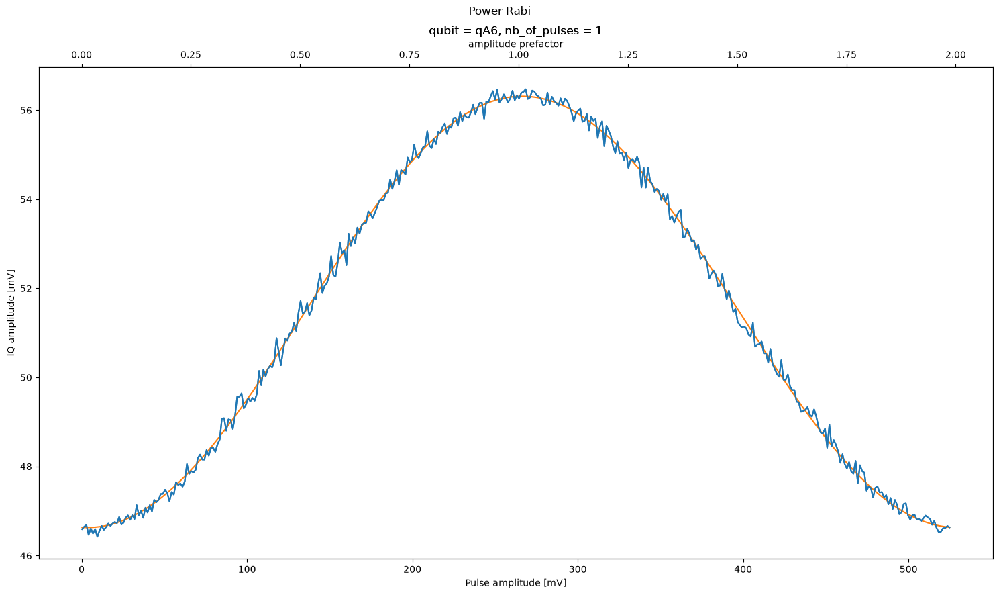

# Power Rabi

[`04b_power_rabi.py`](../../../../../calibrations/1Q_calibrations/04b_power_rabi.py)

Sweep the drive amplitude to find the value that implements a calibrated $\pi$ (or $\pi/2$) rotation.

## Purpose

A Rabi experiment measures excited-state population vs drive strength. The first maximum corresponds to a $\pi$ pulse. Repeating the pulse many times at each amplitude (error amplification) sharpens the optimum and enables sub-percent amplitude calibration.

{ .calibration-result }

## Prerequisites

- Qubit transition frequency found (node 03a_qubit_spectroscopy).

## (Chosen) Input Parameters Effect

* Amplitude:
    * Span — too narrow may miss the $\pi$ point; too wide wastes shots on over-rotation.
    * Step — finer steps resolve the optimum when using error amplification.
* Error amplification:
    * Number of repeated pulses — more repetitions sharpen the amplitude optimum but amplify decoherence and readout errors.
* Which gate:
    * $\pi$ vs $\pi/2$ — selects which rotation angle is being calibrated.

## Output

* Calibrated $\pi$-pulse amplitude (and optionally $\pi/2$ as half of $\pi$).

## Experiment Step-by-Step description

1. For each drive amplitude scale factor:
    1. For each repetition count (1 for standard Rabi, $N>1$ for error amplification):
        1. Reset the qubit.
        1. Apply the target rotation $N$ times at the trial amplitude.
        1. Measure the qubit state.
1. Fit Rabi oscillations vs amplitude.
1. Set the drive amplitude to the $\pi$ point.
