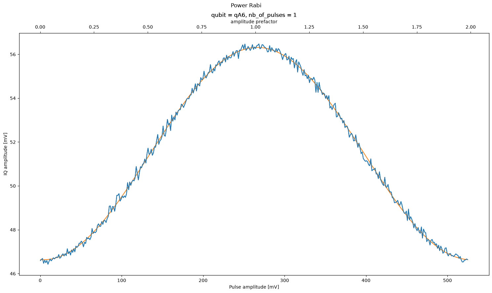

# Power Rabi

[`04b_power_rabi.py`](../../../../../calibrations/1Q_calibrations/04b_power_rabi.py) · **Targets:** qubits · **Category:** 1Q_calibrations

Sweeps drive amplitude at a fixed pulse duration to find the amplitude that implements a calibrated rotation (`x180` by default), with an optional pulse-repetition (error-amplification) mode for sub-percent precision.

## Purpose

A Rabi experiment measures excited-state population as a function of drive strength at fixed duration; the population traces out $\sin^2$-like fringes as amplitude increases through successive multiples of a $\pi$ rotation **[Kra+2019]**, **[AE1987]**. The first such extremum gives the amplitude that implements a $\pi$ pulse in the pulse's currently configured length — this node fits that fringe pattern directly.

The node's module-level description is titled *"POWER RABI WITH ERROR AMPLIFICATION"* and frames repetition as central to the method. In the shipped default configuration, however, **error amplification is off**: `max_number_pulses_per_sweep` defaults to `1`, which collapses the pulse-count sweep to a single-pulse plane — i.e. a plain, single-shot power Rabi. Error amplification only activates when `max_number_pulses_per_sweep` is explicitly raised above 1, which is exactly what the shipped bring-up/retuning graphs do in their later `power_rabi_error_amplification_x180`/`_x90` stages (see Next Steps).

The physics behind amplification, once active, is the same "pulse-train" idea used elsewhere in the literature for fine amplitude tuning: if the amplitude implementing `operation` is exactly correct, repeating it $N$ times returns the qubit to the same population regardless of $N$ (for `x180`, alternating between $|0\rangle$ and $|1\rangle$ every repetition); any amplitude error compounds with each additional repetition, so a small miscalibration that's invisible after one pulse becomes an easily fit deviation after many **[GRTW2021]**. This node's implementation sweeps a set of pulse counts $N$ directly (no leading half-pulse), then locates the amplitude at which the population, averaged across all swept $N$, sits at its extremum — i.e. the amplitude whose outcome is most consistent across repetition count, which is exactly the "population independent of $N$" signature of a correctly calibrated amplitude.

{ .calibration-result }

`BasePowerRabiParameters` (in `calibration_utils/power_rabi/parameters.py`) is shared with `13_power_rabi_ef`, which calibrates the $e\leftrightarrow f$ transition's `EF_x180` pulse using the same amplitude-sweep machinery; that node is not covered here.

## Mechanism

For each (pulse-count, amplitude-prefactor) grid point in the sweep, repeated `num_shots` times for averaging:

1. `qubit.reset(reset_type, simulate)` — honors the common `reset_type` parameter normally (unlike `03a`/`03b`).
2. A QUA `for_` loop plays `operation` (default `"x180"`) `npi` times back-to-back at amplitude scale `a`, where:
   - `amps = arange(min_amp_factor, max_amp_factor, amp_factor_step)` — default `0.001` to `1.99` in steps of `0.005` (≈400 points), i.e. almost the full allowed QUA `amplitude_scale` range of `[-2, 2)`, guaranteeing the sweep crosses at least one full $\pi$-point regardless of how far off the seed amplitude is.
   - `N_pi_vec` (`get_number_of_pulses`) is `[1]` at the default `max_number_pulses_per_sweep=1`. When raised above 1, it becomes `arange(1, max, 2)` (odd counts: 1, 3, 5, …) for `operation="x180"`, or `arange(2, max, 4)` (2, 6, 10, …) for the `x90`-family operations — the parity choice matches which pulse count returns the qubit to a population extremum for that gate.
3. Measure (`readout_state` if `use_state_discrimination`, else raw `I`/`Q`).

> **Stream-processing buffer-size mismatch for `x180` + `use_state_discrimination` + odd `max_number_pulses_per_sweep`.** For that specific combination, the QUA buffer size is computed directly from the parameter as `ceil(max_number_pulses_per_sweep / 2)`, rather than from `len(N_pi_vec)` (which is what every other branch — raw-IQ `x180`, and all `x90`-family branches either way — correctly uses). These two quantities only coincide when `max_number_pulses_per_sweep` is **even**: e.g. at the default of 1 and at the shipped graphs' value of 100 they happen to match, but an odd value (e.g. 101) will produce a buffer sized for one more point than `N_pi_vec` actually contains, which is a latent shape-mismatch bug. Keep `max_number_pulses_per_sweep` even in this operation/discrimination combination.

Analysis (`calibration_utils/power_rabi/analysis.py`):

1. `process_raw_dataset` converts I/Q to volts (unless discriminated) and computes the absolute amplitude axis `full_amp = amp_prefactor × operation's current amplitude`.
2. `fit_raw_data` branches on `max_number_pulses_per_sweep` (read directly from parameters, not from `len(N_pi_vec)`):
   - **`== 1` (default path):** select the single `nb_of_pulses=1` plane and fit a cosine (`fit_oscillation`) to the population vs. `amp_prefactor`. From the fitted phase $\phi$ and frequency $f$: `opt_amp_prefactor = (π − φ_wrapped) / (2π f)` (with $\phi$ folded below $\pi/2$ first), then `opt_amp = opt_amp_prefactor × current amplitude`.
   - **`> 1` (error amplification):** average the data over the `nb_of_pulses` axis, then take the amplitude prefactor that minimizes or maximizes that average (the choice of min vs. max depends on the parity of the swept counts and the operation), giving `opt_amp_prefactor` directly rather than via a cosine fit.
3. Success: `opt_amp`/`opt_amp_prefactor` not `NaN`, and `opt_amp < limits[0].max_x180_wf_amplitude` — again using the **first qubit's** channel-type hardware limit (0.3 V for IQ channels, 0.6 V for MW-FEM) for every qubit in the batch, the same pattern seen in `03a`/`03b`.

## Prerequisites

- Mixer/Octave calibration (`01a_mixer_calibration`).
- Qubit frequency calibrated (`03a_qubit_spectroscopy`, and/or `03b_qubit_spectroscopy_vs_flux`).
- A rough `x180` pulse duration already set (`qubit.xy.operations["x180"].length`) — typically from `04a_rabi_chevron`, since this node calibrates amplitude at whatever duration is currently configured and never touches duration itself.
- Flux operating point specified if relevant (`qubit.z.flux_point`).
- Graph topology: in both bring-up graphs (`80_calibration_graph_bringup_flux_tunable_transmon.py`, `90_calibration_graph_bringup_fixed_frequency_transmon.py`), this node runs directly after `04a_rabi_chevron`.

## Parameters

Inherits the common parameter set — see [Common node parameters](_common_parameters.md) — plus the node-specific parameters below (`BasePowerRabiParameters` + this node's own fields).

| Parameter | Type | Default | Unit | Description | Effect |
|---|---|---|---|---|---|
| `num_shots` | `int` | 50 | – | Averages per (pulse-count, amplitude-prefactor) point. | Cost multiplies across the whole grid, especially with error amplification's extra pulse-count axis. |
| `min_amp_factor` | `float` | 0.001 | – | Lower bound of the amplitude-prefactor sweep. | Near-zero drive; combined with the default upper bound, the sweep spans almost the whole allowed range. |
| `max_amp_factor` | `float` | 1.99 | – | Upper bound of the amplitude-prefactor sweep (QUA `amplitude_scale` hard limit is `[-2, 2)`). | If the fit lands right at this edge, the true $\pi$-point may be outside the swept range — widen if so. |
| `amp_factor_step` | `float` | 0.005 | – | Step size of the amplitude sweep. | ~400 points across the default span; finer steps sharpen the fringe fit at proportional run-time cost. |
| `operation` | `Literal["x180","x90","-x90","y90","-y90"]` | `"x180"` | – | Which configured `qubit.xy` operation to sweep and calibrate. | Selects both the played pulse and which QUAM key gets the fitted amplitude written back. |
| `max_number_pulses_per_sweep` | `int` | 1 | – | Largest pulse-repetition count in the error-amplification sweep. | `1` = plain single-pulse Rabi (amplification **off**, despite the module description's framing — see Purpose). `>1` sweeps repetition counts up to this value; see the buffer-size callout above for a parity caveat. |
| `update_x90` | `bool` | `True` | – | Documented as gating whether `x90`'s amplitude is derived as half of the fitted `x180` amplitude. | **Not actually read anywhere in this node's source** — see callout below. |

> **`update_x90` has no effect in this node.** It is declared on `NodeSpecificParameters` and exposed in the GUI, but grep across `04b_power_rabi.py` and `calibration_utils/power_rabi/` shows it is never referenced in the node's own code. The actual x90-derivation logic in `update_state` is unconditionally gated on `node.parameters.operation == "x180"` alone (see State Updates) — setting `update_x90=False` does **not** suppress that write. The shipped calibration graphs (`80`/`81`/`90`/`91`) pass `update_x90=False` when running this node a second time with `operation="x90"` for a dedicated x90 calibration pass, but that value is inert; the reason that second pass's x90 write doesn't clash with anything is simply that its `operation` isn't `"x180"`, not that `update_x90` did anything.

## Outputs

**Measured:** `I`/`Q` (volts, or discriminated `state`), `full_amp` (absolute amplitude coordinate), at every (pulse-count, amplitude-prefactor) point.

| Fitted quantity | Unit | Written to state? | Description |
|---|---|---|---|
| `opt_amp_prefactor` | – | – | Amplitude scale factor (relative to the operation's *current* amplitude) estimated to deliver the target rotation. |
| `opt_amp` | V | ✅ | Absolute amplitude: `opt_amp_prefactor × current amplitude`. |
| `operation` | – | – (metadata) | Which operation this fit result applies to; echoes `node.parameters.operation`. |
| `success` | – | – (gates the update) | See criterion below. |

**Success criterion:** `opt_amp_prefactor`/`opt_amp` not `NaN`, **and** `opt_amp < limits[0].max_x180_wf_amplitude` (first qubit's channel limit applied to every qubit in the batch — see Mechanism).

## State Updates

Applied only when the fit succeeds — failed qubits are skipped entirely:

| Attribute | New value | Mode | Condition |
|---|---|---|---|
| `qubit.xy.operations[operation].amplitude` | fitted `opt_amp` | replace | outcome successful |
| `qubit.xy.operations["x90"].amplitude` | fitted `opt_amp / 2` | replace | outcome successful **and** `node.parameters.operation == "x180"` (**not** gated by `update_x90`, despite its name — see Parameters callout) |

## Troubleshooting

See also: [General troubleshooting](_general_troubleshooting.md#general-troubleshooting) for issues common to most nodes in this library. Below are issues specific to this node.

1. **Fitted `opt_amp` seems implausible / gets rejected as "failed" despite a clean-looking fringe pattern** → the amplitude-limit check uses `limits[0]` — the *first* qubit's channel-type hardware limit — for every qubit in a multiplexed run. In a mixed-hardware batch (IQ vs. MW-FEM channels, which have different `max_x180_wf_amplitude`), this can misjudge later qubits. Re-run the suspect qubit alone to get a correctly-scoped check.
2. **Set `update_x90=False` expecting x90's amplitude to stay untouched, but it still gets overwritten** → expected given the current source: `update_x90` is never read (see Parameters callout); the x90 write fires whenever `operation == "x180"` succeeds, full stop. The only way to avoid it is to not run with `operation="x180"` on that pass, or to manually restore `qubit.xy.operations["x90"].amplitude` afterward.
3. **Error-amplification run (`max_number_pulses_per_sweep > 1`) with `operation="x180"` and `use_state_discrimination=True` throws a shape/buffering error** → use an **even** `max_number_pulses_per_sweep`. Odd values create a mismatch between the QUA stream buffer size (`ceil(max_number_pulses_per_sweep/2)`) and the actual number of swept pulse counts (`len(arange(1, max_number_pulses_per_sweep, 2))`) — see the Mechanism callout. The shipped graphs use `100`, which is safe.
4. **Calibrating `x90` (or `-x90`/`y90`/`-y90`) directly, not as half of `x180`** → set `operation` accordingly. In that case the state update writes *only* `qubit.xy.operations[operation].amplitude` — the `x180`-derived x90 write never fires unless `operation` is exactly `"x180"`. This is the pattern the shipped graphs use for their `power_rabi_error_amplification_x90` stage.

## Parameter Tuning Heuristics

See also: [General parameter tuning heuristics](_general_troubleshooting.md#general-parameter-tuning-heuristics) for guidance common to most nodes in this library. Below is guidance specific to this node.

1. **No Rabi oscillation visible anywhere in the amplitude sweep** → since `amps` scales the operation's *existing* configured amplitude, if that seed amplitude is near zero, no prefactor in `[min_amp_factor, max_amp_factor]` produces meaningful drive strength. Set a reasonable nonzero seed on `qubit.xy.operations[operation]` (e.g. via `04a_rabi_chevron` first) before running this node.
2. **Fitted `opt_amp` sits right at the edge of the swept range** (near `min_amp_factor`× or `max_amp_factor`×current) → the true $\pi$-point likely lies outside the current window. Widen `min_amp_factor`/`max_amp_factor` (mindful of the QUA `amplitude_scale` hard limit of `[-2, 2)`) rather than trusting an edge-pinned fit.
3. **Turned on error amplification but the result barely differs from a plain single-pulse fit** → check that `max_number_pulses_per_sweep` is actually greater than 1; the default is `1`, meaning amplification is off *despite* the node's module docstring being titled "POWER RABI WITH ERROR AMPLIFICATION." Explicitly raise it (e.g. to 100, as the bring-up/retuning graphs' `power_rabi_error_amplification_*` stages do) to activate the pulse-train mode.
4. **Fringe contrast collapses well before a clean amplitude extremum emerges, when `max_number_pulses_per_sweep` is large** → repeating the pulse many times amplifies not only amplitude error but also decoherence and any per-pulse leakage/off-resonance error **[GRTW2021]**; if contrast dies out too fast to fit, reduce `max_number_pulses_per_sweep`, or revisit the pulse duration/leakage behavior via `04a_rabi_chevron` before pushing repetition count higher.

## Next Steps

`08b_readout_power_optimization` — in both bring-up graphs, this node feeds directly into readout optimization on its first pass. Much later in the *same* graphs, after `07_iq_blobs` and (for flux-tunable qubits) `09a_ramsey_vs_flux_calibration`, this node is **reused twice** as `power_rabi_error_amplification_x180` then `power_rabi_error_amplification_x90` — both with `max_number_pulses_per_sweep=100`, a narrowed `[0.8, 1.2]` amplitude range at a finer `0.01` step, and `use_state_discrimination=True` — to fine-tune `x180` and then `x90` independently via genuine error amplification, before proceeding to `06a_ramsey`/`05_T1`. The retuning graphs (`81`, `91`) skip the initial coarse pass entirely and start straight from these two error-amplification stages.

## References

**[Kra+2019]** P. Krantz, M. Kjaergaard, F. Yan, T. P. Orlando, S. Gustavsson, and W. D. Oliver, "A quantum engineer's guide to superconducting qubits," *Appl. Phys. Rev.*, vol. 6, no. 2, p. 021318, 2019.

**[AE1987]** L. Allen and J. H. Eberly, *Optical Resonance and Two-Level Atoms*. New York: Dover Publications, 1987.

**[GRTW2021]** Y. Y. Gao, M. A. Rol, S. Touzard, and C. Wang, "Practical guide for building superconducting quantum devices," *PRX Quantum*, vol. 2, p. 040202, 2021.
