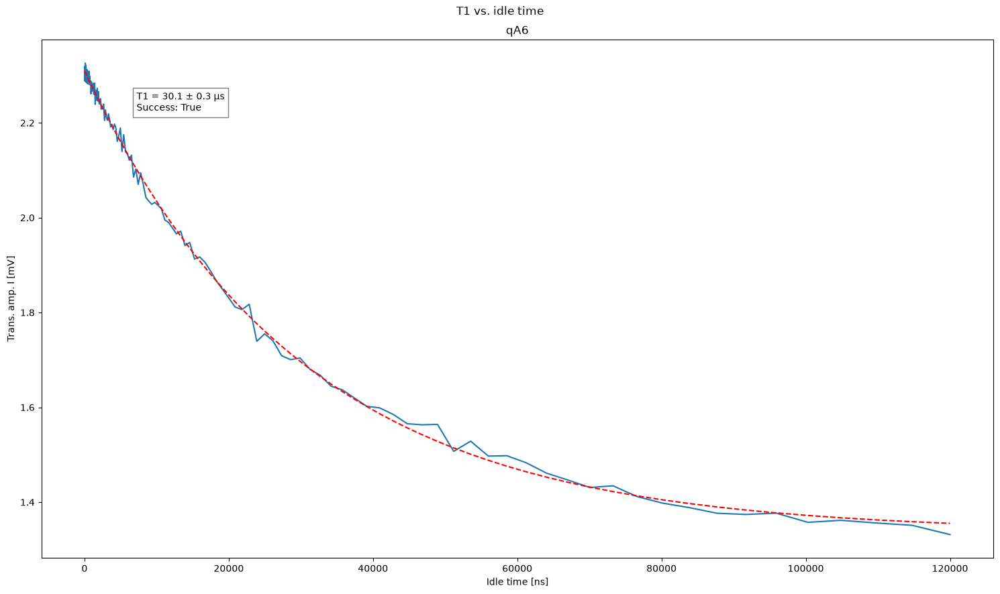

# T₁ Energy Relaxation

[`05_T1.py`](../../../../../calibrations/1Q_calibrations/05_T1.py)

Prepare $|1\rangle$ and wait before readout to measure how quickly the qubit loses energy.

## Purpose

The energy relaxation time $T_1$ limits how long quantum information can be stored in the excited state. This experiment excites the qubit with a $\pi$ pulse, waits for a variable time, and measures the remaining excited-state population. The decay envelope gives $T_1$.

{ .calibration-result }

## Prerequisites

- $\pi$ pulse calibrated (node 04b_power_rabi).
- Readout calibrated (nodes 08a/08b and 07_iq_blobs recommended).

## (Chosen) Input Parameters Effect

* Wait time:
    * Range — must span several $T_1$ values for a reliable exponential fit.
    * Step — enough points across the decay curve.
* Averaging:
    * Number of shots — reduces scatter on the exponential without changing $T_1$.

## Output

* Energy relaxation time $T_1$.

## Experiment Step-by-Step description

1. For each wait time:
    1. Reset the qubit.
    1. Apply a $\pi$ pulse to prepare $|1\rangle$.
    1. Wait for the trial duration.
    1. Measure the qubit state.
1. Fit an exponential decay to the excited-state population.
1. Record $T_1$ in the machine configuration.
