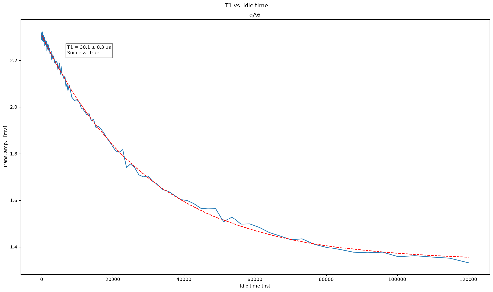

# T1 Energy Relaxation

[`05_T1.py`](../../../../../calibrations/1Q_calibrations/05_T1.py) · **Targets:** qubits · **Category:** 1Q_calibrations

Excites the qubit with a $\pi$ pulse, waits a variable idle time, and fits the exponential decay of the excited-state population to extract the energy relaxation time $T_1$.

## Purpose

$T_1$ sets the timescale over which the qubit irreversibly loses its excitation to the environment — through coupling to two-level-system (TLS) defects, the Purcell effect via the readout resonator, dielectric and quasiparticle loss, or any other channel that lets the $|1\rangle$ state decay to $|0\rangle$ **[Kra+2019]**. It bounds how much time any protocol (a gate sequence, a stored logical qubit, a mid-circuit measurement) has before amplitude damping degrades the state, and it is one of the two coherence numbers (with $T_2$) tracked at every re-tune to catch drift or degradation of the device.

The experiment is the most direct possible probe of this decay: prepare $|1\rangle$ with an $x180$ pulse, wait an idle time $t$, then measure. Repeating this across many $t$ traces out the decay envelope directly, fit to the single-exponential form **[GRTW2021]** (their Eq. 53):

$$S(t) = A\, e^{-t/T_1} + B$$

{ .calibration-result }

## Mechanism

For each idle time $t$ in the sweep, repeated `num_shots` times:

1. Reset the qubit (`qubit.reset(reset_type, ...)`) — honors the common `reset_type` parameter (`"thermal"`, `"active"`, `"active_gef"`), unlike some other nodes in this family that hardcode the reset method.
2. `qubit.align()`, then play `x180` on `qubit.xy` to prepare $|1\rangle$.
3. `qubit.align()` again, then `qubit.resonator.wait(t)` — the idle wait is issued on the **resonator** element specifically, not on `qubit.xy`. A subsequent top-level `align()` (issued once per idle-time step, after all qubits in the batch have been manipulated) forces every element — including the drive line — to catch up to the resonator's later timestamp before readout starts. The net effect on timing is identical to waiting on the drive line directly; this is simply how the source implements the gap.
4. Measure the resonator (`qubit.resonator.measure("readout", ...)`, or `qubit.readout_state(...)` if `use_state_discrimination=True`).

Analysis (`process_raw_dataset` / `fit_raw_data` in `calibration_utils/T1/analysis.py`):

1. Convert I/Q to volts (skipped if using discriminated `state`).
2. Fit `a * exp(t * decay) + offset` to the decay curve along `idle_time` (`fit_decay_exp`) — note the sign convention: `decay` is fit as a (negative) rate, not $-1/T_1$ directly.
3. $T_1 = \tau = -1/{\tt decay}$; the reported uncertainty propagates the covariance of the fitted `decay` parameter: $\sigma_\tau/\tau = \sigma_{\tt decay}/{\tt decay}$.
4. Success requires $\tau > 16\,\text{ns}$ and a relative error $\sigma_\tau/\tau < 1$ (`_extract_relevant_fit_parameters`) — this is a sanity floor to reject unphysical/divergent fits, not a claim about expected $T_1$ values; $16\,\text{ns}$ happens to equal the default `min_wait_time_in_ns` but the source gives no indication the two are linked.

## Prerequisites

- Mixer/Octave calibration (`01a_mixer_calibration` or `01b`).
- Readout calibrated (`02a_resonator_spectroscopy`, and/or `02b`/`02c`).
- Qubit $x180$ pulse calibrated (`03a_qubit_spectroscopy`, `04b_power_rabi`).
- (Optional) Readout parameters optimized (`08a`, `08b`, `08c`) — improves signal-to-noise on the decay curve but is not required for a valid fit.
- `qubit.z.flux_point` set as desired, if the qubit is flux-tunable.
- `07_iq_blobs` calibrated, only if running with `use_state_discrimination=True`.

## Parameters

Inherits the common parameter set — see [Common node parameters](_common_parameters.md) — plus the `IdleTimeNodeParameters` group (shared by this whole $T_1$/Ramsey/echo family) and one node-specific parameter.

| Parameter | Type | Default | Unit | Description | Effect |
|---|---|---|---|---|---|
| `num_shots` | `int` | 1000 | – | Averages per idle-time point. | Reduces scatter on the exponential without changing the fitted $T_1$; linear cost in run time. |
| `min_wait_time_in_ns` | `int` | 16 | ns | Shortest idle time swept. | Anchors the start of the decay curve near $t=0$; 16 ns is the QUA minimum wait. |
| `max_wait_time_in_ns` | `int` | 30000 | ns | Longest idle time swept. | Must extend to several multiples of the qubit's expected $T_1$ so the decay is fully resolved down into the noise floor — see Parameter Tuning Heuristics #1. |
| `wait_time_num_points` | `int` | 500 | – | Number of idle-time points between the min and max. | More points reduce fit variance at proportional cost in run time. |
| `log_or_linear_sweep` | `Literal["log", "linear"]` | `"log"` | – | Spacing of the idle-time sweep. | **Logarithmic by default.** A single exponential's information content per unit time is concentrated at short $t$ (where the curve is changing fastest relative to the noise floor); a log-spaced sweep places most of its points there, while a linear sweep spends many points at long $t$ where the signal has already decayed into the noise and each additional point contributes comparatively little to constraining $T_1$. |

## Outputs

**Measured:** `I`/`Q` (or discriminated `state`), at every idle-time point.

| Fitted quantity | Unit | Written to state? | Description |
|---|---|---|---|
| `tau` | ns | ✅ (as `qubit.T1`, in seconds) | Fitted $T_1$, $= -1/{\tt decay}$. |
| `tau_error` | ns | – | Propagated fit uncertainty on `tau`. |

**Success criterion:** `tau > 16 ns` **and** `tau_error / tau < 1`. Checked per-qubit in `_extract_relevant_fit_parameters`.

## State Updates

Applied only when the fit succeeds — failed qubits are skipped entirely:

| Attribute | New value | Mode | Condition |
|---|---|---|---|
| `qubit.T1` | fitted `tau` (converted ns → s) | replace | outcome successful |

## Troubleshooting

See also: [General troubleshooting](_general_troubleshooting.md#general-troubleshooting) for issues common to most nodes in this library. Below are issues specific to this node.

1. **Curve looks flat / no visible decay at all** → either `max_wait_time_in_ns` is far too short relative to $T_1$, or the $x180$ pulse (from `04b_power_rabi`) isn't actually preparing $|1\rangle$ — check the power-Rabi calibration before assuming this node itself is broken.
2. **Fit succeeds but the reported $T_1$ drifts noticeably run-to-run at nominally fixed conditions** → this is common and not necessarily a bug: TLS-defect coupling and other loss channels drift over time and with flux/frequency; if the drift correlates with elapsed time since the last flux-point recalibration, re-run `03b_qubit_spectroscopy_vs_flux`/`09a_ramsey_vs_flux_calibration` before re-trusting $T_1$.
3. **Measured $T_1$ changes when `08b_readout_power_optimization` or `08a_readout_frequency_optimization` is re-run, or depends on readout pulse power/duration** → this is the well-known **"$T_1$ vs. $\bar n$" problem**: "in practice, a powerful [readout] drive triggers a significant level of qubit relaxation. This phenomena is commonly referred to as the $T_1$ versus $\bar n$ problem and its exact physical mechanism is still an ongoing topic of research" **[GRTW2021]**. Treat readout-power-dependent $T_1$ as an expected, open physical effect rather than evidence of a bug in this node — but do keep readout power consistent between re-tunes if you want $T_1$ trend data to be comparable.
4. **Fitted $T_1$ is systematically shorter with `reset_type="thermal"` than with `"active"`, or vice versa** → residual excited-state population left over from an imperfectly calibrated reset shows up as a biased fit amplitude/offset (`a`, `offset`), not necessarily a change in the decay rate itself — but check that `"active"`/`"active_gef"` reset is actually well-calibrated before trusting it over the (slower but simpler) thermal default.
5. **`use_state_discrimination=True` gives a visibly different $T_1$ or success rate than the raw-I/Q version** → discriminated `state` requires `07_iq_blobs` to already be well calibrated; a stale IQ-blob calibration (e.g. after a readout frequency/power change) will misclassify shots near the decision boundary and bias the fitted decay, especially at long idle times where the state is close to $|0\rangle$ already. Re-run `07_iq_blobs` before trusting a state-discriminated $T_1$ that disagrees with the I/Q version.

## Parameter Tuning Heuristics

See also: [General parameter tuning heuristics](_general_troubleshooting.md#general-parameter-tuning-heuristics) for guidance common to most nodes in this library. Below is guidance specific to this node.

1. **Fit fails, or `tau` comes back implausibly small/large with a huge error bar** → `max_wait_time_in_ns` (default 30 µs) is likely mismatched to the qubit's actual $T_1$. If the decay hasn't visibly reached the noise floor by the end of the sweep, the offset `B` and decay rate are poorly separated in the fit — widen `max_wait_time_in_ns` to several multiples of the expected $T_1$. If it decays to the floor almost immediately, narrow it instead to concentrate points where the curve is still informative.
2. **Fit quality is markedly worse after switching `log_or_linear_sweep` to `"linear"` at the same `wait_time_num_points`** → expected, per the reasoning above: linear spacing spends many points at long $t$ (low information density per point once past a few $T_1$) at the cost of density near $t=0$ (highest information density). Prefer the `"log"` default unless there's a specific reason (e.g. wanting uniform coverage for a non-exponential secondary effect) to switch.

## Next Steps

`06b_echo` — the repository's bring-up calibration graphs (`80_calibration_graph_bringup_flux_tunable_transmon.py` and `90_calibration_graph_bringup_fixed_frequency_transmon.py`) both wire this node directly into the Hahn-echo $T_2$ measurement that follows (`ramsey` → `T1` → `T2echo`).

## References

**[Kra+2019]** P. Krantz, M. Kjaergaard, F. Yan, T. P. Orlando, S. Gustavsson, and W. D. Oliver, "A quantum engineer's guide to superconducting qubits," *Appl. Phys. Rev.*, vol. 6, no. 2, p. 021318, 2019.

**[GRTW2021]** Y. Y. Gao, M. A. Rol, S. Touzard, and C. Wang, "Practical guide for building superconducting quantum devices," *PRX Quantum*, vol. 2, p. 040202, 2021.
