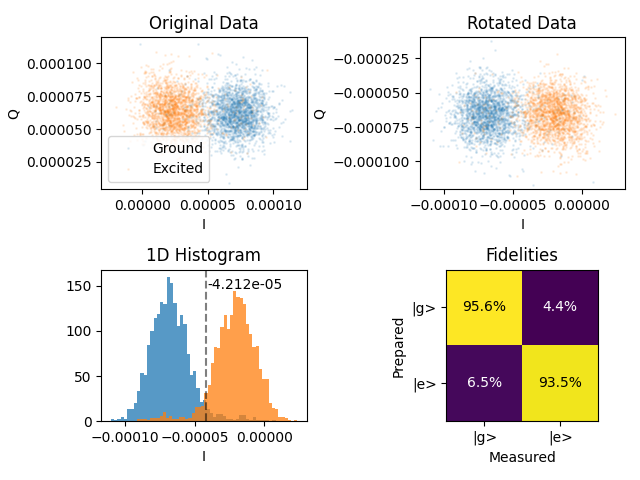

# IQ Blobs

[`07_iq_blobs.py`](../../../../../calibrations/1Q_calibrations/07_iq_blobs.py) · **Targets:** qubits · **Category:** 1Q_calibrations

Repeated single-shot readout of the qubit prepared in $|g\rangle$ and $|e\rangle$ to characterize dispersive readout: the integration-weight rotation angle, the ge discrimination threshold, the repeat-until-success (RUS) exit threshold, and the readout confusion matrix.

## Purpose

Dispersive readout maps the qubit's state onto the resonator's transmitted/reflected field through the state-dependent dispersive shift $\chi$ **[BGGW2021]**: the resonator's dressed frequency (and hence the demodulated I/Q response at a fixed probe frequency) differs depending on whether the qubit is in $|g\rangle$ or $|e\rangle$. Averaged over enough shots this produces two distinguishable populations ("blobs") in the IQ plane, but any single measurement is a noisy draw from one of them — the two blobs have finite width and, if not fully separated, overlap. Single-shot state assignment therefore has to be treated as a statistical binary-classification problem, not merely a matter of checking which side of some geometric midpoint a point falls on.

This node builds the statistics needed to do that classification well: it repeats readout `num_shots` times with the qubit prepared in $|g\rangle$ and, on alternating measurements, in $|e\rangle$ (via an `x180` pulse), and fits the resulting two-cloud distribution to extract (1) the phase rotation that aligns the $|g\rangle$/$|e\rangle$ separation onto a single quadrature — so that a real-valued threshold on that one quadrature captures essentially all of the discriminating information — (2) the threshold itself, chosen to minimize total misclassifications rather than simply bisecting the two blob centers, (3) a second, tighter threshold used only to decide when repeat-until-success (RUS) active reset can stop retrying, and (4) the resulting confusion matrix: the actual $P(\text{measured}\,|\,\text{prepared})$ rates, which fold together resonator-response separation, the `x180` pulse's own fidelity, and (per **[Gam+2007]**) any qubit relaxation that occurs during the measurement window itself — a real single-shot fidelity is never just "how far apart are the blobs," but includes how long the measurement takes relative to $T_1$ and how much of that time contributes to distinguishing power at all. The finite width of the confusion matrix's off-diagonal terms — even for well-separated blobs — is also shaped by the resonator field's ring-up/ring-down transient (time constant $\sim 1/\kappa$): the fixed, flat (boxcar) integration weights this node computes and writes do not correct for the fact that the first and last fractions of the returning signal carry comparatively little state information **[GRTW2021]**. That refinement (an integration-weight envelope shaped to the difference between the average $|g\rangle$ and $|e\rangle$ trajectories) is not implemented here; see Troubleshooting #7.

{ .calibration-result }

## Mechanism

For each of `num_shots` repetitions, per qubit:

1. Reset the qubit (`qubit.reset(reset_type, simulate)`), then measure the resonator with `operation` (default `"readout"`) to record $I_g, Q_g$ — the qubit is nominally in $|g\rangle$.
2. Wait `qubit.resonator.depletion_time` (so a lingering readout-photon population from step 1 doesn't leak into the reset in step 3 if `reset_type="active"`).
3. Reset the qubit again, play `x180` on `qubit.xy` to drive it to $|e\rangle$, `align()`, then measure the resonator with the same `operation` to record $I_e, Q_e$.
4. Wait `depletion_time` again.

Note the qubit is reset independently before **each** of the two measurements (twice per shot), rather than measured once in $|g\rangle$ and then driven straight to $|e\rangle$ from there — this decorrelates the two measurements at the cost of double the per-shot reset overhead.

Analysis (`process_raw_dataset` / `fit_raw_data` in `calibration_utils/iq_blobs/analysis.py`):

1. Convert raw I/Q to volts.
2. Compute the rotation angle `iw_angle` = $\arctan2\!\big(\overline{Q_e}-\overline{Q_g},\ \overline{I_g}-\overline{I_e}\big)$ (shot-averaged), then flip it by $\pi$ if needed so that, after rotation, the $|e\rangle$ population sits at higher rotated-$I$ than $|g\rangle$ — this fixes a consistent sign convention.
3. Rotate every individual shot by this angle (`Ig_rot`, `Qg_rot`, `Ie_rot`, `Qe_rot`).
4. `rus_threshold`: the mode (histogram peak, 100 bins) of the rotated $|g\rangle$ population — the single most probable ground-state $I$ value, used as a tight, "are we really back in $|g\rangle$" check.
5. `ge_threshold`: found by numerically minimizing (Nelder-Mead, `scipy.optimize.minimize`) the total count of misclassified shots (`_false_detections`) — **not** the midpoint between the two blob means; if the blobs have unequal populations or widths, the fidelity-optimal threshold is skewed toward the more concentrated one.
6. The confusion matrix (`gg`, `ge`, `eg`, `ee`) and `readout_fidelity` = $100\times(gg+ee)/2$ are built directly from classification counts at `ge_threshold`.

**Flagged from source:**

- **State-update sign convention:** `integration_weights_angle -= iw_angle` (line in `07_iq_blobs.py`'s `update_state`) — a **decrement**, not an overwrite. Because the raw I/Q fed into the fit already reflect whatever `integration_weights_angle` was configured *before* this run, `iw_angle` measures the *residual* rotation still present. Subtracting it is therefore self-correcting: re-running this node repeatedly on a stable setup should converge the residual toward zero, unlike parameters elsewhere in this library that are unconditionally incremented (see e.g. `qubit.z.joint_offset` in `03b_qubit_spectroscopy_vs_flux`).
- **Threshold unit conversion:** `operation.threshold = ge_threshold * operation.length / 2**12` (and the same for `rus_exit_threshold`). This is the algebraic inverse of the volts conversion `convert_IQ_to_V` applies to raw data (`raw * demod_factor * 2**12 / length`), assuming `demod_factor = 1` (the default for a dual-demodulation IQ readout channel, the standard case here). If a differently-configured single-demod readout channel were ever used, this factor would be off by 2×.
- **Confusion matrix write is conditional on `operation`:** `q.resonator.confusion_matrix = fit_result["confusion_matrix"]` only runs `if node.parameters.operation == "readout"`. Since `confusion_matrix` lives on the resonator (one value, not per-operation), running this node with `operation="readout_QND"` still updates that operation's `integration_weights_angle`/`threshold`/`rus_exit_threshold`, but **silently skips** the confusion-matrix write.

## Prerequisites

- Readout parameters calibrated (`02a_resonator_spectroscopy`, and/or `02b`/`02c`).
- Qubit `x180` pulse calibrated (`03a_qubit_spectroscopy`, `04b_power_rabi`).
- Recommended (per the bring-up graph topology, not enforced by this node): readout frequency and amplitude already optimized (`08a_readout_frequency_optimization`, `08b_readout_power_optimization`) — this node characterizes readout at whatever frequency/amplitude is currently configured, so running it before those two just means re-running it again afterward.

## Parameters

Inherits the common parameter set — see [Common node parameters](_common_parameters.md) — plus the node-specific parameters below.

| Parameter | Type | Default | Unit | Description | Effect |
|---|---|---|---|---|---|
| `num_shots` | `int` | 2000 | – | Number of repeated $|g\rangle$/$|e\rangle$ measurement pairs. | More shots sharpen the histograms (`rus_threshold`) and the misclassification-count optimum (`ge_threshold`), and shrink the statistical uncertainty on `readout_fidelity`; linear cost in run time. |
| `operation` | `Literal["readout", "readout_QND"]` | `"readout"` | – | Which QUAM resonator operation to characterize. | Selects the pulse whose `integration_weights_angle`/`threshold`/`rus_exit_threshold` get updated. `"readout_QND"` is not defined in this repo's default QUAM config — it exists as a hook for a separately-configured, QND-optimized readout pulse (see Purpose, ring-up/ring-down note); using it also changes whether `confusion_matrix` gets written (see Mechanism). |

## Outputs

**Measured:** `I`/`Q` (in volts, `Ig`/`Qg`/`Ie`/`Qe`) for every shot; rotated versions `Ig_rot`/`Qg_rot`/`Ie_rot`/`Qe_rot` in the fit dataset.

| Fitted quantity | Unit | Written to state? | Description |
|---|---|---|---|
| `iw_angle` | rad | ✅ (as a decrement) | Rotation aligning the $|g\rangle$/$|e\rangle$ separation onto the rotated-I axis. |
| `ge_threshold` | V | ✅ (unit-converted) | Misclassification-minimizing discrimination threshold along rotated I. |
| `rus_threshold` | V | ✅ (unit-converted) | Histogram-mode-based RUS exit threshold (center of the $|g\rangle$ blob). |
| `readout_fidelity` | % | – | $100\times(gg+ee)/2$; logged and plotted, not written to QUAM state directly (the underlying confusion matrix is). |
| `confusion_matrix` | – (2×2 list) | ✅ (only if `operation=="readout"`) | $[[gg, ge], [eg, ee]]$ classification-rate matrix at `ge_threshold`. |

**Success criterion:** none of `iw_angle`, `ge_threshold`, `rus_threshold`, `readout_fidelity` are NaN (`_extract_relevant_fit_parameters`). **This does not check the fidelity value itself** — a fit with `readout_fidelity` of, say, 60% is still marked `"successful"` as long as the numbers are finite. Always inspect the logged/plotted fidelity, don't rely on the outcome flag alone.

## State Updates

Applied only when the fit succeeds (non-NaN) — failed qubits are skipped entirely:

| Attribute | New value | Mode | Condition |
|---|---|---|---|
| `qubit.resonator.operations[operation].integration_weights_angle` | current angle $-$ fitted `iw_angle` | **decrement** | outcome successful |
| `qubit.resonator.operations[operation].threshold` | `ge_threshold * operation.length / 2**12` | replace | outcome successful |
| `qubit.resonator.operations[operation].rus_exit_threshold` | `rus_threshold * operation.length / 2**12` | replace | outcome successful |
| `qubit.resonator.confusion_matrix` | fitted `confusion_matrix` | replace | outcome successful **and** `operation == "readout"` |

## Troubleshooting

See also: [General troubleshooting](_general_troubleshooting.md#general-troubleshooting) for issues common to most nodes in this library. Below are issues specific to this node.

1. **Fit reports "successful" but `readout_fidelity` is mediocre (well under, say, 95%)** → the success criterion only checks for NaNs, not fidelity magnitude (see Outputs). A low but finite fidelity usually means insufficient SNR at the current readout frequency/amplitude, or genuine measurement-induced relaxation during the readout window **[Gam+2007]**. Run (or re-run) `08b_readout_power_optimization` and `08a_readout_frequency_optimization` first, then re-run this node — don't chase this by only re-fitting the same data.
2. **Visible cloud of points scattered between the two blobs in `figures["iq_blobs"]`, not just two clean clusters** → shots decaying from $|e\rangle$ to $|g\rangle$ (or vice versa via thermal excitation) partway through the measurement window inflate exactly this "bridge" population, which shows up as elevated `eg`/`ge` confusion-matrix terms. This is a $T_1$-during-readout effect, not a fitting artifact; check whether `readout` pulse `length` and `depletion_time` are longer than necessary for adequate SNR — shortening the readout can reduce the decay window at some SNR cost.
3. **`rus_exit_threshold` sits implausibly close to `threshold`, and active reset (`reset_type="active"`) then either exits on the first attempt almost every time or almost never** → the mode-based `rus_threshold` estimate assumes a clean, unimodal $|g\rangle$-blob histogram; a residual excited-state population left from imperfect thermalization can also bias the histogram peak. Confirm the qubit thermalizes properly with `reset_type="thermal"` first.
4. **`integration_weights_angle` keeps drifting on successive re-runs of this node instead of settling near a stable residual** → the `-=` update (see Mechanism) is self-correcting only if the readout operation's other settings (frequency, amplitude, `length`) are held fixed between runs. If it isn't converging, check for real physical drift (resonator frequency/power) or an intervening run of `08a`/`08b` that changed the operation in between — re-run whichever changed most recently before trusting the angle.
5. **Ran with `operation="readout_QND"` and `qubit.resonator.confusion_matrix` doesn't change** → this is expected, not a bug: the state-update code only writes `confusion_matrix` when `node.parameters.operation == "readout"` (see Mechanism). The QND operation's own `integration_weights_angle`/`threshold`/`rus_exit_threshold` are still updated correctly.
6. **Downstream nodes with `use_state_discrimination=True` (e.g. `05_T1`, `06a_ramsey`, `06b_echo`, DRAG, randomized benchmarking) report noisy or implausible state populations** → they read `threshold` and `integration_weights_angle` set here; verify this node has actually run and succeeded *recently* for exactly the qubits in question. A stale or never-run calibration doesn't error — it silently falls back to whatever `threshold`/`integration_weights_angle` are already in QUAM state (possibly `None`/default).
7. **Confusion-matrix off-diagonal terms are non-negligible even with visibly well-separated, tight blobs** → the flat/boxcar integration weights this node computes don't discount the ring-up/ring-down portions of the returning signal, which is a known limit on achievable fidelity independent of blob separation **[GRTW2021]**. There is no parameter in this node to fix that; it would require a custom integration-weight envelope (e.g. shaped to the difference between the average $|g\rangle$/$|e\rangle$ trajectories) implemented outside this node.

## Parameter Tuning Heuristics

See also: [General parameter tuning heuristics](_general_troubleshooting.md#general-parameter-tuning-heuristics) for guidance common to most nodes in this library. No node-specific heuristics beyond the general ones above.

## Next Steps

This node is a **hard prerequisite for every downstream node run with `use_state_discrimination=True`** — in the bring-up graphs (`80_calibration_graph_bringup_flux_tunable_transmon.py`, `90_calibration_graph_bringup_fixed_frequency_transmon.py`) that includes `power_rabi_error_amplification_x180`/`x90`, `ramsey`, `T1`, `T2echo`, `DRAG_calibration`, and `Randomized_benchmarking` — all of which read the `threshold`/`integration_weights_angle` this node writes. Both retuning graphs (`81_calibration_graph_retuning_flux_tunable_transmon.py`, `91_calibration_graph_retuning_fixed_frequency_transmon.py`) start directly from this node, on the assumption that the readout frequency/amplitude are already well-tuned and only the blob rotation/thresholds need refreshing.

In the bring-up graphs specifically, this node runs immediately after `08a_readout_frequency_optimization` (which itself runs after `08b_readout_power_optimization`), and feeds into `09a_ramsey_vs_flux_calibration` (flux-tunable) or directly into `power_rabi_error_amplification_x180` (fixed-frequency).

## References

**[BGGW2021]** A. Blais, A. L. Grimsmo, S. M. Girvin, and A. Wallraff, "Circuit quantum electrodynamics," *Rev. Mod. Phys.*, vol. 93, no. 2, p. 025005, 2021.

**[Gam+2007]** J. Gambetta, W. A. Braff, A. Wallraff, S. M. Girvin, and R. J. Schoelkopf, "Protocols for optimal readout of qubits using a continuous quantum nondemolition measurement," *Phys. Rev. A*, vol. 76, p. 012325, 2007.

**[GRTW2021]** Y. Y. Gao, M. A. Rol, S. Touzard, and C. Wang, "Practical guide for building superconducting quantum devices," *PRX Quantum*, vol. 2, p. 040202, 2021.
