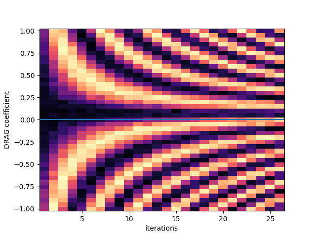

# DRAG Calibration (180 − 180, "Google Method")

[`10b_drag_calibration_180_minus_180.py`](../../../../../calibrations/1Q_calibrations/10b_drag_calibration_180_minus_180.py) · **Targets:** qubits · **Category:** 1Q_calibrations

Plays an increasing number of alternating $\pm\pi$ (or $\pm\pi/2$-pair) pulses while sweeping the DRAG coefficient $\alpha$, and picks the value at which repeated pulses leave the qubit closest to the ground state — the pulse-train, error-amplified analog of an ALLXY diagnostic, applied to $\alpha$ instead of amplitude.

## Purpose

A transmon's anharmonicity is finite and negative ($f_{12} < f_{01}$, typically a few hundred MHz) **[Koc+2007]**. Short, high-amplitude pulses have spectral content comparable to that anharmonicity, driving unwanted leakage into $|2\rangle$. DRAG **[MGRW2009]** suppresses this leakage without slowing the pulse down, by adding a second control quadrature proportional to the time-derivative of the primary envelope, scaled by a coefficient $\alpha$. Getting $\alpha$ wrong under- or over-corrects that leakage and shows up as a phase/rotation error on the qubit's own transition.

This node finds $\alpha$ using an **error-amplification** strategy: for a qubit pulse `operation` (default `"x180"`), it plays an increasing number of alternating $+\theta/-\theta$ pulse pairs (`x180` then `-x180`, i.e. a rotation and its exact inverse) at each of several candidate $\alpha$ values. If $\alpha$ is exactly right, every pair returns the qubit to where it started, so the qubit should sit in $|g\rangle$ regardless of how many pairs are applied. If $\alpha$ is off, each pair leaves a small residual error that **compounds** with pulse count — the same amplification principle used in ALLXY-style diagnostics and pulse-train amplitude calibrations more generally: playing $2N$ repetitions turns a per-pulse error too small to see in a single shot into an $N$-fold-amplified, easily fit deviation **[GRTW2021]**. Here, that amplification count is the pulse-count axis (`max_number_pulses_per_sweep`) rather than a fixed repeated-gate count, and the swept quantity is $\alpha$ rather than a plain amplitude pre-factor — a naming subtlety flagged below.

This is *why the node sits where it does in the calibration graph*: it runs immediately after `06a_ramsey`, `05_T1`, and `06b_echo` (T2 echo) — i.e. only once the qubit frequency is precisely pinned down by a method (Ramsey) that is itself insensitive to $\alpha$ — and immediately before amplitude fine-tuning and randomized benchmarking. Detuning errors and DRAG-coefficient errors otherwise produce very similar-looking symptoms in simple diagnostics; calibrating frequency first via a method blind to $\alpha$, then $\alpha$ itself, then amplitude, removes that ambiguity **[GRTW2021]**. The protocol is described in more detail in the node's own docstring, which links to the original "Google method" reference (https://journals.aps.org/prl/abstract/10.1103/PhysRevLett.117.190503).

{ .calibration-result }

## Mechanism

For each (candidate $\alpha$ pre-factor, number-of-pulse-pairs) point in the 2D sweep, for every qubit in a batch:

1. If `alpha_setpoint` is given, `tracked_updates` temporarily overrides `qubit.xy.operations[operation].alpha` to that value for the whole node run (reverted explicitly at the start of `update_state`, not automatically at context exit — see callout below).
2. `qubit.reset(reset_type, simulate)` — this node **does** honor `reset_type` properly (unlike `03b`/`09a`).
3. `npi` times, play the pulse pair on `qubit.xy`:
   - For `operation == "x180"`: `play(x180 * amp(1,0,0,a))` then `play(x180 * amp(-1,0,0,-a))`.
   - For `operation == "x90"`: two `play(x90 * amp(1,0,0,a))` then two `play(x90 * amp(-1,0,0,-a))` — built from doubled $\pi/2$ pulses so the *same* method can calibrate the `x90` operation's own $\alpha$ independently of `x180`'s.
4. Measure via `qubit.readout_state` if `use_state_discrimination`, else raw `qubit.resonator.measure` (this node, unlike `09a`, honors `use_state_discrimination` correctly and offers both paths).

The QUA `amp(v00, v01, v10, v11)` matrix scales the pulse's two IQ quadrature waveforms independently. `amp(1, 0, 0, a)` leaves the primary (in-phase) quadrature at scale 1 and scales **only** the second quadrature — the DRAG derivative term, already baked into the compiled waveform as `alpha_current × d(envelope)/dt` — by the swept factor `a`. Runtime-scaling that quadrature by `a` therefore produces an effective DRAG coefficient of `alpha_current × a`. `amp(-1, 0, 0, -a)` negates *both* quadratures, giving the physical "$-x180$"/"$-x90$" pulse: the same waveform shape, rotating about the opposite axis.

Analysis (`calibration_utils/drag_calibration_180_minus180/analysis.py`):

1. `process_raw_dataset`: convert I/Q to volts if not using state discrimination, and compute the actual physical $\alpha$ swept at each point — `alpha = qubit.xy.operations[operation].alpha (at run time, i.e. the setpoint if overridden) × alpha_prefactor` — stored as a new `alpha` coordinate alongside the raw `alpha_prefactor` sweep axis.
2. `fit_raw_data`: average the measured signal (`state` or `I`) over **all** `nb_of_pulses` values (not just the largest), then take `optimal_alpha` as the $\alpha$ at the minimum of that averaged trace (`argmin` along `alpha_prefactor`) — there is no curve fit here, just an argmin plus a threshold test.
3. `_extract_relevant_fit_parameters`: success requires `optimal_alpha` not NaN, **and** the depth of that minimum relative to the mean of the averaged trace, normalized by its standard deviation across the $\alpha$ sweep, to exceed a z-score of 2 (`|(min − mean)/std| > 2`) — a genuine SNR-based gate, unlike `09a`'s hardcoded success.
4. `update_state` first calls `qubit.revert_changes()` on every qubit that had an `alpha_setpoint` override, *then* writes `fit_result["alpha"]` — the revert only undoes the temporary override used to generate the swept waveforms; it does not touch the final fitted value.

## Prerequisites

- Mixer/Octave calibration (`01a_mixer_calibration` / `01b_time_of_flight_mw_fem`).
- Qubit parameters precisely calibrated: `04b_power_rabi` (pulse amplitude) and `06a_ramsey` (frequency) — per the node's own docstring. In the repo's bring-up/retuning graphs this is satisfied by running `ramsey` → `T1` → `T2echo` immediately beforehand (see Purpose for why that specific order matters).
- (Optional) Readout optimization (`08a_readout_frequency_optimization`, `08b_readout_power_optimization`).
- `07_iq_blobs` calibrated **if** `use_state_discrimination=True` — both the bring-up and retuning graphs explicitly set this to `True` when instantiating this node.
- `qubit.z.flux_point` set appropriately if relevant to the qubit's architecture.

## Parameters

Inherits the common parameter set — see [Common node parameters](_common_parameters.md) — plus the node-specific parameters below.

| Parameter | Type | Default | Unit | Description | Effect |
|---|---|---|---|---|---|
| `num_shots` | `int` | 10 | – | Averages per (α pre-factor, pulse-count) point. | Lower than most nodes' default (100) because the error-amplification itself (up to `max_number_pulses_per_sweep` repeated pulses) already boosts SNR; linear cost in run time. |
| `operation` | `str` | `"x180"` | – | Which qubit pulse's DRAG coefficient to calibrate — `"x180"` or `"x90"`. | Selects both the played pulse pair (see Mechanism) and which `qubit.xy.operations[...].alpha` gets read as the baseline and written back at the end. |
| `min_amp_factor` | `float` | -1.0 | – (pre-factor) | Lower bound of the swept $\alpha$ pre-factor. | **Not a literal amplitude nor a literal $\alpha$** — see callout below. |
| `max_amp_factor` | `float` | 2.0 | – (pre-factor) | Upper bound of the swept $\alpha$ pre-factor. | Same scope as above; default range is asymmetric around 1.0 (not centered), spanning from "flip the DRAG term's sign" (−1) to "double it" (2). |
| `amp_factor_step` | `float` | 0.02 | – (pre-factor) | Step size of the $\alpha$ pre-factor sweep. | Finer steps resolve the minimum more precisely, at proportional run-time cost; too coarse a step can under-resolve the sharp, error-amplified minimum at high `nb_of_pulses` (see Parameter Tuning Heuristics #6). |
| `max_number_pulses_per_sweep` | `int` | 40 | – | Number of $\pm\theta$ pulse pairs applied (the error-amplification axis). | Higher values amplify a wrong-$\alpha$ error more strongly (see Purpose), sharpening the fit's discrimination between the true minimum and noise — at proportional run-time cost. |
| `alpha_setpoint` | `Optional[float]` | `None` | – | If given, temporarily overrides `qubit.xy.operations[operation].alpha` to this absolute value for the duration of the run (via `tracked_updates(auto_revert=False)`), reverted explicitly in `update_state`. | See callout below — essential when the qubit's currently configured $\alpha$ is exactly 0. |

> **`min_amp_factor`/`max_amp_factor`/`amp_factor_step` are named like `04b_power_rabi`'s amplitude-sweep fields, but they sweep a *DRAG-α pre-factor*, not a literal amplitude.** The runtime value `a` multiplies only the pulse's DRAG (derivative) quadrature component (`amp(1,0,0,a)`), which was itself built at config-generation time from the qubit's currently-configured `alpha`. The result is an *effective* $\alpha$ of `alpha_current × a` — so `1.0` means "no change from the current $\alpha$," `0` means "no DRAG correction at all," and negative values flip the DRAG term's sign. This is exactly the concept the prompt/troubleshooting sections below build on.

> **If the qubit's current `alpha` is exactly 0 (e.g. a freshly bootstrapped qubit that has never had DRAG calibrated), sweeping the pre-factor changes nothing physically** — `alpha_current × a = 0` for every swept point, because the underlying derivative-quadrature waveform is itself identically zero. This is precisely the situation `alpha_setpoint` exists to solve: it seeds a temporary nonzero starting $\alpha$ so the pre-factor sweep has something real to scale, without permanently committing to that guess (see Mechanism step 1 and step 4).

## Outputs

**Measured:** `state` (if `use_state_discrimination`) or `I`/`Q`, at every (α pre-factor via the derived `alpha` coordinate, `nb_of_pulses`) point.

| Fitted quantity | Unit | Written to state? | Description |
|---|---|---|---|
| `alpha` | (dimensionless DRAG coefficient) | ✅ | The absolute $\alpha$ value at the minimum of the `nb_of_pulses`-averaged signal (`optimal_alpha`) — not a further pre-factor correction. |
| `success` | bool | – | `True` iff `optimal_alpha` is not NaN **and** $\left|\frac{\min - \text{mean}}{\text{std}}\right| > 2$ across the `alpha_prefactor` axis of the pulse-count-averaged trace. |

**Success criterion:** the z-score gate above. Checked per-qubit in `_extract_relevant_fit_parameters`; also mirrored (with a `"fail"`/`"successful"` label, later overwritten by the node script's own `"failed"`/`"successful"` labeling) into `node.outcomes` inside that same function.

## State Updates

Applied only when `node.outcomes[qubit] == "successful"` — failed qubits are skipped entirely (no partial update):

| Attribute | New value | Mode | Condition |
|---|---|---|---|
| `qubit.xy.operations[operation].alpha` | fitted `alpha` | **replace** | outcome successful |

Before this loop runs, `update_state` unconditionally calls `qubit.revert_changes()` on every qubit that received an `alpha_setpoint` override during `create_qua_program` — regardless of whether that qubit's fit ultimately succeeded. This only undoes the *temporary* setpoint used to build the swept waveforms; it has no bearing on whether the final `alpha` gets written.

## Troubleshooting

1. **The (α, `nb_of_pulses`) heatmap looks flat or noisy instead of showing the expected fan/V pattern (larger deviations at higher pulse counts, narrowing toward the true α)** → since this node *does* honor `reset_type`, `reset_type="active"`/`"active_gef"` may be selected without that reset method actually being calibrated yet, silently degrading fidelity rather than erroring. Try `reset_type="thermal"` to isolate whether the reset method itself is the problem (see Parameter Tuning Heuristics #3 for the other likely cause).
2. **DRAG looks well-calibrated by this node's own success criterion, but downstream randomized benchmarking (`11a`) still shows poor single-qubit fidelity** → per **[GRTW2021]**, detuning errors and DRAG errors produce similar-looking symptoms in simple diagnostics; this node's placement — immediately after `06a_ramsey`/`05_T1`/`06b_echo` and immediately before amplitude fine-tuning — exists specifically to remove that ambiguity by nailing frequency first. Don't reorder this node earlier in a custom graph, and re-check the frequency calibration (`06a_ramsey`) if amplitude fine-tuning after this node doesn't resolve it. It is also worth treating this node's fitted `alpha` itself with some skepticism: **[Reed2013]** warns explicitly that the *theoretically*-predicted DRAG coefficient can differ dramatically in magnitude, and even in sign, from the experimentally optimal value, because the cavity filters the pulse on its way to the qubit — DRAG must always be tuned empirically, never trusted from a closed-form prediction alone. If this node's result still leaves poor RB fidelity, a useful independent cross-check (not implemented by this node) is the two-curve AllXY method **[Reed2013]** describes: sweep $\alpha$ against two AllXY pulse-pair combinations whose DRAG-error syndrome has opposite sign (e.g. $Y_\pi X_{\pi/2}$ vs. $X_\pi Y_{\pi/2}$) and take the $\alpha$ where the two curves cross.
3. **A qubit's `alpha` reads unchanged after a run that otherwise looked successful, and `alpha_setpoint` was supplied** → check `node.outcomes[qubit.name]` first: a `"failed"` qubit's `continue` in `update_state` skips the final `alpha` assignment entirely, leaving only the setpoint-revert in effect (which restores the *pre-run* value, not the setpoint) — the qubit ends up back where it started, which can look like "nothing happened."
4. **Switching `use_state_discrimination` on for this node changes the result noticeably, beyond just SNR** → unlike `09a` (which ignores this flag entirely), this node genuinely branches on it — both for the QUA measurement (`readout_state` vs. raw `resonator.measure`) and for which raw variable (`state` vs. `I`) the fit averages over `nb_of_pulses`. Make sure `07_iq_blobs` is actually calibrated before enabling it; an uncalibrated discrimination threshold will misclassify shots and bias `optimal_alpha`.

## Parameter Tuning Heuristics

1. **`success=False` for most/all qubits, or the fitted minimum sits right at `min_amp_factor` or `max_amp_factor`, and the qubit has never had DRAG calibrated before** → the qubit's current `alpha` is very likely 0, so the swept pre-factor multiplies an identically-zero DRAG waveform component at every point (see Parameters callout) — no real $\alpha$ variation is ever driven, only noise. Set `alpha_setpoint` to a nonzero seed value (even a rough guess) so the sweep spans real, distinguishable $\alpha$ values.
2. **`optimal_alpha` lands exactly at one edge of the sweep, but the qubit's `alpha` is already known to be roughly calibrated** → the true optimum lies outside `[min_amp_factor, max_amp_factor)`. Widen the range — remember these are *pre-factors* on the current $\alpha$ (1.0 = unchanged, 0 = no DRAG, negative = flipped sign), not literal $\alpha$ units.
3. **The (α, `nb_of_pulses`) heatmap looks flat or noisy instead of showing the expected fan/V pattern (larger deviations at higher pulse counts, narrowing toward the true α)** → `num_shots` (default 10, deliberately low) may be too low for this qubit's SNR (see Troubleshooting #1 for the other likely cause) — raise it if the reset method isn't the culprit.
4. **The fitted vertical line (`optimal_alpha`) doesn't sit where the heatmap visually looks minimal** → there is no real curve fit here, only an `argmin` over the `nb_of_pulses`-averaged trace plus a z-score gate (see Mechanism); an asymmetric response or a secondary local minimum can fool a plain argmin. Increase `max_number_pulses_per_sweep` to amplify the true minimum's contrast relative to any spurious one — this is the entire point of the error-amplification design **[GRTW2021]**.
5. **Calibrating `operation="x90"` gives a substantially different $\alpha$ than `operation="x180"` on the same physical qubit** → some difference is expected (different envelope/duration, in principle a different optimal $\alpha$ each), but a *large* discrepancy suggests whichever pulse's currently-configured `alpha` seeded the pre-factor sweep (via `process_raw_dataset`) was far from correct to begin with. Re-run both with `alpha_setpoint` set explicitly rather than trusting whatever's currently configured.
6. **`amp_factor_step` chosen coarse enough that the sweep runs fast, but the result is noticeably less repeatable run-to-run than with a finer step** → the response near the true $\alpha$ narrows sharply at high `nb_of_pulses` (that's the amplification working as intended); a step fine enough to resolve a shallow low-pulse-count trace can under-resolve the sharp minimum that appears once averaged over the full `nb_of_pulses` range. Reduce `amp_factor_step` (cost scales with total points: pre-factor count × `max_number_pulses_per_sweep` × `num_shots`).

## Next Steps

`11a_single_qubit_randomized_benchmarking` — both the bring-up graph (`80_calibration_graph_bringup_flux_tunable_transmon.py`) and the retuning graph (`81_calibration_graph_retuning_flux_tunable_transmon.py`) run this node directly after `06b_echo` (`T2echo`) and feed it straight into randomized benchmarking.

## References

**[Koc+2007]** J. Koch, T. M. Yu, J. Gambetta, A. A. Houck, D. I. Schuster, J. Majer, A. Blais, M. H. Devoret, S. M. Girvin, and R. J. Schoelkopf, "Charge-insensitive qubit design derived from the Cooper pair box," *Phys. Rev. A*, vol. 76, no. 4, p. 042319, 2007.

**[MGRW2009]** F. Motzoi, J. M. Gambetta, P. Rebentrost, and F. K. Wilhelm, "Simple pulses for elimination of leakage in weakly nonlinear qubits," *Phys. Rev. Lett.*, vol. 103, no. 11, p. 110501, 2009.

**[GRTW2021]** Y. Y. Gao, M. A. Rol, S. Touzard, and C. Wang, "Practical guide for building superconducting quantum devices," *PRX Quantum*, vol. 2, p. 040202, 2021.

**[Reed2013]** M. D. Reed, *Entanglement and Quantum Error Correction with Superconducting Qubits*, Ph.D. dissertation, Yale University, New Haven, CT, 2013.
