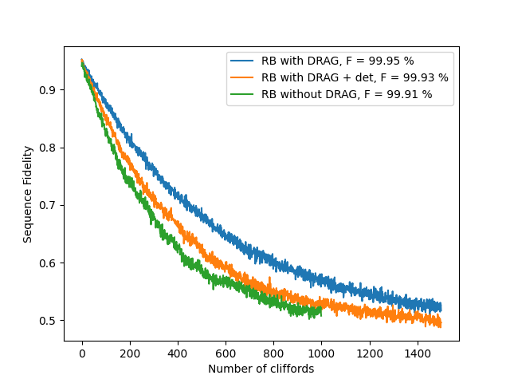

# Single-Qubit Randomized Benchmarking

[`11a_single_qubit_randomized_benchmarking.py`](../../../../../calibrations/1Q_calibrations/11a_single_qubit_randomized_benchmarking.py) · **Targets:** qubits · **Category:** 1Q_calibrations

Plays random sequences of single-qubit Clifford gates of increasing length, each capped by a computed recovery gate, and fits the resulting exponential decay in return-to-ground-state probability to extract an averaged single-qubit gate fidelity that is insensitive to state-preparation-and-measurement (SPAM) errors.

## Purpose

Randomized benchmarking (RB) answers a question that Rabi, Ramsey, and T1/T2 calibrations cannot: how good are the actual gates, on average, once every imperfection (pulse miscalibration, decoherence, crosstalk, control noise) is folded in — without needing a separate, independently-calibrated measurement of SPAM error to interpret the result **[MGE2011]**.

The idea: apply a sequence of $m$ uniformly-random single-qubit Clifford gates, then apply one more, specially-computed "recovery" gate that is the group-inverse of the sequence's net effect — so that, absent any errors, the qubit is returned exactly to its initial state. Averaging the survival probability over many random sequences of the same length $m$, then repeating for a range of $m$, produces a curve that follows a single exponential decay $A\,p^{m}+B$ **[MGE2011]**. The decay parameter $p$ is a *single number that captures the average gate error over the full 24-element single-qubit Clifford group*, and converts to an average error-per-Clifford via $r = (1-p)/2$ (for a single qubit, Hilbert space dimension $d=2$). Because random Clifford sequences average out the *specific* pulse sequence played, the extracted decay rate depends only on the average gate performance and not on how any one sequence happens to interact with SPAM error, which instead biases the curve's offset/intercept rather than its decay rate — see Troubleshooting.

This makes RB the natural gate of "how good is this qubit, overall" to run once the individual pulse parameters (amplitude via `04b_power_rabi`, frequency/phase via `06a_ramsey`, leakage suppression via DRAG **[MGRW2009]**) are already tuned — it is a *summary* diagnostic, not a search for a single miscalibrated parameter. If the reported fidelity is worse than expected, the natural next step is `11b_single_qubit_randomized_benchmarking_interleaved` (see Next Steps), which isolates a single, specific gate's contribution to the average via the interleaved-RB technique **[Mag+2012]**.

{ .calibration-result }

## Mechanism

For each of `num_random_sequences` random sequences, and for each qubit in a batch:

1. `node.machine.initialize_qpu` sets the qubit's flux point.
2. **Sequence generation** (`generate_sequence`, on the FPGA): a QUA `Random(seed=seed)` generator draws `max_circuit_depth` independent random integers in $[0,24)$, one per step, each indexing one of the 24 single-qubit Clifford group elements via a preloaded Cayley table (`c1_table` from `qualang_tools.bakery.randomized_benchmark_c1`). The running group state is tracked step-by-step so that, at *every* depth, the corresponding recovery ("inverse") gate is already known via a precomputed inverse-lookup table (`inv_gates`) — the full `max_circuit_depth`-long sequence and its per-step recovery gates are generated once per random sequence, not once per depth.
3. For each depth in `node.parameters.get_depths()` (see Parameters — log- or linearly-spaced): the sequence is truncated to that depth, its last element is temporarily overwritten with the depth-appropriate recovery gate (the original gate is saved and restored afterward), and then, `num_shots` times:
   - the qubit is reset via `qubit.reset(reset_type, simulate)` — `reset_type` is genuinely honored here (contrast `03b_qubit_spectroscopy_vs_flux`, which hardcodes thermal reset regardless of this parameter);
   - the truncated sequence is played (`play_sequence`): each of the 24 Cliffords is realized via a hardcoded 24-way `switch`/`case` as 0–3 physical pulses drawn from `{x180, y180, x90, -x90, y90, -y90}`. The identity Clifford (`case_(0)`) is realized as `qubit.xy.wait(x180_length // 4)` rather than a true zero-duration no-op — this keeps every branch's duration comparable rather than leaving the identity branch idle for a different amount of time than the 1-pulse branches. If `use_strict_timing=True`, the whole sequence is wrapped in `strict_timing_()` to force gap-free playback;
   - the qubit is measured: discriminated `state` if `use_state_discrimination`, else raw `I`/`Q`.
   - the truncated sequence's last element is restored to its original (pre-recovery-gate) value before moving to the next depth.

Analysis (`calibration_utils/single_qubit_randomized_benchmarking/analysis.py`):

1. `process_raw_dataset`: converts `I`/`Q` to volts *only* if `use_state_discrimination=False`.
2. `fit_raw_data`: computes `averaged_data = 1 - <state or I>`, averaged over the `nb_of_sequences` dimension (the per-shot data was already averaged away on the FPGA via `.buffer(n_avg).map(FUNCTIONS.average())` in `stream_processing` — `num_shots` never appears as a dataset dimension). **If `use_state_discrimination=False`, only the `I` quadrature feeds the fit — `Q` is measured, saved, and then silently discarded** (`ds_fit["averaged_data"] = 1 - ds.I.mean(...)`, no `Q` term at all).
3. A single exponential `decay_exp(depths, a, offset, decay) = a·exp(depths·decay)+offset` is fit per qubit (`qualibration_libs.analysis.fit_decay_exp`, `scipy.optimize.curve_fit` with a heuristic initial guess). **If `curve_fit` fails to converge for a qubit, the shared helper prints a message and calls `plt.show()` on a diagnostic plot before returning `None`** — in a non-interactive/headless run this can hang or error downstream rather than cleanly marking that qubit `"failed"`.
4. `_extract_relevant_fit_parameters` derives `alpha = exp(decay)`, `error_per_clifford = (1-alpha)/2`, and `error_per_gate = error_per_clifford / 1.875` — `1.875` is the *average number of physical pulses per random Clifford* for this specific 24-Clifford decomposition (source comment: `45/24 = 1.875`, following the convention in Qiskit's RB tutorial), so the state-update fidelity is a *per-physical-gate*, not per-Clifford, estimate.

## Prerequisites

- Mixer/Octave calibration (`01a_mixer_calibration` or `01b_time_of_flight_mw_fem`'s equivalent for MW-FEM).
- Precisely calibrated qubit parameters: pulse amplitude (`04b_power_rabi`) and frequency/phase (`06a_ramsey`) — RB's fidelity number is only meaningful once these are already good; it does not search for or fix a miscalibration itself.
- IQ-blob calibration (`07_iq_blobs`) — a de facto requirement here (not merely "optional" as the common-parameter table implies) because **`use_state_discrimination` defaults to `True` on this node**, overriding the library-wide default of `False` (see `_common_parameters.md`); the default run therefore relies on a working discriminator.
- Optional: readout optimization (`08a_readout_frequency_optimization`, `08b_readout_power_optimization`).
- Optional: DRAG calibration (`10a`/`10b`/`10c`) — reduces leakage that can otherwise distort the decay shape (see Troubleshooting).
- `qubit.z.flux_point` set to the intended value if the qubit is flux-tunable.

## Parameters

Inherits the common parameter set — see [Common node parameters](_common_parameters.md) — plus the node-specific parameters below (`calibration_utils/single_qubit_randomized_benchmarking/parameters.py`).

| Parameter | Type | Default | Unit | Description | Effect |
|---|---|---|---|---|---|
| `use_state_discrimination` | `bool` | `True` | – | Return discriminated `state` instead of raw `I`/`Q`. | **Overrides the library-wide default of `False`** (see `_common_parameters.md`) — RB's default `num_shots=10` is low for averaging noisy analog `I`/`Q`, so a bounded, single-shot-discriminated 0/1 outcome gives a cleaner decay curve at this shot budget; it also matches the fact that RB typically runs late in bring-up, after `07_iq_blobs` is already calibrated. |
| `use_strict_timing` | `bool` | `False` | – | Wrap `play_sequence` in `strict_timing_()`. | `True` forces gap-free playback of the Clifford sequence, eliminating timing jitter between pulses — can raise a compile error if the compiled sequence can't fit the requested schedule. |
| `num_random_sequences` | `int` | 300 | – | Number of independently-drawn random Clifford sequences. | This is the RB-specific averaging axis — statistical scatter on the fitted decay rate/fidelity comes down by increasing *this*, not `num_shots`. Linear cost in run time. |
| `num_shots` | `int` | 10 | – | Averages per (sequence, depth) point, averaged away on the FPGA before the dataset is saved (not a retained dimension). | More shots reduce per-point noise before it ever reaches the fit; linear cost in run time, multiplies with `num_random_sequences` and the depth count. |
| `max_circuit_depth` | `int` | 2048 | – | Longest Clifford sequence (before the recovery gate) that will ever be generated or played. | Also sizes the QUA sequence-array declarations (`size=max_circuit_depth+1`). See the log-scale truncation caveat below. |
| `delta_clifford` | `int` | 20 | – | Spacing between depths, **only used when `log_scale=False`**. | Ignored entirely in the default (log-scale) mode. |
| `log_scale` | `bool` | `True` | – | Selects depth spacing via `Parameters.get_depths()`. | `True`: depths double from 1 (`1,2,4,8,...`) up to the largest power of two ≤ `max_circuit_depth` — concentrates points where the decay curve's curvature (and therefore its fit information) is highest, at a fraction of the point count of a linear sweep. `False`: linear spacing by `delta_clifford`, starting at 1. |
| `seed` | `Optional[int]` | `None` | – | Seed for QUA's `Random()` generator. | `None` → a new Python-side seed is drawn at every `create_qua_program` call, so re-running without a fixed seed plays different random sequences each time. Set explicitly for reproducible sequences across runs (useful when comparing against `11b` under matched randomness, or for debugging). |

> **Log-scale mode can silently fall short of `max_circuit_depth`.** `Parameters.get_depths()` builds the log-scale depth list by doubling from 1 (`1, 2, 4, 8, ...`) and stops as soon as the next value would *exceed* `max_circuit_depth` — it never rounds up to hit `max_circuit_depth` exactly. With the default `max_circuit_depth=2048` (itself a power of two) the list ends exactly at 2048, but for a non-power-of-two value, e.g. `max_circuit_depth=2000`, the sequence would be `1,2,4,...,1024` — the deepest circuit actually benchmarked is 1024, less than half of the configured 2000, with no warning. Set `max_circuit_depth` to an exact power of two if the sweep must reach a specific depth.

> **`max_circuit_depth / delta_clifford` must be an integer — but only in linear-scale mode.** `Parameters.get_depths()` asserts this only on the `log_scale=False` branch. The defaults themselves violate it (`2048 / 20 = 102.4`): switching `log_scale` to `False` while leaving `delta_clifford` at its default raises `AssertionError: max_circuit_depth / delta_clifford must be an integer` before any hardware program is built. Pick a compatible `delta_clifford` (e.g. 16, 32, 64 for `max_circuit_depth=2048`) if linear spacing is needed.

## Outputs

**Measured:** `I`/`Q` (or discriminated `state` if `use_state_discrimination`), each shot-averaged on the FPGA and indexed by `(qubit, nb_of_sequences, depths)` — `num_shots` itself is not a retained dataset dimension.

| Fitted quantity | Unit | Written to state? | Description |
|---|---|---|---|
| `fit_data` (`a`, `offset`, `decay`, + 9 covariance terms) | – | – | Raw `curve_fit` output for `decay_exp(depths, a, offset, decay)`, per qubit; the covariance terms are carried in the dataset but not used further by this node. |
| `error_per_clifford` | – | – | $(1-\alpha)/2$ with $\alpha=e^{\text{decay}}$ — average error per random Clifford gate. |
| `error_per_gate` | – | ✅ (as `1 - error_per_gate`) | `error_per_clifford / 1.875` — average error per *physical* pulse (see Mechanism #4). |
| `success` | bool | – | See success criterion below. |

**Success criterion:** `error_per_gate` is non-NaN and strictly $0 < {\tt error\_per\_gate} < 1$ (checked in `_extract_relevant_fit_parameters`). A `curve_fit` that converges but returns a decay rate implying $\text{error\_per\_gate} \le 0$ (e.g. an apparent gain rather than decay) or $\ge 1$ is marked `"failed"` even though the fit itself did not raise.

## State Updates

Applied only when the fit succeeds — failed qubits are skipped entirely (no partial update):

| Attribute | New value | Mode | Condition |
|---|---|---|---|
| `qubit.gate_fidelity["averaged"]` | `1 - error_per_gate` | replace | outcome successful |

## Troubleshooting

1. **Decay curve deviates from a single exponential** — flattens at a higher-than-expected asymptote, or shows an anomalous kink — **especially with `use_state_discrimination=True`** → likely leakage out of the computational subspace (cf. DRAG context, **[MGRW2009]**): the 2-state discriminator can misclassify a leaked qubit as `|0⟩` or `|1⟩`, biasing the apparent decay shape. Compare against a run with `use_state_discrimination=False` (raw `I`/`Q`) to see whether the anomaly persists, and check DRAG calibration (`10a`/`10b`/`10c`) freshness. Note that this node cannot quantify leakage itself even once you suspect it: **[Sou+2026]** points out that leakage's impact on fidelity "depends sensitively on pulse shape, timing, and the multilevel structure of the device," so no simple analytical expression (and no single number out of this node) can fully capture it — a clean-looking `error_per_gate` here does not by itself rule out leakage; dedicated EF-transition characterization (`12_Qubit_Spectroscopy_E_to_F`) is the way to check directly.
2. **`use_state_discrimination=False` and the fit is poor or the decay is nearly invisible despite a healthy qubit** → only the `I` quadrature feeds the fit; `Q` is measured and discarded entirely (see Mechanism #2). If the readout's integration-weight rotation angle isn't set so nearly all signal lands on `I`, the decay can be essentially flat in `I` even though it's clearly present in the raw IQ plane. Re-verify `07_iq_blobs`'s fitted `iw_angle`, or just use the (default) discrimination path.
3. **A qubit with good, recently-verified T1/Rabi/Ramsey calibration still reports a much worse-than-expected fidelity, but the decay is smooth and single-exponential (not noisy-looking)** → SPAM error biases the fitted *offset*, not the *decay rate* **[MGE2011]**. A low apparent fidelity with a clean decay shape may be a readout/state-prep issue upstream rather than a real gate-fidelity problem — re-check `07_iq_blobs` discrimination quality and `04b_power_rabi` amplitude freshness before trusting the number here.
4. **Fitted fidelity is inconsistent across otherwise-identical full RB runs on the same qubit** (not just wider error bars — a genuinely different decay shape or rate) → time-correlated drift (frequency, flux) during a scan that can run for minutes given `num_random_sequences × num_shots × len(depths)` shots — recalibrate frequency (`06a_ramsey`) rather than adding more shots to a drift problem.
5. **Node hangs or throws an unexpected error partway through `analyse_data`, with no clean per-qubit `"failed"` outcome** → the shared `fit_decay_exp` helper opens a diagnostic `plt.show()` window inside its `except RuntimeError` handler when `curve_fit` fails to converge for a qubit, before returning `None`. In a headless/non-interactive run this can hang rather than fail gracefully — treat a hang right after data collection as a likely fit-convergence issue for at least one qubit, not a hardware problem.
6. **One qubit's fidelity degrades specifically when `multiplexed=True` but is clean when run alone** → concurrent reset/drive/measure on other qubits during multiplexed execution can crosstalk into this qubit's actual gate fidelity (e.g. via flux-line or drive-line crosstalk). Re-run the same qubit with `multiplexed=False` to confirm; if the discrepancy disappears, treat it as a crosstalk issue to characterize separately, not a bug in this node.
7. **Total run time is much longer than expected for the requested `max_circuit_depth`** → cost scales as `num_random_sequences × num_shots × len(depths)`. The default log-scale mode reaches `max_circuit_depth=2048` with only 12 depth points; switching to `log_scale=False` with a small `delta_clifford` (e.g. the default 20, giving ~102 points) multiplies the run time roughly tenfold for the same maximum depth — this is the practical reason `log_scale` defaults to `True`.

## Parameter Tuning Heuristics

1. **Outcome is `"failed"` even though the raw decay curve looks like a clean, well-behaved exponential** → the success criterion requires strictly $0 < {\tt error\_per\_gate} < 1$, not just a converged fit. A near-perfect qubit or a noisy fit can push the fitted decay rate to imply zero or negative error, which fails this check outright. Increase `num_random_sequences` before assuming the gates themselves are somehow "too good to be real."
2. **Fidelity estimate has large run-to-run scatter (the fitted curve itself moves, not just its error bars)** → too few `num_random_sequences` (default 300) — this is RB's dedicated statistical-averaging axis per **[MGE2011]**; increase *this*, not `num_shots`, which only reduces per-point noise, not sequence-to-sequence variance. Wide scatter here is a shot-noise-limited symptom, not evidence of an actual gate-fidelity problem.

## Next Steps

This is the **terminal node** in every automated calibration graph in this repository that includes it (`80_calibration_graph_bringup_flux_tunable_transmon.py`, `81_calibration_graph_retuning_flux_tunable_transmon.py`, `90_calibration_graph_bringup_fixed_frequency_transmon.py`, `91_calibration_graph_retuning_fixed_frequency_transmon.py`) — nothing is wired downstream of it automatically. If the averaged fidelity reported here is worse than expected, run `11b_single_qubit_randomized_benchmarking_interleaved` manually (same qubit, matched conditions) once per gate of interest to localize the problem to a specific single-qubit gate rather than the Clifford average as a whole.

## References

**[MGE2011]** E. Magesan, J. M. Gambetta, and J. Emerson, "Scalable and robust randomized benchmarking of quantum processes," *Phys. Rev. Lett.*, vol. 106, p. 180504, 2011.

**[Mag+2012]** E. Magesan, J. M. Gambetta, B. R. Johnson, C. A. Ryan, J. M. Chow, S. T. Merkel, M. P. da Silva, G. A. Keefe, M. B. Rothwell, T. A. Ohki, M. B. Ketchen, and M. Steffen, "Efficient measurement of quantum gate error by interleaved randomized benchmarking," *Phys. Rev. Lett.*, vol. 109, p. 080505, 2012.

**[MGRW2009]** F. Motzoi, J. M. Gambetta, P. Rebentrost, and F. K. Wilhelm, "Simple pulses for elimination of leakage in weakly nonlinear qubits," *Phys. Rev. Lett.*, vol. 103, no. 11, p. 110501, 2009.

**[Sou+2026]** A. M. Souza, D. A. D. Chaves, C. M. Gilardoni, R. S. Sarthour, J. P. Sinnecker, and I. S. Oliveira, "A tutorial for characterizing transmon qubits," Centro Brasileiro de Pesquisas Físicas, arXiv:2606.03815, 2026.
