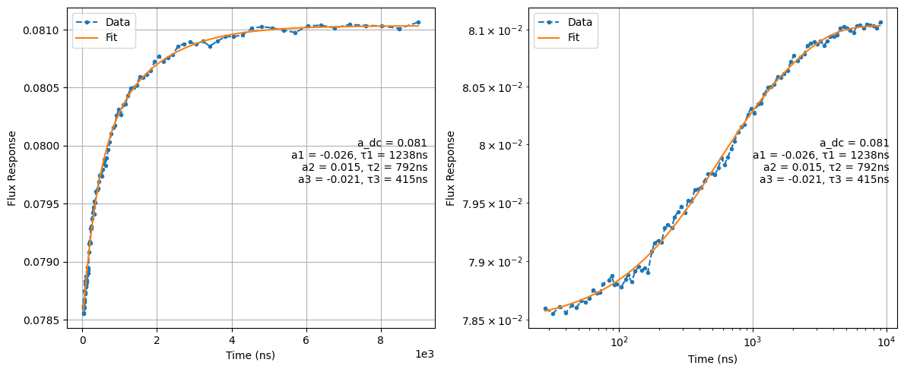

# π vs. Flux — Long-Timescale Distortion Calibration ("Long Cryoscope")

[`17_pi_vs_flux_long_distortions.py`](../../../../../calibrations/1Q_calibrations/17_pi_vs_flux_long_distortions.py) · **Targets:** qubits · **Category:** 1Q_calibrations

Tracks a qubit's instantaneous frequency across a long, sparsely-sampled flux-pulse duration axis via repeated qubit spectroscopy, to characterize and correct the slow (microsecond-scale) tail of the flux line's step response.

## Purpose

A flux pulse's effect on a qubit is never a perfectly sharp step: bias-tee AC-coupling droop, cable dispersion, and filter roll-off along the flux line all distort the ideal rectangular pulse the OPX commands into a step response with its own transient dynamics **[GRTW2021]**. Because a flux pulse is often used to move the qubit rapidly away from its flux-noise-insensitive sweet spot for a gate and then rapidly back **[Koc+2007]**, **[Kra+2019]**, any lingering distortion in that step response — the qubit's frequency settling more slowly than the commanded flux waveform — directly degrades the fidelity of whatever operation the flux pulse was meant to implement, exactly the tension between fast flux gates and clean pulse shaping described in **[GRTW2021]** (Sec. V.D). Left uncorrected, this shows up as reduced gate fidelity even when the *intended* flux waveform looks ideal on paper.

This node characterizes that step response by re-purposing qubit spectroscopy as a frequency-tracking tool: for a range of flux-pulse durations, it sweeps the XY drive frequency around the flux-shifted qubit frequency and locates the spectroscopic peak, giving the qubit's instantaneous frequency as a function of time since the flux pulse turned on. This is a different measurement principle from the classic cryoscope technique of **[Rol+2020]** used by the companion node `18_cryoscope` — that technique reads out the *phase* accumulated during a Ramsey sequence, while this node reads out the *frequency* directly via spectroscopic peak-finding — but both target the same underlying quantity (the flux line's step response) and feed the same corrective state field. The trade-off is resolution versus reach: this node's time axis is not baked to 1 ns and can be swept out to microseconds (`duration_in_ns`, default 8000 ns), letting it see the slow tail components that `18_cryoscope`'s ≲260 ns baked-pulse ceiling cannot reach — hence "long distortions."

{ .calibration-result }

## Mechanism

`create_qua_program` first computes, per qubit, a fixed flux-pulse amplitude from the requested detuning: `flux_amp = sqrt(-detuning_in_mhz * 1e6 / qubit.freq_vs_flux_01_quad_term)`. Because `freq_vs_flux_01_quad_term` defaults to `0.0` until `09a_ramsey_vs_flux_calibration` has been run, this line raises a plain Python `ZeroDivisionError` immediately if that prerequisite is missing — there is no graceful validation error for this case (see Troubleshooting #1).

If the requested `detuning_in_mhz` plus half of `frequency_span_in_mhz` would push the XY intermediate frequency below `-400 MHz`, the node does not simply widen the IF sweep — it **temporarily shifts the qubit's LO** (`xy.opx_output.upconverter_frequency`) via `qualibration_libs.core.tracked_updates` (`auto_revert=False`), validates the new LO against hardcoded MW-FEM band limits (raising `ValueError` if band 2 would go below 4.5 GHz or band 3 below 6.5 GHz), and **forcibly overrides `reset_type` to `"thermal"`** for that qubit with a warning, since active reset depends on the original IF/LO calibration. `save_results` reverts this LO shift (`qubit.revert_changes()`) at the end of the run regardless of outcome, so the shift is transient and scoped to this node's execution.

For each shot, for each detuning point, for each flux-pulse duration:

1. Reset the qubit, then insert a fixed extra wait of `times.max()` (the *longest* scanned duration, not the current one) to let long-timescale flux transients decay between repetitions. Every single shot pays this full dead time regardless of the current duration being measured — a hardcoded cost driver that scales with `duration_in_ns`, not with run progress.
2. Step the XY intermediate frequency to sweep the qubit-drive detuning (`df + intermediate_frequency - if_update[i]`).
3. Play a constant flux pulse (amplitude fixed at `flux_amp`, computed above) for `t_delay + 200` cycles.
4. Wait `t_delay` on the XY line, then play the spectroscopy `operation` (default `x180`, scaled by `operation_amplitude_factor`, default `1.0`) — a much stronger drive than `03a`/`03b`'s saturation default (`0.1`), since this node wants a clean population inversion at each fixed detuning rather than a narrow spectroscopic line.
5. Reset the IF back to baseline, then measure.

Analysis (`calibration_utils/pi_flux/analysis.py`):

1. Convert I/Q to volts; fit a Gaussian to the state (or `IQ_abs`) vs. detuning at each flux-pulse-duration point to extract the qubit's instantaneous center frequency (`extract_center_freqs_state` / `extract_center_freqs_iq`).
2. Convert center frequency to a dimensionless flux-response curve: `flux_response = sqrt(center_freqs / freq_vs_flux_01_quad_term)`.
3. Fit `flux_response(t)` with a sequential sum of decaying exponentials (`sequential_exp_fit`, refined by `optimize_start_fractions` via `scipy.optimize.minimize`, Nelder-Mead), seeded from `fitting_base_fractions` as the starting time-fraction for each component **in descending order** — `optimize_start_fractions` requires this ordering and will silently score any violation as a failed fit (`1e6` RMS penalty), so a customized `fitting_base_fractions` list must stay sorted high-to-low.
4. Normalize each fitted component's amplitude by the fitted DC term (`A_i / A_dc`), pairing it with its own `tau_i`.

> **The module's `decompose_exp_sum_to_cascade` helper is exported but never called by this node.** `calibration_utils/pi_flux/analysis.py` includes a full pole-zero decomposition (`decompose_exp_sum_to_cascade`) for translating a sum-of-exponentials step response into the *older* QOP-3.4.1-style cascade-of-single-pole filter format (`feedback_filter`/`feedforward_filter`). This node's own `update_state` skips that entirely and writes the `A_i / A_dc, tau_i` pairs directly — which is the *correct*, native format for the newer `exponential_filter` field (QOP ≥ 3.3.0, LF-FEM output channels only; see Prerequisites and State Updates). If your hardware only supports the older cascade filter format, this node's state write is not applicable as-is; `decompose_exp_sum_to_cascade` would need to be called manually.

> **`node.outcomes` is never set by this node.** Unlike `16a_xyz_delay` and `18_cryoscope`, which both populate `node.outcomes = {qubit: "successful"/"failed", ...}` from the fit result, this node's `analyze_data` action has no such assignment anywhere in the file. The per-qubit pass/fail flag (`fit_successful`, from the Nelder-Mead convergence flag) still gates the state write correctly inside `update_state` (see below), but any GUI/graph-level status display that reads `node.outcomes` will not reflect this node's actual per-qubit fit outcome. Read `fit_results[qubit]["fit_successful"]` / the logged output directly instead of trusting the node's outcome banner.

## Prerequisites

- A valid rotation angle and threshold if using state discrimination (`07_iq_blobs`).
- Calibrated XYZ delay (`16a_xyz_delay`) — stated explicitly in this node's own docstring.
- A calibrated $\pi$-pulse (`operation`, default `x180`).
- `qubit.freq_vs_flux_01_quad_term` already populated by `09a_ramsey_vs_flux_calibration` — **this is a hard, crash-on-missing prerequisite**: the default value is `0.0`, and computing the flux-pulse amplitude at the start of `create_qua_program` divides by it directly, raising `ZeroDivisionError` with no other qubits processed (see Troubleshooting #1).

> **State-update hardware requirement.** `z_out.exponential_filter` (the field this node writes) only exists on `quam.components.ports.analog_outputs.LFFEMAnalogOutputPort` — i.e., an OPX1000 LF-FEM analog output channel running QOP ≥ 3.3.0. The plain `LFAnalogOutputPort`/`OPXPlusAnalogOutputPort` classes used by OPX+ wiring have no such field at all. If the qubit's Z line is wired through an OPX+ output and `update_state=True`, the write will fail with an `AttributeError`.

> **Recalibration warning, verbatim from the node's own docstring:** *"REMINDER: Adding digital filters will add a global delay --> need to recalibrate IQ blobs (rotation_angle & ge_threshold) and (15)XYZ_delay. It is also worth looking at (09) Ramsey vs Flux as well."* The `"(15)"` is a stale reference to this repository's old node numbering — the current XYZ-delay node is `16a_xyz_delay`, not `15` (`15_iq_blobs_gef` occupies that slot today). **This is a critical, easily-missed step**: after any successful `update_state=True` run of this node, re-run `07_iq_blobs` and `16a_xyz_delay` before trusting anything downstream that depends on IQ-blob thresholds or XY/Z timing.

## Parameters

Inherits the common parameter set — see [Common node parameters](_common_parameters.md) — plus the node-specific parameters below.

| Parameter | Type | Default | Unit | Description | Effect |
|---|---|---|---|---|---|
| `num_shots` | `int` | 30 | – | Averages per (detuning, duration) point. | More shots reduce noise on the extracted center frequency; the class docstring in `calibration_utils/pi_flux/parameters.py` is itself mislabeled `"""Parameters for 16a_long_cryoscope"""` — another stale-numbering artifact, not a functional issue. |
| `operation` | `str` | `"x180"` | – | Qubit-drive pulse played at each (detuning, duration) point. | Falls back to `"x180"` with a warning if the named operation isn't found on the qubit. |
| `operation_amplitude_factor` | `float` | 1.0 | – | Amplitude scale applied to `operation`. | Much stronger than `03a`/`03b`'s saturation default (`0.1`) — this node wants a clean, strong population inversion at each detuning, not a narrow unsaturated line. |
| `duration_in_ns` | `int` | 8000 | ns | Maximum flux-pulse duration scanned. | Sets the reach into slow/long-tail distortion components; directly multiplies total run time together with `frequency_span_in_mhz` / `frequency_step_in_mhz`. |
| `time_axis` | `Literal["linear", "log"]` | `"log"` | – | Whether the duration sweep is linearly or logarithmically spaced. | `"log"` (default) concentrates points at short times, where fast components are best resolved, while still reaching `duration_in_ns`. |
| `time_step_in_ns` | `int` | 48 | ns | Step size for the duration sweep — **only used when `time_axis="linear"`**. | Floored to a 4 ns clock-cycle grid internally (`max(time_step_in_ns, 4) // 4`); has no effect under the default `"log"` axis. |
| `time_step_num` | `int` | 100 | – | Number of duration points — **only used when `time_axis="log"`**. | Points are deduplicated after `np.logspace` + integer rounding, so the effective count can be lower than requested at short times. |
| `min_wait_time_in_ns` | `int` | 32 | ns | Shortest flux-pulse duration scanned. | Sets the earliest time point available to the exponential fit; very fast components shorter than this are invisible to this node (use `18_cryoscope` instead). |
| `frequency_span_in_mhz` | `float` | 200 | MHz | Full width of the drive-frequency sweep at each duration point, centered on the detuned working point. | Must stay wide enough to keep the spectroscopy peak inside the window as the qubit's instantaneous frequency relaxes toward its asymptote; combined with `detuning_in_mhz`, can trigger the LO-shift branch described in Mechanism. |
| `frequency_step_in_mhz` | `float` | 1 | MHz | Step size of the drive-frequency sweep. | Finer steps sharpen the Gaussian center-frequency fit at each duration point, at proportional run-time cost. |
| `detuning_in_mhz` | `int` | 500 | MHz | Target detuning from the sweet spot that the fixed flux-pulse amplitude is designed to reach. | Used to compute the (fixed, not swept) flux-pulse amplitude via `freq_vs_flux_01_quad_term`; also the reference point the extracted `detuning`/`flux` coordinates are offset from during analysis. |
| `fitting_base_fractions` | `List[float]` | `[0.4, 0.15, 0.05]` | – | Initial guessed start-time fractions for each exponential component, **must be strictly descending**. | Three components by default (more than `18_cryoscope`'s two), consistent with resolving a longer, potentially multi-timescale tail. |
| `update_state` | `bool` | `False` | – | **Explicit opt-in** — must be set `True` for any fitted filter to be written to `z.opx_output.exponential_filter`. | Off by default so that running this node to *inspect* the flux response never silently mutates state; see State Updates. |
| `update_state_from_GUI` | `bool` | `False` | – | GUI convenience flag; only takes effect inside the `load_data` action (i.e., only on a re-analysis run with `load_data_id` set). | On such a re-analysis run, setting this forces `update_state=True` and restores `node.machine` to the machine loaded at import time (`stored_machine`) before writing — see State Updates. It has **no effect** on a fresh hardware run without `load_data_id`. |

> Parameter naming is inconsistent in capitalization across this node family: this node uses `detuning_in_mhz` (lowercase `mhz`), while `18_cryoscope` uses `detuning_target_in_MHz` (uppercase `MHz`) for the analogous quantity. Worth double-checking when scripting against either node's `Parameters` class.

## Outputs

**Measured:** `I`/`Q` (or discriminated `state`), `IQ_abs`/`phase`, at every (detuning, duration) point; derived `center_freqs` (Gaussian-fit peak frequency per duration point) and `flux_response` (converted via `freq_vs_flux_01_quad_term`).

| Fitted quantity | Unit | Written to state? | Description |
|---|---|---|---|
| `a_tau_tuple` | (V, ns) pairs | ✅ (normalized) | Fitted exponential components `(amplitude, tau)` of the flux step response. |
| `a_dc` | V | – (used to normalize) | Fitted constant (asymptotic) term of the step response. |
| `optimized_fractions` | – | – | The `Nelder-Mead`-refined start fractions actually used, seeded from `fitting_base_fractions`. |
| `rms_error` | V | – | RMS residual of the final fit — a fit-quality diagnostic. |
| `fit_successful` | bool | gates the write | `True` iff `scipy.optimize.minimize`'s Nelder-Mead search reports convergence; no additional physical sanity check (e.g. on `tau` magnitude or sign) is applied beyond that. |

**Success criterion:** purely the Nelder-Mead convergence flag from `optimize_start_fractions` — there is no bounds or plausibility check on the fitted `(amp, tau)` values themselves.

## State Updates

**Gated behind an explicit opt-in flag** (`update_state`, default `False`) — unlike most nodes in this library, running this node with default parameters **never writes to state**, even on a fully successful fit:

| Attribute | New value | Mode | Condition |
|---|---|---|---|
| `qubit.z.opx_output.exponential_filter` | `(A_i / A_dc, tau_i)` for each fitted component | **append (`list.extend`)** | `update_state=True` **and** `fit_successful=True` for that qubit |

Unlike the failed-outcome guard bug documented for `18_cryoscope`, this node's per-qubit `if not fit_success: continue` check is correctly nested inside its `for q in qubits:` loop (`calibration_utils/pi_flux` update logic in the node file) — a failed fit is genuinely skipped here. Because the write is `list.extend(...)` rather than a replace, and because `18_cryoscope` writes to the exact same field, running both nodes accumulates their fitted components into a single list rather than one overwriting the other — they are complementary short/long-timescale characterizations of the same flux line, not competing corrections.

The `update_state_from_GUI` path only fires inside `load_data` (i.e., only when re-analyzing a cached run via `load_data_id`): it forces `update_state=True` and reassigns `node.machine = stored_machine`, the machine instance loaded fresh at import time — this restores the live/current state as the write target, guarding against `node.load_from_id(...)` having pointed `node.machine` at a historical snapshot from the loaded run. In practice this supports a "measure now, inspect the plot, decide later" workflow: run live with `update_state=False`, inspect the fitted plot, and only then re-run with `load_data_id` set and `update_state_from_GUI=True` to commit the fit already on disk — without re-taking data.

**Before enabling `update_state=True`, read the recalibration warning in Prerequisites** — writing this filter invalidates both IQ-blob calibration and XYZ-delay calibration.

## Troubleshooting

1. **`ZeroDivisionError` raised immediately in `create_qua_program`, before any hardware runs** → `freq_vs_flux_01_quad_term` is still at its default `0.0` for at least one targeted qubit. Run `09a_ramsey_vs_flux_calibration` first; this node has no graceful fallback for a missing quad term.
2. **Active reset (`reset_type="active"`) silently reverts to thermal reset with a console warning** → this happens automatically whenever the LO-shift branch triggers (see Parameter Tuning Heuristics #1), since active reset depends on the pre-shift IF/LO calibration. This is expected, not a bug — if you need active reset for this measurement, keep `detuning_in_mhz + frequency_span_in_mhz/2` within the no-LO-shift regime instead.
3. **`AttributeError` on `exponential_filter` when `update_state=True`** → the qubit's Z line is wired through an OPX+ analog output rather than an OPX1000 LF-FEM channel; `exponential_filter` only exists on `LFFEMAnalogOutputPort` (QOP ≥ 3.3.0). This node's filter-writing state update is not usable on OPX+-wired flux lines as-is.
4. **Fit "succeeds" (`fit_successful=True`) but the plotted exponential curve visibly doesn't track the data, or `rms_error` is large** → the success flag only reflects numerical convergence of the Nelder-Mead search, not fit quality. Inspect the plot and `rms_error` directly before trusting `update_state=True`; don't rely on `fit_successful` alone.
5. **The node's status/outcome banner (GUI or graph) doesn't reflect a qubit you know failed to fit** → `node.outcomes` is never populated by this node (see Mechanism) — check `fit_results[qubit]["fit_successful"]` in the logged results directly instead.
6. **IQ blobs or `16a_xyz_delay` look subtly wrong after this node was run with `update_state=True`** → this is the expected consequence of adding a global delay via the new digital filter, stated explicitly in this node's own docstring reminder. Re-run `07_iq_blobs` and `16a_xyz_delay`, in that order, before trusting anything that depends on them.
7. **Run time is far longer than expected for a given `duration_in_ns`** → every shot pays a fixed extra wait of `times.max()` (the *longest* scanned duration) regardless of the duration point currently being measured, by design (to let long transients decay between repetitions). This scales linearly with `duration_in_ns` on top of the sweep itself; there is no way to disable it via parameters.

## Parameter Tuning Heuristics

1. **`ValueError: Requested detuning is too large for the given MW FEM band`** → the combination of `detuning_in_mhz` and `frequency_span_in_mhz` pushed the computed LO below the hardcoded 4.5 GHz (band 2) / 6.5 GHz (band 3) floor. Reduce `detuning_in_mhz` and/or `frequency_span_in_mhz`, or accept the node's automatic LO shift only if it stays within band.
2. **`fitting_base_fractions` customization silently produces a much worse fit than the default** → `optimize_start_fractions` requires the fractions strictly descending and penalizes any violation with a large RMS score; if your list isn't sorted high-to-low, the optimizer effectively can't converge to a sensible cascade.

## Next Steps

This node is not wired into either automated bring-up graph. Its output feeds directly into two-qubit / flux-pulse-heavy calibrations only informally: no node in `calibrations/CZ_calibrations/` references `exponential_filter`, `pi_vs_flux`, or `cryoscope` as an explicit prerequisite in code, but the motivation in **[GRTW2021]** for correcting flux-pulse distortion before fast flux gates applies directly to that stage of a bring-up. The concrete, code-verified next steps are the ones in this node's own docstring: re-run **`07_iq_blobs`** and **`16a_xyz_delay`** after any `update_state=True` run. `18_cryoscope` is a complementary short-timescale companion (not a strict predecessor or successor) — both write into the same `z.opx_output.exponential_filter` list.

## References

**[GRTW2021]** Y. Y. Gao, M. A. Rol, S. Touzard, and C. Wang, "Practical guide for building superconducting quantum devices," *PRX Quantum*, vol. 2, p. 040202, 2021.

**[Koc+2007]** J. Koch, T. M. Yu, J. Gambetta, A. A. Houck, D. I. Schuster, J. Majer, A. Blais, M. H. Devoret, S. M. Girvin, and R. J. Schoelkopf, "Charge-insensitive qubit design derived from the Cooper pair box," *Phys. Rev. A*, vol. 76, no. 4, p. 042319, 2007.

**[Kra+2019]** P. Krantz, M. Kjaergaard, F. Yan, T. P. Orlando, S. Gustavsson, and W. D. Oliver, "A quantum engineer's guide to superconducting qubits," *Appl. Phys. Rev.*, vol. 6, no. 2, p. 021318, 2019.

**[Rol+2020]** M. A. Rol, L. Ciorciaro, F. K. Malinowski, B. M. Tarasinski, R. E. Sagastizabal, C. C. Bultink, Y. Salathé, N. Haandbæk, J. Sedivy, and L. DiCarlo, "Time-domain characterization and correction of on-chip distortion of control pulses in a quantum processor," *Appl. Phys. Lett.*, vol. 116, no. 5, p. 054001, 2020.
