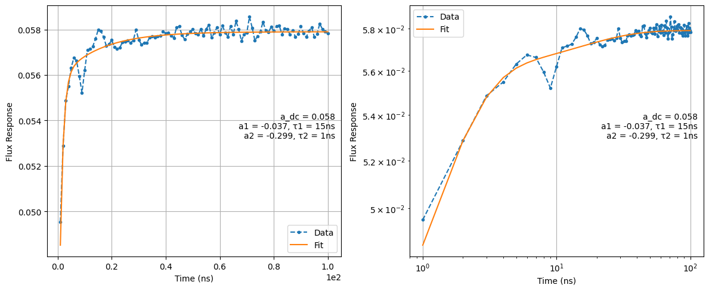

# Cryoscope

[`18_cryoscope.py`](../../../../../calibrations/1Q_calibrations/18_cryoscope.py) · **Targets:** qubits · **Category:** 1Q_calibrations

Uses the qubit itself as a phase-sensitive sensor to reconstruct the flux line's fast step response at 1 ns resolution, and fits it to derive a digital pre-distortion filter.

## Purpose

A flux pulse commanded by the OPX does not arrive at the qubit as a perfect step: bias-tee AC-coupling droop, cable dispersion, and filter roll-off along the flux-bias path all distort the ideal rectangular waveform into a step response with its own transient dynamics **[GRTW2021]**. Because flux pulses are routinely used to move a qubit rapidly away from its flux-noise-insensitive sweet spot and back for a gate **[Koc+2007]**, **[Kra+2019]**, any residual distortion in that step response directly undercuts the fidelity of the operation the flux pulse was meant to implement — the qubit spends part of the intended gate time at the wrong frequency, not because the *commanded* waveform was wrong, but because what actually reached the chip wasn't the commanded waveform **[GRTW2021]** (Sec. V.D).

It is not possible to directly probe the flux pulse after it has propagated through the fridge wiring, so this node exploits the flux-tunable transmon's own frequency-vs-flux dependence as an in-situ sensor, following the cryoscope technique of **[Rol+2020]**: a Ramsey-type sequence ($x90$ – idle – $x90$) with a flux pulse of variable duration played during the idle time converts the instantaneous flux-induced frequency shift into a measurable phase on the qubit's Bloch vector. Sweeping the flux-pulse duration at 1 ns resolution and extracting the accumulated phase at each duration reconstructs the time-domain step response of the flux line as the qubit actually experiences it, which is then fit to a sum of decaying exponentials and converted into a digital pre-distortion filter.

The baking scheme this node uses to reach 1 ns resolution caps the technique at roughly 260 ns of total flux-pulse duration (see Mechanism) — long enough to resolve fast components of the step response, but not the slow tail. `17_pi_vs_flux_long_distortions` is this node's complementary long-timescale counterpart: same underlying goal, coarser time resolution, but reaching microseconds instead of hundreds of nanoseconds. Both write into the same state field, so both can be run and their fitted components accumulate.

{ .calibration-result }

## Mechanism

This node supports **exactly one qubit at a time** — `create_qua_program` asserts `num_qubits == 1` and raises immediately otherwise. It has no `multiplexed`-batching behavior for the qubit dimension the way the other nodes documented alongside it do.

Two structural differences from most other nodes in this repository, both verified directly in source:

- **The `QualibrationNode` constructor does not receive `machine=Quam.load()`.** Every other node covered here (e.g. `16a_xyz_delay`) passes `machine=Quam.load()` as a constructor argument. This node (like `17_pi_vs_flux_long_distortions`) instead constructs the node bare and immediately assigns `node.machine = stored_machine = Quam.load()` on the next line. The practical purpose becomes visible in `load_data`: after `node.load_from_id(...)` (used to re-analyze a cached run), the code explicitly does `node.machine = stored_machine` again before allowing a state write. This strongly suggests `load_from_id` can leave `node.machine` pointing at a historical machine snapshot from the loaded run; re-assigning `stored_machine` (the instance loaded fresh when the module was imported) ensures any subsequent `record_state_updates()` call lands on the *current* state file rather than a stale one.
- The flux-pulse amplitude is computed once, up front: `amplitude = sqrt(-detuning_target_in_MHz * 1e6 / qubit.freq_vs_flux_01_quad_term)`. As in `17_pi_vs_flux_long_distortions`, `freq_vs_flux_01_quad_term` defaults to `0.0` until `09a_ramsey_vs_flux_calibration` has been run, and this line will raise a plain `ZeroDivisionError` with no other handling if that prerequisite is missing.

Baking (`baked_waveform`, `max_length=16`): 16 rectangular flux-pulse segments of length 1…16 ns are baked at the target `amplitude`, right-padded. For a requested `idx` (the current flux-pulse duration in the sweep, 1…`cryoscope_len`):

- If `idx <= 16`: play the matching baked segment directly.
- If `idx > 16`: split `idx` into a 4-ns-aligned `const`-pulse duration (`t_cycles = idx >> 2`) plus a 0–3 ns remainder played from the same 16 baked segments. This hybrid baked+strided-play construction is exactly why the module's own top-of-file docstring caps the technique at "~260 ns" — beyond that, either the resolution has to coarsen to 2 ns steps or the separate `cryoscope_4ns.py` variant is needed (not part of this documented set).

Per shot, for each `idx` (flux-pulse duration) and each `frame` (`num_frames` linearly-spaced points from 0 to 1):

1. Reset the qubit (`qubit.reset(reset_type, simulate)` — honored, not hardcoded).
2. Play $x90$, wait for the XY drive length plus a 16 ns buffer, then play the flux pulse of duration `idx` (via the baked/hybrid dispatch above).
3. Wait out the remainder of the maximum scan window, apply a virtual-Z rotation via `qubit.xy.frame_rotation_2pi(frame)`, and close with a second $x90$.
4. Measure (`I`/`Q` or discriminated `state`).

> **The actual sequence sweeps a continuous virtual-Z frame, not a literal two-point $x90$/$y90$ alternation.** The module's top-of-file docstring describes the classic two-point scheme — closing the Ramsey sequence with either an $x90$ or a $y90$ to read out the Sx/Sy Bloch components separately. The QUA program actually implemented instead sweeps `frame_rotation_2pi(frame)` continuously over `num_frames` (default 17) points spanning a full turn, then fits a cosine to the resulting oscillation (`fit_oscillation(..., "frame")`) to extract the phase directly. This is a finer-grained generalization of the same underlying idea, not a discrepancy in physics — but the actual sequence in code differs from the sequence described in the docstring.

Analysis (`calibration_utils/cryoscope/analysis.py`):

1. `fit_oscillation` extracts phase $\phi$ vs. time from the frame sweep; `unwrap_phase` removes $2\pi$ wraps.
2. `diff_savgol` (a Savitzky-Golay derivative) converts unwrapped phase into instantaneous frequency vs. time.
3. `cryoscope_frequency` converts frequency to a dimensionless flux value via `flux = sqrt(|freq| / freq_vs_flux_01_quad_term)`.
4. The same sequential sum-of-exponentials fit used by `17_pi_vs_flux_long_distortions` (`optimize_start_fractions`) is applied to `flux(t)`, seeded by `exponential_fit_time_fractions` (default `[0.5, 0.01]` — two components, versus `17`'s three-component default, consistent with resolving fewer, faster components over a much shorter window).

> **`cryoscope_frequency`'s stable-window normalization branch is effectively dead code as this node calls it.** The function accepts a `stable_time_indices` window (passed here as `(cryoscope_len - 20, cryoscope_len)`) intended to normalize the reconstructed flux trace to 1 in its settled region — but that normalization only executes when `quad_term == -1` (the function's sentinel default). This node always passes the qubit's real, non-sentinel `freq_vs_flux_01_quad_term`, so the branch that uses `stable_time_indices` never runs; the flux trace is used directly from `sqrt(freq/quad_term)` without that renormalization step.

## Prerequisites

- Resonator spectroscopy performed (stated in the node's own docstring).
- Qubit gates $x90$/$y90$ calibrated: spectroscopy → `04a_rabi_chevron` → `04b_power_rabi` → `06a_ramsey`, with configuration updated (stated in the node's own docstring).
- `qubit.freq_vs_flux_01_quad_term` already populated by `09a_ramsey_vs_flux_calibration` — a hard, crash-on-missing prerequisite (see Mechanism); not listed in this node's own docstring prerequisites, unlike `17_pi_vs_flux_long_distortions`, whose docstring does list the analogous requirement explicitly.
- Note that this node's own docstring does **not** list XYZ-delay calibration (`16a_xyz_delay`) as a prerequisite, even though it plays a co-timed XY+flux sequence in essentially the same spirit as `16a` calibrates for. Treat `16a_xyz_delay` as good practice here too, even though the source doesn't enforce or request it.

> **State-update hardware requirement.** `z.opx_output.exponential_filter` (the field this node writes) only exists on `quam.components.ports.analog_outputs.LFFEMAnalogOutputPort` — an OPX1000 LF-FEM analog output channel on QOP ≥ 3.3.0. On OPX+-wired flux lines, this attribute doesn't exist on the port class at all, and `.extend(...)` on it will fail.

> **Recalibration warning, verbatim from the node's own docstring:** *"Note that these filters will introduce a global delay on all the output channels that may rotate the IQ blobs so that you may need to recalibrate them for state discrimination or active reset protocols."* and, in the node's "Next steps" block: *"WARNING: digital filters add a global delay: recalibrate IQ blobs (rotation_angle & ge_threshold)."* This node's own warning names only IQ blobs (`07_iq_blobs`) explicitly — it does not mention `16a_xyz_delay` the way `17_pi_vs_flux_long_distortions`'s docstring does. Since both nodes write the same port's `exponential_filter` field, and a filter changing the port's group delay affects XY/Z alignment exactly the same way regardless of which node wrote it, **re-run `16a_xyz_delay` as well after either node applies a filter**, even though only `17`'s docstring says so in words.

## Parameters

Inherits the common parameter set — see [Common node parameters](_common_parameters.md) — plus the node-specific parameters below.

| Parameter | Type | Default | Unit | Description | Effect |
|---|---|---|---|---|---|
| `num_shots` | `int` | 5000 | – | Averages per (duration, frame) point. | The class docstring in `calibration_utils/cryoscope/parameters.py` says `"""Number of averages to perform. Default is 50."""` — stale relative to the actual default of 5000; a real instance of the same docstring-drift bug already documented for `03b_qubit_spectroscopy_vs_flux`. |
| `detuning_target_in_MHz` | `int` | 300 | MHz | Target detuning from the sweet spot for the cryoscope pulse. | Its own docstring says "Default is 350" — also stale; the actual default is 300. Used with `freq_vs_flux_01_quad_term` to compute the fixed flux-pulse amplitude (see Mechanism). |
| `cryoscope_len` | `int` | 240 | **ns**, despite the parameter's own docstring | Maximum flux-pulse duration scanned, at 1 ns resolution. | The parameter's docstring reads *"Length of the cryoscope operation in microseconds"* — this is verifiably wrong: the value is used directly as a nanosecond loop bound (`idx <= cryoscope_len`, `idx` in ns) against the ~260 ns baking ceiling stated in the same module's top-of-file docstring, and 240 µs would be nowhere near that ceiling while 240 ns fits comfortably under it. Treat `cryoscope_len` as nanoseconds. |
| `num_frames` | `int` | 17 | – | Number of virtual-Z frame points swept per duration (see Mechanism's note on the actual sequence). | More frames give a better cosine fit for the phase at each duration point, at proportional run-time cost. |
| `exponential_fit_time_fractions` | `List[float]` | `[0.5, 0.01]` | – | Initial guessed start-time fractions for each exponential component, seeded into the same `optimize_start_fractions` machinery used by `17_pi_vs_flux_long_distortions`. | Two components by default (fewer than `17`'s three), matching this node's shorter, faster-timescale window. |
| `update_state` | `bool` | `False` | – | **Explicit opt-in** — must be `True` for any fitted filter to be written. | Off by default; see State Updates, including a confirmed bug in how the per-qubit success check is applied. |
| `update_state_from_GUI` | `bool` | `False` | – | GUI convenience flag; only takes effect inside `load_data` (i.e. only on a `load_data_id` re-analysis run). | Forces `update_state=True` and restores `node.machine = stored_machine` on that path; has no effect on a fresh hardware run — same mechanism as `17_pi_vs_flux_long_distortions`. |

> As in `17_pi_vs_flux_long_distortions`, parameter capitalization is inconsistent across the two modules: this node uses `detuning_target_in_MHz` (uppercase `MHz`), while `17` uses `detuning_in_mhz` (lowercase) for the analogous quantity.

## Outputs

**Measured:** `I`/`Q` (or discriminated `state`) at every (duration, frame) point.

| Fitted quantity | Unit | Written to state? | Description |
|---|---|---|---|
| `components` | (V, ns) pairs | ✅ (normalized) | Fitted exponential components `(amplitude, tau)` of the flux step response, from `optimize_start_fractions`. |
| `a_dc` | V | – (used to normalize) | Fitted constant (asymptotic) term of the step response. |
| `success` | bool | nominally gates the write | `True` iff the Nelder-Mead fit in `optimize_start_fractions` reports convergence — same criterion as `17_pi_vs_flux_long_distortions`, no additional physical plausibility check. |

**Success criterion:** Nelder-Mead convergence flag only, propagated into `node.outcomes[qubit] = "successful"/"failed"` (this node **does** set `node.outcomes`, unlike `17_pi_vs_flux_long_distortions`).

## State Updates

**Gated behind an explicit opt-in flag** (`update_state`, default `False`) — like `17_pi_vs_flux_long_distortions`, running this node with default parameters never writes to state even on a successful fit:

| Attribute | New value | Mode | Condition (as written; see warning below) |
|---|---|---|---|
| `qubit.z.opx_output.exponential_filter` | `(A_i / A_dc, tau_i)` for each fitted component | **append (`list.extend`)** | intended: `update_state=True` **and** `node.outcomes[qubit] == "successful"` |

> **Verified bug: the per-qubit failed-outcome check does not actually gate the write.** In `update_state`, the `if node.outcomes[q.name] == "failed": continue` check is nested inside a `for q in node.namespace["qubits"]:` loop, but the code that actually reads `fit_results` and calls `.exponential_filter.extend(...)` sits **outside and after** that `for` loop, at the same indentation level as the `for` statement itself — not inside it. Concretely:
> ```python
> with node.record_state_updates():
>     for q in node.namespace["qubits"]:
>         if node.outcomes[q.name] == "failed":
>             continue
>
>     components = node.results["fit_results"][q.name]["components"]
>     ...
>     node.machine.qubits[q.name].z.opx_output.exponential_filter.extend(list(zip(A_list, tau_list)))
> ```
> Because this node only ever operates on one qubit (`assert num_qubits == 1`), the `continue` simply ends the (single-iteration) loop with no effect either way, and the write below it executes **unconditionally** whenever `update_state=True` — regardless of whether that qubit's outcome was `"successful"` or `"failed"`. In practice, a failed Nelder-Mead fit typically leaves `components` empty (so the `.extend(...)` is a harmless no-op), but there is no code-level guarantee of that: **do not rely on this node's outcome check to protect state from a bad fit.** Visually confirm the fitted plot and `success` flag before enabling `update_state=True`, rather than trusting the write to skip a failed qubit on its own.

As in `17_pi_vs_flux_long_distortions`, the write is `list.extend(...)` rather than a replace, and both nodes target the exact same field — so components fitted by `18_cryoscope` (fast, short-timescale) and `17_pi_vs_flux_long_distortions` (slow, long-timescale) accumulate together rather than overwriting each other. Unlike `17`, this node's `update_state` does **not** pre-initialize `exponential_filter` from `None` to `[]` before extending — if the field is still at its QUAM default of `None` (i.e. no filter, including from `17`, has ever been written for this qubit), the very first `update_state=True` run of `18_cryoscope` will raise `AttributeError: 'NoneType' object has no attribute 'extend'`.

## Troubleshooting

1. **`ZeroDivisionError` in `create_qua_program`, before any hardware runs** → `freq_vs_flux_01_quad_term` is still `0.0` for the target qubit. Run `09a_ramsey_vs_flux_calibration` first — there is no other handling for this case.
2. **`AttributeError: 'NoneType' object has no attribute 'extend'` when `update_state=True`** → `z.opx_output.exponential_filter` has never been initialized (still `None`, the QUAM default). Either run `17_pi_vs_flux_long_distortions` with `update_state=True` first (its `update_state` action initializes `None` to `[]` before extending), or initialize the field manually before running this node.
3. **`AttributeError` on `exponential_filter` generally, independent of #2** → the qubit's Z line is wired through an OPX+ analog output, not an OPX1000 LF-FEM channel; the field only exists on `LFFEMAnalogOutputPort` (QOP ≥ 3.3.0).
4. **You enabled `update_state=True`, the qubit's fit visibly failed in the plot, and the filter changed anyway** → this is the confirmed indentation bug described in State Updates: the per-qubit failure check is a no-op for this single-qubit node. Never trust `update_state=True` to protect against a bad fit on its own — inspect the plot and `success` flag first.
5. **Cryoscope trace looks fine out to ~16 ns then develops a visible discontinuity or kink around there** → this is the seam between the fully-baked region (`idx <= 16`) and the hybrid baked+`const`-play region (`idx > 16`) described in Mechanism; a small discontinuity right at this boundary can indicate an amplitude mismatch between the baked segments and the regular `const` pulse's configured amplitude (`qubit.z.operations["const"].amplitude`) used for the `amplitude_scale` computation.
6. **Trying to resolve distortion components with time constants longer than a few hundred ns** → this node's baking scheme caps `cryoscope_len` at roughly 260 ns; use `17_pi_vs_flux_long_distortions` instead for slow/long-tail components, and expect its results to accumulate into the same `exponential_filter` list rather than replace this node's.
7. **Passed `cryoscope_len` in microseconds because the parameter's own docstring says so, and now the run is either near-instant or absurdly slow** → the docstring is wrong; `cryoscope_len` is nanoseconds (see Parameters). A value in the hundreds is correct; a value like `240_000` (intended as "240 µs") will vastly exceed the ~260 ns baking ceiling and likely fail or behave unexpectedly in the baked/strided-play dispatch.
8. **IQ blobs (or, less obviously, XYZ delay) look off after this node was run with `update_state=True`** → the node's own docstring only warns about recalibrating IQ blobs after adding a filter, but the underlying cause (a new global port delay from the filter) affects `16a_xyz_delay`'s calibrated timing too. Re-run both `07_iq_blobs` and `16a_xyz_delay` after any `update_state=True` run, not just the one the docstring mentions.

## Parameter Tuning Heuristics

1. **Extracted step response looks noisy or the phase fit is unstable at short durations** → `num_frames` (default 17) may be too coarse to resolve the cosine in `fit_oscillation` at every duration point, or `num_shots` (default 5000) may need to be even higher for a low-SNR qubit. Increase whichever is cheaper for your run-time budget first.

## Next Steps

This node is not wired into either automated bring-up graph; it, like `17_pi_vs_flux_long_distortions`, is run manually once single-qubit gates and `09a_ramsey_vs_flux_calibration` are in place. `17_pi_vs_flux_long_distortions` is a complementary long-timescale variant rather than a strict successor — run either or both depending on which timescale of distortion needs correcting, and expect their fitted components to accumulate in the same `z.opx_output.exponential_filter` list. After any `update_state=True` run of either node, the concrete, code-verified next steps are to re-run **`07_iq_blobs`** and **`16a_xyz_delay`**.

## References

**[GRTW2021]** Y. Y. Gao, M. A. Rol, S. Touzard, and C. Wang, "Practical guide for building superconducting quantum devices," *PRX Quantum*, vol. 2, p. 040202, 2021.

**[Koc+2007]** J. Koch, T. M. Yu, J. Gambetta, A. A. Houck, D. I. Schuster, J. Majer, A. Blais, M. H. Devoret, S. M. Girvin, and R. J. Schoelkopf, "Charge-insensitive qubit design derived from the Cooper pair box," *Phys. Rev. A*, vol. 76, no. 4, p. 042319, 2007.

**[Kra+2019]** P. Krantz, M. Kjaergaard, F. Yan, T. P. Orlando, S. Gustavsson, and W. D. Oliver, "A quantum engineer's guide to superconducting qubits," *Appl. Phys. Rev.*, vol. 6, no. 2, p. 021318, 2019.

**[Rol+2020]** M. A. Rol, L. Ciorciaro, F. K. Malinowski, B. M. Tarasinski, R. E. Sagastizabal, C. C. Bultink, Y. Salathé, N. Haandbæk, J. Sedivy, and L. DiCarlo, "Time-domain characterization and correction of on-chip distortion of control pulses in a quantum processor," *Appl. Phys. Lett.*, vol. 116, no. 5, p. 054001, 2020.
