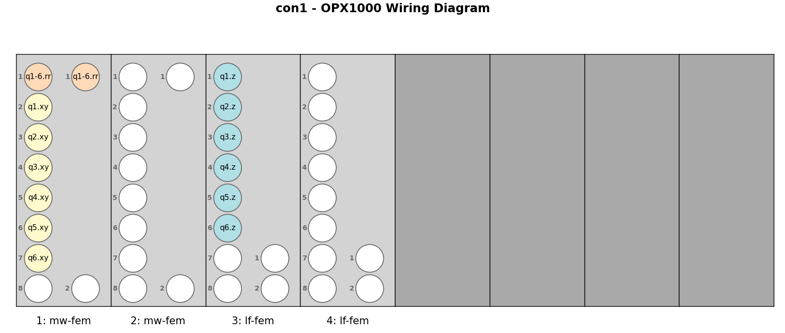

# Creating the QUAM State

This document explains the process of defining, generating, and initializing the Quantum Abstract Machine (QUAM) state, which serves as the central configuration object for your quantum system within the QUAlibrate software ecosystem. The QUAM object holds information about hardware configuration, connectivity, elements (qubits, resonators, etc.), pulses, and operations.

## Folder Contents (`quam_config/`)

The `quam_config` library is organized into the following main files and directories:

```text
quam_config/
├── __init__.py             # Makes quam_config a Python package.
├── my_quam.py              # Defines the core QUAM Python class structure.
├── generate_quam.py        # Script to generate the QUAM state file (e.g., JSON), based on wiring examples.
├── populate_quam_*.py      # Scripts to populate QUAM with initial parameters for specific hardware.
├── instrument_limits.py    # Defines operational limits for instruments.
├── wiring_examples/        # Example wiring/connectivity configurations.
│   ├── wiring_opxp_octave.py
│   ├── wiring_lffem_mwfem.py
│   └── ...                 # Other specific hardware wiring examples.
└── README.md               # Documentation for QUAM configuration (this file).
```

**`my_quam.py`**: Defines the root-level QUAM class (inheriting from base `QuamRoot`) representing your physical setup (qubits, instruments). This will be used in each QualibrationNode and can either be imported from the `quam-builder` module or customized to match your set-up.

**`generate_quam.py`**: Script to generate the static QUAM configuration (wiring) and the baseline QUAM state file. The user is expected to copy the contents from a relevant script in `wiring_examples/` into this file and adjust it to match their specific hardware setup. Running this script generates the initial QUAM state.

**`populate_quam_*.py`** (e.g., `populate_quam_opxp_octave.py`, `populate_quam_lf_mw_fems.py`): Loads a base QUAM state (generated by `generate_quam.py`) and populates it with initial operational parameters and connectivity details for specific hardware setups (e.g., OPX+ & Octave, OPX1000), providing a starting point for calibration.

**`instrument_limits.py`**: Defines instrument operational limits (e.g., power, frequency) used for validation or constraints during analysis and subsequent QUAM state updates.

**`wiring_examples/`**: Contains example scripts showing how to define hardware wiring/connectivity within QUAM for various setups, serving as templates. The appropriate script's contents should be copied to `generate_quam.py` and adjusted accordingly.

## Workflow for Creating the QUAM State

The typical workflow to create a QUAM state that accurately represents your quantum setup involves the following steps:

### 1️⃣ Navigate to `superconducting/quam_config` folder

All relevant scripts reside here.

### 2️⃣ Define the QUAM Root Class Structure (in `my_quam.py`)

Edit `my_quam.py` to define the Python classes representing your system's hierarchy.
It contains a class definition `Quam`, which should typically inherit from `FluxTunableQuam` or `FixedFrequencyQuam` depending on the qubit type and can be customized if needed.

### 3️⃣ Generate Static Configuration & Wiring (using `generate_quam.py`)

This step creates the static part of the QUAM state, primarily defining the hardware layout, connectivity, and the initial (mostly empty) state file.

- Find the example script in the `wiring_examples/` directory that most closely matches your hardware setup (e.g., `wiring_opxp_octave.py`, `wiring_lffem_mwfem.py`).
- Copy the entire content of the chosen example script into `generate_quam.py`.
- Modify the `generate_quam.py` script:
  - Adjust static parameters like IP addresses and cluster names.
  - Define the available instruments in your setup.
  - Specify the qubit IDs present in your system.
  - Define any custom channel addresses if necessary.
  - Review the wiring allocation logic and adjust if needed.
- Run the script: Execute `python generate_quam.py`. This uses the definitions in the script (leveraging `quam-builder` tools internally) to generate the QUAM state files (e.g., `wiring.json` and `state.json`) in your QUAM state folder (default: `superconducting/quam_state`). The `state.json` created at this stage contains the structure but is largely empty of specific operational parameters. This generated QUAM state should typically be populated with target values in the next step.



### 4️⃣ Initialize Dynamic Parameters (using `populate_quam_*.py`)

This step populates the QUAM state file (e.g., `state.json`) created in the previous step with initial operational parameters.

- Choose the correct initialization script based on your hardware:
  - For OPX+/Octave setups: Use `populate_quam_opxp_octave.py`.
  - For OPX1000 setups: Use `populate_quam_lf_mw_fems.py`.
  - Adapt or create a new script if your setup differs significantly.
- Edit the chosen script: These files contain initial guesses for parameters like qubit/resonator frequencies, pulse amplitudes/durations, gains, etc.. **You must adjust these values** to be reasonable starting points for your specific qubits and setup.
- Run the script: Execute `python populate_quam_{hw_type}.py` (replacing `{hw_type}` accordingly). This loads the existing QUAM state, populates the dynamic parameters based on the script's logic and values, and saves the updated, populated QUAM state file (e.g., `state.json`).

### 5️⃣ (Optional) Specify Instrument Limits (using `instrument_limits.py`)

For device safety or operational constraints, you can define limits on parameters such as waveform amplitudes in `instrument_limits.py`. This step ensures that analysis steps or manual changes do not set parameters outside safe operating ranges.

## Saving and loading a QUAM state

After completing these steps, your QUAM state is ready. You can load and save it within your Python scripts or calibration nodes using:

```python
# Make sure Quam class is correctly imported from your my_quam.py
from quam_config import Quam

# Load QUAM state (adjust path if needed)
machine = Quam.load()

# Save QUAM state (updates the state file)
machine.save()
```

This populated QUAM state serves as the starting point for running calibrations via QUAlibrate nodes, which will further refine these parameters.
