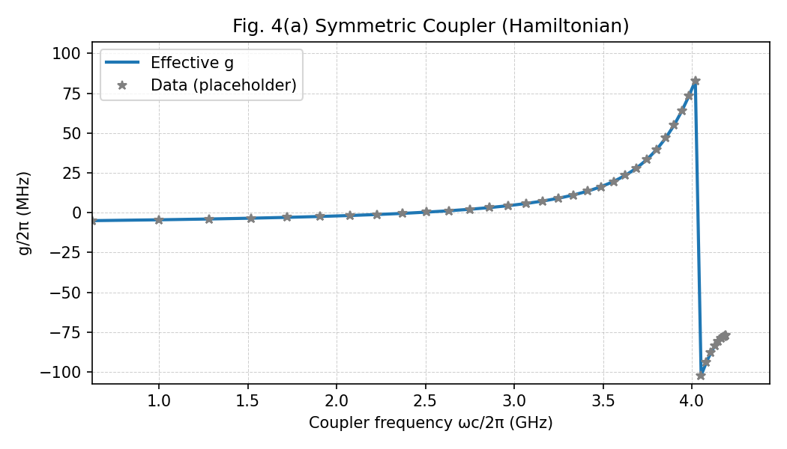

# Coupling vs Flux: Theory and Implementation

This note documents the theory used to compute the effective qubit-qubit coupling
as a function of tunable coupler flux, and how it is implemented in the code.
All energies are in GHz and times in ns.

## Model Hamiltonian (Sete et al.)

The device is modeled as two transmon qubits coupled through a tunable coupler.
Each mode is approximated as a Duffing oscillator:

- Mode Hamiltonian:
  - `H_k = omega_k a_k^† a_k - (K_k/2) a_k^† a_k^† a_k a_k`

- Coupling terms (charge-charge coupling from the paper):
  - `H_int = g_1c (a_1 a_c^† + a_1^† a_c - a_1 a_c - a_1^† a_c^†)
            + g_2c (a_2 a_c^† + a_2^† a_c - a_2 a_c - a_2^† a_c^†)
            + g_12 (a_1 a_2^† + a_1^† a_2 - a_1 a_2 - a_1^† a_2^†)`

This matches the floating tunable-coupler model (Appendix B in the paper).

## Flux-to-Frequency Nonlinearity

Each SQUID has effective Josephson energy:

- `EJ(phi) = sqrt(EJ_S^2 + EJ_L^2 + 2 EJ_S EJ_L cos(phi))`

where `phi = 2 pi Phi / Phi0` is the reduced external flux.

The transmon expansion yields:

- `omega(phi) = sqrt(8 EJ EC) - EC * (1 + xi/4)`
- `K(phi) = 0.5 * EC * (1 + 9 xi/16)`
- `xi = sqrt(2 EC / EJ)`

These expressions are used for qubits and coupler. In the symmetric coupler
configuration, `EJ_S = EJ_L`, and `omega(phi)` spans the widest range.

## Effective Coupling Extraction

The effective qubit-qubit coupling is extracted from the **full Hamiltonian**
via eigensplitting in the single-excitation manifold:

1. Build `H` at a fixed flux.
2. Diagonalize `H` and identify the two eigenstates with the largest overlap
   on `|10>` and `|01>` (coupler in ground).
3. Define `g_eff = 0.5 * (E_high - E_low)`.
4. Assign sign by checking which state is more symmetric:
   - If the higher-energy eigenstate overlaps more with `(|10> + |01>)/sqrt(2)`,
     then `g_eff > 0`, else `g_eff < 0`.

This reproduces the correct sign convention for the symmetric configuration.

## Plot

The plot below is generated by:

- `qualibration_graphs/superconducting/validation_utils/time_dynamics/coupling_vs_flux.py`

and saved to:

- `qualibration_graphs/superconducting/validation_utils/time_dynamics/data/coupling_vs_flux.png`

## Notes on Avoided Crossing

The analytic perturbative expression yields a divergence at resonance
(`g ~ 1/Delta`). The full Hamiltonian instead shows a finite avoided crossing.
To see both branches, the plot uses the full omega_c range and an autoscaled
y-axis so the large coupling near resonance is visible.
