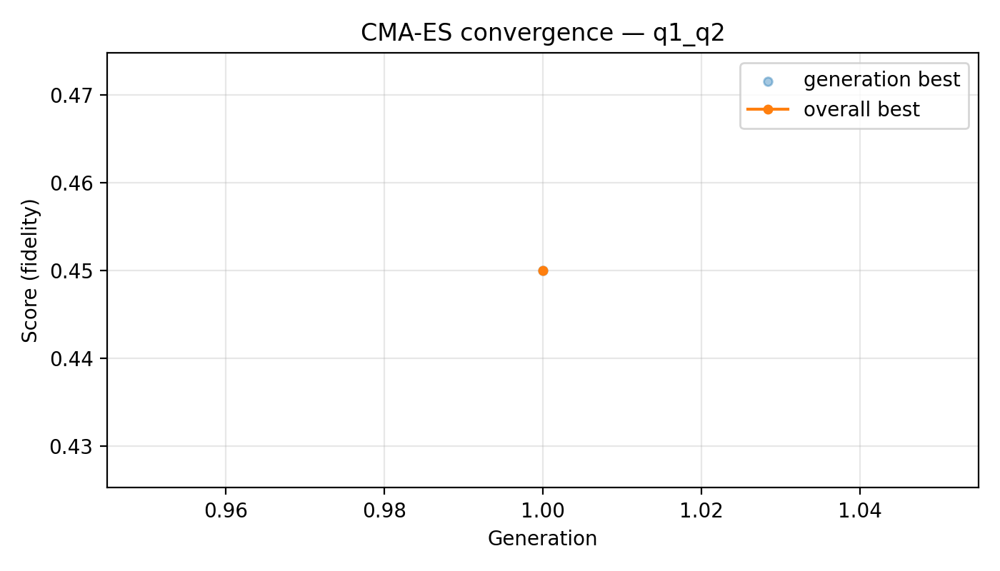
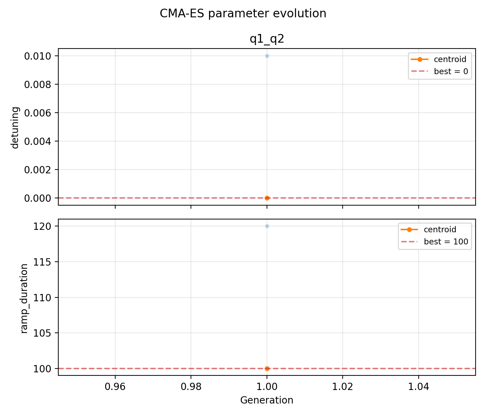

# 01_optimize_measurement_fidelity

## Description

OPTIMISE MEASUREMENT FIDELITY (CMA-ES)
Uses CMA-ES to jointly optimise the measurement detuning and initialisation
ramp duration so as to maximise the readout fidelity.

Each generation of CMA-ES proposes a batch of candidate (detuning,
ramp_duration) pairs.  For every candidate the QUA program initialises the
qubit, ramps to the candidate detuning with the candidate ramp duration, and
performs a dispersive readout for ``num_shots`` repetitions.  The shot-by-shot
I/Q data is projected onto the axis of maximum variance (PCA) and a
two-component Gaussian mixture is fitted analytically to extract the readout
fidelity.

The QUA program is compiled once and uses input streams so that each new
generation only requires pushing fresh parameter values — no recompilation.

Prerequisites:
    - Having initialised the Quam.
    - Having calibrated the PSB measurement point (06a-06c).
    - Having the balanced measurement macro configured with a valid threshold.

State update:
    - The measure voltage point detuning and the initialisation ramp duration
      on each qubit pair.

## Parameters

| Parameter | Value |
|-----------|-------|
| `buffer_duration` | `16` |
| `cmaes_log_each_generation` | `True` |
| `detuning_initial` | `0.0` |
| `detuning_max` | `0.1` |
| `detuning_min` | `-0.1` |
| `load_data_id` | `None` |
| `max_generations` | `1` |
| `multiplexed` | `False` |
| `num_shots` | `100` |
| `operation` | `readout` |
| `population_size` | `2` |
| `qubit_pairs` | `['q1_q2']` |
| `ramp_duration_initial` | `100` |
| `ramp_duration_max` | `2000` |
| `ramp_duration_min` | `16` |
| `reset_wait_time` | `5000` |
| `sigma0` | `0.01` |
| `simulate` | `False` |
| `simulation_duration_ns` | `50000` |
| `success_threshold` | `0.5` |
| `timeout` | `120` |
| `tolfun` | `1e-06` |
| `tolx` | `1e-06` |
| `use_state_discrimination` | `False` |
| `use_waveform_report` | `True` |

## Optimisation Results

### q1_q2

- **Converged**: False
- **Generations**: 1
- **Best score (fidelity)**: 0.450000

| Parameter | Value |
|-----------|-------|
| `detuning` | `0` |
| `ramp_duration` | `100` |

## Analysis Output

