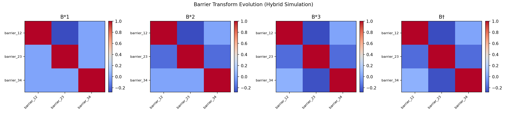
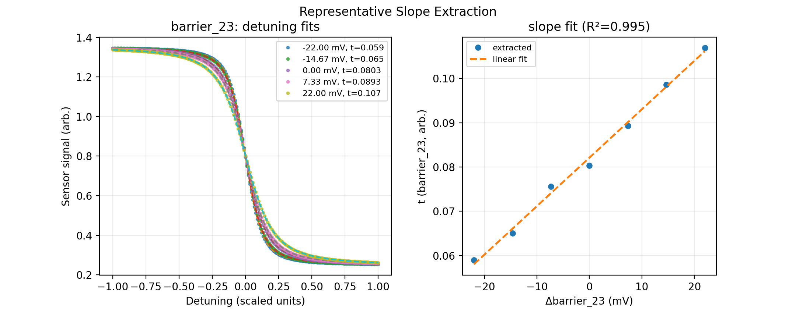
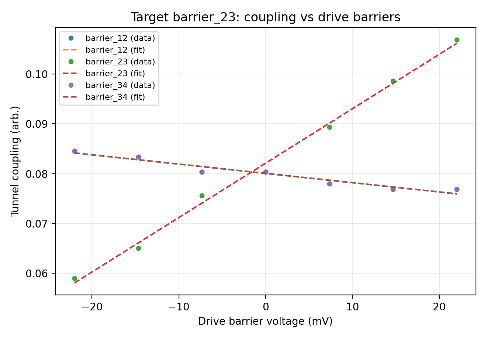
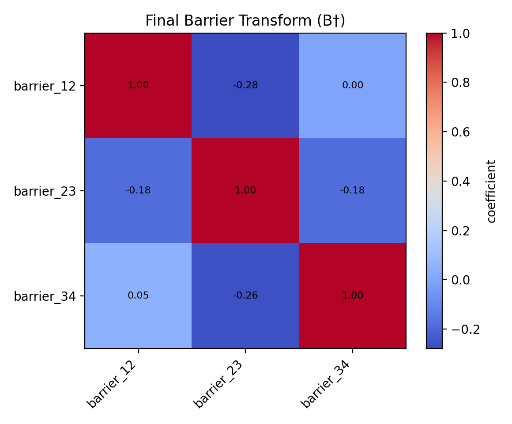

# 03_barrier_compensation

## Description

Hybrid-simulator E2E analysis test for barrier-barrier virtualization.
Synthetic pair scans are generated from:

1. Paper-style tunnel model: `t_i = t0_i * exp(sum_j Gamma_ij * dB_j)`
2. Finite-temperature inter-dot transition traces per drive point
3. Optional `qarray` sensor background mixed into the traces

## Summary

- `qarray_background_used`: `True`
- `max_residual_crosstalk`: `0.052891`
- `residual_target`: `0.10`

## Raw slope matrices

### Extracted `dt_i/dB_j`

```text
[[ 7.5754e-01 -1.8677e-01  7.1527e-16]
 [-1.8677e-01  1.0940e+00 -1.8677e-01]
 [ 7.1527e-16 -1.7646e-01  7.5754e-01]]
```

### Ground-truth at operating point

```text
[[ 0.75 -0.22  0.  ]
 [-0.22  1.1  -0.22]
 [ 0.   -0.22  0.75]]
```

## Analysis Output






---
*Generated by gate_virtualization hybrid analysis test*
