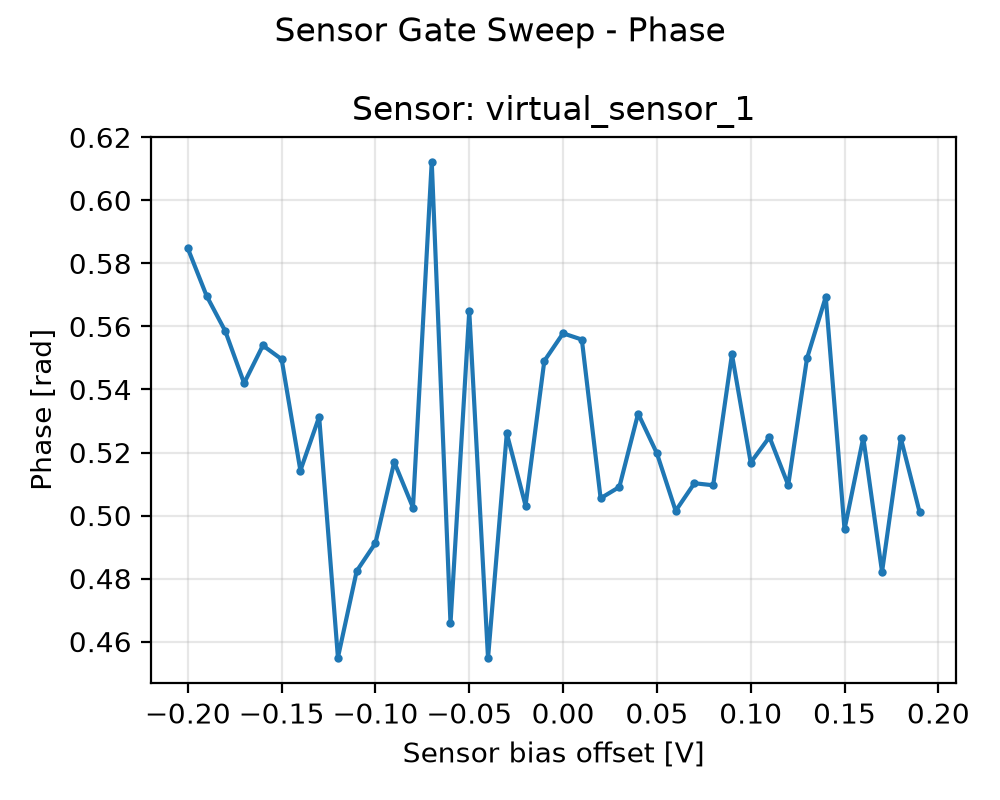
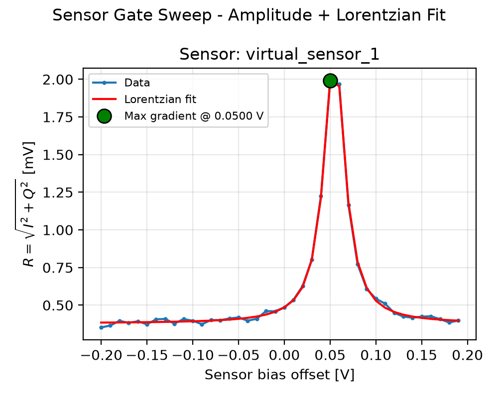

# 03a_sensor_gate_sweep_opx

## Description

        SENSOR DOT GATE SWEEP (OPX)
This sequence sweeps the sensor-dot gate bias using the OPX (AC line of a bias-tee) and measures the sensor response via
RF reflectometry. At each bias offset, a readout pulse is sent to the sensor resonator and the reflected signal is
demodulated into the 'I' and 'Q' quadratures. The sweep is averaged to improve SNR and post-processed to extract the
recommended operating point (maximum-sensitivity bias).

Prerequisites:
    - Connect the AC line of the bias-tee connected to the sensor dot to one OPX channel.
    - QUAM initialised (e.g. ``quam_config/populate_quam_state_*.py``).
    - SensorDot readout resonators calibrated (time-of-flight/offsets/gains + readout frequency, amplitude, duration).
    - (Recommended) Use an external DAC to hold a DC offset while the OPX performs fast sweeps.

Datasets:
    - ``ds_raw``: untouched I/Q fetched from the OPX (never modified after acquisition).
    - ``ds_processed``: ``ds_raw`` plus derived amplitude/phase (used by fitting and plotting).
    - ``ds_fit``: processed sweeps plus analysis outputs (derived fields and per-sensor summary coordinates). Used by
      ``plot_data``.
    - ``fit_results``: compact per-sensor calibration dict (``FitParameters`` serialized with ``asdict``). Used by
      logging, ``node.outcomes``, and ``update_state``.

Results (``node.results["fit_results"][<sensor>]``):
    - ``success``: whether the fit passed sanity checks and the state update is applied.
    - ``optimal_bias`` [V]: recommended operating bias (Lorentzian inflection point; side set by ``peak_fit_side``).
    - ``peak_position`` [V]: detected Coulomb-peak position (feature detection).
    - ``lorentzian_gamma`` [V]: Lorentzian FWHM (linewidth) of the fitted peak.
    - ``max_gradient_bias`` [V]: bias at maximum slope (closest sampled point to ``optimal_bias``).

Figures (``node.results["figures"]``):
    - ``"phase"``: phase vs bias offset for each sensor.
    - ``"amplitude_gradient"``: amplitude with Lorentzian fit overlay and a marker at the max-gradient point.

State update:
    - Adds/updates the SensorDot ``MEASURE`` voltage point using ``optimal_bias`` for each successful sensor.

## Parameters

| Parameter | Value | Description |
|-----------|-------|-------------|
| `multiplexed` | `False` | Whether to play control pulses, readout pulses and active/thermal reset at the same time for all qubits (True)
or to play the experiment sequentially for each qubit (False). Default is False. |
| `use_state_discrimination` | `False` | Whether to use on-the-fly state discrimination and return the qubit 'state', or simply return the demodulated
quadratures 'I' and 'Q'. Default is False. |
| `reset_type` | `thermal` | The qubit reset method to use. Must be implemented as a method of Quam.qubit. Can be "thermal", "active", or
"active_gef". Default is "thermal". |
| `num_shots` | `10` | Number of averages to perform. Default is 100. |
| `offset_min` | `-0.2` | Minimum voltage offset for the sensor gate sweep in volts. Default is -0.2 V. |
| `offset_max` | `0.2` | Maximum voltage offset for the sensor gate sweep in volts. Default is 0.2 V. |
| `offset_step` | `0.01` | Step size for the voltage offset sweep in volts. Default is 0.005 V. |
| `duration_after_step` | `1000` | Wait duration after each voltage step in nanoseconds. Default is 1000 ns (1 µs). |
| `sensor_names` | `None` | The list of sensor dot names to be included in the measurement.  |
| `use_simulated_data` | `False` | Whether to generate simulated data instead of measuring via the OPX. Default False. |
| `peak_fit_side` | `left` | Which side to fit the max gradient on. |
| `max_compensation_voltage` | `0.01` | The maximum compensation pulse voltage. |
| `ramp_duration` | `16` | Ramp duration of each voltage point. |
| `simulate` | `False` | Simulate the waveforms on the OPX instead of executing the program. Default is False. |
| `simulation_duration_ns` | `50000` | Duration over which the simulation will collect samples (in nanoseconds). Default is 50_000 ns. |
| `use_waveform_report` | `True` | Whether to use the interactive waveform report in simulation. Default is True. |
| `timeout` | `120` | Waiting time for the OPX resources to become available before giving up (in seconds). Default is 120 s. |
| `load_data_id` | `None` | Optional QUAlibrate node run index for loading historical data. Default is None. |

## Fit Results

| Qubit | f_res (GHz) | t_pi (ns) | Omega_R (rad/ns) | gamma (1/ns) | T2* (ns) | success |
|-------|-------------|----------|--------------|----------|----------|--------|
| virtual_sensor_1 | 0.0000 | nan | nan | nan | inf | True |

## Updated State

| Qubit | intermediate_frequency (Hz) | xy.operations.x180.length (ns) |
|-------|-----------------------------|-----------------------------------------|
| virtual_sensor_1 | 0 | nan |

## Analysis Output

---
*Generated by analysis test infrastructure (virtual_qpu)*
