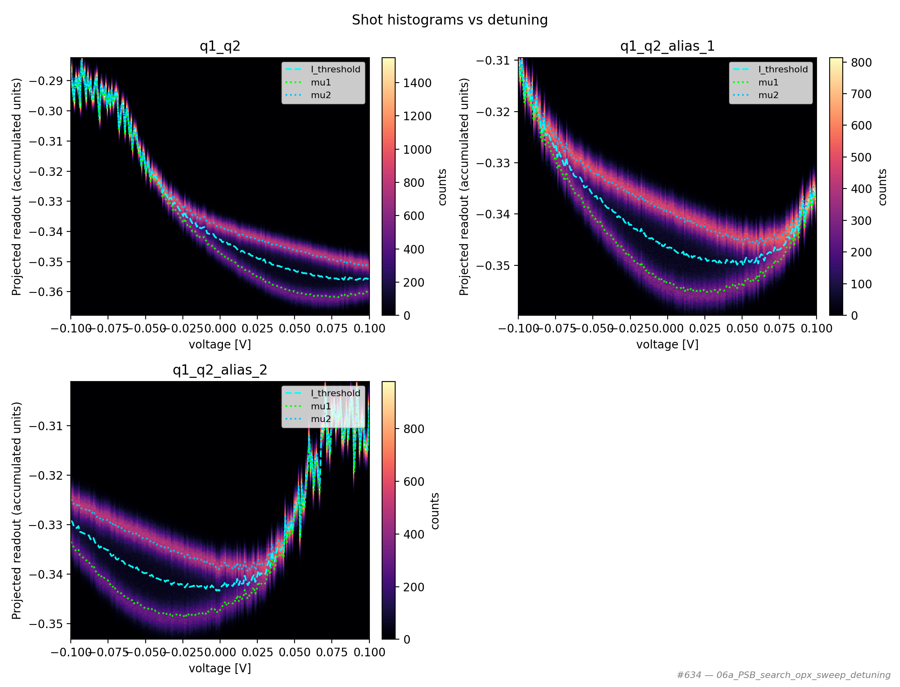
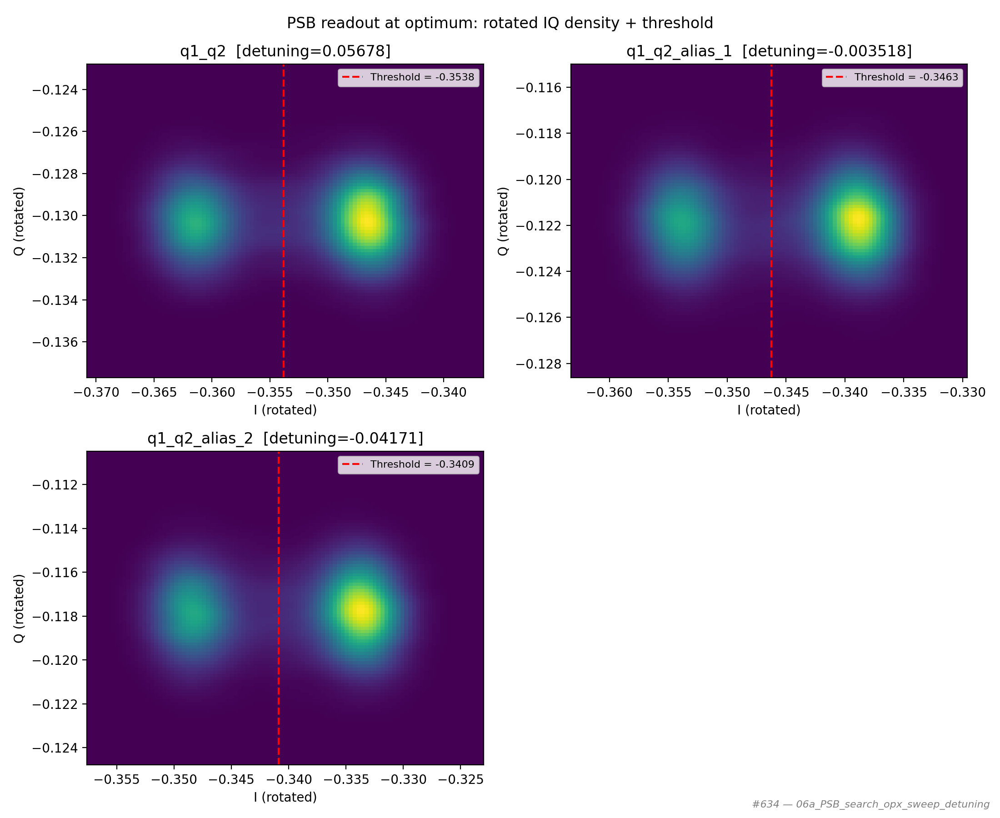

# 06a_PSB_search_opx_sweep_detuning

## Description

PAULI SPIN BLOCKADE SEARCH - Sweep Detuning
The goal of this sequence is to find the Pauli Spin Blockade (PSB) region.
To do so, the following triangle in voltage space (empty - random initialization - measurement) is applied using OPX
channels on the fast lines of the bias-tees while sweeping the "measure" voltage point along the detuning axis.

The OPX measures the response via RF reflectometry or DC current sensing during the readout window
(last segment of the triangle). A single-point averaging is performed and the data is extracted while
the program is running to display the results.

Depending on the cut-off frequency of the bias-tee, it may be necessary to adjust the barycenter (voltage offset) of each
triangle so that the fast line of the bias-tees sees zero voltage on average. Otherwise, the high-pass filtering effect
of the bias-tee will distort the fast pulses over time, unless a compensation pulse is played.

Prerequisites:
    - Having initialized the Quam (quam_config/populate_quam_state_*.py).
    - Having calibrated the resonators coupled to the SensorDot components.
    - Having calibrated the "empty" and "initialization" voltage points, and having defined the detuning axis.

State update:
    - The optimal detuning value for PSB readout, as the voltage point associated with the .measure macro.

## Parameters

| Parameter | Value |
|-----------|-------|
| `barrier_gate_voltage` | `0.0` |
| `buffer_duration` | `16` |
| `detuning_max` | `0.1` |
| `detuning_min` | `-0.1` |
| `detuning_points` | `200` |
| `initialization_macro` | `empty` |
| `labeled_states` | `False` |
| `load_data_id` | `None` |
| `multiplexed` | `False` |
| `num_shots` | `20000` |
| `operation` | `readout` |
| `optimization_metric` | `fidelity` |
| `qubit_pairs` | `None` |
| `ramp_duration` | `40` |
| `reset_wait_time` | `5000` |
| `simulate` | `False` |
| `simulation_duration_ns` | `50000` |
| `sweep_name` | `detuning` |
| `timeout` | `120` |
| `use_simulated_data` | `False` |
| `use_state_discrimination` | `False` |
| `use_waveform_report` | `True` |

## Fit Results

| qubit_pair | optimal_detuning | F* @ detuning | V* @ detuning | F (%) | V | success |
|------------|------------------|---------------|---------------|-------|---|---------|
| q1_q2 | 0.05678 | 0.05678 | 0.05678 | 99.7 | 0.994 | True |
| q1_q2_alias_1 | -0.003518 | -0.003518 | -0.003518 | 99.7 | 0.995 | True |
| q1_q2_alias_2 | -0.04171 | -0.04171 | -0.04171 | 99.7 | 0.995 | True |

## Figures

