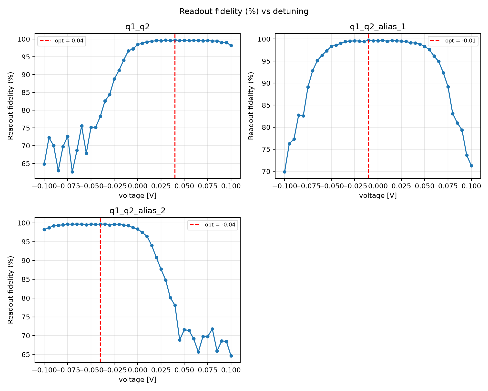
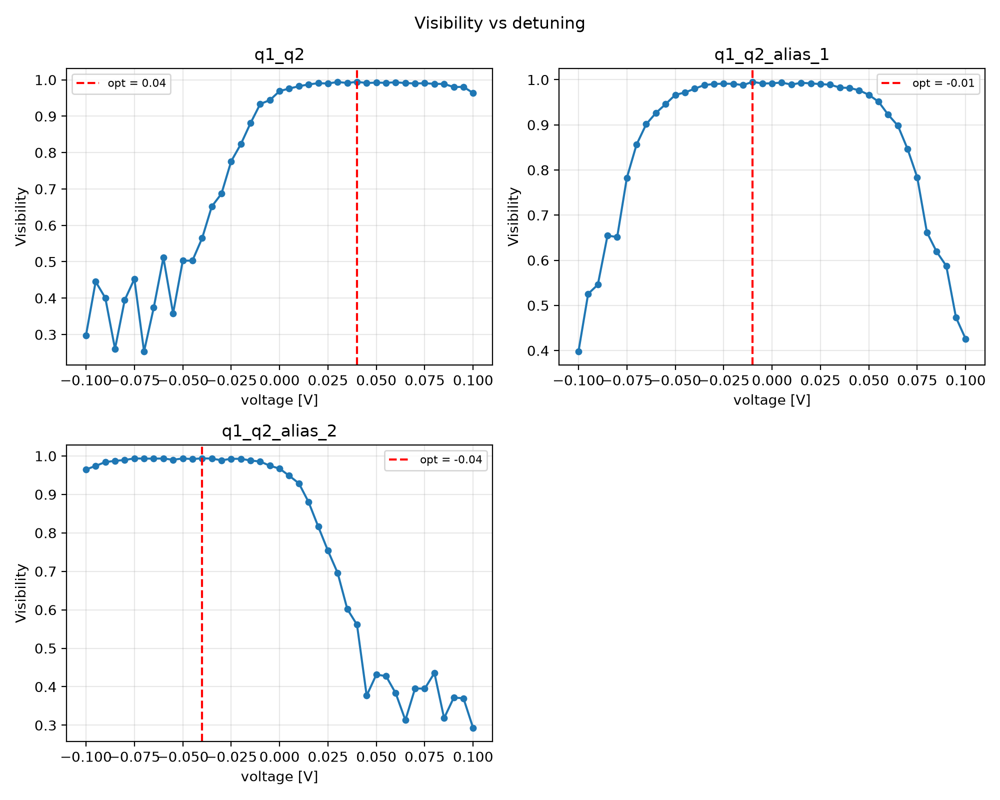
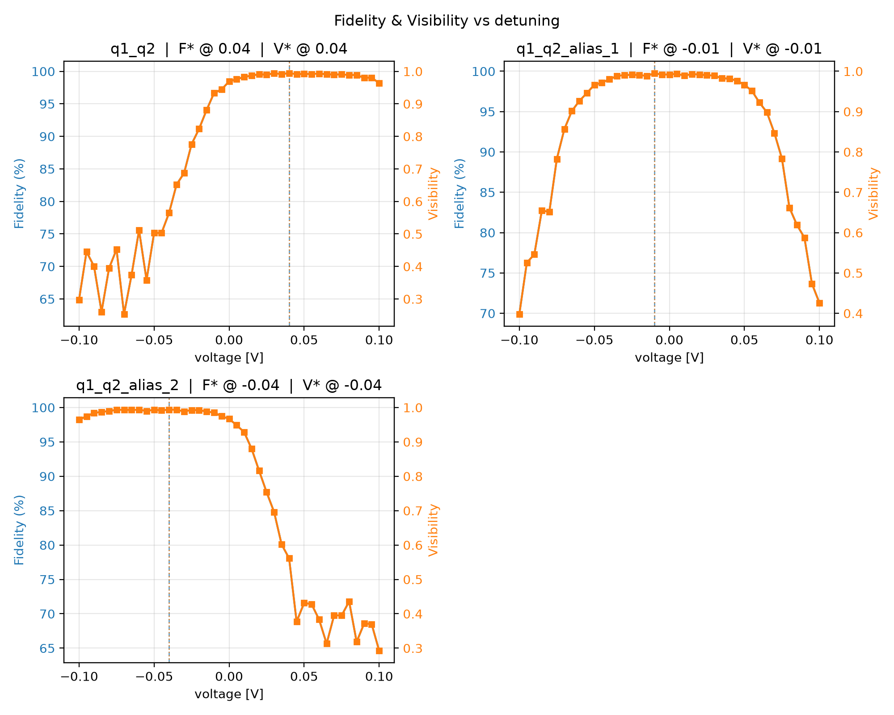
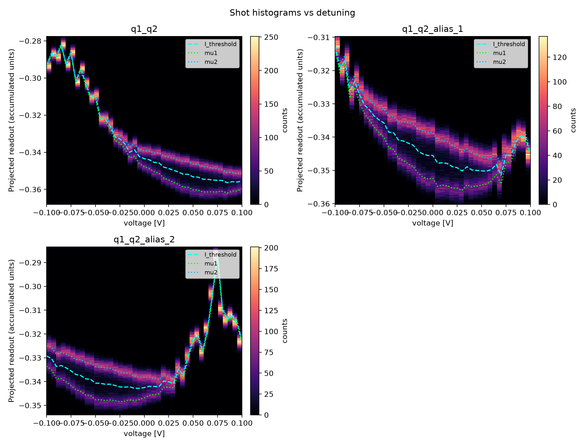
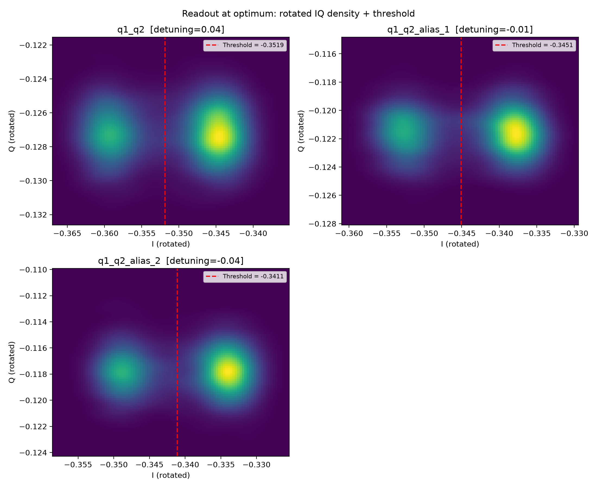

# 06a_PSB_search_opx_sweep_detuning

## Description

PAULI SPIN BLOCKADE SEARCH — Sweep detuning (OPX)

This node searches for the Pauli Spin Blockade (PSB) region by sweeping the
inter-dot detuning and measuring the sensor response during a PSB readout window.
Each sweep point plays a voltage sequence (prepare → ramp → measure) using OPX 
fast-line channels, and acquires per-shot I/Q data.

Prerequisites
-------------
- QUAM configured and loaded (``quam_config/populate_quam_state_*.py``).
- Sensor-dot readout calibrated (resonator calibration nodes completed).
- Detuning axis and voltage points (empty / initialize / measure) defined on the dot pair.

Datasets
--------
- ``ds_raw``: shot-level ``I`` and ``Q`` vs ``detuning`` (dims: ``qubit_pair``, ``n_runs``, ``detuning``).
- ``ds_fit``: readout metrics and optimum detuning per pair (from ``iq_sweep`` analysis).
- ``fit_results``: per-pair scalar results (serialized dataclass) for logging and state updates.

Results
-------
For each qubit pair, the node identifies an optimal detuning (by fidelity or visibility)
and extracts the readout axis and threshold used for the PSB readout discrimination.

Figures
-------
- Fidelity and visibility vs detuning
- Sweep summary (fidelity + visibility on twin axes)
- Shot histograms vs detuning (projected readout axis)
- Rotated IQ density at the optimal detuning with the chosen threshold

State update
------------
Updates the dot pair ``MEASURE`` voltage point detuning and stores the readout threshold
for the selected optimal detuning (only for successful pairs).

## Parameters

| Parameter | Value |
|-----------|-------|
| `barrier_gate_voltage` | `0.0` |
| `buffer_duration` | `16` |
| `detuning_max` | `0.1` |
| `detuning_min` | `-0.1` |
| `detuning_points` | `41` |
| `initialization_macro` | `empty` |
| `labeled_states` | `False` |
| `load_data_id` | `None` |
| `multiplexed` | `False` |
| `num_shots` | `3000` |
| `operation` | `readout` |
| `optimization_metric` | `fidelity` |
| `plot_kde` | `True` |
| `qubit_pair_to_initialize` | `None` |
| `qubit_pairs` | `None` |
| `qubit_to_pulse` | `None` |
| `ramp_duration` | `40` |
| `reset_type` | `thermal` |
| `simulate` | `False` |
| `simulation_duration_ns` | `50000` |
| `sweep_name` | `detuning` |
| `timeout` | `120` |
| `use_simulated_data` | `False` |
| `use_state_discrimination` | `False` |
| `use_waveform_report` | `True` |

## Fit Results

| qubit_pair | optimal_detuning | F* @ detuning | V* @ detuning | F (%) | V | success |
|------------|------------------|---------------|---------------|-------|---|---------|
| q1_q2 | 0.04 | 0.04 | 0.04 | 99.7 | 0.994 | True |
| q1_q2_alias_1 | -0.01 | -0.01 | -0.01 | 99.8 | 0.995 | True |
| q1_q2_alias_2 | -0.04 | -0.04 | -0.04 | 99.7 | 0.994 | True |

## Figures

