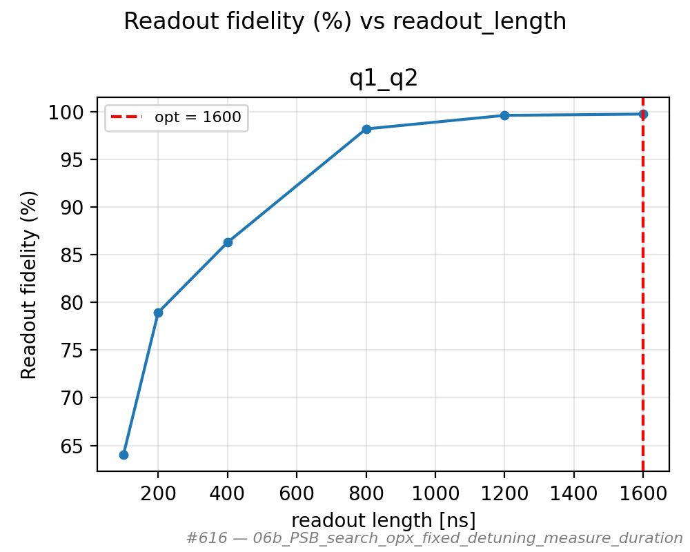
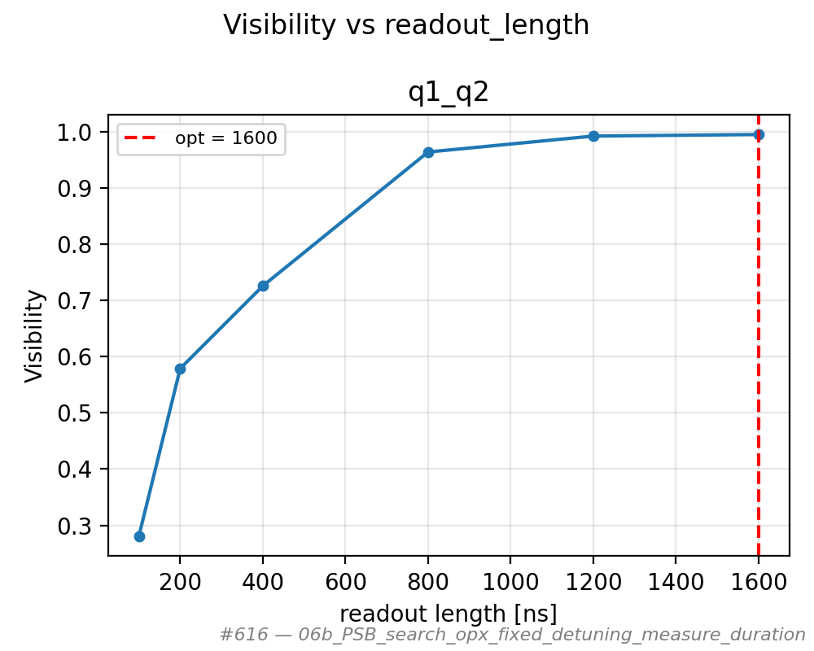
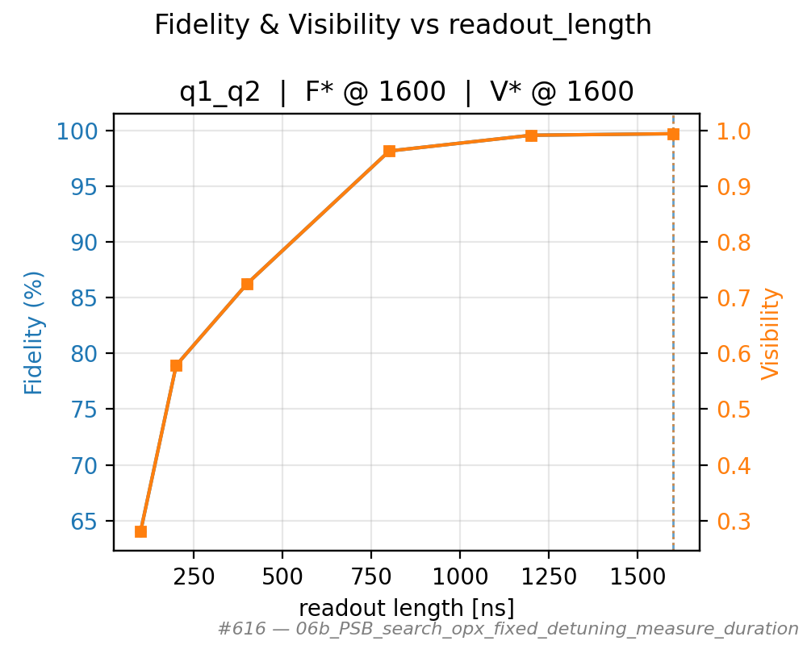
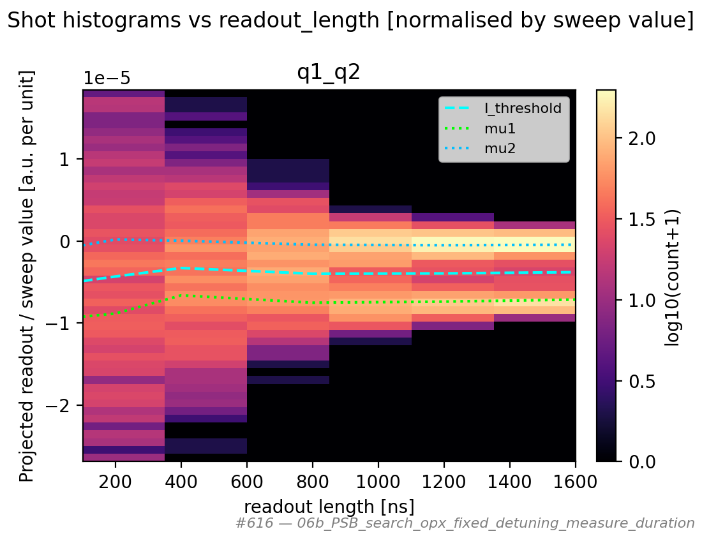
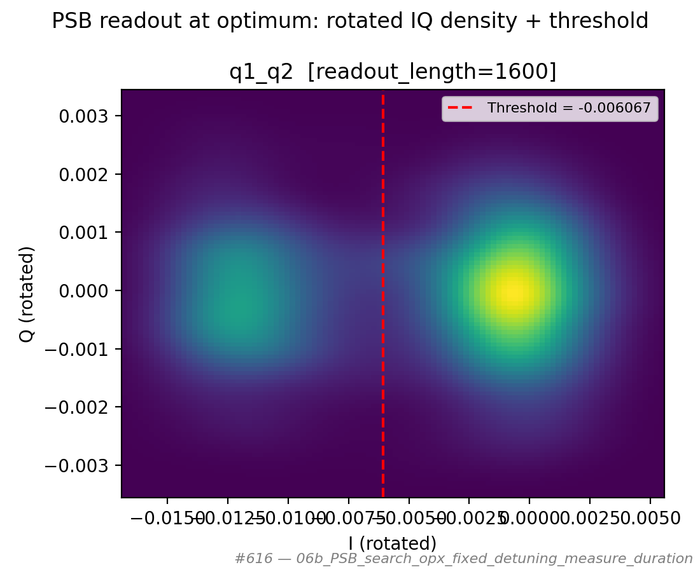

# 06b_PSB_search_opx_fixed_detuning_measure_duration

## Description

PAULI SPIN BLOCKADE SEARCH - Fixed Detuning, Sweep Readout Length
The goal of this sequence is to probe PSB contrast while sweeping how long the resonator
is integrated (readout pulse length / accumulated demod segments) at a fixed measure-point
detuning (optionally overridden via node parameters).

The readout pulse length is set to an exact integer number of demod chunks
(``N * 4 * segment_length`` ns) so QM integration weights match the accumulated measure.

Prerequisites:
    - Initialized Quam, calibrated sensor resonators, empty/init/measure macros.
    - Prefer having run 06a/06b to set the measure detuning; optional ``detuning`` override.

State update:
    Reverts temporary detuning override and extended readout pulse, then (if the fit succeeded)
    persists the optimal readout ``length``, integration-weights angle, and discrimination threshold
    on the pair's sensor dot (same pattern as 05c length + 06a readout calibration).

## Parameters

| Parameter | Value |
|-----------|-------|
| `buffer_duration` | `16` |
| `detuning` | `None` |
| `initialization_macro` | `empty` |
| `labeled_states` | `False` |
| `load_data_id` | `None` |
| `multiplexed` | `False` |
| `num_shots` | `1000` |
| `operation` | `readout` |
| `optimization_metric` | `fidelity` |
| `qubit_pairs` | `['q1_q2']` |
| `ramp_duration` | `40` |
| `readout_length_max` | `1600` |
| `readout_length_min` | `100` |
| `readout_length_points` | `6` |
| `reset_wait_time` | `5000` |
| `simulate` | `False` |
| `simulation_duration_ns` | `50000` |
| `sweep_name` | `readout_length` |
| `timeout` | `120` |
| `use_simulated_data` | `False` |
| `use_state_discrimination` | `False` |
| `use_waveform_report` | `True` |

## Fit Results

| qubit_pair | optimal_length_ns | F* @ length | V* @ length | F (%) | V | success |
|------------|-------------------|-------------|-------------|-------|---|---------|
| q1_q2 | 1600 | 1600 | 1600 | 99.7 | 0.995 | True |

## Figures

