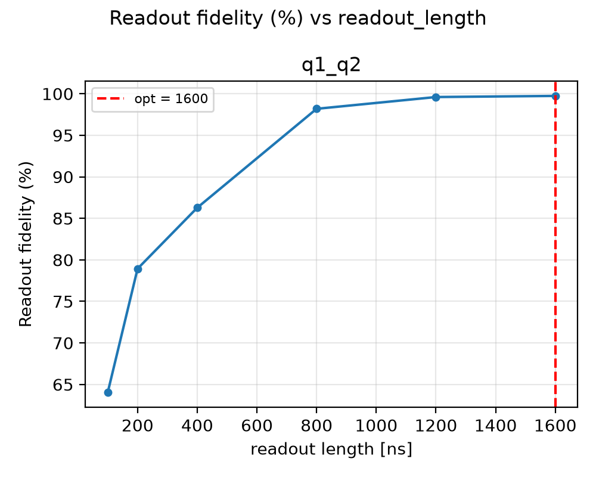
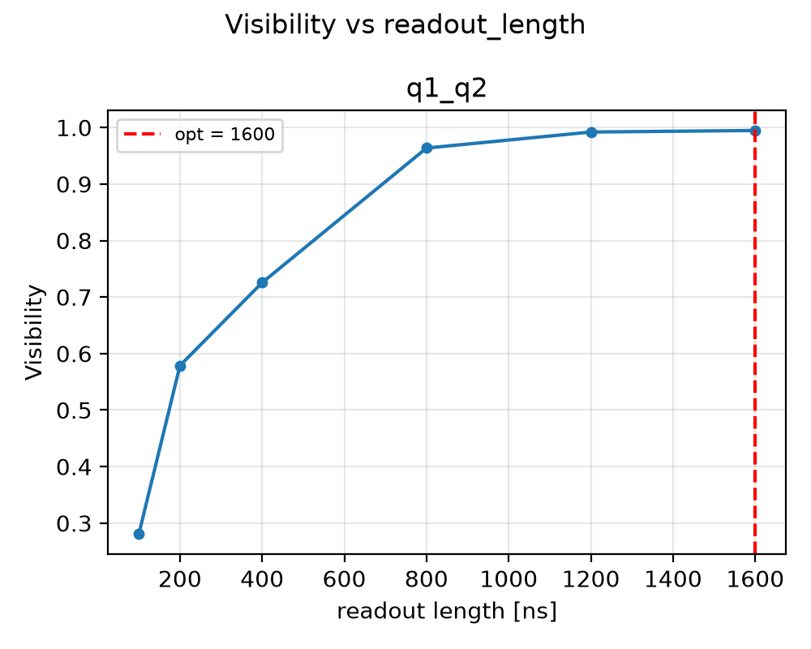
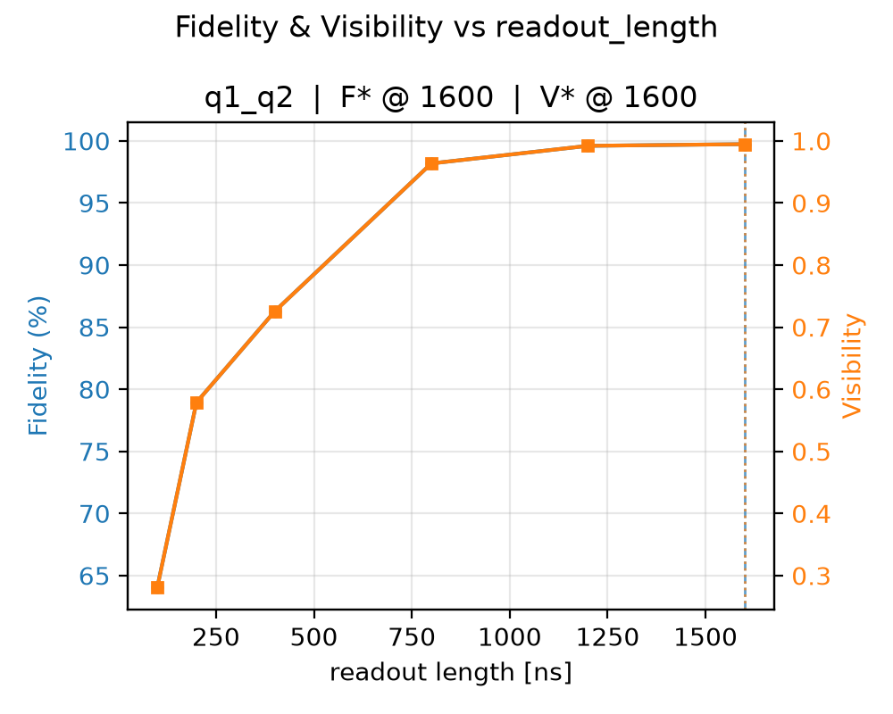
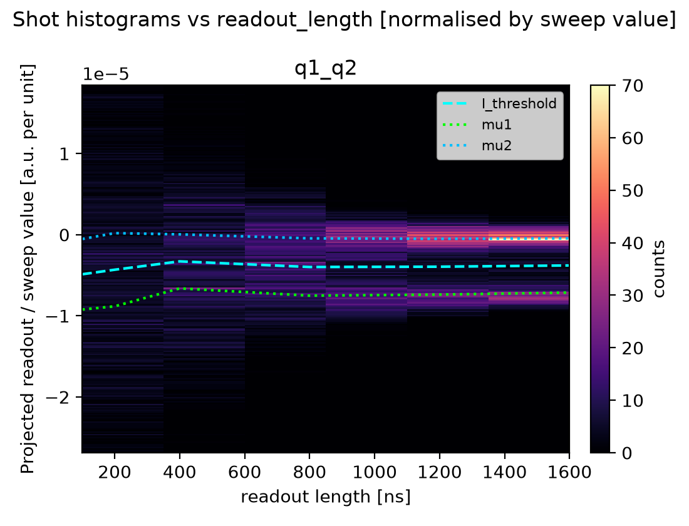
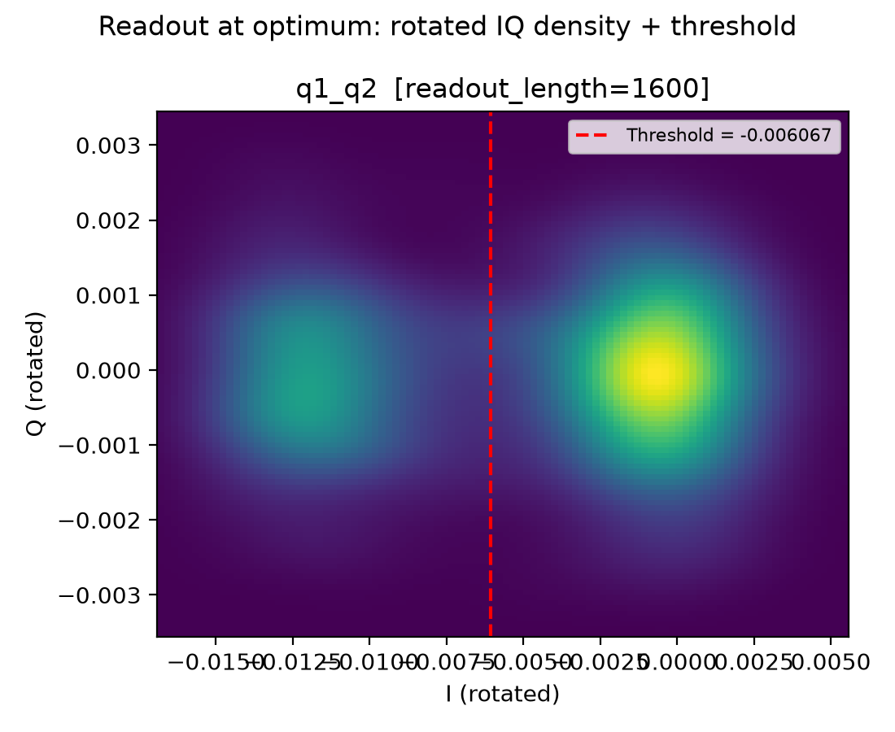

# 06b_PSB_search_opx_fixed_detuning_measure_duration

## Description

PAULI SPIN BLOCKADE SEARCH — Fixed detuning, sweep readout length (OPX)

This node probes PSB readout contrast while sweeping the resonator integration time
(readout pulse length / accumulated demodulation segments) at a fixed measure-point
detuning (optionally overridden via node parameters).

Because the sequence uses ``measure_accumulated``, the readout pulse length is constrained
to an integer number of integration chunks:

    ``pulse_length = N * 4 * segment_length``  (ns)

Prerequisites
-------------
- QUAM configured and loaded (``quam_config/populate_quam_state_*.py``).
- Sensor-dot readout calibrated (resonator calibration nodes completed).
- Empty / initialize / measure macros defined on the dot pair.
- Prefer running 06a first to set a reasonable measure detuning; this node can optionally
  override detuning temporarily via ``parameters.detuning``.

Datasets
--------
- ``ds_raw``: shot-level ``I`` and ``Q`` vs ``readout_length`` (dims: ``qubit_pair``, ``n_runs``, ``readout_length``).
- ``ds_fit``: readout metrics vs readout length (PCA + two-Gaussian EM per sweep point).
- ``fit_results``: per-pair scalar results (serialized dataclass) for logging and state updates.

Results
-------
For each qubit pair, the node selects an optimal readout length (fidelity or visibility)
and extracts the readout axis and threshold used for PSB discrimination at that optimum.

Figures
-------
- Fidelity and visibility vs readout length
- Sweep summary (fidelity + visibility on twin axes)
- Shot histograms vs readout length (projected readout axis; normalized by sweep value)
- Rotated IQ density at the optimal readout length with the chosen threshold

State update
------------
Reverts temporary detuning/pulse-length overrides, then (if the fit succeeded) persists the
optimal readout ``length``, integration-weights angle, and discrimination threshold on the
pair's sensor dot (same pattern as 05c length + 06a readout calibration).

## Parameters

| Parameter | Value |
|-----------|-------|
| `buffer_duration` | `16` |
| `detuning` | `None` |
| `initialization_macro` | `empty` |
| `labeled_states` | `False` |
| `load_data_id` | `None` |
| `multiplexed` | `False` |
| `num_shots` | `1000` |
| `operation` | `readout` |
| `optimization_metric` | `fidelity` |
| `plot_kde` | `True` |
| `qubit_pairs` | `['q1_q2']` |
| `ramp_duration` | `40` |
| `readout_length_max` | `1600` |
| `readout_length_min` | `100` |
| `readout_length_points` | `6` |
| `reset_type` | `thermal` |
| `simulate` | `False` |
| `simulation_duration_ns` | `50000` |
| `sweep_name` | `readout_length` |
| `timeout` | `120` |
| `use_simulated_data` | `False` |
| `use_state_discrimination` | `False` |
| `use_waveform_report` | `True` |

## Fit Results

| qubit_pair | optimal_length_ns | F* @ length | V* @ length | F (%) | V | success |
|------------|-------------------|-------------|-------------|-------|---|---------|
| q1_q2 | 1600 | 1600 | 1600 | 99.7 | 0.995 | True |

## Figures

