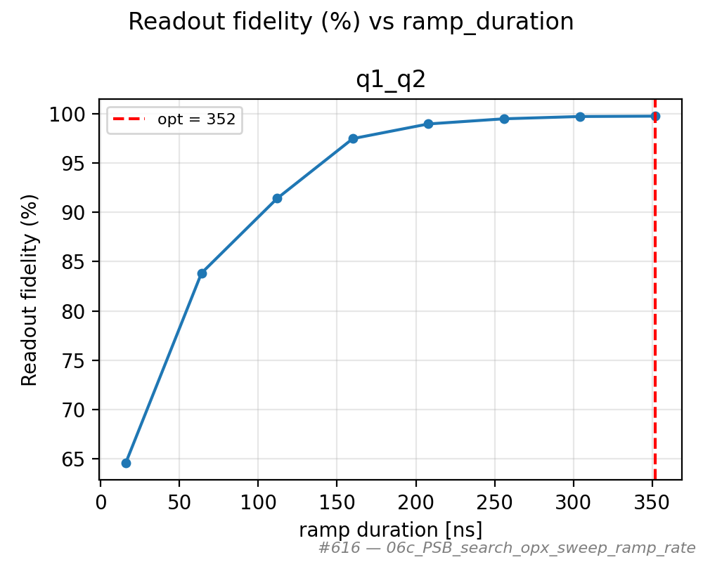
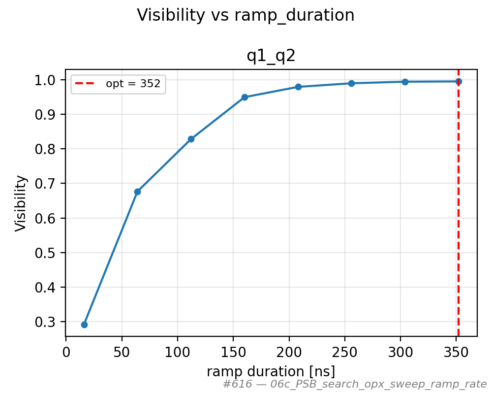
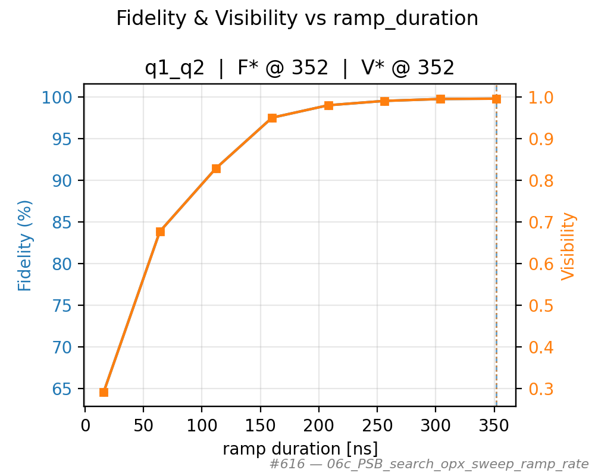
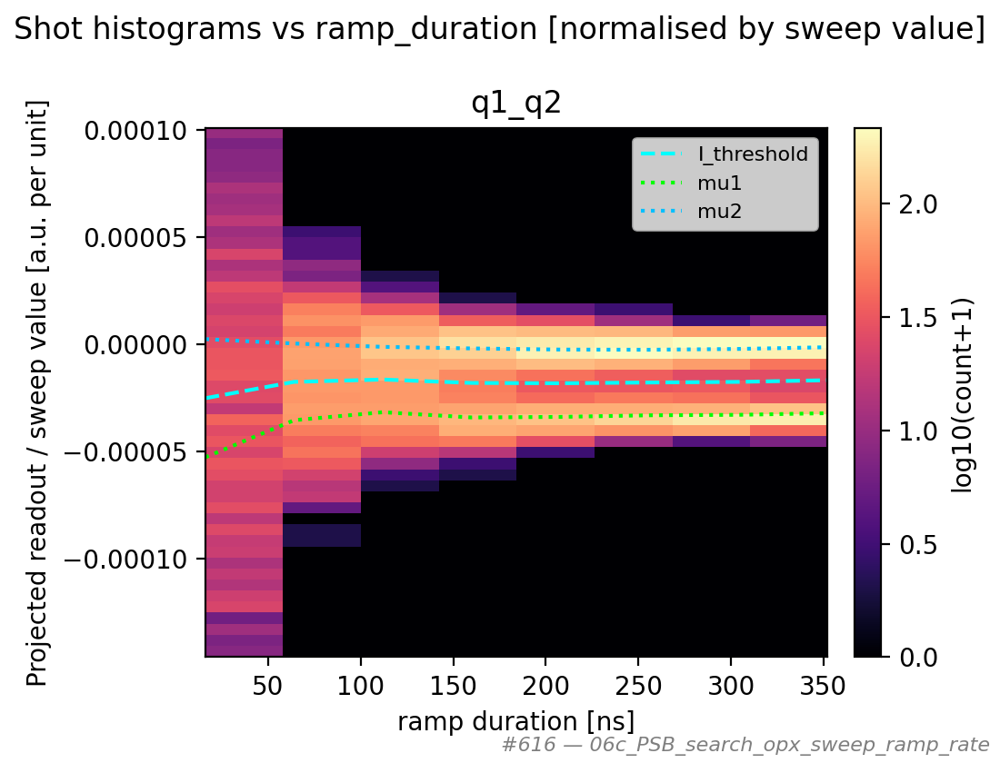
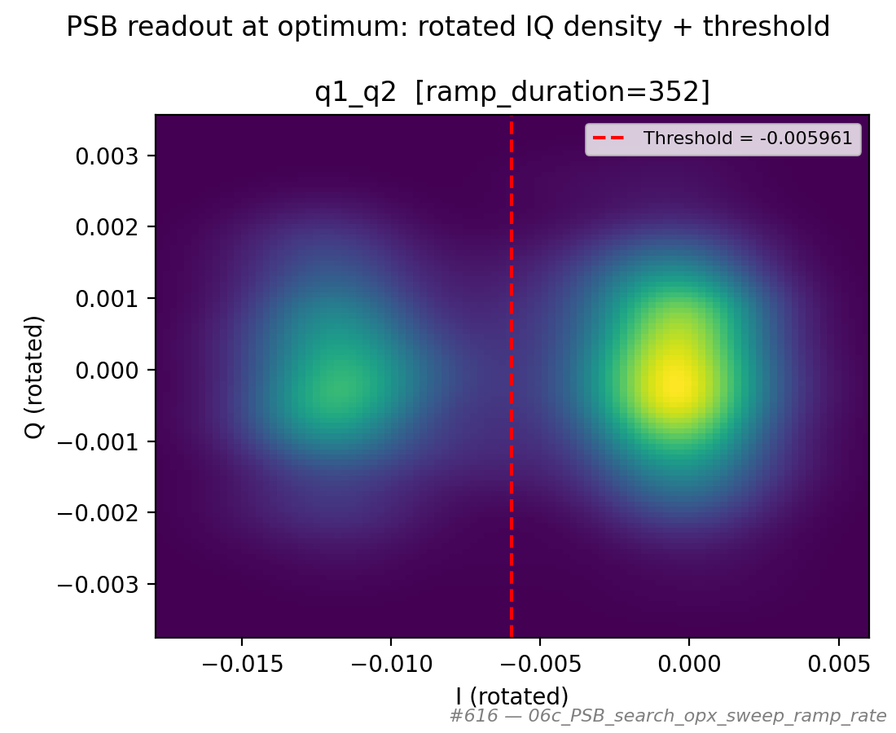

# 06c_PSB_search_opx_sweep_ramp_rate

## Description

PAULI SPIN BLOCKADE SEARCH - Fixed Measure Point, Sweep Ramp to Measure
The goal of this sequence is to probe PSB contrast while sweeping how long the voltage ramp
to the PSB measurement point lasts (nanoseconds). For a fixed voltage trajectory, shorter ramps
correspond to higher effective ramp rates on the OPX fast lines.

The sequence matches 06e except the swept axis is ramp duration: preparation via
``initialization_macro`` (default ``empty``), then for each ramp duration
``ramp_to_point('measure', ...)``, then resonator readout at the fixed measure
voltages (optional ``detuning`` override like 06e).

Prerequisites:
    - Initialized Quam, calibrated sensor resonators, empty/init/measure macros.
    - Prefer having run 06a/06b to set the measure detuning; optional ``detuning`` override.

State update:
    Reverts temporary detuning override, then (if the fit succeeded) persists the optimal ramp
    duration on the pair ``measure`` macro when supported, and updates integration-weights angle
    and discrimination threshold on the sensor dot (readout pulse length is not changed).

## Parameters

| Parameter | Value |
|-----------|-------|
| `buffer_duration` | `16` |
| `detuning` | `None` |
| `initialization_macro` | `empty` |
| `labeled_states` | `False` |
| `load_data_id` | `None` |
| `multiplexed` | `False` |
| `num_shots` | `1000` |
| `operation` | `readout` |
| `optimization_metric` | `fidelity` |
| `qubit_pairs` | `['q1_q2']` |
| `ramp_duration_max` | `400` |
| `ramp_duration_min` | `16` |
| `ramp_duration_step` | `48` |
| `reset_wait_time` | `5000` |
| `simulate` | `False` |
| `simulation_duration_ns` | `50000` |
| `sweep_name` | `ramp_duration` |
| `timeout` | `120` |
| `use_simulated_data` | `False` |
| `use_state_discrimination` | `False` |
| `use_waveform_report` | `True` |

## Fit Results

| qubit_pair | optimal_ramp_ns | F* @ ramp | V* @ ramp | F (%) | V | success |
|------------|-----------------|-----------|-----------|-------|---|---------|
| q1_q2 | 352 | 352 | 352 | 99.8 | 0.995 | True |

## Figures

