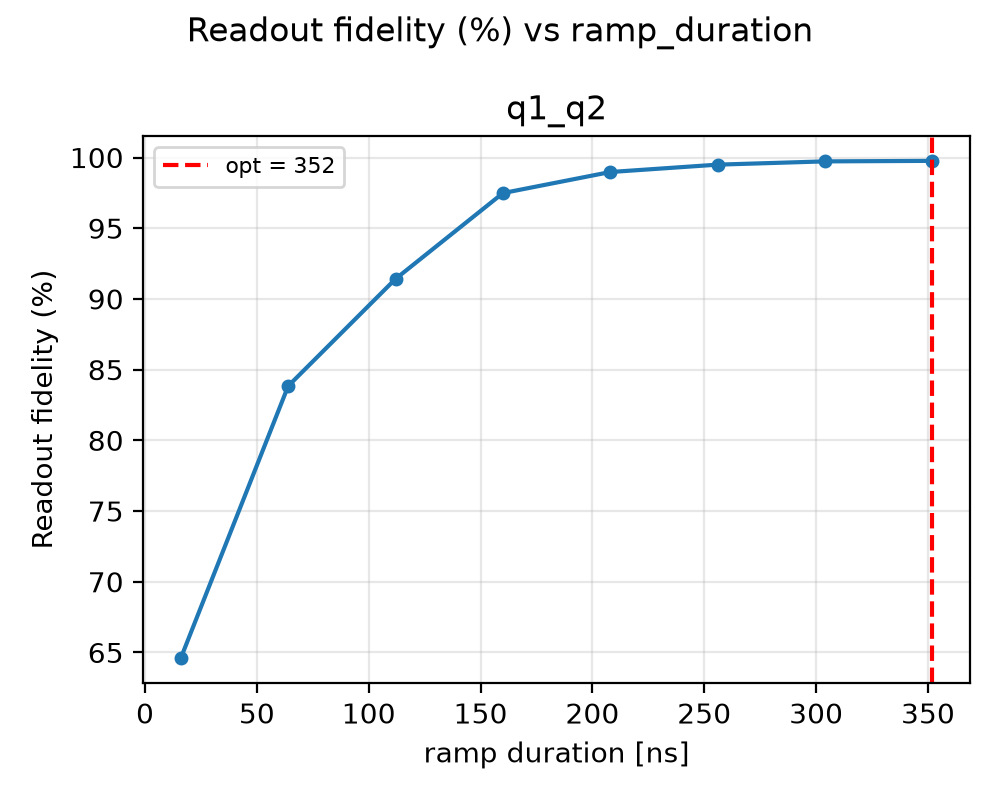
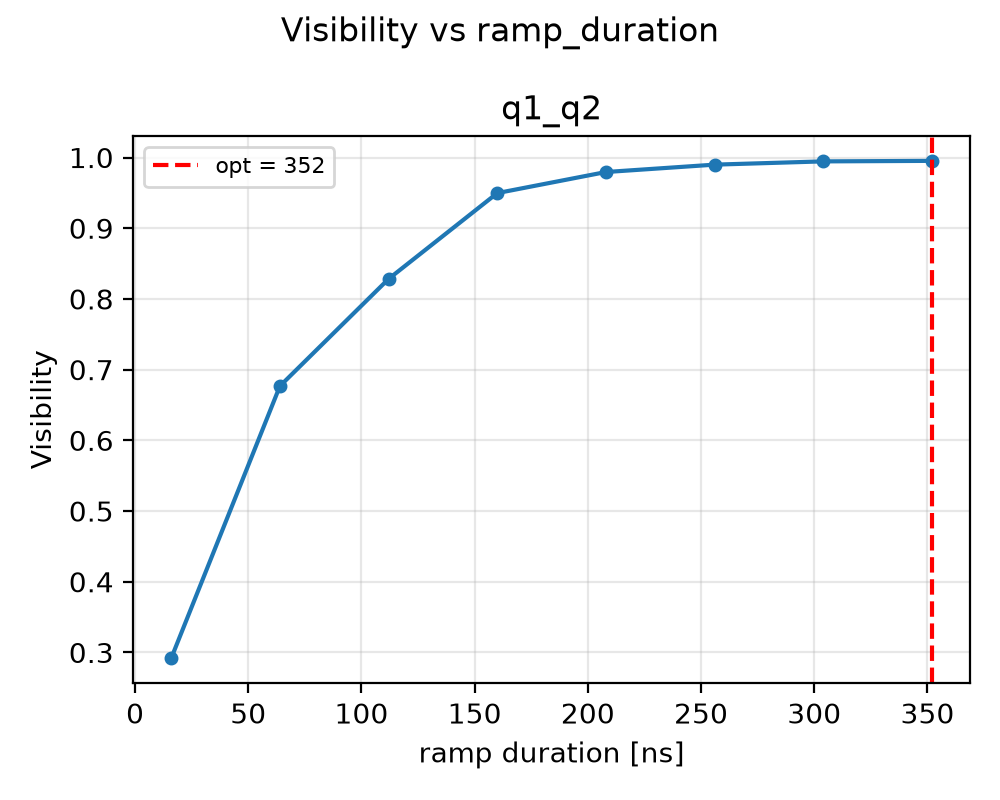
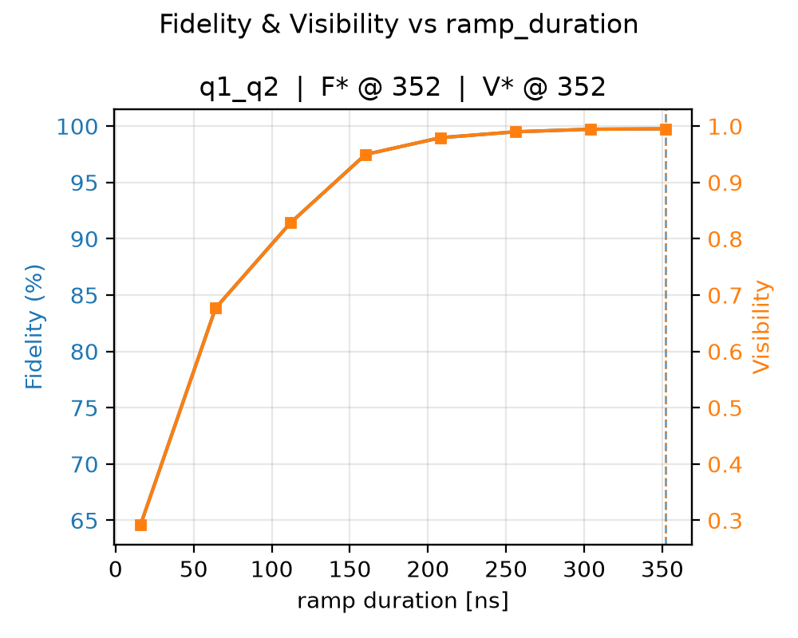
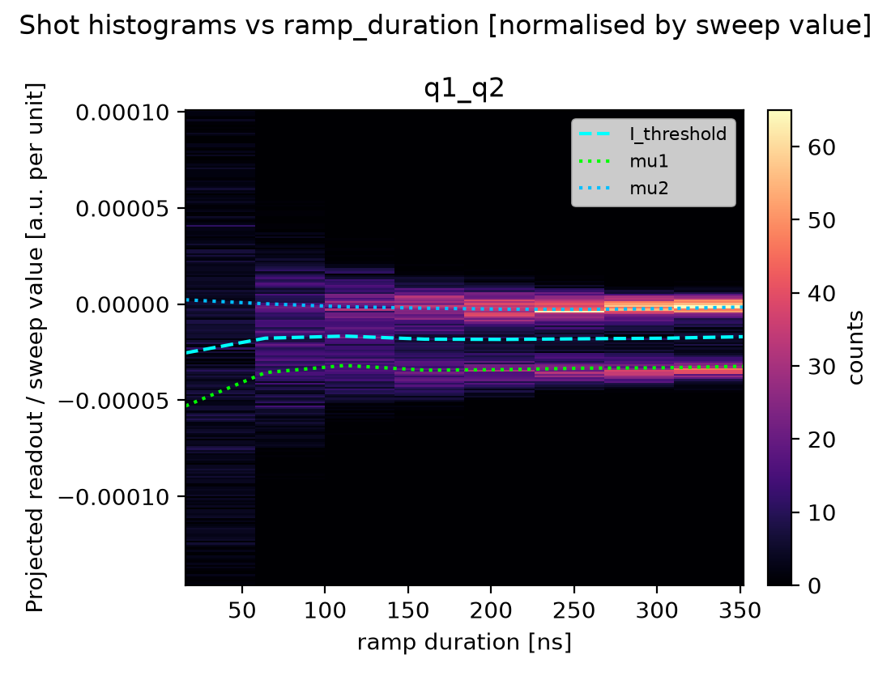
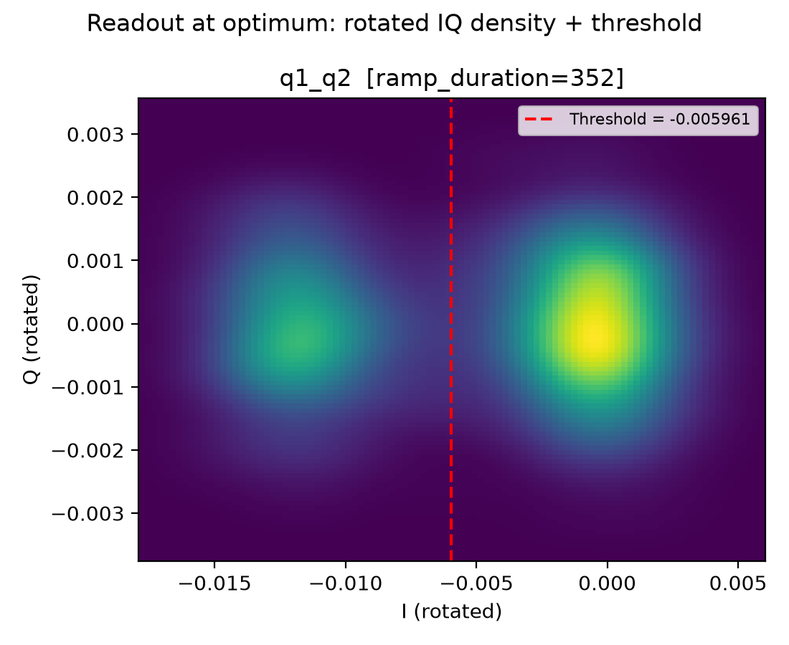

# 06c_PSB_search_opx_sweep_ramp_rate

## Description

PAULI SPIN BLOCKADE SEARCH — Sweep ramp duration to measure (OPX)

This node probes PSB readout contrast while sweeping the ramp duration (ns) used to reach
the PSB measurement point. For a fixed voltage trajectory, shorter ramps correspond to
higher effective ramp rates on the OPX fast lines.

The sequence matches the detuning-sweep PSB nodes (06a/06b) except the swept axis is the
ramp duration: preparation via ``initialization_macro`` (default ``empty``), then for each
ramp duration a ``ramp_to_point('measure', ...)`` is executed, followed by resonator readout.
An optional detuning override (``parameters.detuning``) can be applied temporarily.

Prerequisites
-------------
- QUAM configured and loaded (``quam_config/populate_quam_state_*.py``).
- Sensor-dot readout calibrated (resonator calibration nodes completed).
- Empty / initialize / measure macros defined on the dot pair.
- Prefer running 06a/06b first to set a reasonable measure detuning; this node can optionally
  override detuning temporarily via ``parameters.detuning``.

Datasets
--------
- ``ds_raw``: shot-level ``I`` and ``Q`` vs ramp duration (dims: ``qubit_pair``, ``n_runs``, ``ramp_duration``).
- ``ds_fit``: readout metrics vs ramp duration (PCA + two-Gaussian EM per sweep point).
- ``fit_results``: per-pair scalar results (serialized dataclass) for logging and state updates.

Results
-------
For each qubit pair, the node selects an optimal ramp duration (fidelity or visibility)
and extracts the readout axis and threshold used for PSB discrimination at that optimum.

Figures
-------
- Fidelity and visibility vs ramp duration
- Sweep summary (fidelity + visibility on twin axes)
- Shot histograms vs ramp duration (projected readout axis; normalized by sweep value)
- Rotated IQ density at the optimal ramp duration with the chosen threshold

State update
------------
Reverts temporary detuning override, then (if the fit succeeded) persists the optimal ramp
duration on the pair ``measure`` macro when supported, and updates integration-weights angle
and discrimination threshold on the sensor dot (readout pulse length is not changed).

## Parameters

| Parameter | Value |
|-----------|-------|
| `buffer_duration` | `16` |
| `detuning` | `None` |
| `initialization_macro` | `empty` |
| `labeled_states` | `False` |
| `load_data_id` | `None` |
| `multiplexed` | `False` |
| `num_shots` | `1000` |
| `operation` | `readout` |
| `optimization_metric` | `fidelity` |
| `plot_kde` | `True` |
| `qubit_pairs` | `['q1_q2']` |
| `ramp_duration_max` | `400` |
| `ramp_duration_min` | `16` |
| `ramp_duration_step` | `48` |
| `reset_type` | `thermal` |
| `simulate` | `False` |
| `simulation_duration_ns` | `50000` |
| `sweep_name` | `ramp_duration` |
| `timeout` | `120` |
| `use_simulated_data` | `False` |
| `use_state_discrimination` | `False` |
| `use_waveform_report` | `True` |

## Fit Results

| qubit_pair | optimal_ramp_ns | F* @ ramp | V* @ ramp | F (%) | V | success |
|------------|-----------------|-----------|-----------|-------|---|---------|
| q1_q2 | 352 | 352 | 352 | 99.8 | 0.995 | True |

## Figures

