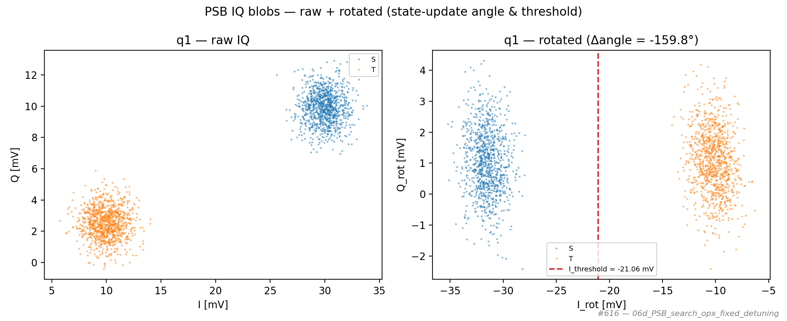
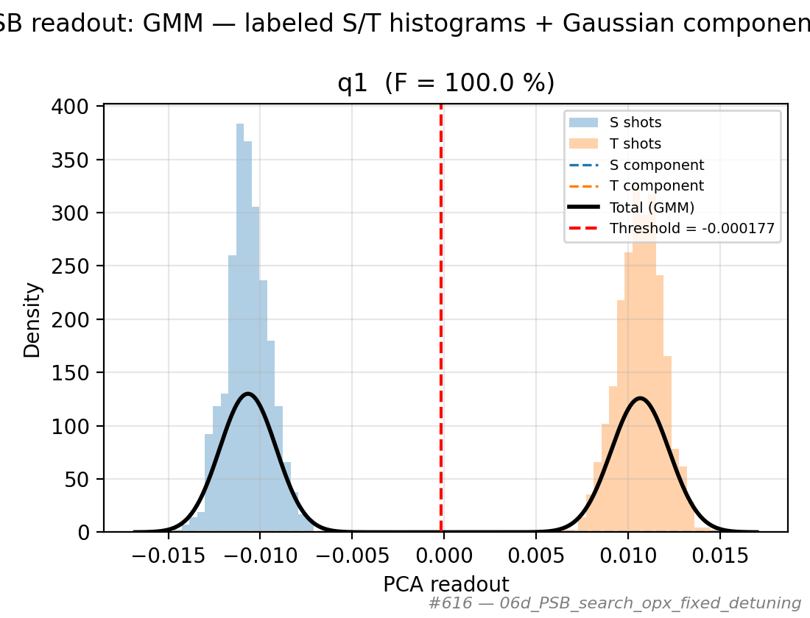

# 06d_PSB_search_opx_fixed_detuning

## Description

PAULI SPIN BLOCKADE SEARCH - Fixed Configuration, Labeled Two-State Readout
Acquires labeled shot-by-shot IQ data at the configured measure point for each qubit by measuring
twice per shot: once without a pi pulse (loading ``init_state_label``) and once with a pi pulse
(loading the complementary state). The two streams are used to fit either the Barthel 1D readout
model or a 2-component Gaussian mixture model.

Qubit pairs are resolved automatically from ``qubit.preferred_readout_quantum_dot``; no explicit
``qubit_pairs`` parameter is required.

Prerequisites:
    - Initialized Quam, calibrated sensor resonators, x180 pulse calibrated on each qubit.
    - Empty / initialize / measure voltages defined; optional ``detuning`` override for this run.

Node parameters:
    init_state_label : 'decay' | 'no_decay'
        Which physical state is prepared WITHOUT the pi pulse.
        'decay'    → no pi  = T (triplet, decays during measurement); pi = S (singlet)
        'no_decay' → no pi  = S (singlet);                            pi = T (triplet)
    analysis_model : 'barthel' | 'gmm'
        'barthel' – physics-based Barthel 1D model (MCMC, recommended).
        'gmm'     – 2-component Gaussian mixture model via PCA + sklearn.

State update:
    Reverts any temporary detuning override, then (if the fit succeeded) updates the
    integration-weights angle and discrimination threshold on the sensor dot.

## Parameters

| Parameter | Value |
|-----------|-------|
| `analysis_model` | `gmm` |
| `detuning` | `None` |
| `init_state_label` | `no_decay` |
| `load_data_id` | `None` |
| `multiplexed` | `False` |
| `num_shots` | `1000` |
| `qubits` | `['q1']` |
| `reset_wait_time` | `5000` |
| `simulate` | `False` |
| `simulation_duration_ns` | `50000` |
| `timeout` | `120` |
| `use_state_discrimination` | `False` |
| `use_waveform_report` | `True` |

## Fit Results

| qubit | I_threshold | iw_angle | F (%) | success |
|-------|-------------|----------|-------|---------|
| q1 | -0.02106 | -2.789 | 100.0 | True |

## Figures

